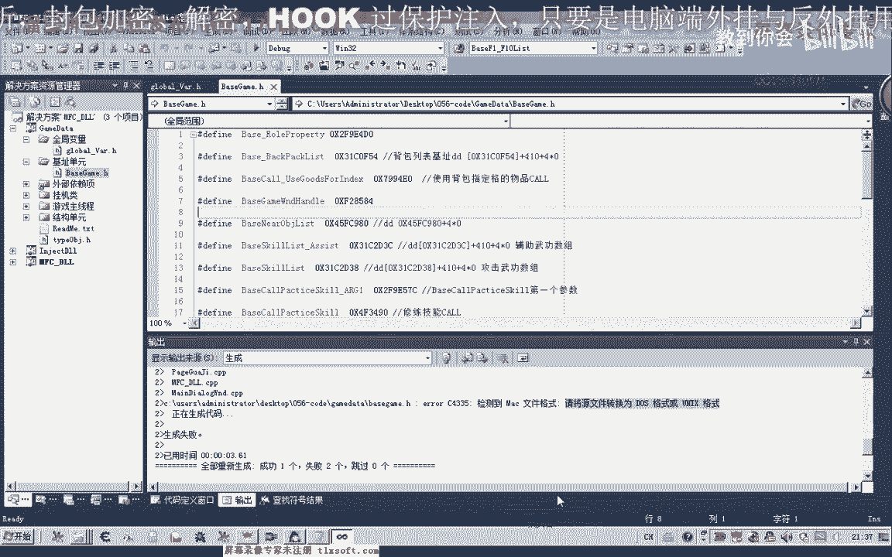
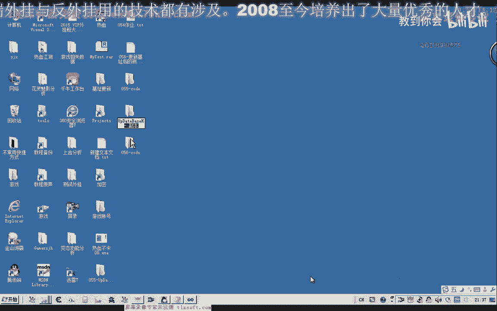
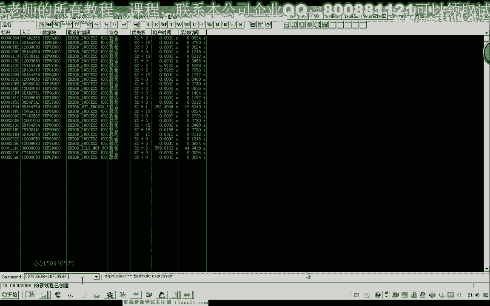

# 课程 P45：056 - 更新基址后的测试与调试 🐛

在本节课中，我们将学习如何对自动更新基址后生成的头文件进行测试和调试，以发现并修复潜在的代码错误，确保外挂功能正常运行。

上一节我们实现了自动更新基址头文件的机制。本节中，我们来看看如何测试更新后的代码，并解决编译和运行时遇到的问题。

## 编译测试与换行符问题

首先，我们打开第55课的工程代码进行编译。

编译过程中，编译器提示了一个失败信息：“请将原文件转换为多次格式或者是unit music格式”。我们注意到，生成的头文件中换行符与其他头文件不同。

问题根源在于，我们之前生成头文件时，添加了回车（`\r`）和换行（`\n`）两个字符。实际上，在C/C++头文件中，通常只需要一个换行符（`\n`）即可。

以下是解决步骤：

1.  在代码中找到负责生成头文件字符串的部分。
2.  将包含回车换行（`\r\n`）的代码段剪切出来。
3.  使用记事本的替换功能，将 `\r\n` 全部替换为 `\n`。
4.  将修改后的代码段粘贴回原处。

修改完成后，重新生成解决方案。此时编译应能通过。

## 路径配置与文件替换

编译成功后，需要找到生成的 `exe` 文件。有时输出目录可能与预期不符。

1.  检查项目属性中的“输出目录”设置，确认 `exe` 文件的生成位置。
2.  将新生成的 `exe` 文件复制到本课（第56课）的代码目录下，替换旧的 `BaseUnit` 相关文件。
3.  替换后，再次编译整个解决方案。

## 运行时异常分析与修复

编译通过后，将程序注入游戏进行测试。开启挂机功能后，调试信息查看器报告了异常。

异常主要指向两个功能模块：
*   `F1` 到 `F10` 的 `GetAddr` 函数。
*   放置技能的 `Call` 函数。

这表明这两个函数对应的基址或偏移量可能存在错误。

### 修复 F1-F10 的 GetAddr 偏移

首先检查 `F1` 到 `F10` 的 `GetAddr` 相关代码。

在头文件中，我们发现 `F1` 到 `F4` 的基址明显错误。回顾生成单元的代码，`F1` 到 `F10` 部分的偏移量计算有误。

正确的偏移量计算应为：
`目标地址 - 基地址 = 偏移量`

例如，若特征码定位到的地址是 `0x17114`，基地址是 `0xDFD`，则偏移量应为：
`0x17114 - 0xDFD = 0x16317`

我们需要将头文件中错误的偏移值修正为计算出的正确结果。

### 修复放置技能 Call 的偏移

接下来检查放置技能 `Call` 的异常。

在头文件中找到放置技能 `Call` 的偏移设置。对比之前的手动笔记，发现此处偏移量设置不正确。

例如，笔记中记录的偏移可能是 `0xEC`，但头文件中误写为 `0x28`。我们需要根据原始笔记修正这个偏移值。

修正完成后，保存所有更改。

## 最终测试与验证

完成上述修复后，需要重新生成基址头文件并进行最终测试。

1.  关闭当前工程。
2.  运行修正后的生成程序，重新生成 `BaseUnit.h` 头文件。
3.  将新生成的头文件替换到工程中。
4.  重新编译整个解决方案。
5.  运行程序，注入游戏，再次开启挂机功能。

此时，观察调试信息查看器，不再有异常报告。切换到游戏内，验证外挂功能（如自动挂机）是否正常工作。若功能恢复正常，则说明所有基址更新和错误修复均已完成。

---

本节课中我们一起学习了如何对自动更新的基址进行测试和调试。我们解决了因换行符导致的编译错误，修正了输出路径，并重点分析了运行时异常，通过核对和修正偏移量修复了 `F1-F10` 功能与放置技能功能的错误。最终，我们完成了整个更新流程的验证，确保了外挂功能的稳定性。