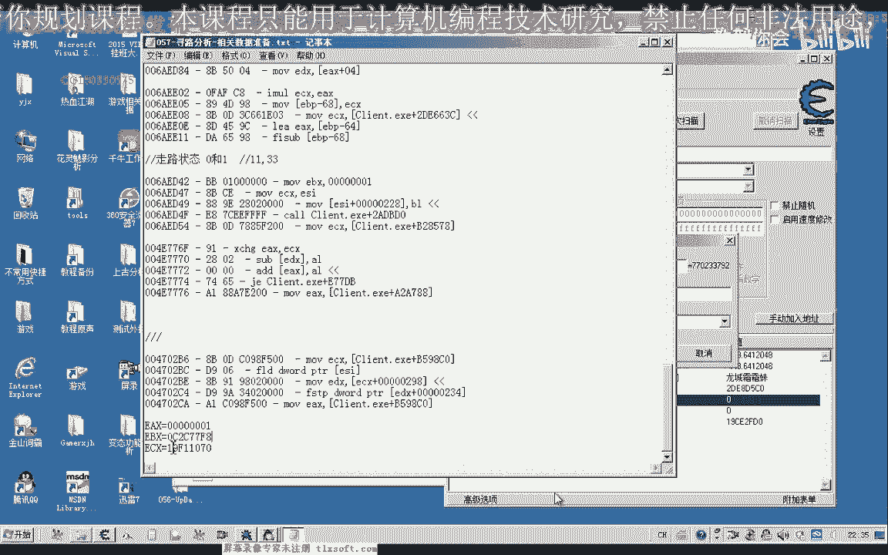
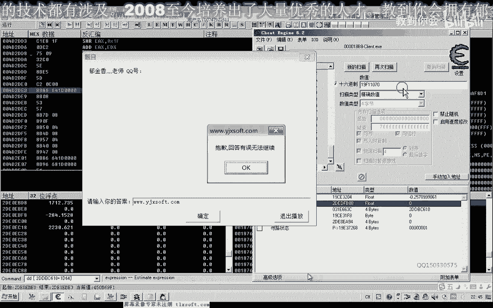
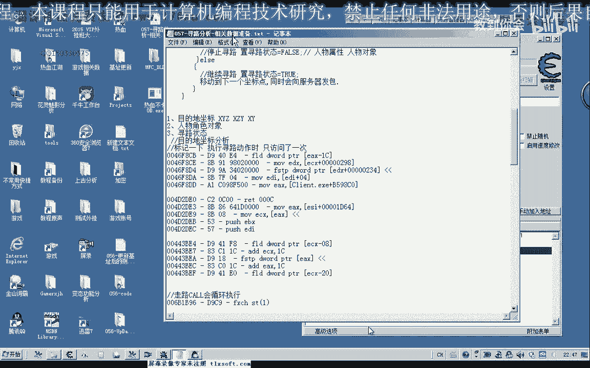
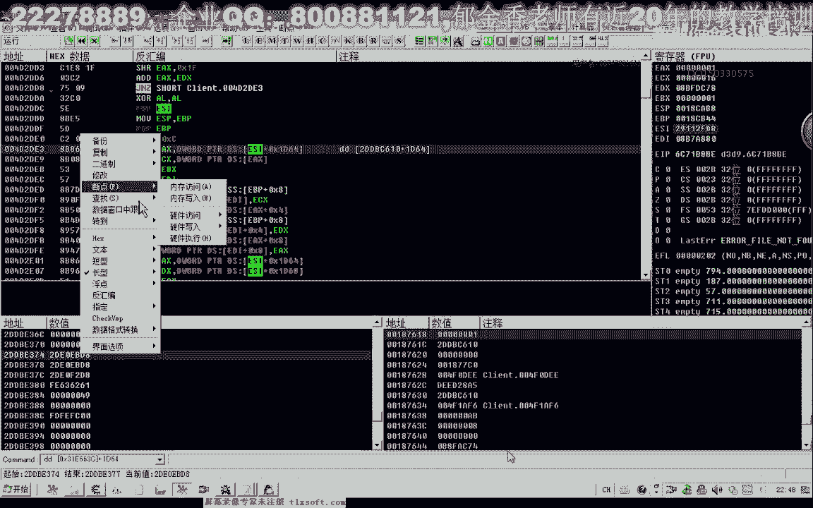
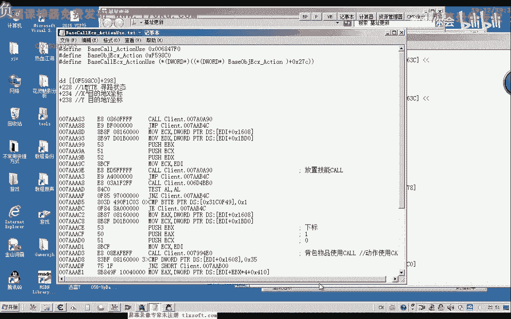

# 课程 P46：057-寻路分析-相关数据准备 🧭

在本节课中，我们将学习如何通过分析关键数据来逆向游戏中的寻路功能。我们将重点寻找并分析三个关键数据：目的地坐标、人物角色对象和寻路状态，为后续定位寻路逻辑代码打下基础。

## 概述

寻路功能分析通常有两种思路：一是通过分析关键数据（如坐标）来定位相关逻辑；二是通过分析网络发包函数来回溯。本节课我们专注于第一种方法，即通过关键数据进行逆向分析。

## 目的地坐标分析 🎯

上一节我们介绍了分析思路，本节中我们来看看如何定位目的地坐标。目的地坐标是寻路功能的核心数据之一，通常以浮点数形式存储在连续的内存空间中。

以下是分析目的地坐标的步骤：

1.  在游戏中记录当前位置的X坐标值。
2.  打开CE（Cheat Engine）并附加到游戏进程。
3.  由于坐标通常为浮点数，在CE中首次扫描时选择“浮点数”类型和“未知的初始值”。
4.  让游戏角色开始移动或寻路，此时目的地坐标会发生变化。
5.  在CE中搜索“变动的数值”来缩小范围。
6.  通过多次改变目的地（如在游戏地图上点击不同位置），并交替搜索“变动的数值”和“未变动的数值”，最终精确定位到存储目的地坐标的地址。
7.  找到的地址可能不止一个。需要区分：在寻路开始时仅访问一次的地址，很可能在寻路逻辑代码附近；而被反复访问的地址，可能在持续移动的“走路”逻辑代码中。

通过此流程，我们找到了目的地坐标的地址。其基址和偏移可表示为：`[动作对象基址 + 0x298] + 0x234`（X坐标）。Y坐标通常紧随其后。

## 人物角色对象分析 👤

接下来，我们分析寻路时是否访问了人物角色对象。该对象通常包含角色的各种属性，可能也与寻路状态相关。

以下是分析人物角色对象的思路：

1.  利用已知的人物角色对象地址（例如，之前通过角色名找到的地址）。
2.  在CE中查看该地址，并添加对它的访问监视。
3.  触发寻路功能，观察是否有新的、仅在寻路时发生的对该地址的访问操作。
4.  记录下这些只执行了一次或少数几次的访问指令地址，它们更可能位于寻路逻辑中。

分析发现，在寻路过程中确实有对人物角色对象指针的访问。其基址和偏移可表示为：`[人物对象基址 + 0x18] + 0x1964`，此指针指向一个包含X、Z、Y坐标的结构体。

## 寻路状态分析 🔄

最后，我们来寻找可能存在的寻路状态标志。这个标志可能是一个布尔值（0/1），用于指示当前是否处于自动寻路状态。

以下是分析寻路状态标志的步骤：

1.  在未寻路时，于CE中搜索字节类型的数值“0”。
2.  开始寻路，搜索变动的数值“1”。
3.  停止寻路，搜索变动的数值“0”。
4.  重复“开始-停止”寻路的过程，并交替搜索1和0，最终定位到状态标志地址。
5.  通过对比发现，有两个地址的值会变化：一个在走路和寻路时都为1（走路状态）；另一个仅在寻路时为1（寻路状态）。我们需要的是后者。

通过分析访问该寻路状态标志的代码，我们找到了其基址与偏移：`[动作对象基址 + 0x298] + 0x228`。该标志为单字节大小。

## 关键数据汇总

本节课我们通过逆向分析，找到了与寻路相关的三个关键数据及其内存结构：

*   **寻路状态**：`字节 [动作对象基址 + 0x298 + 0x228]`
*   **目的地坐标X**：`浮点数 [[动作对象基址 + 0x298] + 0x234]`
*   **目的地坐标Y**：`浮点数 [[动作对象基址 + 0x298] + 0x238]`
*   **角色坐标指针**：`指针 [人物对象基址 + 0x18 + 0x1964]` （指向`{X, Z, Y}`结构体）

其中，“动作对象基址”是一个待进一步明确含义的全局基址。

## 总结

本节课中我们一起学习了如何为逆向分析游戏寻路功能准备关键数据。我们掌握了定位并分析目的地坐标、人物角色对象以及寻路状态标志的具体方法，并将找到的数据整理成了明确的偏移公式。在下一节课中，我们将利用这些宝贵的数据作为突破口，深入追踪并分析寻路的核心逻辑代码。