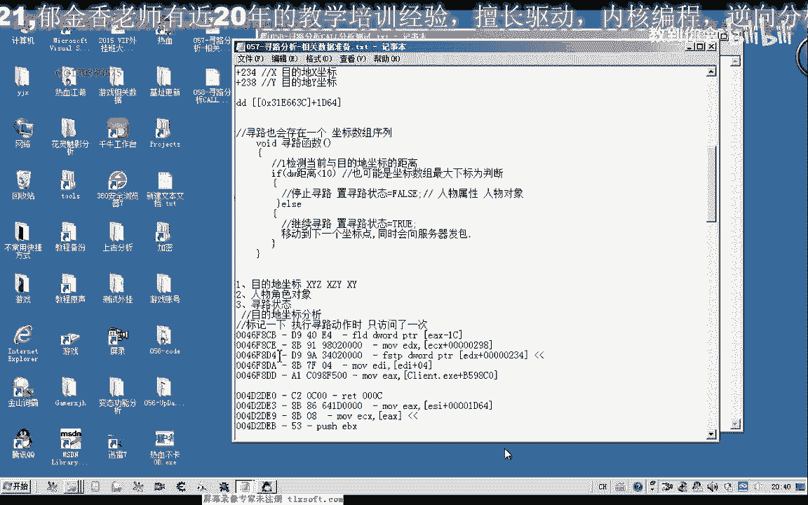
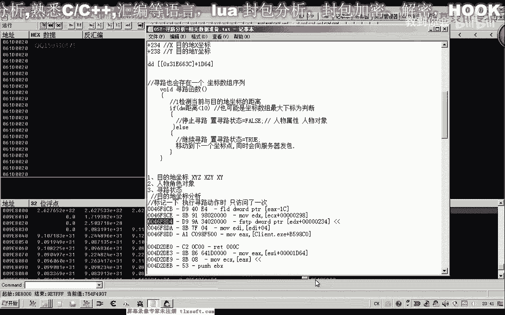
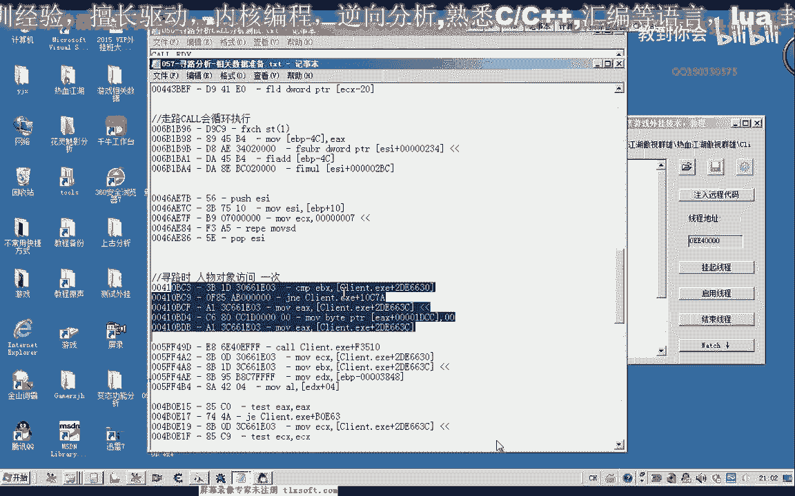

# 逆向工程教程 P47：058-寻路CALL分析测试 🧭


在本节课中，我们将学习如何通过逆向工程分析游戏中的寻路功能，定位并测试关键的寻路CALL。我们将从之前课程标记的代码入手，逐步分析堆栈、参数，并最终编写出可用的测试代码。



---

## 分析可疑的CALL地址

上一节我们介绍了如何标记访问寻路数据的代码。本节中，我们来看看如何通过调试工具，从这些标记的地址中筛选出真正负责寻路功能的CALL。

首先，我们使用调试工具附加到游戏进程，并转到之前标记的第一个地址。这个地址存储了目的地的坐标。我们在访问该地址的代码处下断点。

当我们尝试移动角色时，断点并未触发。这表明上层的调用可能并非直接的寻路逻辑。因此，我们使用 **`Ctrl+F9`**（执行到返回）功能，逐层返回到调用者，并对每一层返回的地址都下断点并做标记。

以下是我们在堆栈中追踪到的几个关键地址：


*   **地址1**：最外层的CALL，参数中包含坐标地址，可能性最大。
*   **地址2**：参数中同样包含坐标数据，需要测试。
*   **地址3**：参数结构与寻路相关，列为可疑对象。


我们优先测试最外层的 **地址1**，因为它的调用层级最高，最可能是功能入口。

---

## 确定CALL的参数结构

确定了可疑的CALL后，我们需要弄清楚它需要哪些参数。观察汇编代码，我们看到类似 `push 0x3F` 和 `push eax` 的指令，但仅凭此无法确定参数总数。

有两种方法可以确定参数占用的总字节数：
1.  在CALL执行后，观察 `RET` 指令后面的数字。例如 `RET 0xC` 表示平衡掉12字节的堆栈空间，这意味着CALL有 **3个参数**（每个参数占4字节）。
2.  按 **`F7`** 键步入CALL内部，执行到 `RET` 指令，同样可以观察到堆栈平衡的数值。

通过分析，我们确认了目标CALL有3个参数。参数顺序（从最后一个开始压栈）是：
1.  一个整型常量（例如 `0x54`）。
2.  一个指向数据结构的指针（存储在 `eax` 寄存器中）。
3.  另一个整型常量（例如 `0x3F`）。

其中，第二个参数 `eax` 指向的结构体是难点，我们需要知道它的大小和内容。

---

## 构建并测试寻路CALL

为了调用这个CALL，我们必须构建出正确的参数，尤其是第二个结构体参数。

我们通过计算CALL内部访问该结构体的最大偏移和最小偏移，来估算其大小。公式如下：
```
结构体大小 ≈ 最大偏移 - 最小偏移 + 4
```
分析后，我们估算其大小约为 `0x30`（48）字节。


接下来，我们从调试器的堆栈窗口中，复制出 `eax` 指针所指向的 `0x30` 字节数据。这些数据包含了当前的坐标等信息。

然后，我们开始编写汇编测试代码。核心步骤如下：
1.  在堆栈上分配 `0x30` 字节的空间（`sub esp, 0x30`）。
2.  将分配的空间地址赋给 `eax`。
3.  将之前复制的数据，按照正确的偏移填写到 `eax` 指向的结构体中。**关键是要填入目标坐标值**。
4.  按正确顺序压入三个参数。
5.  调用寻路CALL的地址。

以下是代码的核心片段示例：
```assembly
sub esp, 0x30          ; 分配结构体内存
mov eax, esp           ; eax 指向结构体
mov [eax+0x00], 目标X坐标 ; 填写数据
mov [eax+0x04], 目标Y坐标
mov [eax+0x08], 目标Z坐标
; ... 填写其他结构体成员
push 0x54              ; 压入参数3
push eax               ; 压入参数2 (结构体指针)
push 0x3F              ; 压入参数1
mov eax, 寻路CALL地址
call eax               ; 调用寻路CALL
add esp, 0x30          ; 平衡堆栈
```
使用代码注入器执行上述代码后，游戏角色成功向指定坐标移动，证明我们找到了正确的寻路CALL。

---


## 优化坐标传递方式

在测试代码中，我们直接以十六进制形式填写了坐标的浮点数表示，这不够直观。我们可以使用浮点指令，将十进制的坐标值（如 `-153.0`）转换为浮点数并压栈，使代码更易读。

这需要用到两条指令：
*   `fild`：将整数加载到浮点寄存器。
*   `fstp`：将浮点寄存器的值存储到内存（如堆栈）。

优化后的坐标设置代码如下：
```assembly
; 设置X坐标 (-153.0)
push -153              ; 将整数压栈
fild dword ptr [esp]   ; 加载整数到浮点寄存器
fstp dword ptr [eax+0x00] ; 存储浮点数到结构体
add esp, 4             ; 平衡堆栈

; 设置Y坐标 (1545.0)
push 1545
fild dword ptr [esp]
fstp dword ptr [eax+0x04]
add esp, 4
```
这种方法让我们能在代码中直接使用有意义的十进制坐标值。

---

## 总结与练习

本节课中我们一起学习了逆向分析寻路功能的完整流程：从追踪可疑地址、分析CALL参数、构建数据结构到最终编写并优化测试代码。

**核心收获**：
1.  通过堆栈回溯寻找关键CALL。
2.  利用 `RET` 后的数值分析参数数量。
3.  通过偏移计算估算结构体大小。
4.  编写并注入汇编代码来测试功能。
5.  使用浮点指令优化参数传递。



**课后练习**：
请尝试分析本节课中标记的 **地址2** 和 **地址3**，按照相同的步骤测试它们是否也是有效的寻路CALL。这能帮助你更深入地理解游戏代码的调用链。