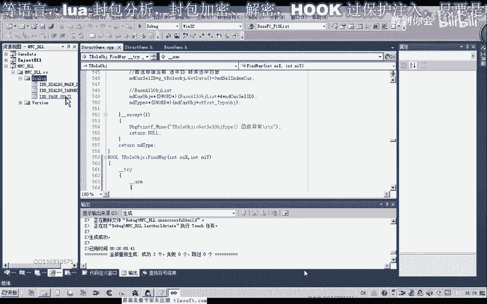

# 课程 P48：059 - 寻路CALL封装与测试 🧭


在本节课中，我们将学习如何将分析得到的寻路CALL代码进行封装，并集成到我们的项目工程中进行测试。我们将从测试通过的汇编代码开始，逐步将其封装为C++函数，并确保其能在游戏主线程中安全调用。

---


## 概述


上一节我们分析了寻路CALL并获得了可用的汇编代码。本节中，我们将把这些代码封装成一个可复用的函数，并集成到现有的项目框架中。核心步骤包括：代码移植、参数处理、异常安全封装以及线程安全的调用测试。


---


## 1. 回顾与测试寻路代码


首先，我们回顾并测试在第58课中分析得到的寻路CALL代码。这段代码包含目标坐标参数。

以下是测试通过的汇编代码片段，其中包含X和Y坐标：

```assembly
mov [ebp-0x14], -999
mov [ebp-0x10], 1800
...
```

我们打开游戏，修改坐标参数，并将代码注入游戏进行测试。测试成功后，角色开始向指定坐标移动，证明代码有效。


---

## 2. 将代码集成到项目工程

测试通过后，我们将这段汇编代码复制，准备添加到项目工程中。

我们打开第56课的工程，在“基础单元”中添加相关的机制。

涉及到的关键寄存器是 **人物角色对象** 的基址，这个基址我们已有定义。在汇编代码中，我们需要将对应的数据替换为该基址。

**注意**：不能直接在汇编代码中替换内存地址。所有十六进制数在C++中都需要添加 `0x` 前缀，但十进制数字9以下可以不加。

我们将代码中的坐标数据替换为变量参数：
*   将 `-999` 替换为 **X坐标** 变量。
*   将 `1800` 替换为 **Y坐标** 变量。

替换时，需要先将变量值移动到寄存器（如 `ECX`），再从寄存器移动到目标内存地址，因为汇编不允许内存到内存的直接寻址。

修改后的代码结构如下：
```assembly
mov ecx, [nX]      ; 将X坐标变量值放入ECX
mov [ebp-0x14], ecx ; 将ECX值存入目标地址
mov ecx, [nY]      ; 将Y坐标变量值放入ECX
mov [ebp-0x10], ecx ; 将ECX值存入目标地址
```

---



## 3. 封装寻路函数

接下来，我们在“结构单元”的“人物角色对象”类中封装寻路函数。

我们定义一个简单的整数类型函数，接收两个坐标参数（X和Y）。

以下是封装函数的步骤：

1.  **添加函数声明**：在人物角色对象类中添加寻路函数 `FindWay(int nX, int nY)`。
2.  **实现函数体**：
    *   首先进行异常处理，使用 `__try` 和 `__except` 块捕获异常，并打印调试信息。
    *   在 `__try` 块内，嵌入我们修改后的汇编代码。
    *   执行成功返回 `true`，发生异常则返回 `false`。


关键实现代码如下（C++内联汇编）：
```cpp
__try {
    __asm {
        // ... 其他汇编指令
        mov ecx, [nX]
        mov [ebp-0x14], ecx
        mov ecx, [nY]
        mov [ebp-0x10], ecx
        // ... 调用寻路CALL的指令
    }
    return true;
}
__except(1) {
    OutputDebugString("寻路CALL调用异常");
    return false;
}
```
编译通过后，函数封装完成。


---

## 4. 进行初步测试

封装完成后，我们首先在测试单元进行直接调用测试。

我们注释掉其他代码，在测试函数中获取全局的人物角色对象，并调用其 `FindWay` 函数，传入一个近处的坐标（如 `-111, 1800`）进行测试。

编译并运行测试，观察到角色成功移动到指定坐标，证明基础封装正确。

**注意**：这种直接调用并不安全，因为它可能不在游戏主线程中执行，容易引发稳定性问题。

---

## 5. 实现线程安全调用

为确保稳定，我们需要将寻路调用封装到游戏的主线程中执行。

以下是实现线程安全调用的步骤：

1.  **定义消息和结构**：在主线程模块中，定义一个新的消息类型 `WM_FIND_WAY` 和一个用于传递坐标的结构（这里简化为使用 `int` 数组，`[0]`存X，`[1]`存Y）。
2.  **添加消息处理函数**：在主线程的消息循环中，添加对 `WM_FIND_WAY` 消息的处理。在处理函数中，从参数中解析出坐标数组，然后调用全局人物角色对象的 `FindWay` 方法。
3.  **提供对外接口**：创建一个公开函数（如 `SendFindWay`），外部模块通过此函数发送 `WM_FIND_WAY` 消息到主线程，并附带坐标参数。

主线程消息处理关键代码：
```cpp
case WM_FIND_WAY: {
    int* pPos = (int*)lParam; // 获取传入的坐标数组指针
    if (pPos) {
        g_pRoleObject->FindWay(pPos[0], pPos[1]); // 安全调用
    }
    break;
}
```

---

## 6. 最终集成测试

最后，我们修改测试代码，改为调用线程安全的接口 `SendFindWay`，并传入一个远处的坐标（如 `-122888, 1800`）进行测试。

编译并运行，点击测试按钮。观察到角色开始稳定地向远方坐标移动，并最终准确到达，整个过程无异常。这证明我们的寻路CALL封装是成功且线程安全的。


---


## 总结


本节课中，我们一起完成了寻路CALL从原始汇编代码到安全、可集成C++函数的完整封装流程。我们学习了如何将汇编代码与C++变量结合，如何封装带异常保护的函数，以及如何通过消息机制实现线程安全调用。这套方法不仅适用于寻路功能，也为封装其他游戏CALL提供了标准流程。下一节课，我们将在此基础上继续探索其他功能的封装。