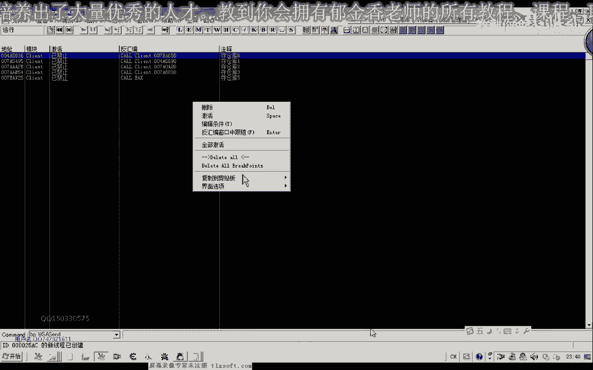

# P49：060-存仓库CALL相关数据收集 - 教到你会 - BV1DS4y1n7qF

大家好，我是郁金香老师，那么这节课呢我们一起来分析一下纯仓库的啊，库的一个相关的一个数据，那么陈仓库这个库的话，它一般呢会做这几件事啊，那么肯定呢它会向服务器啊发送数据。

表示是某一个物品我们存放到这个仓库里面去了，那么肯定它存在着一个呃物品的id的一个属性，那么之前呢我们也分分析了这个物品背包的这个列表，那么而且我们要存的这个物品的话。

肯定也就是这个背包里面的这些东西呢，要把它存到这个仓库里边去，那么我们怎么知道是具体是存放的哪一个物品呢，那么它在发送的时候是表示的啊，第一格的物品栏或者是第二个的这个物品栏，那么肯定他有一个啊标识。

那么有可能是用背包的这个下标来做一个标记，那么也可能是这个背包的这个对象里面呢，它有一个呃关于物品id的这样一个属性啊，某某偏移用来表示我们的物品唯一性的这样一个物品的i d，那么分为这两种情况。

那么无论是哪一种情况呢，它都会向我们的服务器发送一些数据过去啊，在我们存放这个物品的时候，那么另外一个呢它肯定叫我们存放的这个物品的时候呢，他要访问这个物品对象的一些属性啊，比如说是它的一个下标啊啊。

或者是我们说的idea啊，或者是其他的一些呃相应的数据他肯定要做一个访问好的，那么我们有了这些准备之后呢，我们就一起来看一下，那么首先呢我们打开我们的d哈。

附加到我们的游戏里边，然后呢我们用bp啊，圣的下段，但是一般的游戏呢我们可以在生的这个位置下段啊，但是这个游戏的话我们要在w a w a s，是的啊，这个地方下断了，那么按下回车之后呢。

呃当然这个时候呢他立即就会断下，这个时候我们下断了还不是时候，那么我们应该在什么时候进行下一段呢，先把这个物品来选中哈，选中这这个时候呢它应该是呃就有一个相应的对象啊，写到我们这个选中的啊。

就像地址里面去了，然后我们要放到这个仓库里边的时候呢，我们在从这个地方下断，那么这个时候呢我们再断一下，然后呢嘛按下鼠标，那么按下鼠标之后啊，这个时候呢它就像我们的服务器啊，发送了一个程序。

我们嗯这个物品的一个数据啊，那么这个时候呢我们就呃按一下ctrl f9 ，然后一层一层的回溯，一个是通过ctrl f9 ，那么另外一个呢我们可以在这个独立站里面回溯，那么我们还能够看到一些字串啊。

陈仓库的，那么我们还是用ctrl f9 来回溯，然后呢第一层，那么这个时候我们可以看到这个地方来调用的一个发包的一个函数，那么肯定还在上一层，好那么在这一层的时候呢，我们就可以了啊，开始备注了啊。

存仓库第一，然后进行下段，然后呢我们再次执行到返回，在这里呢我们也写一个啊存仓库，那么在这里呢我们也跟他下一个段，然后呢我们再执行到返回，那么在这个地方呢，我们在，备注一下，在这个地方眼下断。

然后继续返回，那么我们可以多返回七层啊，那么直到这个地方的时候呃，就在这里吧，这里从仓库，然后在这个地方你下断再返回一层，那么再返回城的话，就到这个位置啊，好了，那么这返回了五六层之后的话。

一般是够用了，然后呢我们再把按下water b啊，打开这些断点，把所有的断点呢先禁止掉，先让他跑起来。

然后再把它激活，那么激活之后马上就断下来的啊，这因为现在我没有像这个仓库存东西啊，它就断下来了，那么说明这个地方的话啊，不是我们的这个相应的一个库啊，有可能不是啊，那么我们先把这个地方先去掉啊。

只是说有可能不是，那么也有可能这个地方也是，因为我们还有一个地方打开这个断点，因为这个层仓库六还在它的更上层，但是这个地方的话嗯他们并没有断线，那么有可能的话，陈仓库和六这两个地方都有可能是我们的嗯。

这个，存仓库的一个库，那么我们再接下来再来分析一下，另外用一个物品，但是这个时候呢我们点一下啊，这个时候我们点一下这个物品的时候呢，这个地方马上就断下了啊，说明这个地方的可能性的话也比较小。

因为现在我们还没有成仓库，好的我们把这个地方给取消掉，那么存仓库山这个地方呢它也断下了啊，那我们把这个地方呢嗯也取消掉，那么这个时候呢我们在放到仓库里面啊，那么这个时候来存仓库，按这个地方呢嗯他断下了。

那么说明的话在这个地方的话啊，它是存仓库的，这个扩的可能性的话要大一些，好的，那么我们先来看一下它的一个参数，那么现在来压榨的参数有088这两个嗯，一次就是最后的，这个是零，这个是八的。

那么这个也是宝马好的，那么先把它放下，陈仓库基，这个地方肯定有个断路，那么我们再另外放一个啊，放到放到第一个，第二个这个地方，我们再来看一下它的一个变化，那么第二点的话，这里的这里有个180。

我记得是081，那么这个腰的话看起来呢有一点像是仓库的，仓库的啊，这个，数组下标，那么再让它跑起来，然后我们再存存一个东西啊，成一个这个甲进去，然后我们放在第四个这个地方。

那么这个时候呢我们发现了这个地方呢，它的下标为三啊，那么恰好的话就是我们仓库的一个下标，那么另外两个数字呢是不变的，不变的，那么这里呢也是一个，那么这个呢我们暂时我们把它这两个都复制一下。

把这个断点先取消掉，那么按减号再退回来啊，那么这个扩的话极有可能就是我们成仓库的这个扩，那么这个库的话，因为它有一个参数是啊，我们这个仓库的一个下标啊，这两个参数是固定的，那么要执行这个扩的话。

应该前面还有一个动作啊，必须要完成，就像我们之前的呃移动我们的技能到这个技能栏上一样，那么这里呢首先他需要一个选中啊，选中我们的物品，这样来模拟，那么然后再有后面这个动作才可以。

那么也就是说我们必须要有一个前提要选中它，然后呢再存到我们的仓库，但这个时候呢我们看发现呢在背包里面移动的时候呢，它也会在这个地方断下啊，也会在在这个地方断下，那么说明这个扩的话。

它实际上不是一个真正的一个纯仓库的一个空，而是一个这个物品移动的一个扩啊，应该是，但是通过这个扩的话，它应该来说也能够完成这个功能，那么我们来看一下现在ec x看一下这个参数它会不会变化。

那么这是ec x的数值，那么我们再次让它跑起来，但是这个时候呢我们看一下呃，第六个参数，这里是这里有变动了啊，这个时候是唯一啊唯一，那么这里呢是二，这个表示我们背包的一个下标，那么说明还是有区别的。

这个移动的话，那么如果这个参数为八的话，表示移动到这个仓库里面去，那么如果只是在背包里边移动的话，那么比如说把这个物品移动到啊第七个，那么它就是六啊，这个下标就是六，而这里的是一。

如果我们是移动到仓库里面的话，那么比如说我们移动到也是第六个，那么下标来是下标，这里是，但这里呢这里应该是一个分类啊，分类这里是八，这里应该是我们的嗯，背包类型应该是一个分类，看似我们的仓库。

那么我们把代表的是仓库被保一呢代表的是玩家在一个背包，或者说叫做玩家的一个数组，那么我们还还要注意一下啊，e4 x的一个数值的一个变化，那么我们再来测试一下。

那么首先我们在这里在我们个人的背包里面移动的时候，e4 x的数值我们看一下648，那么我们移动到仓库看一下，那么移动到仓库的时候，我们看一下这个时候e cx的数值而且变化了啊。

那么说明这个e c x的数值它也是不同的，我们仓库与个人背包里面的这个对象的话可能是不一样的，那么我们再做一次测试，然后取物品出来啊，也是相当于是移动，那么移动的时候我们看一下啊，68。

那么68的话说明表示了是这个啊个人的背包，那么后面这个呢是仓库背包，好的再次让他跑起来，那么知道这么多的话，我们接下来呢就可以做一个大致的测试了，那么这个空那么首先我们是一个要放到对象的一个下标。

那么实际上这个值的话，那么我们随便给他传一个值，它就会自动排列，那么第二个呢我们是是要存放到我们的背包里面，元素嗯，背包的话是一仓库18，然后下边还有一个数值，好像一直视频再来做一下测试。

从仓库取物品出来，那么这里是011，那么这个是腰，那么这个位置它也不一样，偶像那么取物品好像是妖而成，物品进去好像是零，那我们再看一下哦，这里是1b，那么1p好像也可能是下标的，我们再来看一下。

那么比如说在这里从一个物品进去再来看一下，那么这个的话好像在下面这个啊，对这个是仓库的下标，这里应该是零，那么我们存存东西的时候呢，这里是零，然后我们看取东西的是呃，取物品的时候，那么取物品的时候。

我们下面的这一个这个数字呢也是零，那么无论是纯或者是取，那么这个数值呢它都是你好的，那么这个零呢我们是一个固定式，123好了，慢慢有了这么多之后呢，我们就可以用我们的代码输入器进行输入。

那么比如说我们是从仓库取物品出来啊，然后呢我们用c x的一个数字，那我们再看一下实物品的方法，e cx的数值是648，那么我们把它复制出来，然后起飞my汉语好的，那么这呢就是一个取物品的一个库。

但是呢它必须有一个前提，要先选中一个对象，那么比如说选中这个幸运符，然后我们输入一下，那么这个时候呢我们就会把幸幸运符来取出来哈，然后呢我们再选中一个对象，这个时候呢我们也会把它啊取到我们的这个取出来。

那么如果我们是乘，比如说我们选中的是这个角，那么我们要存的话，就应该换另外一个对象，这样应该画418，这个啊，刚才是60mm看一下，那么是存仓库的话，就应该选这个吧，嗯然后呢我们需要这个数值要改八。

然后我们再测试一下，那么这个时候呢这个甲呢也就存到我们的这个仓库里面去了，但是用这个扣的话啊，相对来说相对来说的话比较麻烦，他要执行两个动作啊才可以才可以，那么我们下一节课呢我们一起来分析一下。

另外的还有一个空，那么另外这个库呢在我们的这个呃备注的时候呢，叫仓库一看，我们看一下有没有抓取相关的一个信息出来看，哦对了，这里有个陈仓库一，那么下一节课我们再分析一下仓库，一个库。

那么这个呢也当作是一个坐力啊，大家一起去分析一下这个库的一个参数，看第二用这个扩的话，能不能够有一些呃辩解啊，能不能够简单一点，是我们这个存仓库的这个动作，那么今天呢我们就分析到这里。

我把相应的代码把它复制出来，那么这个参数呢八表示是，仓库一表示物品，那么这个呢是我们的一个下标，那么这个下标的话，实际上它可以是任意的一个数字都可以，只要不超出我们的这个列表。

那么我们固定可以把它设为一嗯，可以，因为它自动会调整啊，这个那么主要就是这两个了，一个是呃八代表是纯仓库，一表示是曲物品，但是它有一个前提啊，要先，选中物品，那么如果我们不选中物品。

我们看调用调用会出现什么问题，那么直接我们这样调用，那么直接这样调用的话，我们发现了没有任何的效果，那么必须呢我们要选中一个东西啊，再调用，当然我们如果只是选中这里面的东西的话啊，选中仓库的东西呢。

存到仓库的话，它也是相当于是在这个仓库里面这样移动啊，那么我们找到的这个库呢，它实际上不是我们重复品的库，应该是一个，物品移动后，那么既然是物品的移动货的话，那么理论上来说的话。

在这个物品移动的内部的话，肯定有由我们这个程序啊，仓库的这个库一个是全物品的仓库，另外一个是取物品，取出仓库，这两个动作的话，他应该都在这个扩的一个内部啊，那么说明这个扩的话作为一个突破口。

应当也是很关键的，那么我们今天这节课呢我们就先分析到这里，那么下节课呢我们再详细的分析这个呃存储物品的这个空，好的。

