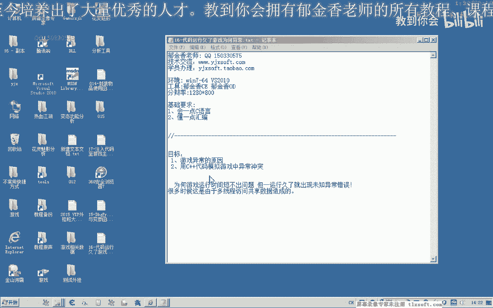
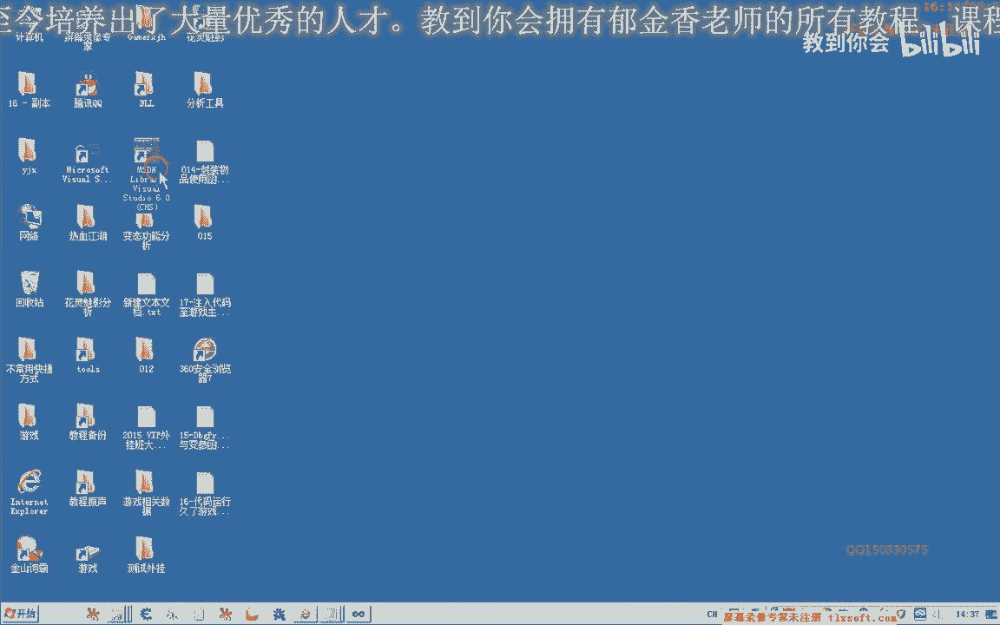

# 课程P5：016 - 代码运行久了游戏为何异常 🐛

在本节课中，我们将要学习一个在编写游戏外挂或修改器时常见的棘手问题：为什么代码运行一段时间后，游戏会突然崩溃或出现异常？我们将通过一个简单的C++示例来模拟问题的成因，并探讨其背后的原理——多线程访问共享数据冲突。最后，我们会介绍如何使用“临界区”来保护我们自己的代码，避免此类冲突。

---

## 问题现象与原因分析

上一节我们测试物品使用功能时，曾出现过异常。这种异常通常不会立即出现，因为当时我们注入代码的窗口线程与游戏的主线程是两个不同的线程。



当游戏主线程和我们编写的代码线程同时访问某些共享数据（如怪物列表、背包列表）时，就可能产生冲突，导致异常。这种异常具有隐蔽性，可能代码运行几小时甚至更久才会出现，造成程序不稳定。

为了说明这种异常是如何产生的，我们将使用Visual Studio 2010创建一个MFC程序来模拟。


## 模拟多线程数据冲突

我们通过两个按钮来模拟两个线程：“游戏主线程”和“外挂线程”。

首先，我们模拟游戏的数据，定义一个全局数组和一个指向该数组的全局指针。

```cpp
// 模拟游戏数据块
int g_GameData[10] = {0, 1, 2, 3, 4, 5, 6, 7, 8, 9};
// 指向游戏数据的指针
int* g_pGameData = nullptr;
```

### 模拟游戏主线程

以下是模拟游戏主线程的代码。它在一个循环中不断初始化指针，指向数组的不同部分。

```cpp
UINT GameMainThread(LPVOID pParam) {
    while (true) {
        // 模拟游戏主线程操作数据
        memset(g_pGameData, 0, sizeof(g_pGameData)); // 先将指针指向的内存清零
        for (int i = 0; i < 5; i++) { // 只初始化前5个元素
            g_pGameData = &g_GameData[i];
            // ... 模拟其他操作
        }
        Sleep(1000); // 延迟，让操作变慢
    }
    return 0;
}
```

### 模拟外挂线程（物品使用函数）

以下是模拟外挂线程调用的函数。它尝试读取并打印指针指向的所有数据。

```cpp
void UseItem() {
    for (int i = 0; i < 10; i++) { // 尝试访问10个元素
        if (g_pGameData != nullptr) {
            // 打印数据
            TRACE("Data[%d]: %d\n", i, *(g_pGameData + i));
        }
        Sleep(50); // 短暂延迟
    }
}

UINT HackThread(LPVOID pParam) {
    while (true) {
        UseItem(); // 外挂线程不断调用物品使用函数
        Sleep(100);
    }
    return 0;
}
```

### 运行与异常产生

当我们只运行游戏主线程时，程序一切正常。但一旦同时启动外挂线程，问题就会出现。

外挂线程的 `UseItem` 函数会尝试访问全部10个数据，而游戏主线程只初始化了前5个。当外挂线程访问下标超过4（即第6个及以后）的数据时，由于那些指针尚未被正确赋值（可能为空或指向无效内存），就会引发访问违规异常，导致程序崩溃。

**核心冲突点**：两个线程**异步地**访问和修改同一个全局指针 `g_pGameData`，缺乏同步机制。

---

## 解决方案：使用临界区保护代码

对于我们自己编写的代码，要解决这种多线程数据冲突，可以使用系统提供的同步对象，如**临界区**。

临界区可以确保同一时间只有一个线程能执行被保护的代码段。


### 临界区的使用方法

以下是使用临界区的关键步骤：

1.  **定义与初始化临界区变量**
2.  **在访问共享数据前进入临界区**
3.  **访问完成后离开临界区**
4.  **最后删除临界区**




以下是具体的代码实现：

```cpp
#include <windows.h>


// 1. 定义临界区变量
CRITICAL_SECTION g_cs;


// 初始化函数中
InitializeCriticalSection(&g_cs);

// 游戏主线程修改后
UINT GameMainThread(LPVOID pParam) {
    while (true) {
        EnterCriticalSection(&g_cs); // 进入临界区
        // ... 操作 g_pGameData 的代码
        LeaveCriticalSection(&g_cs); // 离开临界区
        Sleep(100); // 释放时间片，让其他线程有机会进入
    }
    return 0;
}

// 外挂线程修改后
UINT HackThread(LPVOID pParam) {
    while (true) {
        EnterCriticalSection(&g_cs); // 进入临界区
        UseItem(); // 此函数内部也访问 g_pGameData
        LeaveCriticalSection(&g_cs); // 离开临界区
        Sleep(100);
    }
    return 0;
}

// 程序退出时
DeleteCriticalSection(&g_cs);
```

### 修改后的运行逻辑

经过上述修改，当游戏主线程进入临界区操作 `g_pGameData` 时，外挂线程会在 `EnterCriticalSection` 处等待。直到游戏主线程调用 `LeaveCriticalSection`，外挂线程才能进入临界区执行 `UseItem`。这样就强制了两个线程**串行化**访问共享数据，彻底避免了冲突。

**注意**：临界区保护的是**代码段**，所有需要访问同一共享资源的线程都必须使用同一个临界区变量。

---

## 总结与下节预告

本节课中我们一起学习了导致代码长时间运行后出现异常的一个常见原因：**多线程访问共享数据缺乏同步**。我们通过C++示例模拟了游戏主线程与外挂线程的冲突场景，并介绍了使用 **`CRITICAL_SECTION`（临界区）** 来保护我们自己的代码，确保线程安全。

然而，我们模拟的是自己的代码。如果要解决与**游戏本身代码**的冲突（例如Hook游戏函数后发生的冲突），临界区就无能为力了，因为我们无法修改游戏的代码来添加临界区保护。

下一节课，我们将探讨解决这个终极问题的方案：**如何将我们的代码挂靠到游戏的主线程中去执行**，从而从根本上避免与游戏主线程的异步冲突。


(字幕制作：贝尔)