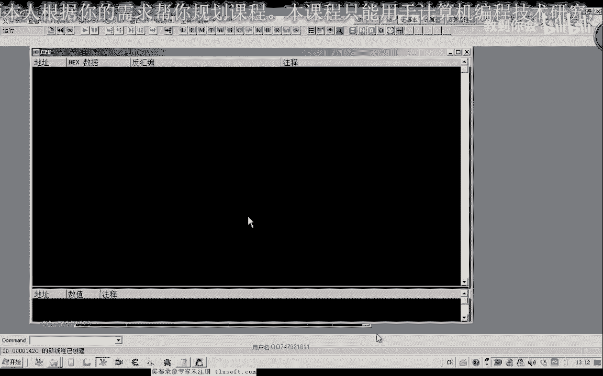
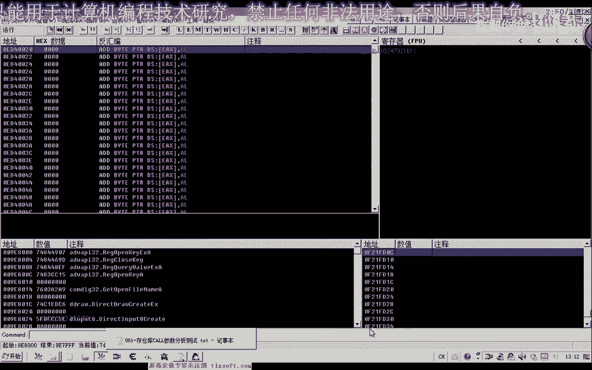
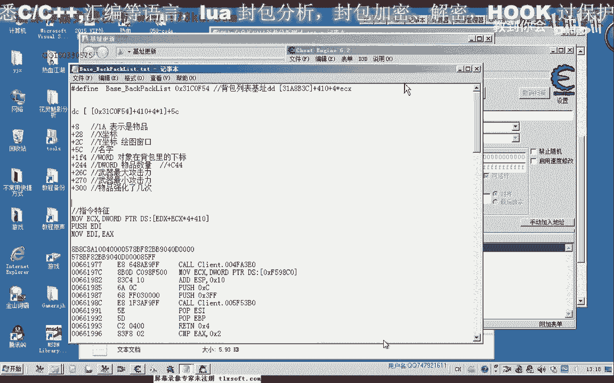
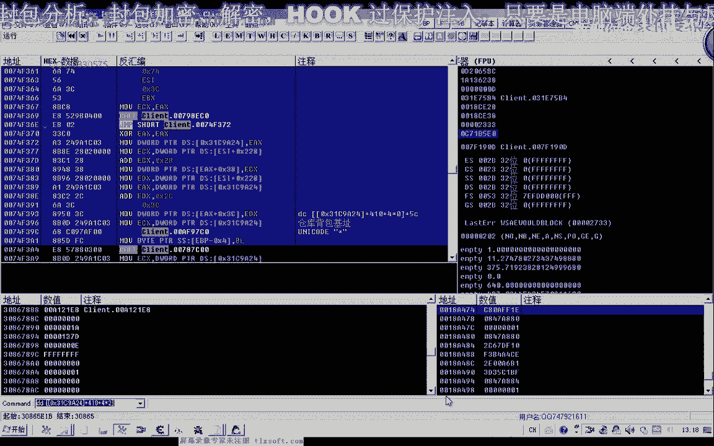
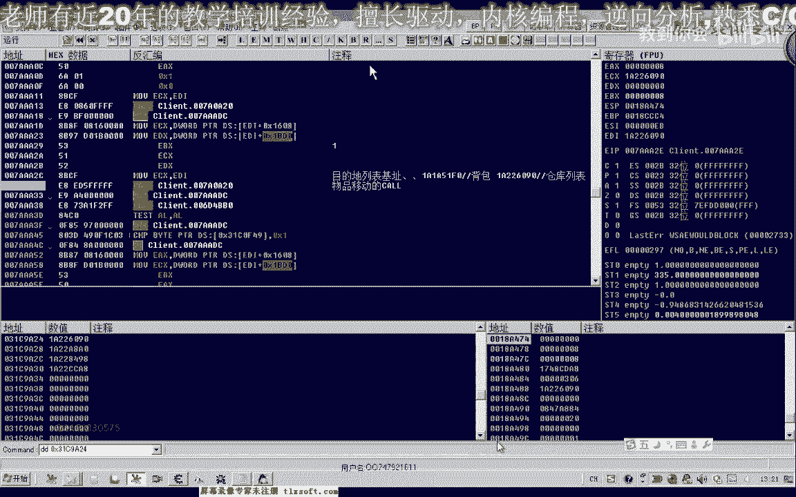
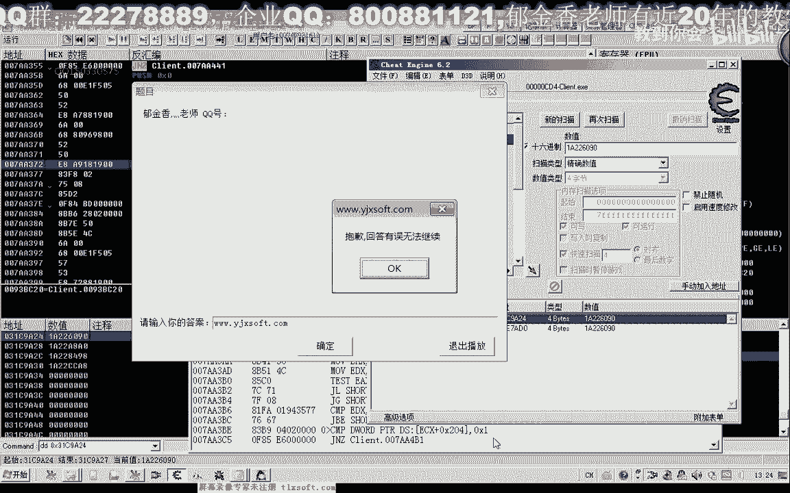
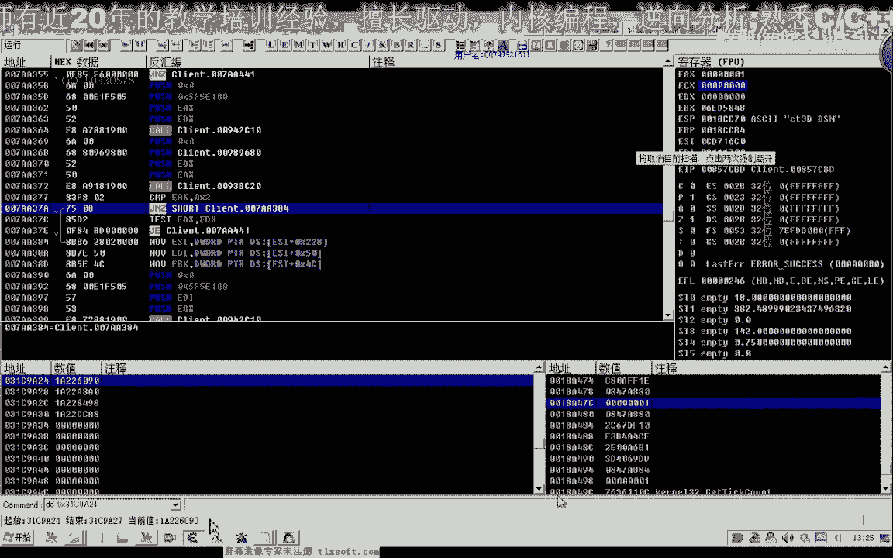
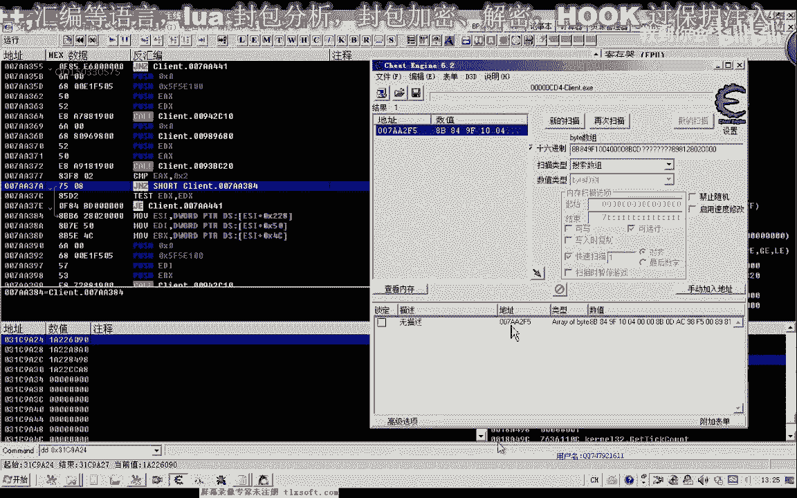
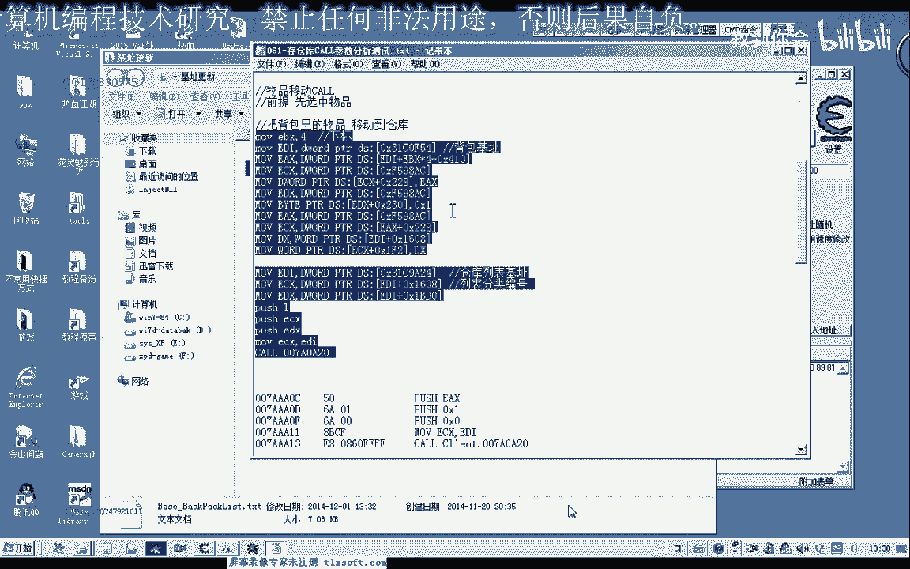

# 课程P50：061-存仓库CALL参数分析测试 📦➡️🏦

在本节课中，我们将学习如何分析游戏内存中“存仓库”功能的关键参数，并理解其调用机制。我们将通过逆向分析，找到背包和仓库的对象基址，并最终编写出能够将物品从背包移动到仓库的代码。

---

## 概述


上一节我们分析了物品移动功能的一些数据和参数。本节中，我们将深入分析其核心机制，特别是`ecx`和`edi`参数的来源。理解这些参数后，我们就能通过偏移量直接获取`ebx`和`edx`的数据，从而完整地调用存仓库功能。





---

## 分析参数来源

核心参数`ecx`（或执行一步后变为`ecx`的`edi`）是目的地（背包或仓库）的对象基址。`ebx`和`edx`的数据则来源于该基址加上特定的偏移量。


以下是关键偏移量：
*   `+0x410`: 指向物品列表的起始位置。
*   `+0x5C`: 指向物品的名称或其他属性。

这些偏移量在之前分析“物品使用”功能时也出现过，形式类似，但调用的函数库不同。

---


## 定位背包与仓库基址

为了验证我们的分析，需要使用调试工具（如OD）附加到游戏进程。

1.  首先，在背包内移动一个物品，触发我们上节课分析的断点。
2.  记录此时`ecx`（或`edi`）寄存器的值。这个值就是**背包对象基址**。
    *   公式：**背包基址 = `ecx`寄存器值**
3.  接着，在仓库内移动一个物品，再次记录`ecx`（或`edi`）的值。这个值就是**仓库对象基址**。
    *   公式：**仓库基址 = `ecx`寄存器值**





通过内存查看工具（如CE）搜索并验证这些基址，确认`基址+0x410`偏移处确实是物品列表。


---

## 理解调用机制

分析调用存仓库功能的汇编代码后，我们明确了其工作流程：

1.  **选中物品**：首先需要选中背包中待移动的物品。
2.  **调用移动函数**：然后调用一个固定的函数（CALL），传入必要的参数。



移动函数的关键参数如下：
*   **参数1 (ecx)**：目的地对象基址（背包基址或仓库基址）。
*   **参数2 (ebx)**：来源物品在背包中的下标（索引）。
*   **参数3 (edx)**：通常为固定值1。
*   **调用地址**：一个固定的函数地址（例如 `0x720A20`）。

因此，存仓库的调用逻辑可以概括为：
**调用 `目标函数`，参数为：(`仓库基址`, `背包物品下标`, 1)**

---

## 编写选中物品代码


在调用移动函数前，必须先选中物品。我们找到了游戏中“选中物品”功能的代码位置。



以下是实现选中物品的核心汇编代码片段（地址和常量需根据实际分析更新）：




```assembly
mov edi, [背包基址]        ; 将背包对象基址存入edi
mov ebx, [物品下标]        ; 将要选中的物品下标存入ebx
mov eax, [edi+ebx*4+0x410] ; 计算物品对象地址
mov [选中状态地址], eax     ; 写入到选中状态的内存位置
```




**代码说明**：
*   `背包基址`：之前找到的背包对象地址。
*   `物品下标`：从0开始的物品格子索引。
*   `选中状态地址`：游戏中记录当前选中物品的内存地址。

运行此代码后，游戏内对应的背包物品就会被高亮选中。

---

## 整合存仓库功能

将“选中物品”和“调用移动函数”两步结合，就构成了完整的存仓库功能。

以下是完整的操作步骤：

1.  **初始化参数**：
    *   获取背包基址、仓库基址。
    *   确定要移动的物品在背包中的下标。

2.  **执行选中操作**：
    *   调用上述“选中物品”的代码，选中目标物品。

3.  **执行移动操作**：
    *   调用存仓库函数，传入参数：仓库基址、物品下标、1。

---

## 代码封装建议

为了方便使用，可以将上述逻辑封装成一个函数。函数原型可以设计如下：

```c
// 函数功能：将背包中指定下标的物品存放到仓库
// 参数：nIndex - 背包中的物品下标（0起始）
// 返回值：成功返回1，失败返回0
int StoreItemToWarehouse(int nIndex) {
    // 1. 定义常量（通过分析获得）
    DWORD dwBackpackBase = 0xXXXXXXX;   // 背包基址
    DWORD dwWarehouseBase = 0xXXXXXXX;  // 仓库基址
    DWORD dwSelectItemFunc = 0xXXXXXXX; // 选中物品CALL地址
    DWORD dwMoveItemFunc = 0x720A20;    // 移动物品CALL地址

    // 2. 选中背包物品
    // 此处需内联汇编或WriteProcessMemory实现选中逻辑
    // ...

    // 3. 调用存仓库CALL
    __asm {
        push 1                 // 参数三
        mov ecx, dwWarehouseBase // 参数一：目的地基址（仓库）
        mov ebx, nIndex        // 参数二：来源下标
        call dwMoveItemFunc    // 调用移动函数
    }

    return 1;
}
```

**注意**：此方法通常需要先打开仓库界面才能成功。后续可以探索更简洁的“一键存仓库”函数。

---

## 总结

本节课我们一起学习了如何逆向分析游戏中的存仓库功能。
1.  我们首先分析了关键参数`ecx`的来源，区分了**背包基址**和**仓库基址**。
2.  然后，我们理解了存仓库的**两步机制**：先选中物品，再调用移动函数。
3.  接着，我们找到了**选中物品的代码**并理解了其原理。
4.  最后，我们将所有步骤整合，形成了完整的存仓库逻辑，并给出了**代码封装**的建议。



通过本课的学习，你不仅掌握了分析特定游戏功能的方法，也加深了对游戏内存结构和函数调用约定的理解。课后作业是尝试将分析出的汇编逻辑，用C语言封装成一个可调用的函数。