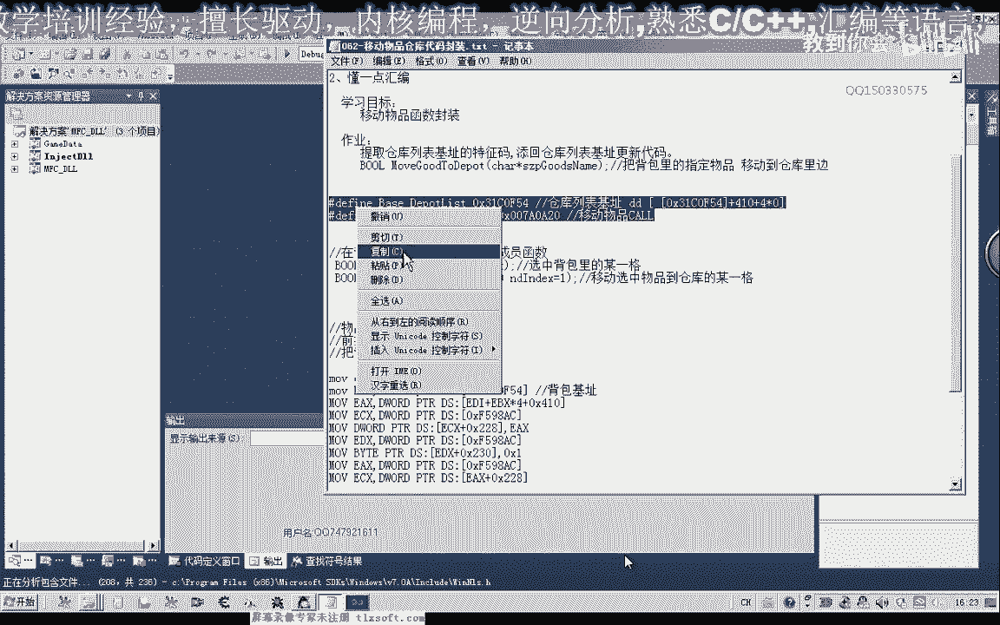
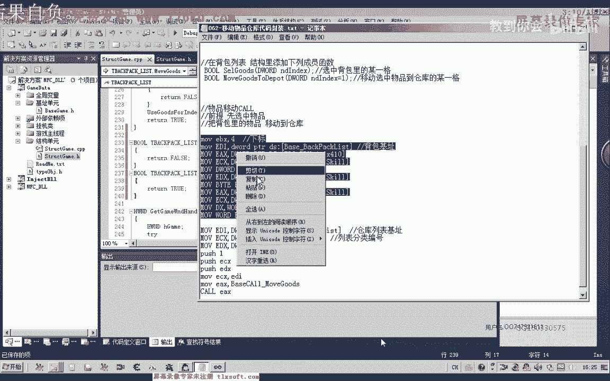
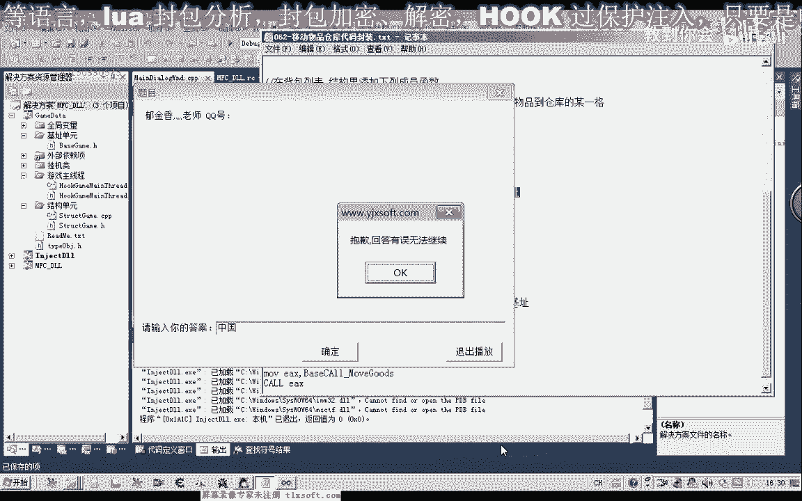
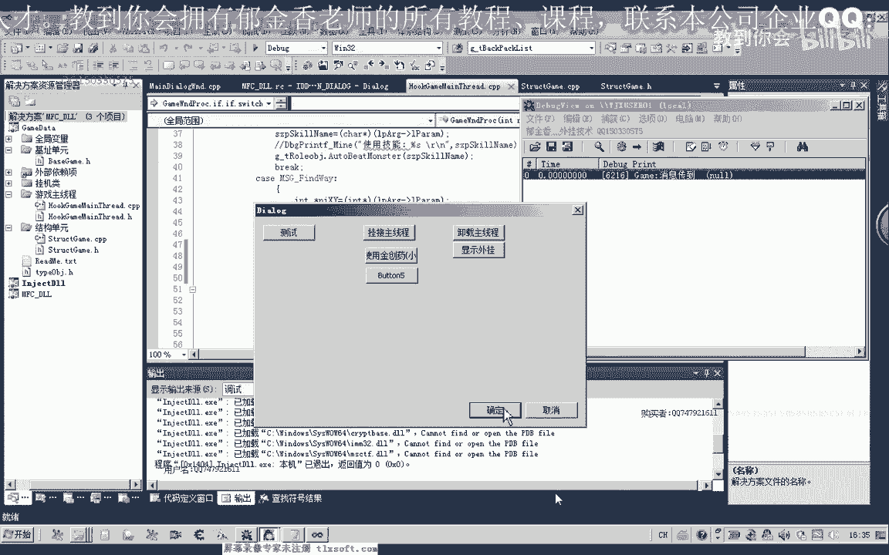
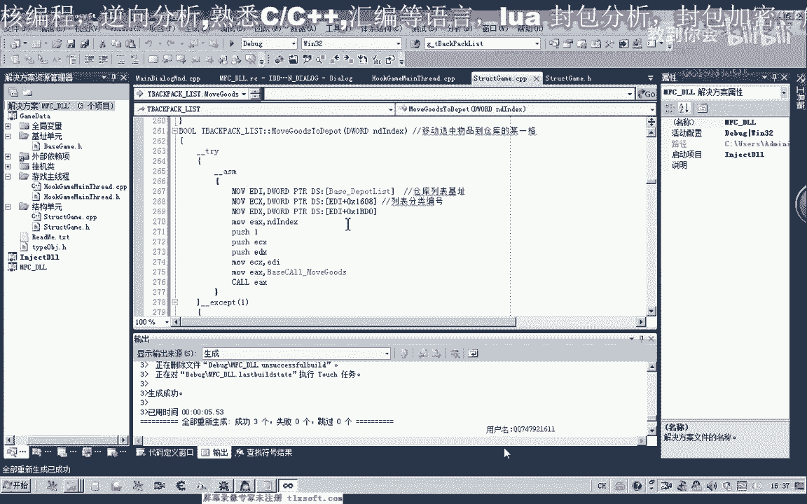
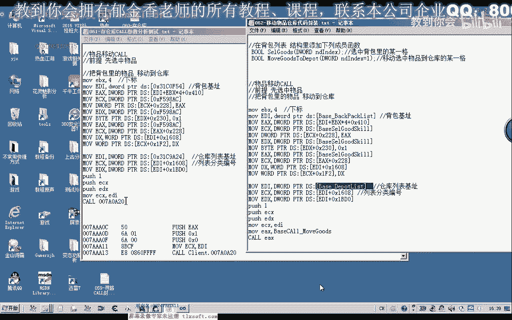
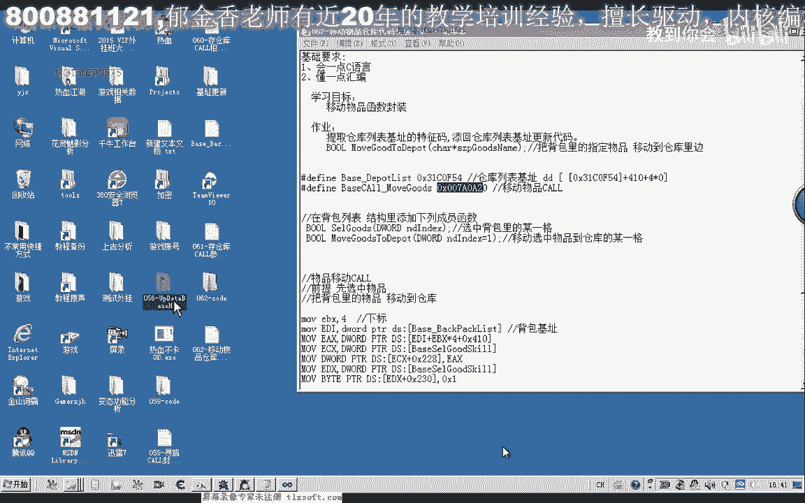
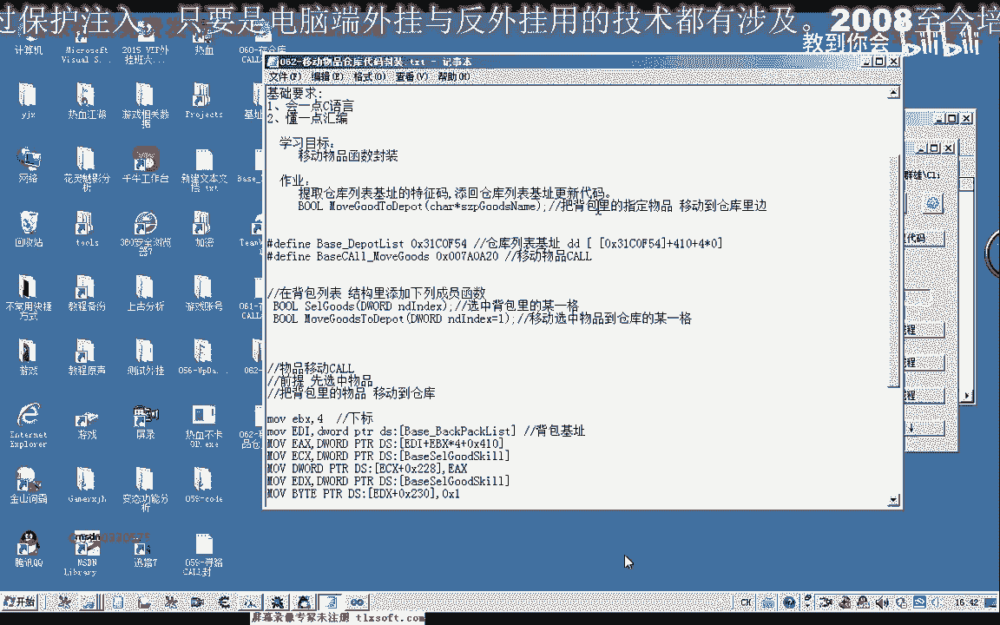

# P51：062-移动物品仓库代码封装 - 教到你会 - BV1DS4y1n7qF

大家好，我是郁金香老师，那么今天这节课呢，我们对前面分析的这些数据呢进行相应的封装，先打开第59课的代码。

那么首先呢我们把仓库列表的机子以及移动盲物品的这个扩展，这个地址呢我们放到我们的基础单元。

那么然后呢我们需要对这下面的这一段代码来进行一些处理。

首先呢背包的机子呢我们把它替换成红。

你看。

那么然后是后边这些数数字的，我们把它也进行相应的替换。

那么这个呢我们把它替换成我们的选中的物品技能的这个红啊，在这个地方。

那么还有一个呢也就是仓库的一个机制，我们也需要进行一个替换，那么最后呢是我们的这个扩扩呢，我们也需要替换成一个红，但但是这个地方呢我们不能够直接的替换，那么我们需要先把它放到我们的一个寄存器里边。

那么这里呢我选1a x，好的，那么做完这些工作之后呢，我们再把我们函数的这个格式添加到我们的相应结构里面。

那么在这里呢我们添加到背包列表里面，那么在这里我们可以给它加上一个前缀，也可以不加啊，那么加上前缀之后呢，我们方便复制，那么复制这个函数的一个说明，然后我们对它进行一个代码的添加，转到第一。

去掉后面的分号，先随意的给他一个返回值，然后我们再选中背包里面的某一格。

那么我们先把前面的这一段代码复制进来。

那么因为我们需要读取机制这一类的，那么我们也要做一个相应的异常处理，二，哈哈哈，复制一下哈，然后粘贴到我们这个地方，啊，然后这里呢我们需要来进行一个汇编的快的一个说明，哈哈，对它进行一下整理。

然后这个地方呢是我们背包的下标，那么我们把这个下标值呢把它传进来，那么这个地方如果出现了异常，当然我们返回flash或者是返回空，那么如果这里返回空的话，我们返回类型呢我们最好把它改一下。

那么这里我们有一个取出的对象，那么如果我们选中的这个对象啊，指定的这个下标那一个他没有这个对象存在的话，那么呢我们就返回相应的就返回空啊，那么在这里呢我们在另外的建一个变量，用来指向这个对象。

那么这个ex呢就是我们根据下标取出来的对象，那么在这个时候我们把它放到我们的临时变量里面，那么最后呢我们在这里来返回这个对象就可以了，那么所以说这里的类型呢我们也可以改变一下啊，那么我们编译一下。

在这里呢我们把它的一个默认值来给它取消掉，然后再编一下，重新编译所有的这个代码，好那么这个时候编译成功了，那么我们进行一下相关的测试，那么要测试的话，我们需要在主线程单元啊，测试的这个代码这里。

那么先把后面的这个注释掉，多余的啊，这是技能的一个偏离，那么我们选中第一个啊，这里我选择第一，然后切换到我们的资源视图窗口啊。

测试这个地方来调用我们的测试函数，那么调用的时候呢，我们把后面的寻路的关掉，再进行编译。

那么我们看一下第一个是瑞把武器，那么我们挂机主线程测试，这个时候我们移动到游戏窗口的时候，我们发现他已经他选中了我们的这个相应的物品，那么如果我们第一个是这个相应的金刚石，那我们测试的时候呢。

我们发现了它也能够选中相应的这个金刚石，那么证明了我们的测试是成功的，那么接下来我们嗯嗯。

进行第二步啊，也就是调用这个移动移动物品到仓库里面，那么这是它的一个相应的一个下标好的，我们复制一下这段代码，在这里呢我们也需要来添加一个异常处理，那么添加我们的会汇编去复制进来，那么如果出现异常的话。

这里呢我们就返回数值零啊，那么如果是没有产生异常呢，我们返回数值一，那么这里呢是我们的一个下标，那么这里呢我们还是把这个下边那个数字呢给它传进来，那么我们先把它放到我们的呃，另外一个ex这个先读出来。

然后呢再把它进行一个复习，嗯，好的，那么我们再编译一下嗯，如果成功的话，我们就能够把指定的物品来，能够把它移动到我们的仓库里面去，那么我们再进行一下相关的一个测试，那么移到我们的主线程单元。

那么选中第一个之后呢，我们就把它移动到我们的仓库里边。

那么这里呢应该已经有一个默认的一个数值了，那么这个默认的数值呢，我们把它放到头文件，说明这，应该是在这个地方实现了，啊，那我们再看一下前面的一个说明，好的，那么我们在主线程单元呢添加我们相关的一个代码。

那么当然了，这里我们也可以给他传一个数字进去，那么我们看一下现在第一个呢他没有这个物品，那么首先呢我们需要来测试的时候，我们需要把仓库打开，那么打开之后呢，我们呃首先我们是需要第一个有一个相应的物品。

那么我们以这个骨气无力，那么我们化解到主线程，然后测试，那么这个时候呢他没有这个反应啊，那么我们先用调试器啊，信息啊，查看一下调试的一个信息。

那我们再来看一下我们的这个相应的代码，那么已选中了第一格的物品，然后是移动到我们的仓库里面，那么我们再重新编译一下，子，你，再测试一下，那么这个时候还是没有反应，我们在这里打印一段调试信息。

看我们这里有没有被执行到，嗯，那么这段代码呢它是被执行到的，但是没有出现相应的效果，那么可能是我们后面封装到这个函数呢，它出了问题，那么我们再来看一下相关的参数，他也没有出现一个相关的一个异常。

仓库基层，那么我们再把这里看是不是这个参数的一个传递出现了问题，那我先把这个参数啊这里改一下嗯，然后我们再编译重新再看一下。

那么首先呢我们看一下相关的这些机子是不是正确的，我们再来核对一下呃，仓库列表的一个基础，3140f4 ，那么我们再看一下前一刻更新的。

31c0 f54 。

嗯嗯那么我们先测试一下这段汇编代码。

我们看能不能够执行，然后把下标为五的这个物品呢我们存到仓库里面去，我们看一下下表为没有东西啊，那么我们第四个这里有个戒指，那么我们下标为三啊，试一下，那么证明我们的代码是没有问题的。

那么我们用这段代码都是可以呃，那么可以执行的，那么我们再来检测一下我们的这个c语言里面的这个代码的一个问题。

那我们先进行一下对照啊修改，那么可能是后面这一段出了问题，31c9 好像是这个这个机子好像是出了问题，那么我们知道这个仓库的列表机制，这个地方嗯，把它进行一下修改，然后我们再进行测试，挂在主线程中。

那么这个时候呢我们测试成功了啊，那么我们能够把我们背包里面的物品移动到我们的这个仓库里边，好的，那么这节课呢我们的测试就到这里，那么这节课下去之后呢，大家也去把我们的呃相应的这个机子的特征码啊。

进行一下这个收集仓库列表的。

还有这个移动物品的，然后呢添加相应的代码，那么我们把它更新到我们的头文件里边。

好的，那么这节课我们就到这里，那么呃还有一个作业呢，我们就是这里来留了一个函数，让大家自己去封装一下，那么也就是我们在存放的时候呢，我们不通过啊下标，搜索到之后呢。

我们直接就把相应的物品栏存到我们仓库里边去了，大家可以呃运行这样一个函数，那么编写这个函数的时候呢，我们可以借用一些现有的函数，那么比如说betty goindex或类啊。

那么这个呢它就能够取得相应的这个下标，然后再来调用我们的这个ca库组，下周应该就可以了啊，那么大家自己下去动一下子，那进行一下相应的赏识，那么并且把我们的机子也进行一下更新好的。

