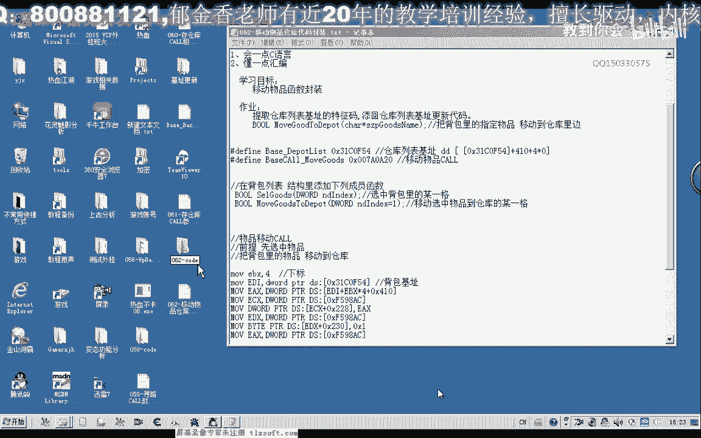

# 课程P51：062-移动物品仓库代码封装 📦➡️🏦


在本节课中，我们将学习如何将之前分析的游戏数据封装成可复用的函数。主要内容包括封装“选中背包物品”和“移动物品到仓库”两个核心功能，并进行测试验证。


---

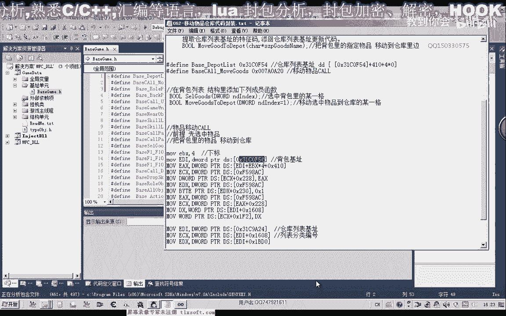


## 概述


上一节我们分析了游戏仓库和背包的相关数据。本节中，我们将把这些零散的汇编代码逻辑封装成结构清晰、易于调用的C语言函数。


## 第一步：定义基础数据与宏

首先，我们需要将仓库列表的基址以及移动物品功能相关的扩展地址定义在基础单元（头文件）中。

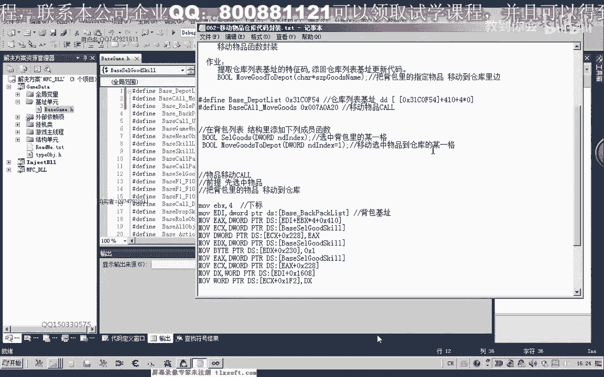

以下是需要定义的核心地址宏：

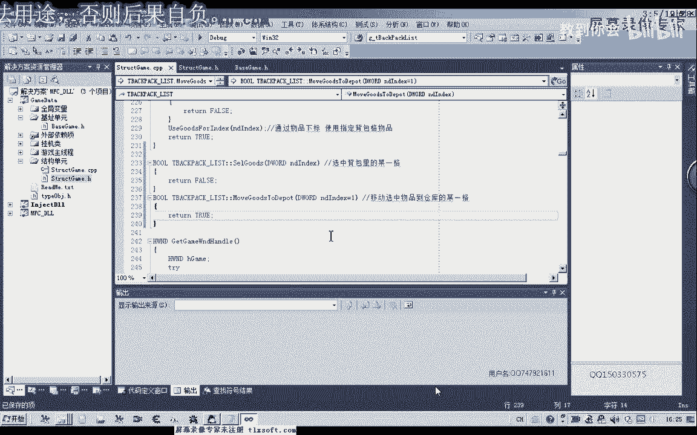

```c
// 仓库列表基址
#define WAREHOUSE_LIST_BASE 0x031C0F54
// 移动物品功能扩展地址
#define MOVE_ITEM_EXT_ADDR 0xXXXXXXXX
// 背包列表基址
#define BACKPACK_LIST_BASE 0xXXXXXXXX
```


## 第二步：封装“选中背包物品”函数

上一节我们介绍了如何通过汇编代码选中背包中的物品。本节中我们来看看如何将其封装成一个C函数。

这个函数的目标是：根据传入的物品在背包中的下标（索引），选中对应的物品。

以下是该函数的实现步骤：

1.  将背包基址替换为宏 `BACKPACK_LIST_BASE`。
2.  将选中物品的索引值作为参数传入。
3.  将相关的汇编代码块放入函数体。
4.  添加异常处理，确保代码健壮性。
5.  函数返回选中物品的对象指针，如果选中失败则返回空值 `NULL`。

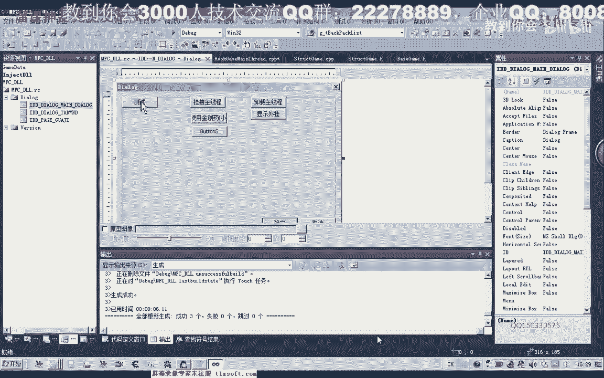

封装后的函数代码如下：

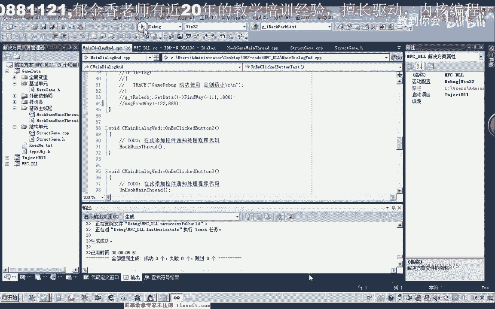

```c
// 函数：根据下标选中背包中的物品
// 参数：index - 物品在背包中的下标（从0开始）
// 返回值：成功选中则返回物品对象指针，失败返回NULL
void* SelectBackpackItem(int index) {
    void* pItem = NULL; // 用于指向选中物品的临时变量

    __asm {
        // 异常处理开始
        pushad
        try {
            // 汇编代码块：根据 index 计算并选中背包物品
            mov ecx, BACKPACK_LIST_BASE
            mov ecx, [ecx]
            // ... 其他计算和调用指令，使用 index 参数 ...
            mov [pItem], eax // 假设选中后物品指针在EAX中
        }
        except(EXCEPTION_EXECUTE_HANDLER) {
            // 发生异常，清理并返回NULL
            popad
            return NULL;
        }
        // 异常处理结束
        popad
    }
    return pItem; // 返回选中的物品对象
}
```

编译成功后，我们在主线程单元进行测试。测试时，需要先打开游戏窗口，然后调用 `SelectBackpackItem(0)` 尝试选中背包第一格的物品（无论是武器还是金刚石），观察游戏内是否成功选中，以验证函数功能。


## 第三步：封装“移动物品到仓库”函数

成功封装选中功能后，我们继续封装更复杂的操作：将选中的物品移动到仓库。

这个函数的目标是：将指定下标的背包物品移动到仓库中。

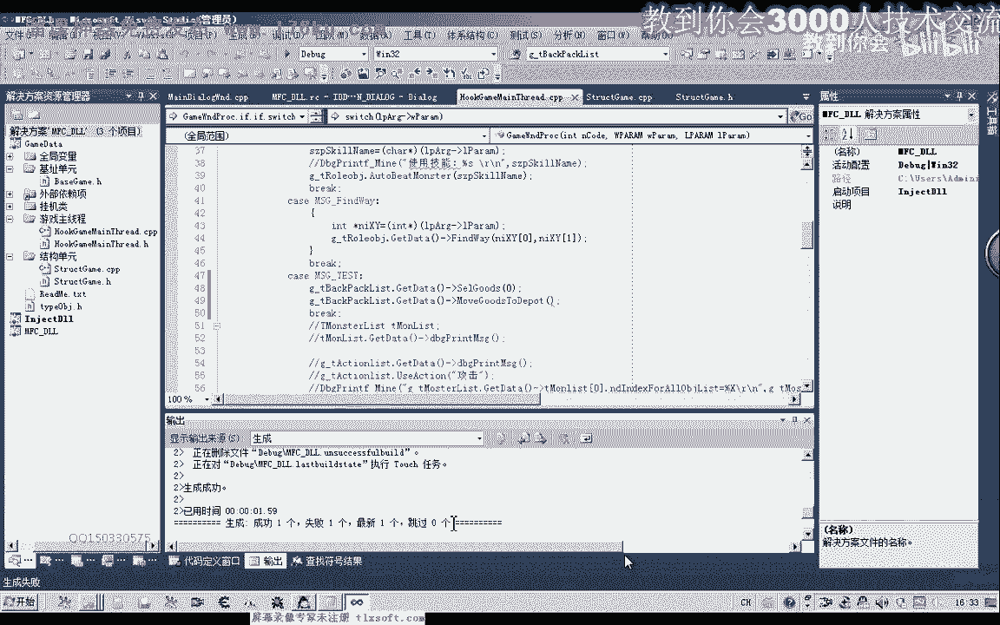

以下是该函数的实现步骤：

1.  复制移动物品的汇编代码逻辑。
2.  将仓库列表基址替换为宏 `WAREHOUSE_LIST_BASE`。
3.  将物品下标作为参数传入。
4.  同样添加异常处理框架。
5.  函数返回一个整型状态，1代表成功，0代表失败。

封装后的函数代码如下：


```c
// 函数：将背包中指定下标的物品移动到仓库
// 参数：index - 要移动的物品在背包中的下标
// 返回值：1-移动成功，0-移动失败
int MoveItemToWarehouse(int index) {
    int nResult = 0; // 操作结果

    __asm {
        pushad
        try {
            // 首先，选中指定下标的物品
            // ... 调用类似 SelectBackpackItem 的逻辑或直接嵌入汇编 ...
            // 然后，执行移动到仓库的调用
            mov ecx, WAREHOUSE_LIST_BASE
            mov ecx, [ecx]
            // ... 后续移动物品的指令 ...
            mov [nResult], 1 // 执行成功，设置结果为1
        }
        except(EXCEPTION_EXECUTE_HANDLER) {
            popad
            return 0; // 发生异常，返回失败
        }
        popad
    }
    return nResult;
}
```

在测试这个函数时，我们遇到了问题：代码编译通过，但物品没有移动。通过调试器输出信息，我们发现函数被执行了，但未产生效果。

经过排查，问题出在仓库列表基址 `WAREHOUSE_LIST_BASE` 的值不正确。我们重新核对前课分析的数据，将基址修正为 `0x031C0F54`。


修正基址后，重新编译并测试。此时，调用 `MoveItemToWarehouse(3)` 成功将背包第四格（下标为3）的戒指移动到了仓库中，证明函数封装成功。

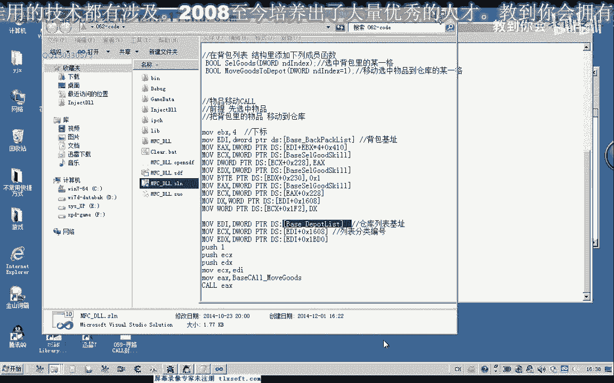

## 第四步：更新头文件与课后作业

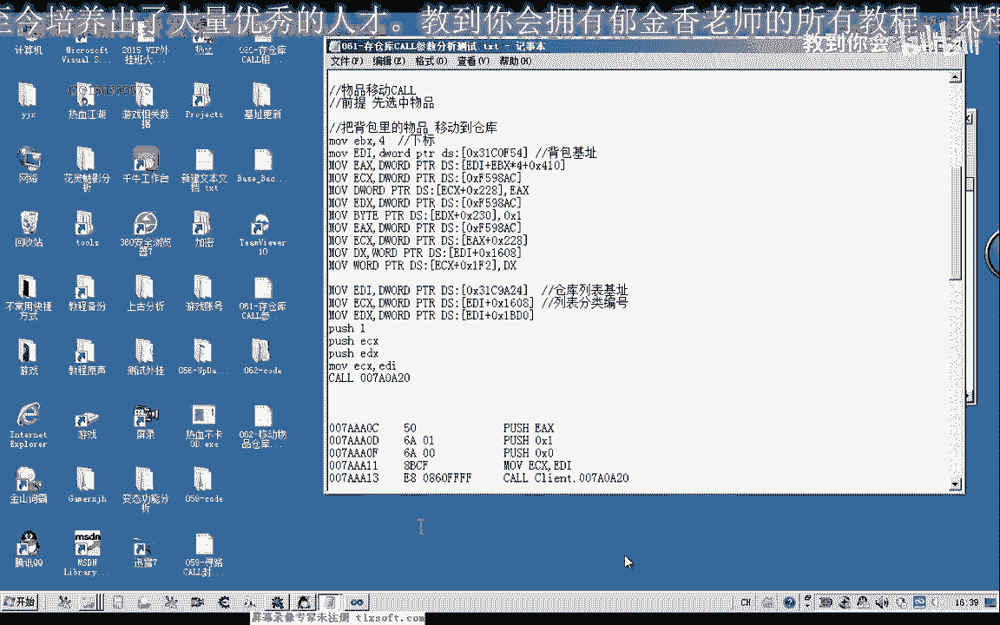

函数测试成功后，我们需要将最终确定的特征码和基址更新到项目的公共头文件中，方便其他模块调用。


此外，留一个课后作业供大家练习：


**作业：封装一个“存放指定物品到仓库”的函数**

这个函数不通过下标，而是直接搜索背包中符合条件的物品（例如特定名称或ID），然后将其存放到仓库。

实现思路：
1.  可以借助现有的遍历背包函数（例如 `GetItemByIndex`）来查找物品。
2.  找到物品后，获取其下标。
3.  调用本节课封装的 `MoveItemToWarehouse` 函数完成存放。

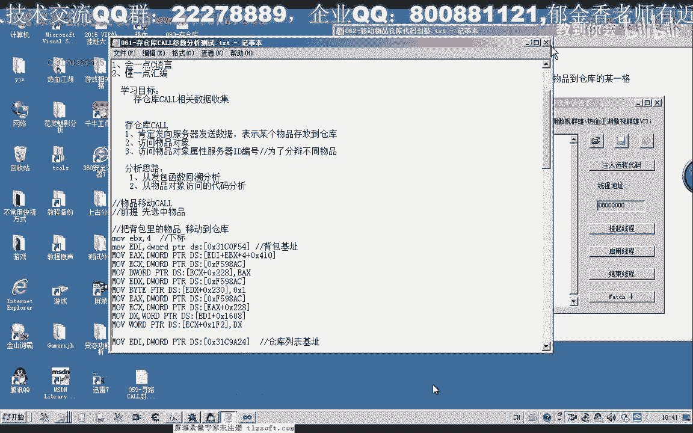

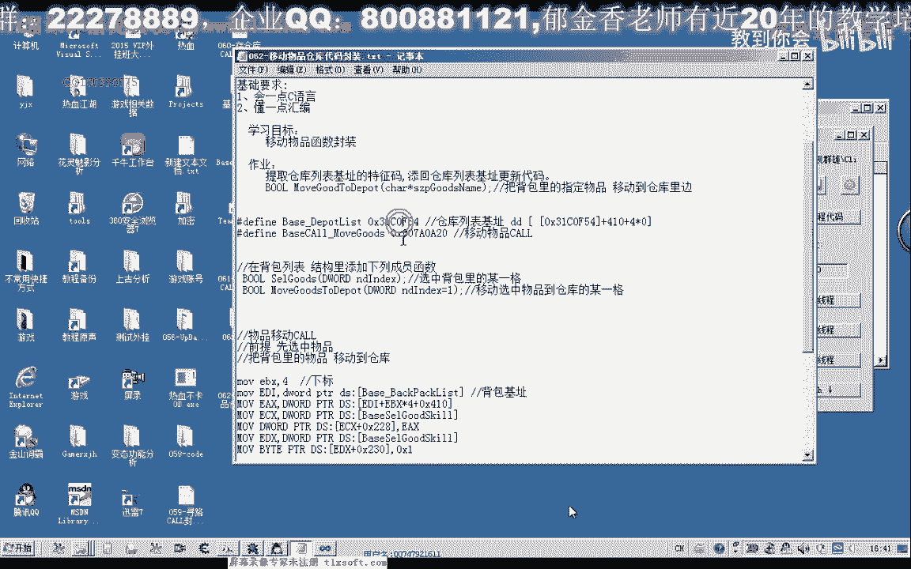

请大家课后动手实践，完成这个函数的封装，并更新相关的特征码。


---

## 总结

本节课中我们一起学习了如何将逆向分析得到的汇编代码封装成实用的C语言函数。我们完成了两个核心功能：
1.  **选中背包物品**：根据下标选中物品。
2.  **移动物品到仓库**：将选中物品移入仓库。


通过封装，我们使代码更模块化、更易读、更易维护。同时，在调试中修正基址错误的过程，也巩固了逆向工程中验证数据准确性的重要方法。