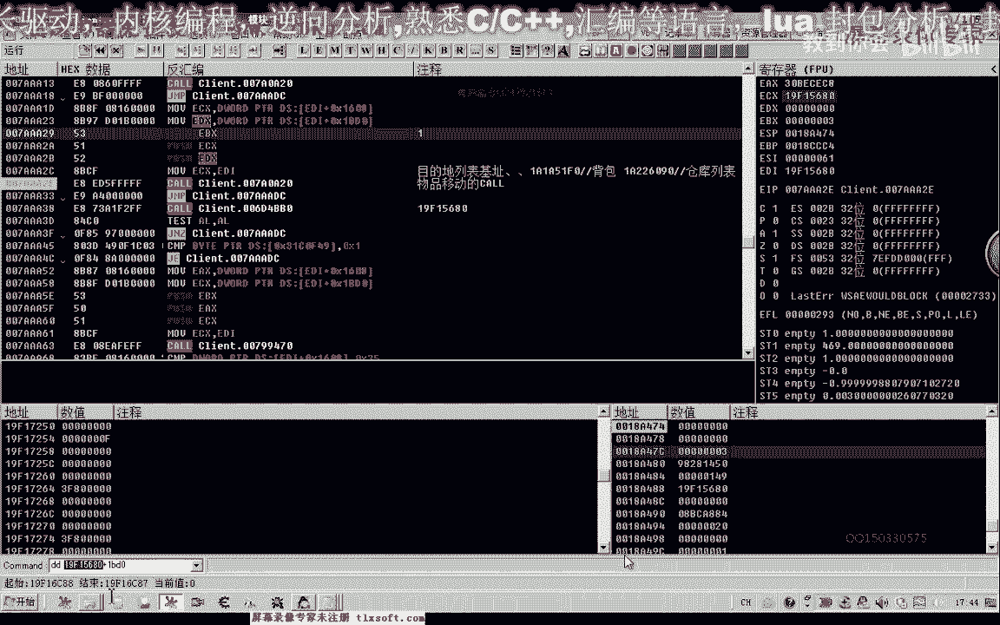
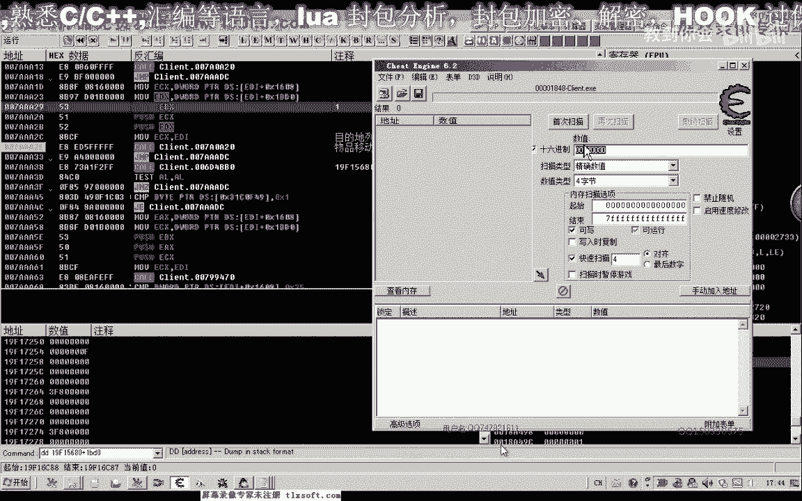
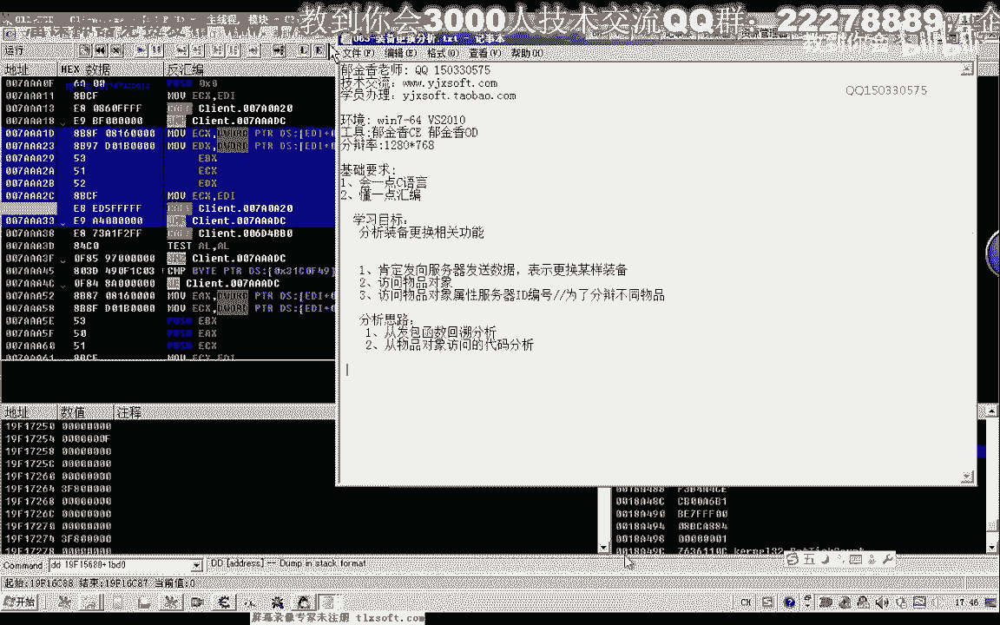

# 课程 P52：063-装备更换功能分析 🛠️

在本节课中，我们将学习如何分析游戏中的装备更换功能。我们将基于之前物品移动功能的分析，探索如何将背包中的物品移动到装备栏，并理解其背后的数据结构和调用逻辑。

---

上一节我们分析了物品在背包和仓库之间的移动。本节中，我们来看看如何更换装备，例如将一件武器从背包装备到角色身上。


实际上，更换装备也是将对象从背包列表移动到装备列表的过程，它很可能调用了与物品移动相同的函数。因此，我们可以延续上一节课的数据分析基础。


我们打开第61课的相关代码，并在相应的函数调用处下断点进行尝试。


首先，我们将调试器附加到游戏进程。


我们在物品移动的函数处下断点。因为更换装备也是一种物品移动，所以可能会在此处中断。此时，程序确实中断了。

我们观察此时的 `ECX` 寄存器值是 `680`。我们记录下这个 `ECX` 的数值，并检查它是否指向相关数据。我们查看 `ECX + 0x410` 地址的内容。

此时，我们发现其指向的第一个物品是“地藏枪一”。第一个位置（下标0）对应的是装备栏中间的位置。因为所有对象（背包、仓库、装备栏、快捷栏）都使用相同的对象格式，并通过 `+0x410` 这个偏移量来访问物品数组。

我们再查看第二个位置（下标1）的物品，它是一个“领域副手”，属性为防御+8。第三个位置（下标2）是空的。第四个位置（下标3）才是我们的武器栏。

因此，我们知道武器在装备列表中的下标值是 **3**。

我们继续执行，再次中断时，发现参数中传入了下标值 **3**。后面两个参数的值都是 **0**。这两个零值分别来源于装备列表指针偏移 `+0x1608` 处的值，以及 `EBP-0xD0` 处的值。

这个下标参数是必须传入的，这与移动到仓库时不同（移动到仓库时，目标位置可能由函数内部自动计算）。

了解了这些信息后，我们接下来寻找装备列表的基址指针。





我们首先使用 `CE`（Cheat Engine）搜索 `ECX` 的值。


此时搜出两个地址。一个应该是全局所有对象列表中的地址，另一个才是真实的装备列表基址指针。我们修改这个值，然后在游戏中进行验证，以确定正确的基址。

找到的基址指针会被多处代码引用。我们选择第一个结果，并将其记录下来。注意，这是**装备列表**的基址。

第二个地址（绿色的）通常位于数据段（`.data` 或 `.rdata`），可能属于全局对象列表，不一定是我们需要的那个变量。

接下来，我们进行功能测试。我们退回游戏，尝试更换装备。




以下是编写调用代码的思路：


首先，我们可以参照前几节课的代码结构。实际上，我们可以在上一节课（第62课）的“移动到仓库”代码基础上进行修改。


我们需要修改的**核心部分**如下：
1.  将**目标列表基址**从仓库地址改为装备列表地址。
2.  传入的**目标下标参数**固定为武器的下标 **3**。
3.  传入的**源下标参数**（背包中的位置）根据实际情况选择，例如第二个格子（下标1）。


修改后的关键代码逻辑如下（伪代码表示）：
```cpp
// 假设函数原型：MoveItem(源列表基址， 源下标， 目标列表基址， 目标下标， 参数4， 参数5)
DWORD equipBaseAddr = 0xXXXXXX; // 装备列表基址
DWORD backpackBaseAddr = 0xYYYYYY; // 背包列表基址
int fromIndex = 1; // 从背包第2格（下标1）取物品
int toIndex = 3;   // 移动到装备栏武器位（下标3）

MoveItem(backpackBaseAddr, fromIndex, equipBaseAddr, toIndex, 0, 0);
```

我们使用代码注入器进行测试，发现可以成功更换武器装备。

在编写游戏辅助程序时，这个功能会经常用到。本节课的分析就到这里。

下一节课，我们将对这个装备更换的代码进行封装。大家也可以将此作为一个练习，在课后尝试独立完成。


---


**本节课总结**
在本节课中，我们一起学习了：
1.  装备更换功能本质上是**物品移动函数**的另一种调用方式。
2.  确定了**装备栏**中**武器**所在的固定下标为 **3**。
3.  通过CE搜索和游戏验证，找到了**装备列表的基址指针**。
4.  在之前移动物品代码的基础上，通过修改目标基址和目标下标，成功实现了**装备更换**的调用。
5.  理解了更换装备与移动物品到仓库时，在参数传递上的主要区别。