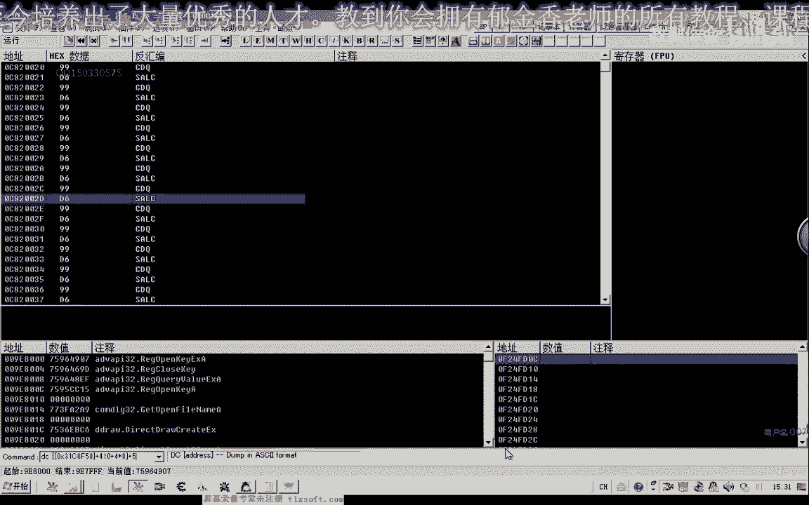
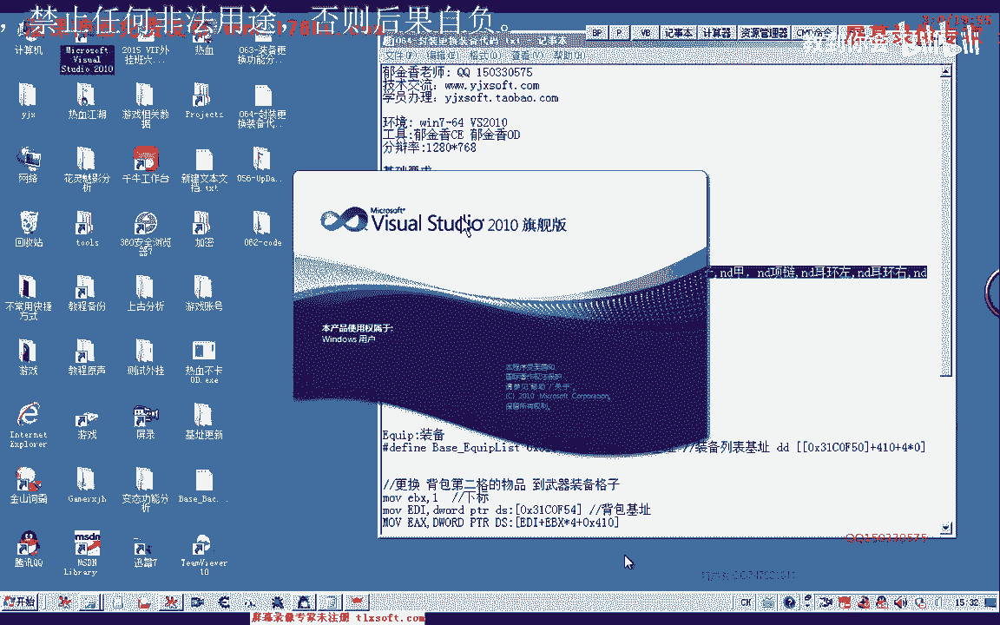

# 课程 P53：064-封装更换装备代码 🛡️➡️⚔️


在本节课中，我们将学习如何封装游戏内更换装备的功能代码。我们将分析装备列表的结构，使用枚举类型提高代码可读性，并最终封装一个通用的更换装备函数。

---

## 了解装备列表与下标


上一节我们分析了更换装备的相关数据，本节中我们来看看如何封装更换装备的功能。



在封装之前，需要先了解游戏中的装备列表。更换武器时，必须将物品移动到装备列表中武器的特定下标位置。传递下标时需注意，必须是武器对应的下标。

若要更换副手装备，同样需要获取副手对应的下标位置，不能像存放仓库那样随意传递一个下标。因此，我们需要先通过调试工具确定各个装备在列表中的下标位置。

观察可知，武器的位置位于所有装备列表的左上角。




其下标可能为0，但仍需测试验证。


通过显示名称可以确认，在加 `0x5C` 偏移的位置。


测试发现，下标0的位置对应的是衣服。因此，我们可以将衣服定义为0。
下标1对应左边的副手。
下标3对应武器（例如“流星枪”）。


因此，我们可以按顺序定义：0-衣服，1-副手左，2-副手右，3-武器。定义时可以直接使用数字，但为了代码清晰，更推荐使用枚举常量。

---

## 使用枚举类型提高可读性

上一节我们确定了装备下标，本节中我们来看看如何使用枚举类型来管理这些下标。

枚举类型本质上是一个整数序列。如果没有指定值，它会从0开始自动编号。

以下是枚举类型的一个简单示例：
```cpp
enum EquipmentIndex {
    ID1, // 值为 0
    ID2, // 值为 1
    ID3  // 值为 2
};
```
打印这些常量，得到的值就是0、1、2。


我们可以用枚举常量来代表装备下标：
```cpp
enum EquipSlot {
    SLOT_ARMOR,      // 衣服，下标 0
    SLOT_OFFHAND_L,  // 副手左，下标 1
    SLOT_OFFHAND_R,  // 副手右，下标 2
    SLOT_WEAPON      // 武器，下标 3
};
```
这样，`SLOT_WEAPON` 就代表了数字3。使用枚举能使程序更具可读性。虽然也可以直接传递数字3，但使用有意义的常量名是更好的实践。


---

## 封装移动装备到指定槽位的函数

了解了枚举的用法后，我们开始封装核心函数。我们将基于之前“移动到仓库”的代码进行修改。

首先，在代码中添加装备列表的基址和枚举定义。然后，我们创建一个函数，用于将背包中的物品移动到装备列表的指定槽位。

核心逻辑与移动到仓库类似，但需要修改目标基址为装备列表基址，并且目标位置参数使用我们定义的枚举常量。

以下是函数的核心代码框架：
```cpp
// 假设 g_pEquipmentList 是装备列表基址
BOOL MoveItemToEquipmentSlot(int backpackIndex, EquipSlot slot) {
    // 1. 选中背包中指定下标的物品
    SelectItemInBackpack(backpackIndex);

    // 2. 调用游戏内部函数，移动到装备列表的特定槽位
    // 内部调用类似：CallGameFunction(g_pEquipmentList + slot * itemSize, ...)
    // ...
    return TRUE;
}
```
在调用时，若要更换武器，可以这样使用：
```cpp
MoveItemToEquipmentSlot(backpackItemIndex, SLOT_WEAPON);
```

---

## 封装更上层的“更换武器”函数

现在我们已经有了基础移动函数，可以进一步封装一个更易用的“更换武器”函数。


这个函数接收武器名称作为参数，自动在背包中查找该物品，然后将其移动到武器槽位。


以下是实现步骤：
1.  调用 `GetGoodIndexFlip` 函数，根据名称获取物品在背包中的下标。
2.  判断下标是否有效（>=0）。
3.  调用上一步封装的 `MoveItemToEquipmentSlot` 函数，传入找到的下标和 `SLOT_WEAPON` 枚举。

代码如下：
```cpp
BOOL EquipWeapon(const char* weaponName) {
    int index = GetGoodIndexFlip(weaponName); // 获取背包下标
    if (index < 0) {
        // 未找到该物品
        return FALSE;
    }
    return MoveItemToEquipmentSlot(index, SLOT_WEAPON);
}
```

---

## 测试与错误处理

函数封装完成后，需要进行测试。测试时发现，当背包物品位于后面某些空槽位时，代码会出现异常。

问题可能出在通过名称查找下标时，访问了空对象。为了解决这个问题，需要在遍历背包列表时加入空指针判断。

修改后的查找逻辑如下：
```cpp
for (int i = 0; i < backpackSize; ++i) {
    Item* pItem = GetBackpackItem(i);
    if (pItem == nullptr || pItem->name == nullptr) {
        continue; // 跳过空槽位
    }
    if (strcmp(pItem->name, targetName) == 0) {
        return i; // 找到物品，返回下标
    }
}
return -1; // 未找到
```
加入判断后，代码就能稳定运行了。如果遇到其他难以定位的错误，可以在关键代码前后添加调试信息输出，帮助定位问题所在。

---

## 总结与课后作业

本节课中我们一起学习了：
1.  **分析装备列表结构**，确定了关键装备（武器、衣服、副手）在列表中的下标。
2.  **使用枚举类型**定义这些下标，显著提高了代码的可读性和可维护性。
3.  **封装底层函数** `MoveItemToEquipmentSlot`，实现了将物品移动到装备槽位的通用功能。
4.  **封装上层函数** `EquipWeapon`，实现了通过名称直接更换武器的便捷功能。
5.  **完善错误处理**，在查找物品时加入空指针判断，使代码更加健壮。

**课后作业**：
请参照更换武器函数的逻辑，自行封装更换其他装备的函数，例如：
*   更换衣服 (`SLOT_ARMOR`)
*   更换左边副手 (`SLOT_OFFHAND_L`)
*   更换右边副手 (`SLOT_OFFHAND_R`)
*   更换项链、靴子等（需先定义其对应的枚举值）

多编写、多练习是掌握编程的关键。遇到问题可以查阅相关资料或寻求帮助。


我们下节课再见。