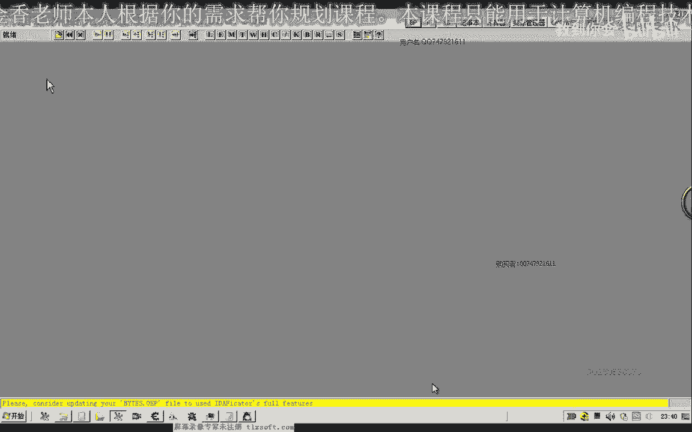
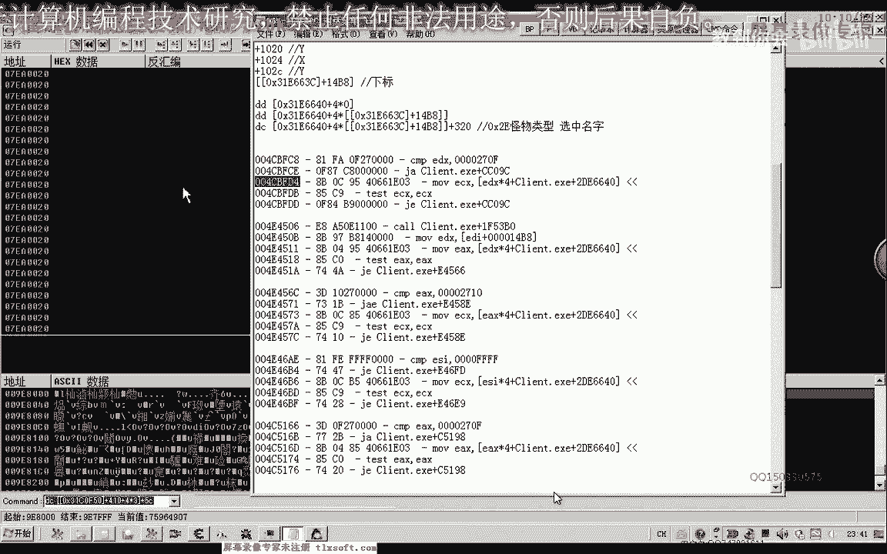
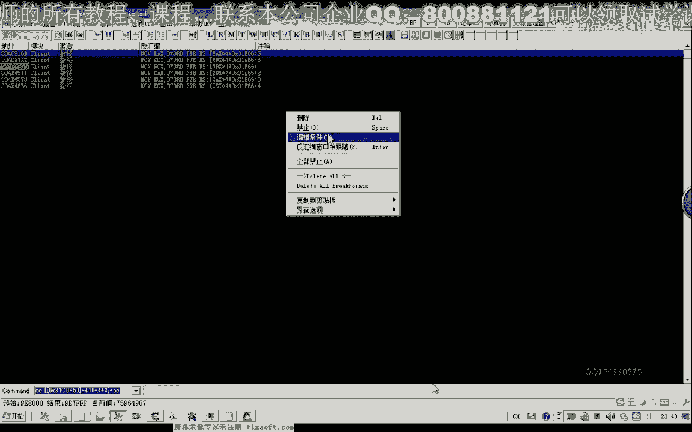
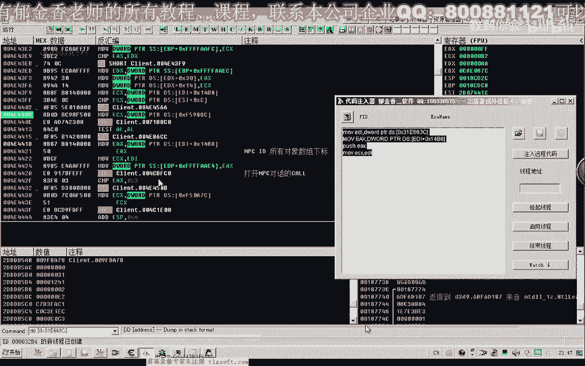
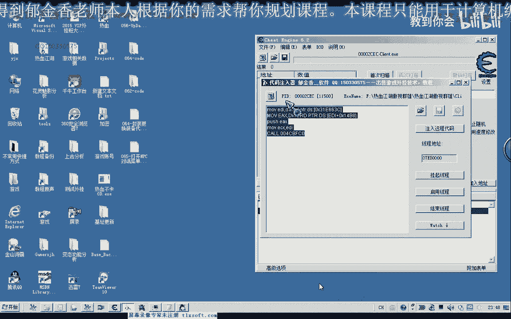
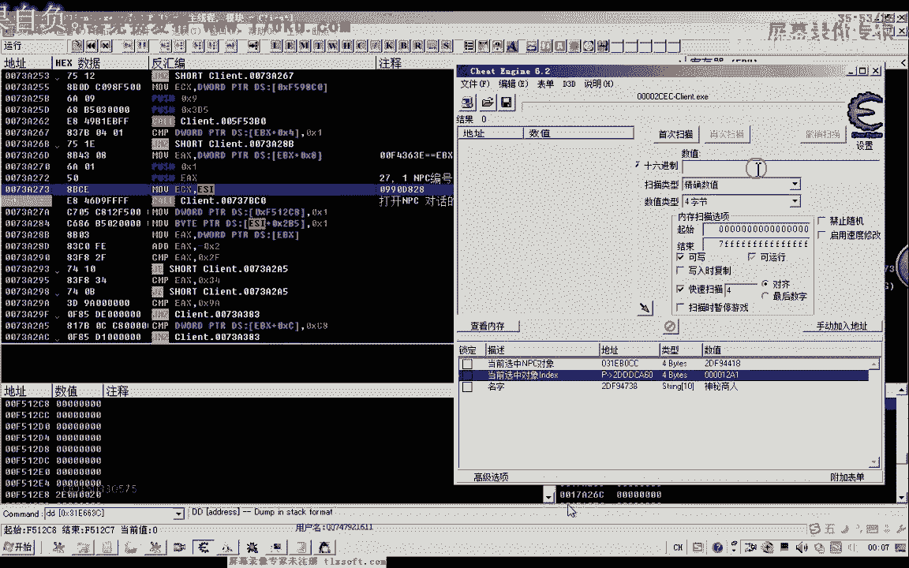

# 逆向教程 P54：065-打开NPC对话菜单 🗣️➡️📜

在本节课中，我们将学习如何通过逆向工程分析并定位游戏中“打开NPC对话菜单”功能的核心调用函数（CALL）。我们将从选中NPC对象开始，逐步追踪数据访问，最终找到并验证打开对话的关键代码。

---

## 一、 分析思路与准备工作

上一节我们介绍了对象列表的访问机制。本节中我们来看看如何定位与NPC交互相关的功能。

打开NPC对话前，需要先选中目标NPC对象。游戏可能通过两种方式处理：
1.  直接鼠标点击NPC。
2.  通过某种方式选中NPC。

无论哪种方式，最终都需要访问NPC对象数据。不同NPC的对话菜单不同，因此功能函数很可能需要访问NPC对象内用于区分的数据。





我们已知一个公式可以获取当前选中对象的指针。公式基于角色对象基址加上偏移 `0x14B8` 获得对象在全局列表中的索引，再通过特定计算得到对象指针。



**获取选中对象指针的公式（示例）**：
```
对象指针 = [[[基址] + 0x14B8] * 4 + 对象列表基址]
```

首先，我们需要验证这个公式获取的是否是NPC对象。可以通过检查对象名字段（例如偏移 `0x320`）来确认。



---

## 二、 定位可能的功能函数（CALL）

找到NPC对象指针后，下一步是找出哪些代码访问了这个指针。我们使用调试器对对象指针地址下“访问断点”。



以下是操作步骤：
1.  在游戏中点击一个NPC（例如“神秘商人”）。
2.  在调试器中，对计算出的NPC对象指针下硬件访问断点。
3.  断点触发后，记录所有访问该地址的代码位置。



这些被记录的位置中，很可能包含打开NPC对话菜单的 `CALL`。我们需要逐一测试这些候选的 `CALL`。

---

## 三、 测试与筛选候选函数

我们得到了多个访问了NPC对象指针的代码地址。接下来需要对这些地址进行测试。

首先，在调试器中为这些地址编号并下断点。


然后，在游戏中再次点击NPC。程序会在某个断点处停下。我们需要分析该断点处的代码：
*   观察传入的参数（通常通过寄存器如 `ECX`, `EDX` 传递）。
*   查看上层调用者，理解函数调用链。
*   尝试手动调用这个 `CALL`，看是否能触发打开NPC菜单。

**手动调用测试的代码框架（汇编）**：
```assembly
MOV EDI, [角色对象基址] ; 获取角色对象
MOV ECX, [EDI+0x14B8]   ; 获取选中对象索引
... ; 其他可能的参数准备
CALL 目标函数地址       ; 尝试调用
```


如果调用成功打开菜单，则找到了目标函数。如果失败，则禁用当前断点，继续测试下一个候选地址。

经过多次测试和参数分析（发现其中一个关键参数是NPC的编号ID），我们最终定位到了正确的函数。

**打开NPC对话的核心调用**：
```assembly
PUSH NPC_ID    ; 参数：NPC的编号
MOV ECX, 参数值 ; 其他上下文参数
CALL 0x737BC0  ; 核心功能函数地址
```

调用此函数可以成功打开指定NPC的对话菜单。

---

## 四、 课程总结

本节课中我们一起学习了如何逆向分析“打开NPC对话”功能。

1.  **思路**：从选中NPC对象入手，监控对其指针的访问，从而定位相关功能代码。
2.  **方法**：使用调试器设置访问断点，筛选出可疑的调用点，并通过分析参数和手动调用来验证。
3.  **结果**：成功找到了核心功能函数 `CALL 0x737BC0`，并确定其一个关键参数是 **NPC的编号ID**。



通过本课，你掌握了从数据访问追踪到功能函数定位的基本逆向分析流程。关于函数内部具体如何根据NPC ID生成菜单的详细机制，我们将在后续课程中继续探讨。