# 课程 P55：066-NPC菜单选择CALL分析 🎮

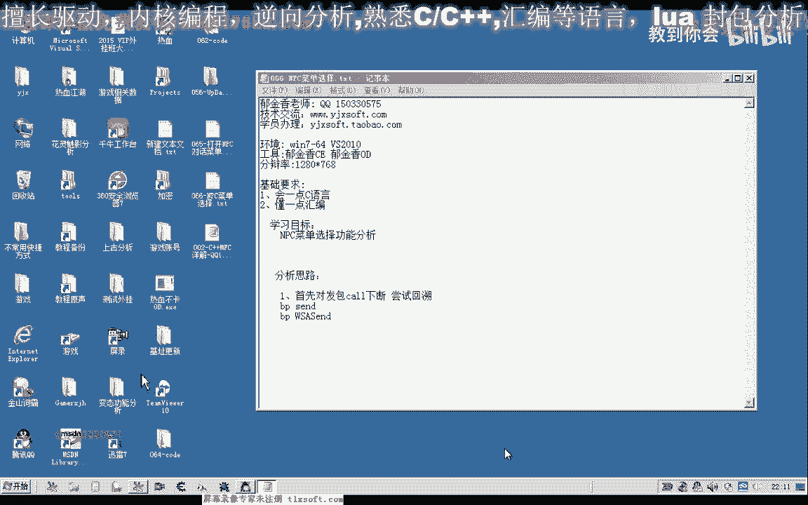

在本节课中，我们将学习如何分析游戏中的NPC菜单选择功能，特别是打开仓库的CALL。我们将通过调试器下断点、回溯调用栈，最终定位到关键的函数调用和数据结构。

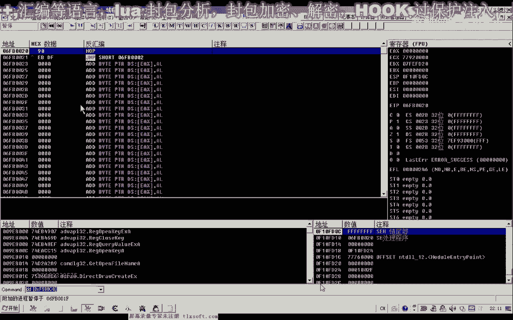

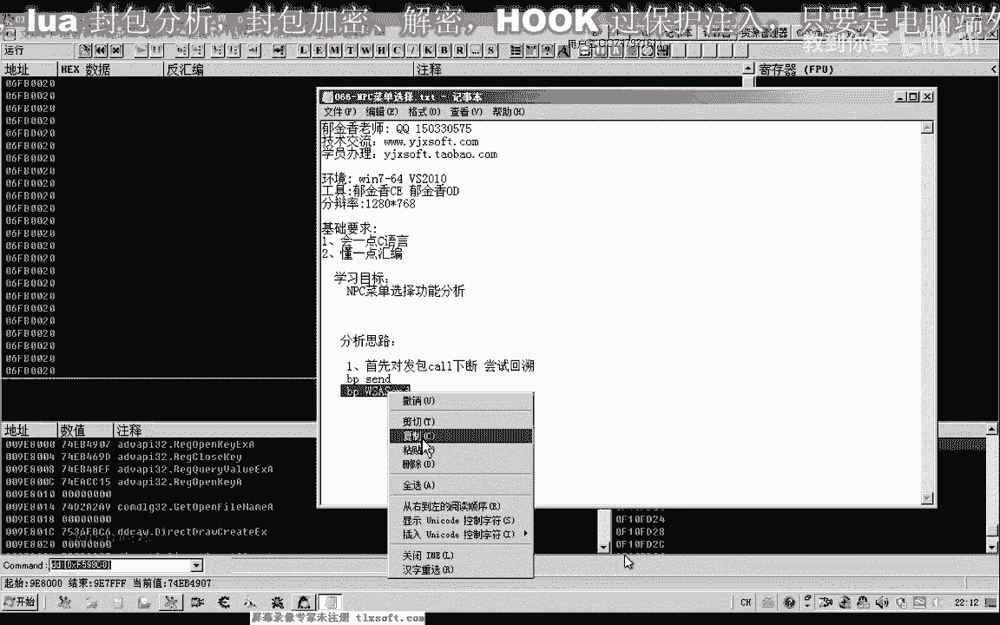

---

## 概述

上一节我们分析了打开NPC对话菜单的功能。本节中，我们来看看如何分析并调用NPC菜单中的具体选项，例如“打开仓库”。我们将对游戏的发包函数进行下断点，并通过回溯找到执行“打开仓库”功能的关键代码和数据。

---

## 调试准备

首先，我们需要将调试器附加到游戏进程。

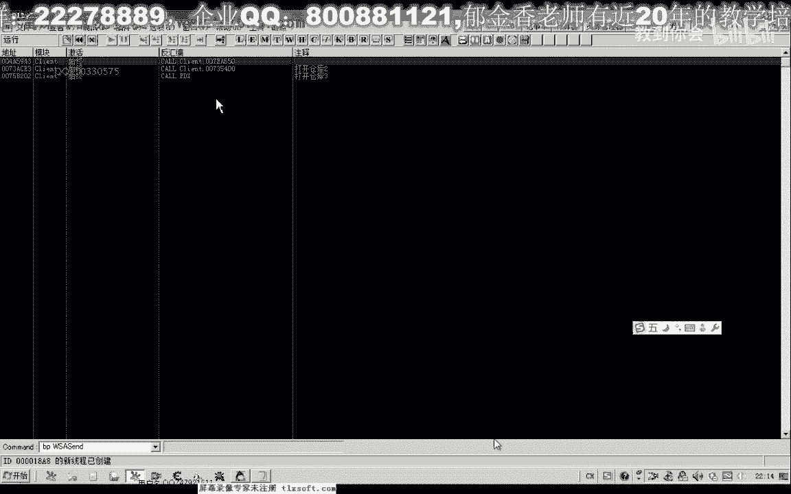


附加成功后，我们在发包函数 `send` 处下一个断点，然后让游戏运行起来。


按下回车键下断点。当游戏执行到打开仓库操作时，如果断点被触发，说明游戏向服务器发送了数据请求。

> **注意**：如果打开仓库时断点没有触发，可能意味着此操作不涉及发包，或者需要寻找其他关键数据进行分析。本节课中，断点成功触发，说明该功能与服务器有数据交互。

---

## 分析打开仓库的调用

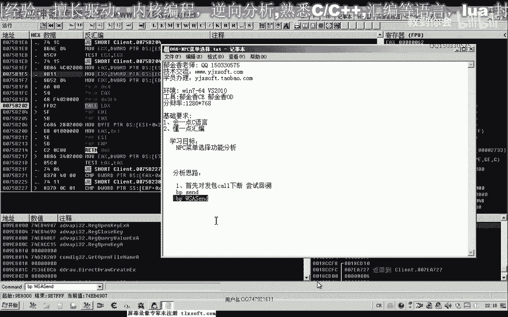

我们再次在 `send` 函数处下断点（F2），然后执行打开仓库操作。

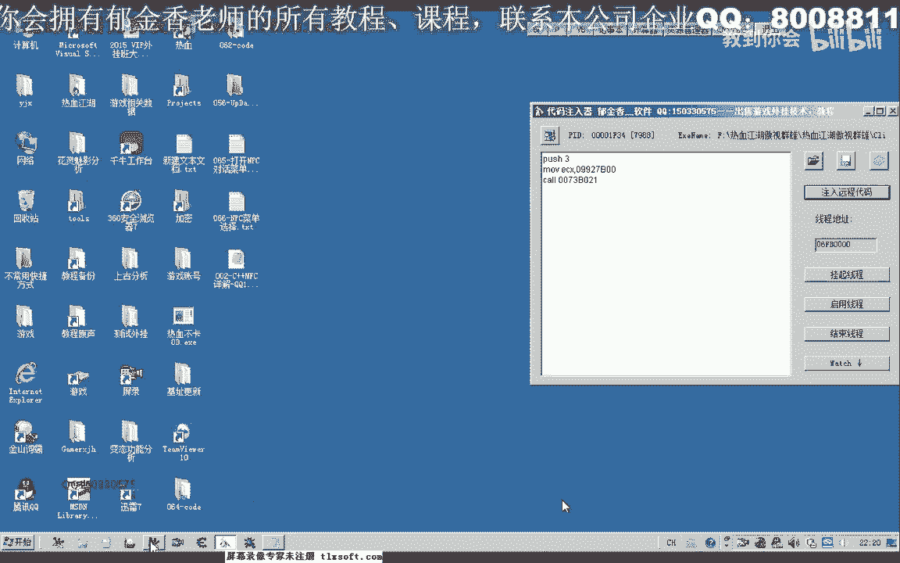

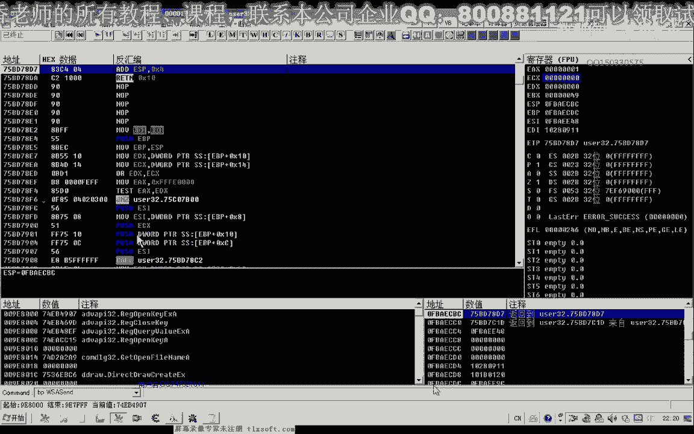

1.  当断点触发后，我们执行到返回（Ctrl+F9）。
2.  在此位置，我们可以备注为“打开仓库”。
3.  再次按 Ctrl+F9 返回，备注为“打开仓库二”。
4.  继续按 Ctrl+F9，在下一个位置下断点（F2），然后按 Ctrl+F7 执行。

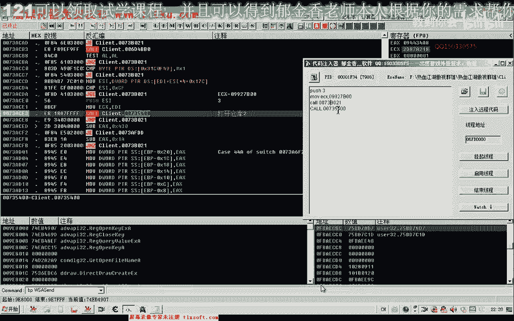

执行到此处时，我们发现很多NPC相关操作都会断在这里。为了过滤掉无关调用，我们进行以下操作：

1.  删除之前设置的所有断点。
2.  仅保留我们新设置的三个断点，并先将其禁用。
3.  然后重新激活它们，这样有助于过滤与打开仓库无关的调用。

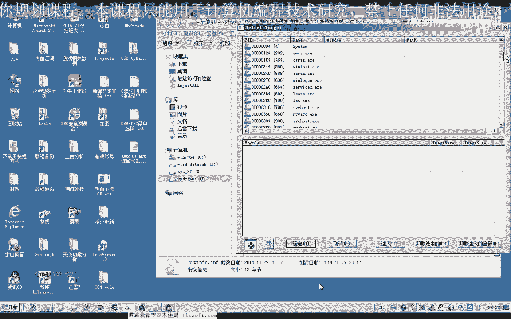

激活断点后，程序立即断下，说明此循环与打开仓库操作有关。同时，关闭仓库时也会在此断下。

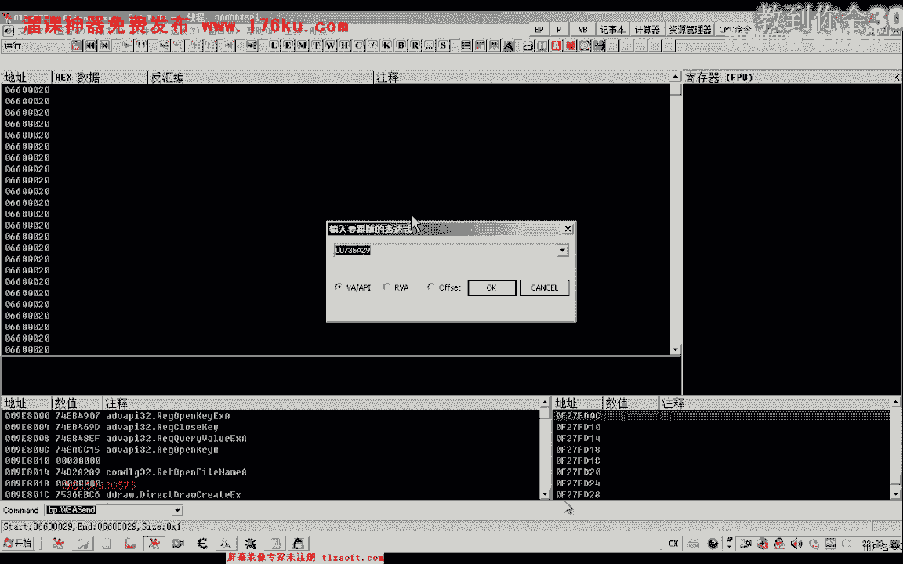

---

## 记录关键参数

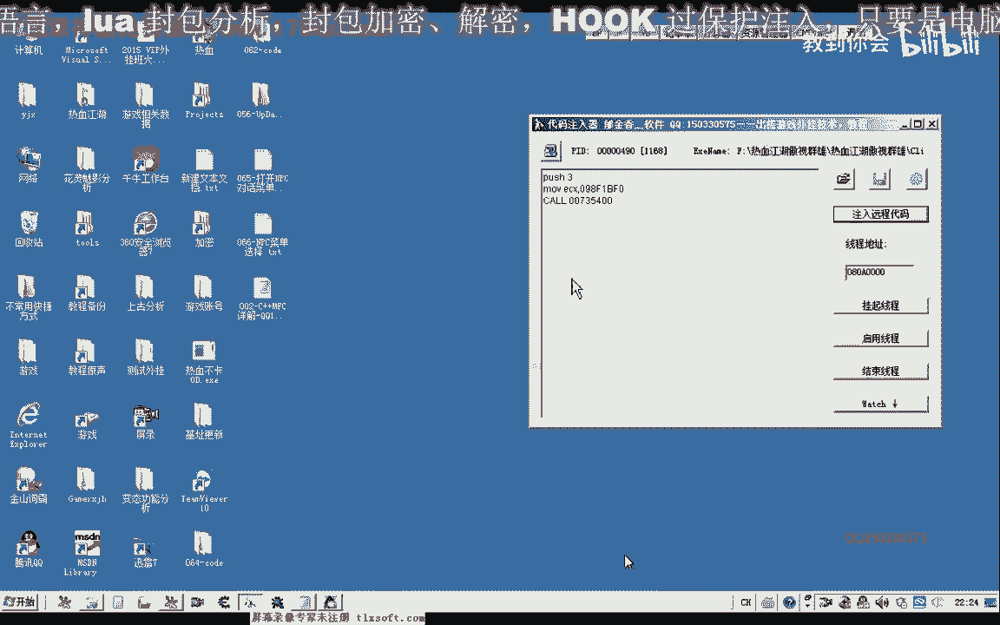

为了找到规律，我们需要记录调用时关键寄存器的值。

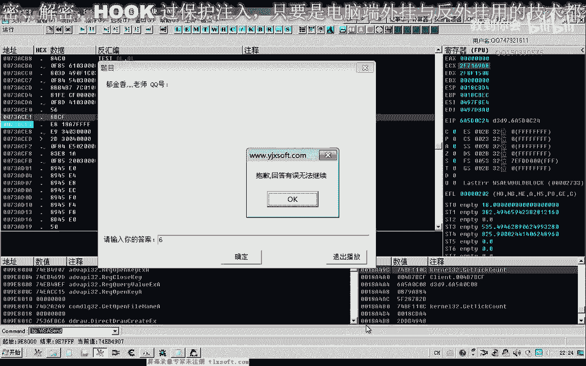

以下是操作步骤：


1.  打开仓库，记录 `EAX` 和 `ESI` 的值。
    *   `EAX = 0x319`
    *   `ESI = 0x3`
2.  关闭仓库，再次记录 `EAX` 和 `ESI` 的值。
    *   `EAX = 0x62`
3.  再次打开仓库，观察参数变化。
    *   `EAX = 0x319` （稳定）
    *   `ECX` 的数值发生了变化。

通过观察发现，`EAX` 参数（0x319）在打开仓库时是稳定的，而 `ECX`（对象指针）和 `EDX` 会变化。这提示我们，关键可能在于调用某个对象（`ECX`）的成员函数。

调用形式类似于：
```cpp
// 伪代码表示
ECX_Object->MemberFunction(0x319);
```

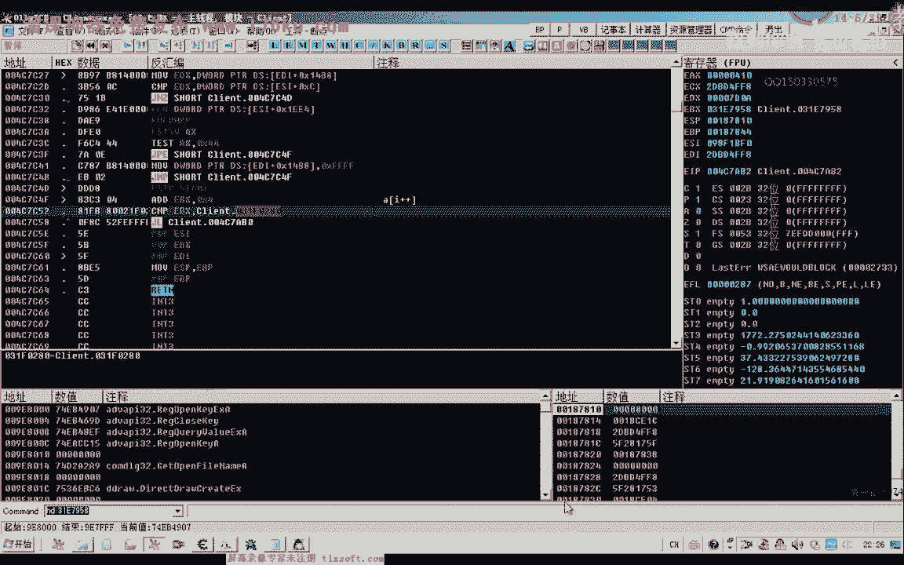

---

## 测试功能CALL

我们找到了一个疑似打开仓库的CALL地址。接下来用代码注入器进行测试。

首先，我们需要手动打开NPC对话。然后，注入调用代码，传入我们记录的参数。


首次注入后程序崩溃，说明参数或CALL地址有误。检查后发现CALL地址写错。

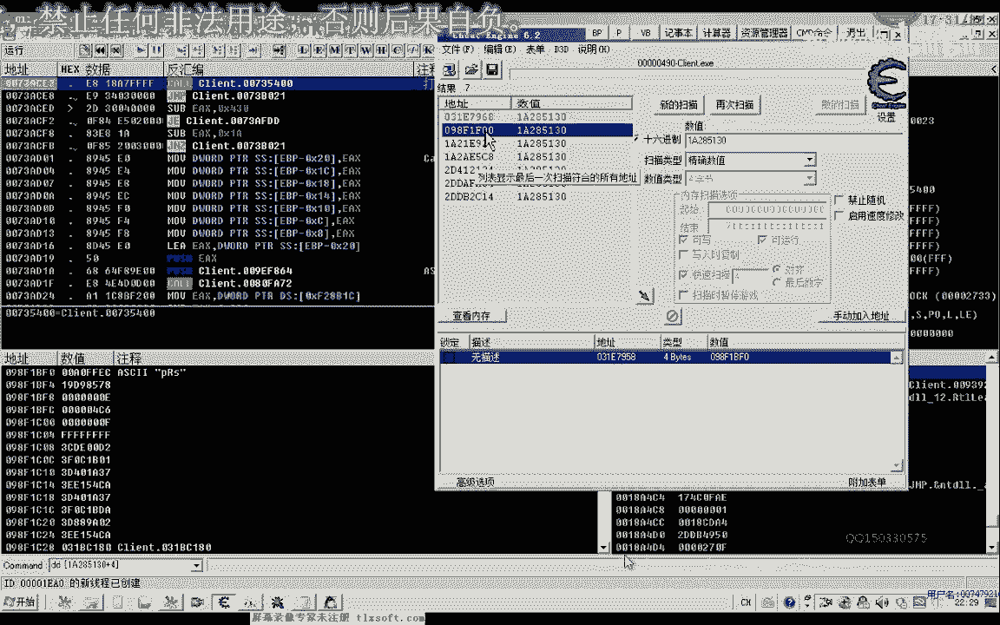

重新启动游戏并附加调试器，获取当前正确的 `ECX` 值。


再次注入测试代码：
```cpp
// 伪代码，需根据实际地址和寄存器调整
mov ecx, [正确的ECX值]
push 0x319
call 0xXXXXXX // 正确的CALL地址
```

测试成功！可以打开仓库。但需要注意的是，**必须**先执行打开NPC对话这一步，单独调用此CALL无效。这说明该功能需要服务器两步验证。

---

## 追溯ECX的来源

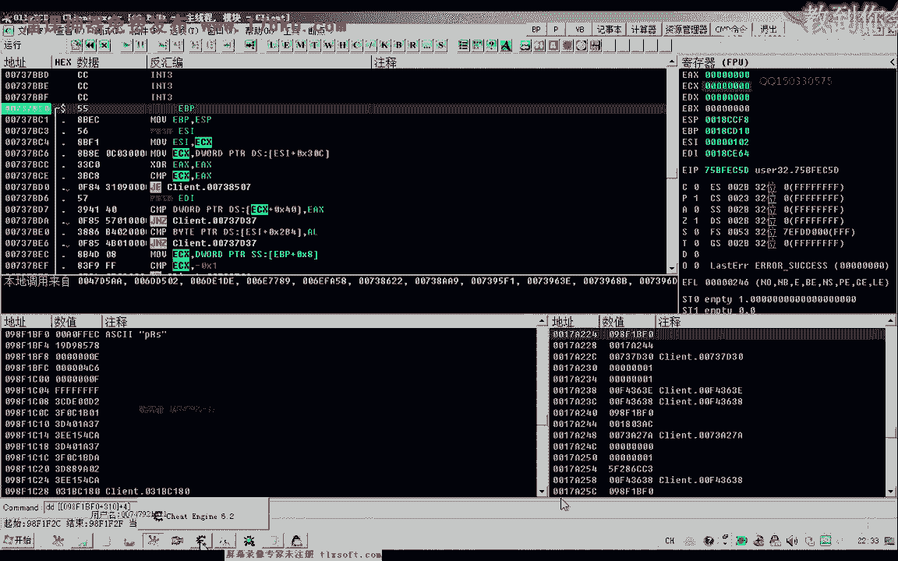

功能测试成功，但 `ECX` 值每次启动游戏都会变化。我们需要找到它的来源，即基址加偏移。

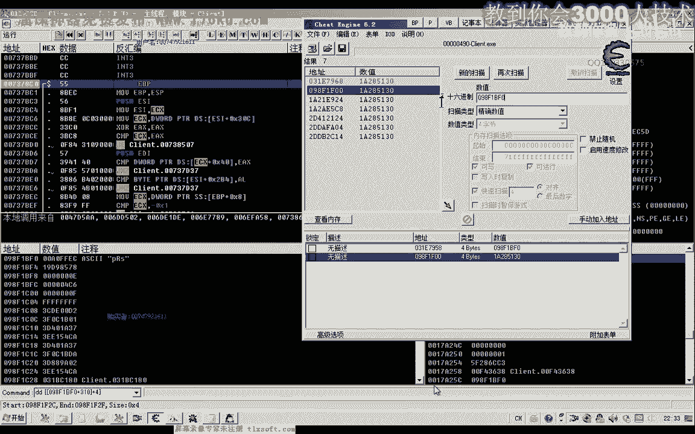

我们回溯调用栈，观察 `ECX` 的传递链：
1.  当前 `ECX` 来源于上一层的 `ESI`。
2.  上一层的 `ESI` 又来源于其上一层的 `ECX`。

通过多次回溯，我们发现一个规律：数据来源于一个数组结构，通过 `[基址 + 偏移]` 的方式访问。

最终，我们定位到一个稳定的静态地址（基址），并通过偏移计算出了 `ECX` 的值。

计算公式如下：
```cpp
// 最终推导出的指针路径
ECX = *(DWORD*)(*(DWORD*)(Base_Address + Offset1) + Offset2);
```
其中 `Base_Address` 是找到的静态基址，`Offset1` 和 `Offset2` 是两次解引用的偏移量。

> **技巧**：可以使用CE（Cheat Engine）搜索访问该地址的代码，或直接在OD中通过堆栈和寄存器回溯来验证指针路径。

---

## 整合与总结

本节课中，我们一起学习了如何分析游戏内NPC菜单选择功能：

1.  **调试与定位**：通过给发包函数下断点，定位到与“打开仓库”相关的代码区域。
2.  **参数分析**：记录并分析函数调用时的寄存器参数，找到稳定参数（`EAX = 0x319`）和可变参数（对象指针 `ECX`）。
3.  **功能测试**：通过代码注入验证找到的CALL，确认其功能。
4.  **数据溯源**：回溯 `ECX` 对象指针的来源，找到其基址与偏移，形成稳定的指针路径。

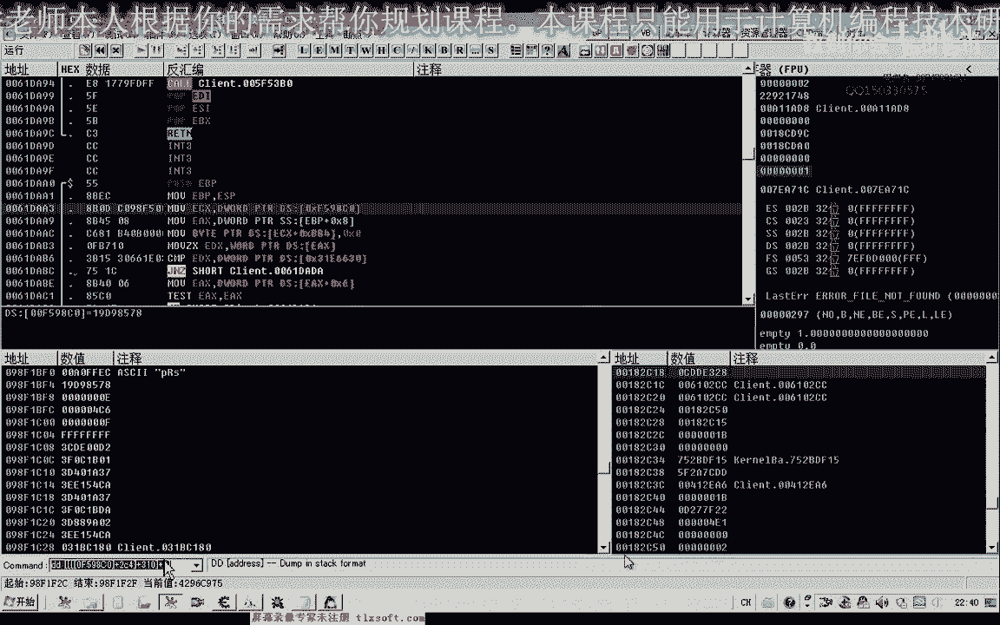

我们成功地将打开仓库的操作分解为两个必要步骤：打开NPC对话、调用仓库CALL。这为后续编写自动化脚本（如自动存物品）打下了基础。

---

## 下节预告

下一节课，我们将对最近分析的功能进行整合。目标是编写一个完整的函数，实现“存放指定物品到仓库”的自动化操作。

函数原型设想如下：
```cpp
bool StoreItemToWarehouse(const char* itemName, int count = 1);
```
我们将把打开NPC、选择仓库、移动物品等CALL串联起来，形成一个实用的功能函数。

---

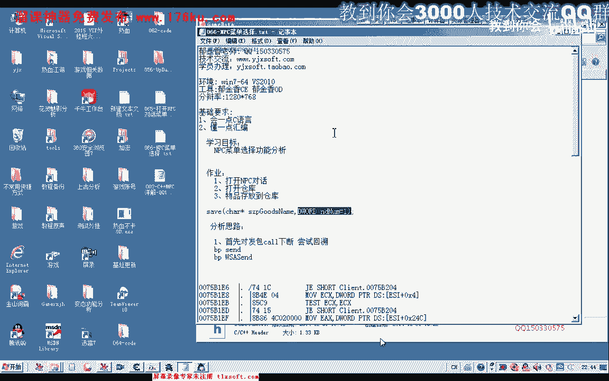

