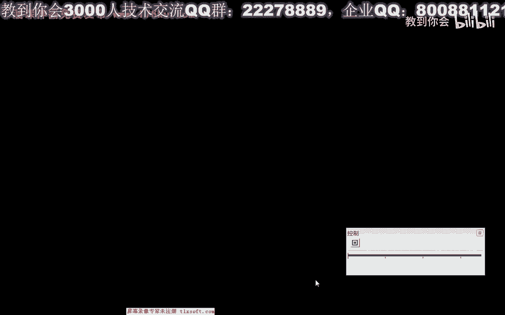
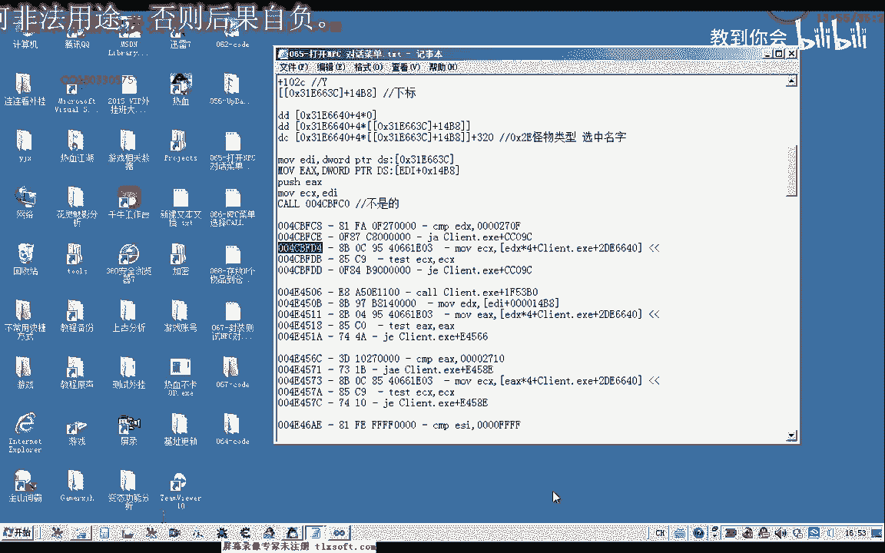
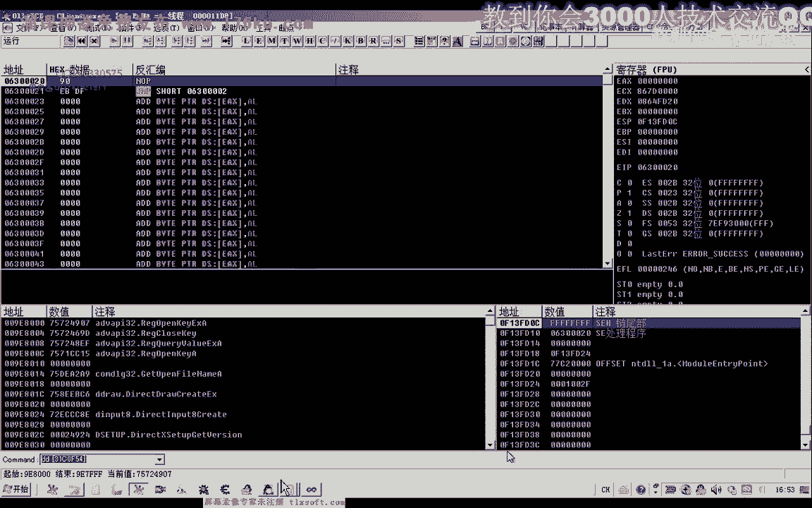
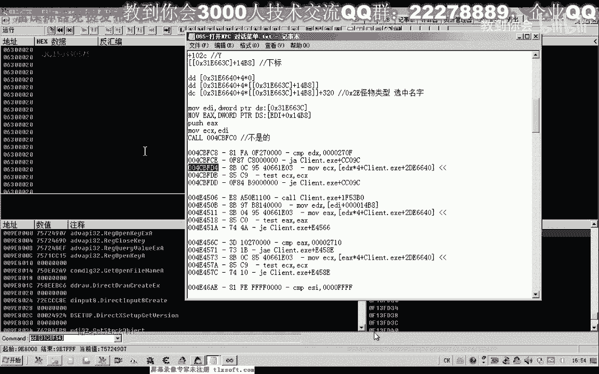
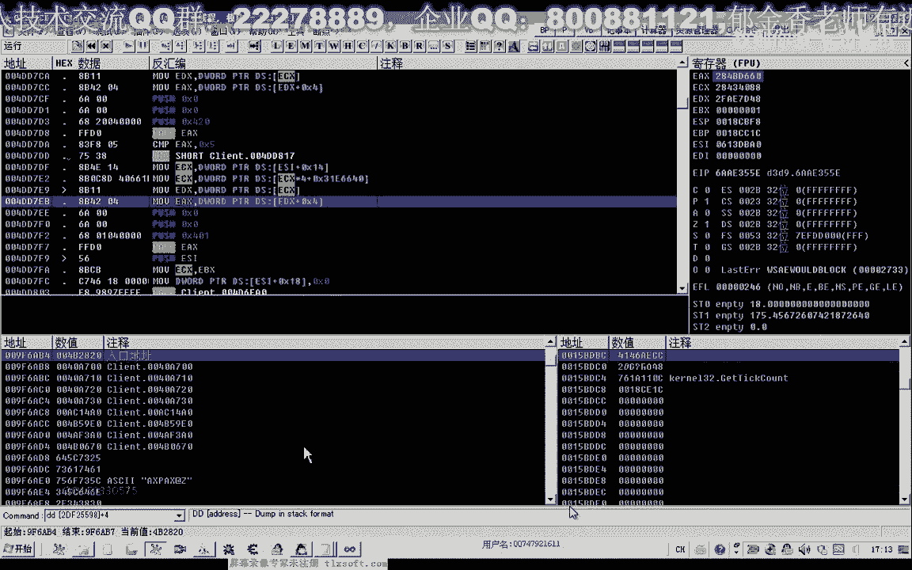
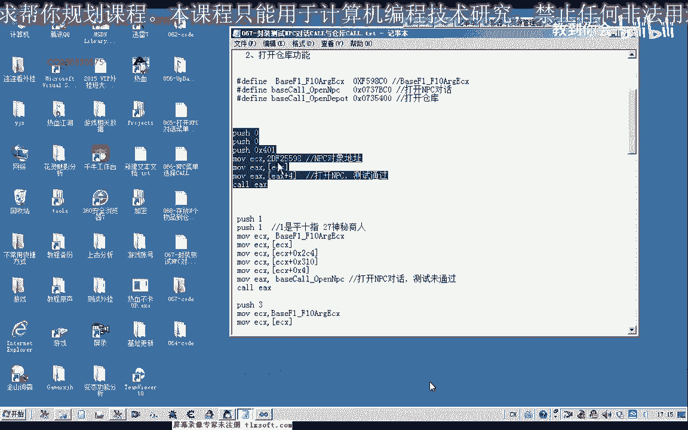

# 课程 P56：067 - 封装测试 NPC 对话 CALL 与仓库 CALL 🧪

在本节课中，我们将学习如何封装并测试用于打开 NPC 对话和仓库功能的 CALL。我们将基于之前课程的分析，将新功能整合到现有代码框架中，并进行调试与验证。

---

## 概述

上一节我们分析了打开 NPC 对话及菜单选择（仓库功能）的 CALL。本节中，我们将在第 64 课代码的基础上，添加这些新分析的功能并进行测试。

首先，我们需要添加相关 CALL 的基址，并创建两个对应的函数：一个用于打开 NPC 对话，另一个用于打开仓库。

打开 NPC 对话函数需要一个参数来区分不同的 NPC，我们使用 NPC 的 ID。打开仓库函数则无需参数。

以下是需要在源代码单元中添加的代码步骤。

---

## 添加 CALL 汇编代码

我们将第 65 课中分析的汇编代码复制过来。其中 `ECX` 参数与之前使用的 `F1` 到 `F10` 参数（即 `F98C0` 更新后的地址）一致。这里做了相应替换，获取地址的部分也使用了宏定义以便更新。

将上面这段代码复制并粘贴到下方。我们只需要替换其中相应的汇编代码即可。





保存后，对于打开 NPC 对话的函数，我们需要传入 NPC 的 ID 作为参数。



---

## 在主线程中进行测试

接下来，我们到主线程区域进行测试。定义一个测试分支 `Txt2` 来测试打开仓库功能。同时，在前面的基础上增加一个宏定义。

在 CP 区单元中，我们需要进行相应改动，并将函数名替换以便分开测试。

然后，切换到资源视图，添加两个测试按钮：“测试二”和“测试三”。同时，在头文件中添加这三个测试函数的说明。

编译成功后，启动测试程序。

---

## 测试与问题排查

首先挂接到主线程并执行打开仓库功能。此时发现仓库无法打开，第二次点击时菜单出现，但点击打开仓库仍无效。这表明两个 CALL 中有一个存在问题。

手动测试以确定问题所在：先尝试打开 NPC 对话，再尝试打开仓库。结果发现打开仓库的 CALL 功能正确，而打开 NPC 对话的 CALL 仅有显示菜单的功能，实际是无效的。

因此，我们需要重新分析并更新第 65 课中关于打开 NPC 对话的 CALL。

---

## 重新分析 NPC 对话 CALL

为了避免全面重新分析带来的巨大工作量，我们可以采用一个取巧的方法。由于打开菜单时可能也会向服务器发送数据包，我们可以在这些访问指令之前下断点，观察在哪个断点之后发送了数据。那个 CALL 可能就是真正的打开 NPC 对话功能。

我们使用调试器附加到游戏进程，在之前标记的访问 NPC 对象的位置（标记为 1, 2, 3）下断点。同时，下一个发包断点。

打开 NPC 对话后，触发断点并执行到返回。观察前后注释，发现在标记 3 的位置，访问 NPC 对象后，会判断对象是否为空。若非空，则向服务器发送数据。这可能就是打开 NPC 对话的指令。

我们需要先获取 NPC 对象，才能调用这个 CALL。也可以通过 NPC 的 ID 以数组方式取出对象。

---

## 测试可能的 CALL

在相应位置下断点，获取 NPC 对象地址（例如 `ECX: 0x59839`）和 CALL 地址（例如 `0x4B2820`）。使用代码注入器进行测试，传入相应参数。

测试多个附近的 CALL 及其不同参数（如 `0x401`, `0x420`, `0x316`），发现参数为 `0x401` 时，成功打开了 NPC 对话和仓库。这证实了该 CALL 是有效的。

因此，我们需要编写一个函数来获取 NPC 对象，然后调用此 CALL。可以仿照以下代码逻辑：
```cpp
// 伪代码示例
ECX = NPC_Object;
EAX = *(DWORD*)(ECX + 4);
CALL EAX(ECX, 0x401); // 0x401 为打开对话参数
```



---

## 总结

本节课中，我们一起学习了如何封装和测试用于打开 NPC 对话与仓库的 CALL。我们发现了最初封装的 NPC 对话 CALL 无效，并通过调试找到了正确的 CALL 地址和调用方式。关键在于需要先获取 NPC 对象，并通过特定参数（如 `0x401`）来触发功能。



下一节课，我们将正式整理并封装这些功能代码。大家也可以将此作为练习，尝试自己先封装相关功能的代码。