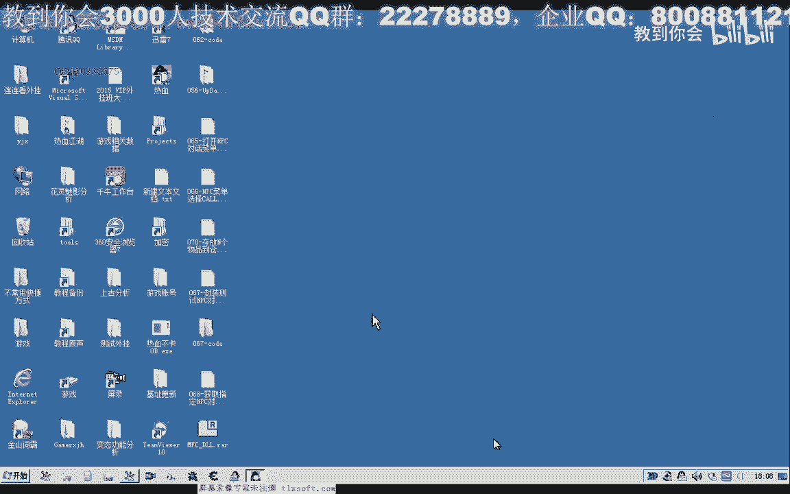
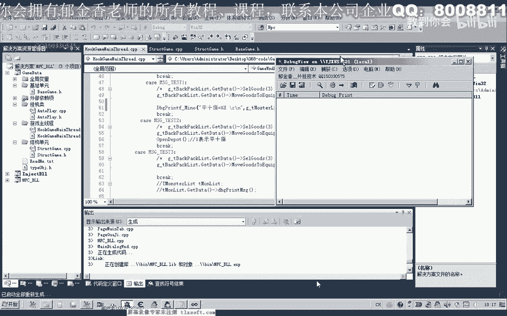
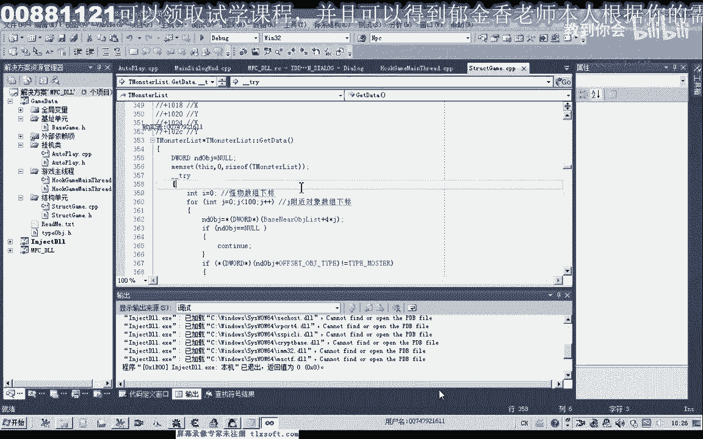

# P57：068-获取指定NPC对象GetNpcObjForName - 教到你会 - BV1DS4y1n7qF

大家好，我是郁金香老师，那么上一节课呢我们分析了一个打开npc对话的一个库，那么其中呢有一个参数，它要求是指定npc的一个对象，那么我们呢像这种的话。

我们需要呢呃先编写一个函数来获取我们的n p c对象，那么我们这个函数的名字呢就是呃npc的这个名字，那么我们把第67课的代码打开，二，打开之后呢，我们先到基础单元删掉。

我们打开pc对话的这个货的一个定义，因为这个扣了啊，用不到嗯，那么另外我们转到结构单元嗯，n p c的话，它在我们的怪物列表里边啊，也就是附近的这个相应的这些对象，那么我们在这里添加它相应的成员函数。

然后呢为我们的这个成员函数来听你讲我们相应的代码，在get it代替后边，那么首先呢我们需要进行一个偏离，就这里我们返回值应该是d的，那么首先呢我们要需要进行一个偏离，偏离之后呢。

我们找到指定的这个对象之后呢，然后然后把它的相应地址来返回，那么我们先随意的给它一个返回值，我们再到前面初始化部分，来看一下他有没有取得我们相应的对象的一个地址。

那么它的成员里面的话是明智hp等级坐标这一类的，但是呢我们呃为了让我们在下面的这个函数，可以通过我们的n p c名字来返回对象的话，我们需要在它相应的这个结构啊，呃成员里边呢添加我们的一个对象地址，这。

那么添加了这个地址之后呢，我们需要来嗯对它来进行一个相应的初始化，还需要，那么对象地址的话啊，就是这个nd不解啊，这个题，那么这样的话我们就能够把对象的地址了返回，那么我们在偏离的时候呢。

我们就对它的一个呃周围的一个对象的一个名字呢进行一个判断，那么如果这个怪物的名字等于我们要找的这个名字的话，那么我们就取得它的相应的地址就可以了，好的，那么我们在这里呢用一个循环，哈哈哈。

那么在这个循环的时候呢，我们的这个列表的大小的话应该是不确定的啊，我们来看一下当时我们有没有指定它的一个大小，那么当时它的大小呢是100啊，那么这里呢我们也骗你100就行。

但是这种算法的话实际上不是很科学啊，这种就是也可以，我们可以用维克特这一类的动态数组来确定它，可能算法呢会优化一些嗯，那么我们先照着写一下啊，100的话应该也是够用的啊，然后呢我们再在调用它之前的话。

我们需要来进行一个初始化啊，但是我们在这里呢可以不写，嗯，那么我们每次调用的时候呢，我们都用用这个get代替呢，呃来初始化一下啊，然后再调用在后边的这个函数，那么首先呢我们做一个条件判断字串的啊。

然后传进来的这个名字呢，比如我们的列表里面的这个，怪物列表里面的这个对象呢的名字啊进行一下对比，那么如果等于零，也就是两个相等相等的话，这个时候呢我们就返回它的一个地址，好那么这样就可以了。

那么如果是这里返回了地址之后的话啊，在后面的就不会被执行，那么如果整个循环我们偏离完成之后都没有发现的话，那么这里呢这里呢我们给它返回一个空子，好的，那么我们重新生成一下，接下来我们进行一下测试。

那么同时呢我们把上一节课的这个打开，嗯打开n p c的这个库来把它删掉，好再重新编译一下，那么同时我们也把它这个头文件里面的相关说明呢也要跟它删掉，还有主线层里边的，好再重新编译一下。

那么我们接下来进行一个相关的测试，这个时候我们需要把呃相应的数字来给它打印出来，返回的这个数值，那么这里呢我们也需要进行一下测试，再出现成单元开始体积，这里，get data。

然后呢我们取得我们的npc对象，然后我们把这个相应的数字呢打印出来，我当时把这个事当转转啊啊，好的，那么我们把它编译一下，那么还需要一个括号吧，打开了我们的信息啊，查看器啊。

调试信息查看器，然后呢，我们注入到游戏里面。

然后我们先挂接到主线程，然后测试看一下它打印出来的数值，嗯那么这个时候呢我们发现我们的测试的话呃，它没有打印出我们相应的这个信息啊。

那么我们再来看一下，没，那么说明他没有执行到这个地方，可能是，那么我们在之前呢再打印一段调试信息进行尝试，那么同时呢在，我们这个测试一这个按钮，这里呢我们也给它加一段调试信息，看他执行到这个地方没有好。

那么我们再重新的编译一下，再重新输入。

然后我们再一次哈挂接到主线程，然后再测试，再来看一下我们的调试信息，那么我们发现了它执行到了我们的max test这个位置呃，但是后边的这个代码呢他没有执行到，那么没有执行到的话。

可能是我们编写的代码的话出现了问题，这个空也就是我们的gtnpc或类，那么这个过来可能是里面出现了相应的一些问题，那么在他他之前呢，我们是先执行了一个格代替，那么也可能是这个格代代替呢。

这里出现了一些问题，那么我们再来看一下这一段啊，对象的地址，那么我们在这一段呢，我们也给它加上一些调试信息，然后我们再这偏离这个地方呢，我们也给它加上一些调试信息，好那么我们再重新编译一下。

那么我们重新再附加到游戏里面进行调试，先挂接到主线程，然后来测试，那么这个时候我们发现的话，我大宝呢他有呃有被偏离到，但是呢可能是我们没有返回正确的数字，或者是后边啊的某一个位置哦，这里有一个空字串啊。

那么空字串的话我们应该是呃可能是我们的这个函数啊，比较函数的话，它不能够比较这种空的这个字串，那么所以说问题可能是出现在这里，那么我们在这里面加上一个区的判断嗯，如果这个指针为空的话。

那么在这里呢我们直接呃就进行下一次的一个循环，要加上一个空的一个判断，好的，那么我们先把前面的这些调试信息可以注释掉了，那么接着我们再进行测试，那么我们清掉调试信息，然后呢再次挂机到主线程测试。

那么这个时候最后呢平时指啊，平时值啊，我们应该是伟大方啊，那么所以说他没有找到平时指这个对象啊，那么我们还需要改一下这个地方，那么这个时候我们前边的这些调试信息呢，可以把它啊删掉，重新生成。

然后再次测试，然后挂机到主线程测试啊，最终呢我们出来的这段数字的2d f，那么我们来看一下这个找出来的数值是不是我们的n p c对象，2d f25598 加上320，那么这个时候的话我们可以看到了。

这里是我们这个npc的一个名字，360这个地方，那么我们再回到它的机子这个地方进行查看，那么也能够看到啊，这里是它的一个数组的下标，然后加四这个位置呢是我们的四比2820的这这个入口地址啊。

函数的一个入口地址，那么说明的话我们的这个函数的话是正确的啊，现在好的，那么我们下一节课呢，嗯再见啊。

