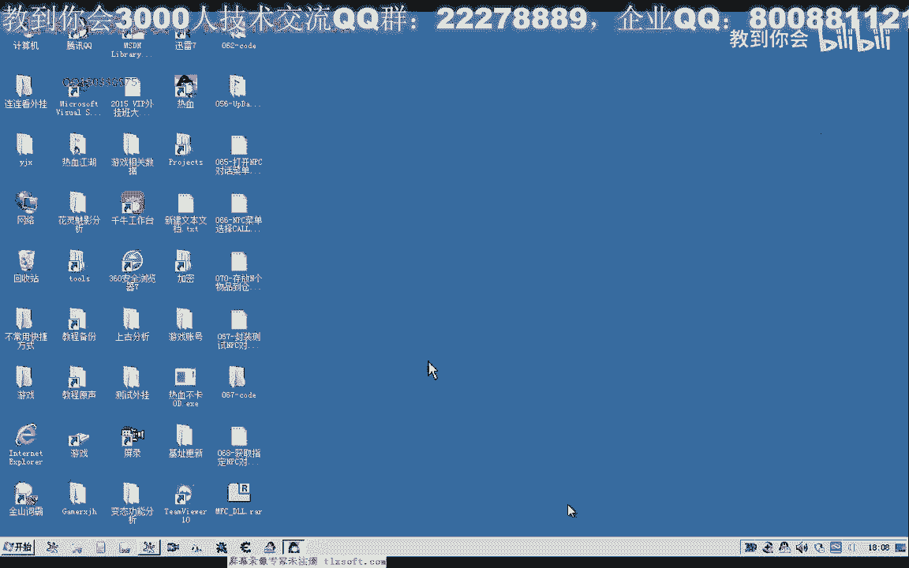
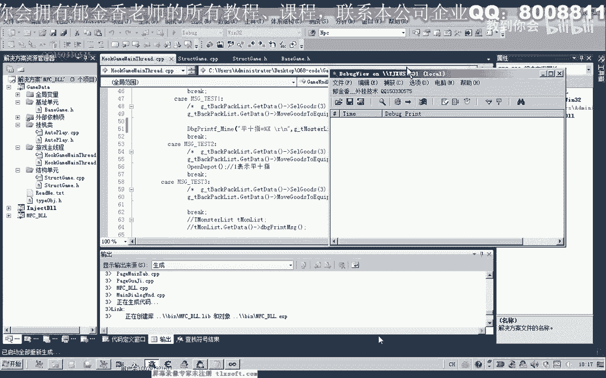
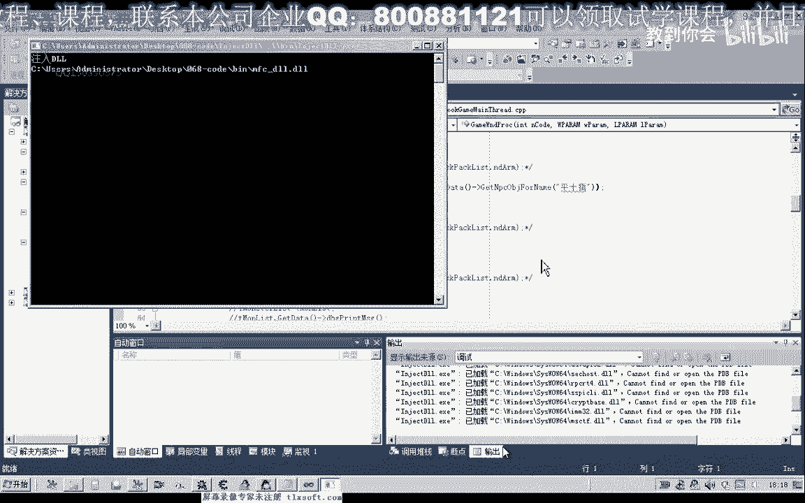
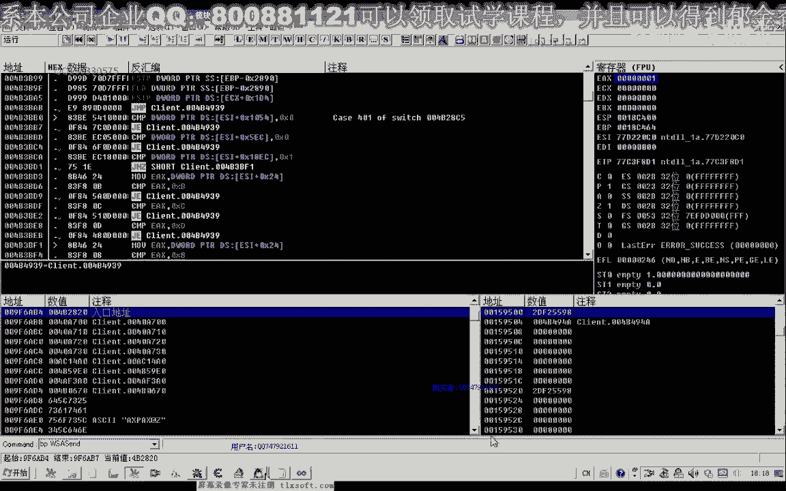
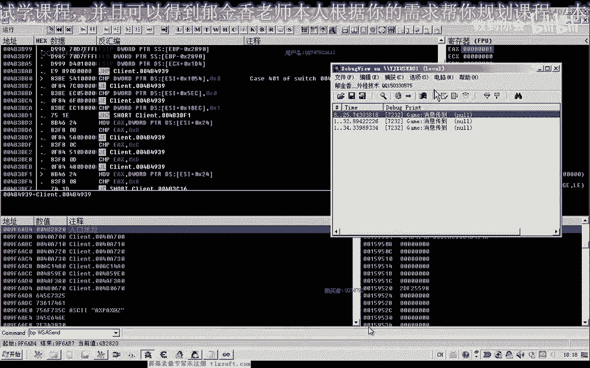
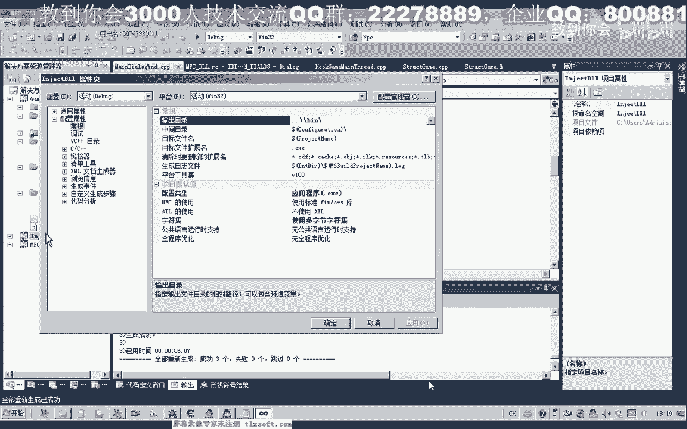
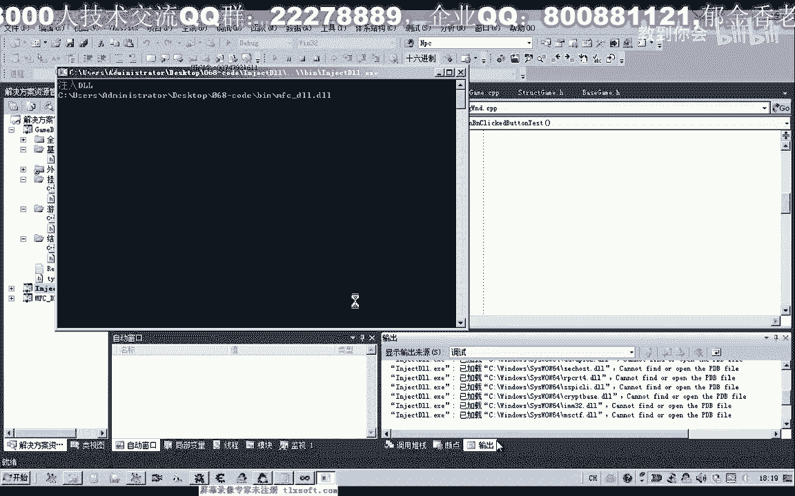
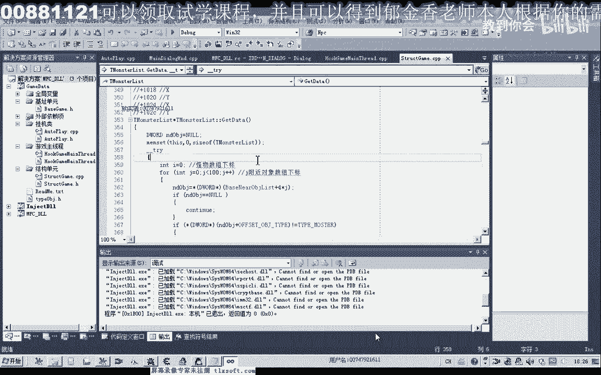

# 课程 P57：068-获取指定NPC对象GetNpcObjForName 🎯

在本节课中，我们将学习如何编写一个名为 `GetNpcObjForName` 的函数，用于根据NPC的名字来获取其在游戏内存中的对象地址。这是实现与特定NPC交互功能的关键步骤。

---

## 概述与背景

上一节我们分析了打开NPC对话的库函数，发现其中一个参数要求传入指定NPC的对象地址。因此，我们需要先编写一个函数来获取这个NPC对象。

我们将在第67课代码的基础上进行修改。首先，打开基础单元并删除之前用于测试打开NPC对话的代码，因为这部分暂时用不到。

---

## 修改数据结构

接着，我们转到结构单元。NPC对象信息通常存储在“怪物列表”或“附近对象”列表中。我们需要在这个NPC结构体的成员函数区域，添加一个新的成员函数。

在 `GetData` 函数之后，我们开始编写新函数 `GetNpcObjForName` 的代码。这个函数的返回值类型应为 `DWORD`，代表一个内存地址。

首先，我们需要遍历附近的怪物列表。在遍历过程中，将列表中每个对象的名字与我们传入的目标名字进行比较。如果找到匹配项，就返回该对象的地址。为了能在函数中返回对象地址，我们需要先在NPC结构体的成员里添加一个用于存储对象地址的变量，例如 `nObjAddr`，并在初始化时为其赋值。

---

## 编写遍历与比较逻辑



以下是实现该功能的核心代码逻辑。我们使用一个循环来遍历列表：





```cpp
DWORD GetNpcObjForName(const char* targetName) {
    // 假设 monsterList 是怪物列表的起始地址
    // listSize 是列表的大小，这里暂定为100
    const int listSize = 100;

    for (int i = 0; i < listSize; ++i) {
        // 获取列表中第i个对象的地址
        DWORD currentObjAddr = monsterList + i * objectSize;
        // 获取该对象的名字字符串
        const char* currentName = GetObjectName(currentObjAddr);

        // 进行安全性判断：如果当前对象名字指针为空，则跳过
        if (currentName == nullptr) {
            continue;
        }

        // 比较当前对象名字与目标名字
        if (strcmp(currentName, targetName) == 0) {
            // 找到目标NPC，返回其对象地址
            return currentObjAddr;
        }
    }
    // 遍历完毕未找到，返回空值
    return NULL;
}
```



**代码说明**：
1.  我们通过循环遍历一个固定大小（示例中为100）的列表。
2.  对于列表中的每个对象，获取其名字。
3.  使用 `strcmp` 函数比较对象名字与目标名字。
4.  如果找到匹配项，则立即返回该对象的地址。
5.  如果遍历完整个列表都未找到，则返回 `NULL`。
> **注意**：使用固定列表大小（如100）的算法可能不够优化。在实际项目中，更科学的方法是使用动态数组（如 `std::vector`）来准确获取列表大小。



---



## 函数测试与调试

代码编写完成后，我们进行编译和测试。同时，需要清理上一节课留下的、现在不再需要的打开NPC对话的库函数及相关头文件声明。

在测试时，我们在主线程的初始化部分调用 `GetData` 函数，并尝试获取指定NPC的对象，然后将返回的地址值打印到调试信息查看器中。

首次测试时，发现调试信息没有输出。通过逐步添加调试信息定位问题，发现是在字符串比较时，如果当前对象的名字指针为空，会导致比较函数出错。因此，我们在循环内添加了空指针判断，如果 `currentName` 为空，则使用 `continue` 跳过本次循环。

修复此问题后，再次编译并注入游戏测试。成功获取到了指定NPC（例如“平一指”）的对象地址（如 `0x2DF25598`）。通过内存查看器验证，该地址偏移特定位置后确实存储着NPC的名字和相关信息，确认函数功能正确。

---

## 总结

本节课中，我们一起学习了如何实现 `GetNpcObjForName` 函数。我们修改了NPC结构体，编写了遍历附近怪物列表并比较名字的逻辑，并通过调试解决了空指针导致的问题，最终成功获取到了指定NPC的对象地址。



这个函数是后续实现与游戏内NPC进行交互（如对话）的基础。下一节课，我们将利用这个获取到的NPC对象地址，来调用打开对话的功能。