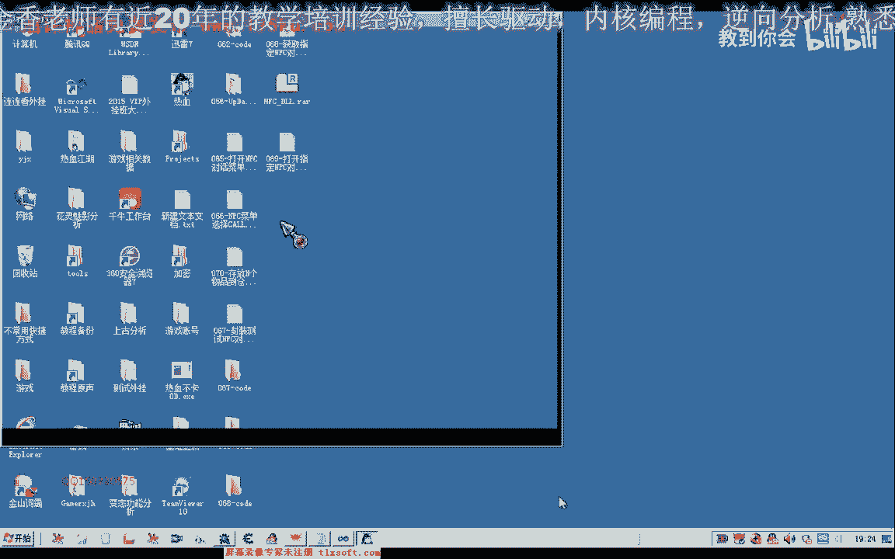
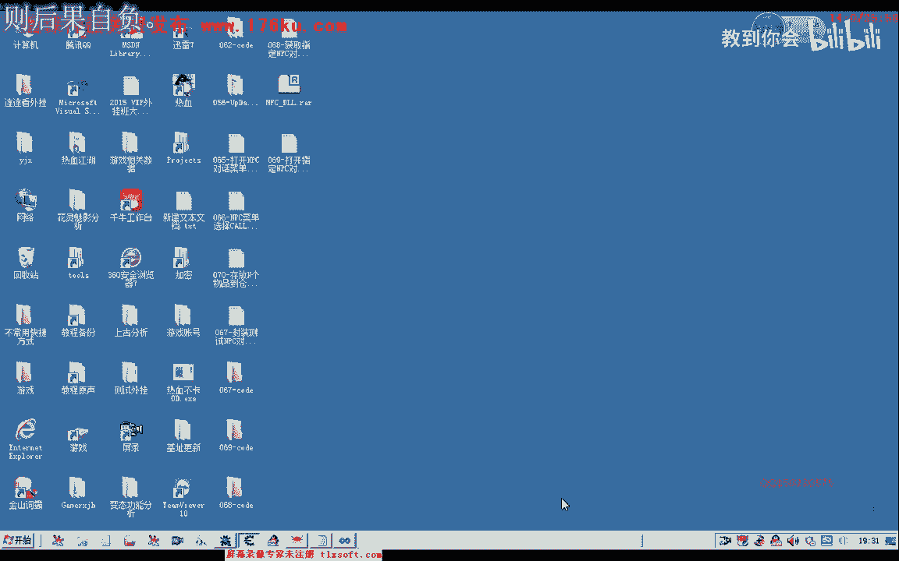
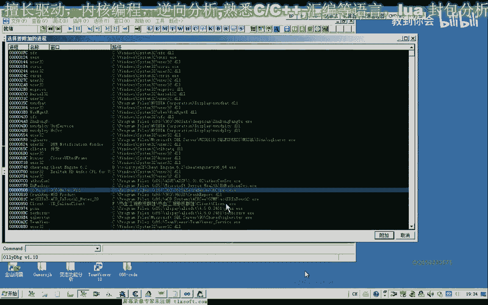
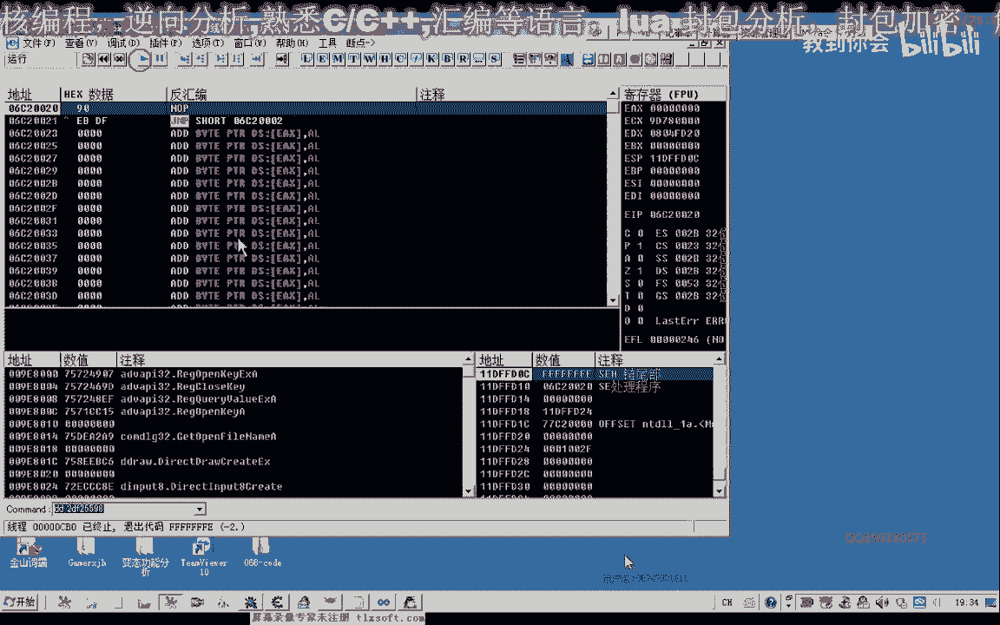
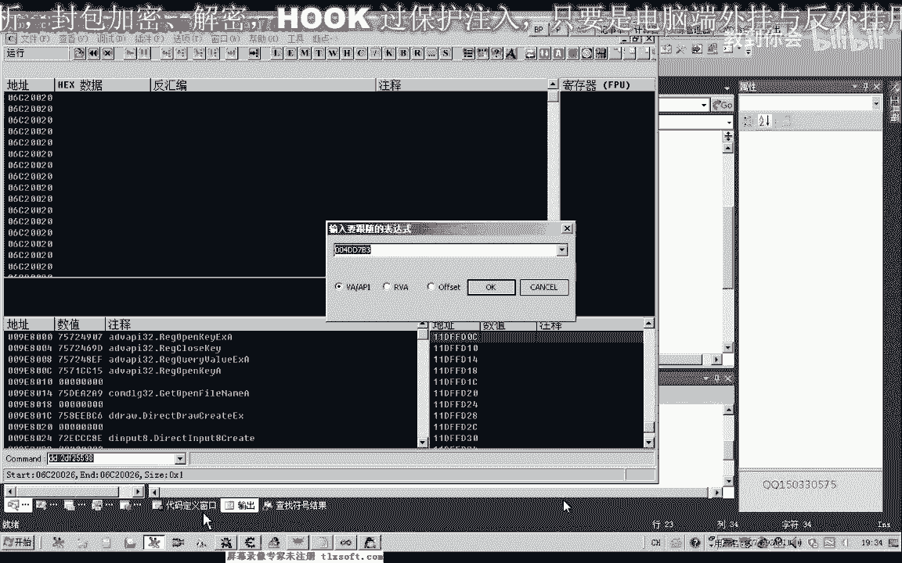
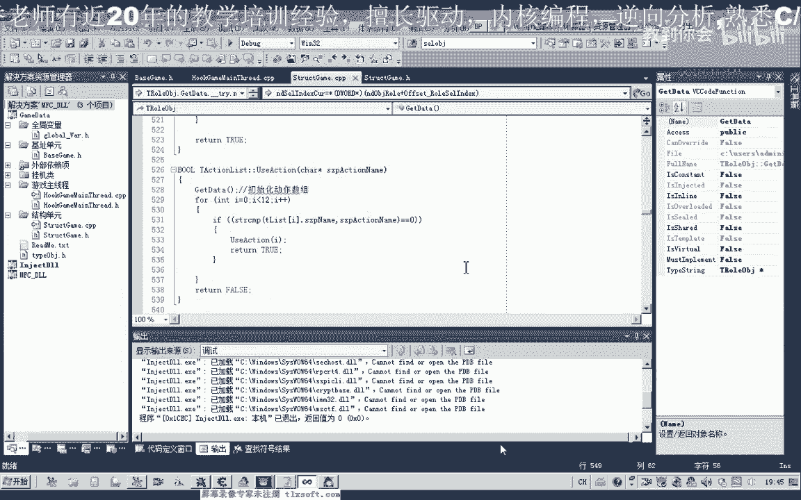

# P58：069-打开指定NPC对话 - 教到你会 - BV1DS4y1n7qF

大家好，我是郁金香老师，那么上一节课的时候，我们一起来写了一个函数，可以通过npc的名字来来获取npc的对象，那么这节课呢我们封装一个打开npc对话的函数啊，通过npc的名字来打开一个相应的对这个对话。

打开我们第68课的代码，然后我们移到结构单元添加一个打开pc，的一个函数八，那么这个函数的话，我们也可以把它封装在我们的呃这个怪物列表里面，因为他要与我们的这个周围的怪物对象的话也是有一些关联的啊。

嗯然后呢我们添加相应的代码，三个位置，92112，啊然后我们这里呢添加这个相应的一些代码，那么首先呢我们就要取得一个呃这个n p c对象的一个地址，那么在这里呢我们建一个临时变量。

然后把npc的名字传进去，那么传进去之后呢，我们再调用这个npc，打开npc的这个空就可以了，啊，然，后添加异常的处理，啊，那么这里如果是产生的异常，然后呢我们就打个de，那么如果是执行完。

我们就返回针啊，然后这里呢我们用布尔，因为稍微做一下修改，千万，然后这里呢我们添加我们的汇编代码块，那么其中这一项呢就是我们前边这里获取的npc的对象，那么如果他获取的n p c对象的话啊，为空的话。

那么在这里呢我们加上一个判断，那么如果这个数字为空的话，那么我们就直接就返回啊，fast调用失败加上这样一个判断，那么这里呢把我们mp 4的对象呢传给ec x，然后呢取出相应的获得这个地址。

那么同时呢也是跟ec x这个寄存器呢传一个参数进去啊，因为它也是呃作为我们的this指针啊，传进去，好那么我们接下来呢就可以来进行我们相应的测试，移到我们的主线程单元，测试一这个地方啊。

那么注意这个n p c的名字一定要传正确啊，传错了的话肯定是不能够打开的，哈，好那么我们编译一下，编译生成我们的代码，然后进行我们的测试，那么首先呢我们挂接到我们的主线程，然后让我们切换到游戏看一下。

然后选测试呃，这个时候呢我们出错了啊，那么我们看一下出错在什么什么地方，有没有相应的一些调试信息出现，那么伟大宝呃，这个对象应该是船队了，那么我们来看一下我是不是我们的相应的汇编代码有出错吗。

但是这里呢我们并没有出现相应的这个异常的呃这个信息啊，嗯那么我们重新的启动一下游戏，再来进行一下测试，把他游戏打开之后呢。

我们再次哈注入，然后呢挂接到主线程，再进行一下测试，那么这个时候呢我们发现呢它仍然会出现这个问题，那么这种可能的话，那么可能是我没有选中这个npc的对象，我们之前的测试呢都选中了这个npc的对象来。

然后在机型的测试。

那么这次进入游戏之后呢，我们先选中选中一个对象，或者是选中自己，然后再或者是选中一个npc，然后呢我们再注入再测试一下，挂机出现的差异，然后把游戏打开点测试。

那么这个时候呢我们测试我们发现了它可以正常的打开n p c，那么很有可能就是那么这种情况的话，很有可能就是我们的呃这个打开n p c，在这个扩它调用之后呢。

可能还会访问到我们的这个选中的当前选中的这个对象，那么如果我们没有选中对象的话，他这个时候去访问到这个空子战场呢，或者是一个不正确的这个指针的话，可能会出现这样的一个错误，那么像这种情况的话。

我们呢可以先把相应的这个位置来给它做一个初始化，那么我们看一下我们的选中啊，选中对象，这里，我们的人物角色里边好像有一个选中对象的函数，我们找一下，那么这个人物角色这里边还有一个选中对象的。

那么我们下次我们执行的时候呢，我们可以先选中这个npc，然后再打开它嗯，这样就可以了，那么我们也可以把它写在这个位置也是可以的，那么这个时候呢我们把它的下标传进去。

那么下标的话我们上边呢是读取的是它的对象啊，那么这个价格的话我们需要加八这个地方呢我们才可以获得，噗噗，那么这样呢我们就能够呃这个获得相应的这个i d，然后呢我们选中这个对象。

然后呢我们再执行下面的这个打开npc的这个动作呢，嗯嗯应该来说就可以了，那么我们再次来进行测试，不能，那么在测试之前呢，我们先把这个选中的对象来取消掉，为什么先移到我们的基础单元。

找到我们的人物角色的机制，那么这个地方加上我们的一四比八啊，就是我们选中对象的这个数组下标i d，那么我们要取消选中的话，这个地方呢我们就把它作为f f。

这个时候呢我们就嗯理论上来说就没有选中任何的这个对象里，那么只是说这上面呢它还会显示一个标志，显示一个标志而已，好的，那么我们接下来再进行一下相应的测试，还需要重新编译一下。

挂接到主线程，然后呢选测试，那么可能是我们刚才读取的啊，这个i d这个地方可能是读错了，那么我们看一下这，个地方呢它没有写入我们的npc的这个，好的，那么我们再来看一下我们的代码。

加八啊这个位置嗯，然后呢是我们的id取出来，我们进入到这个库里面进行看一下，这个也是调用我们的gx加四这个地方，然后他也是取出取出这个对象，与我们刚才的这个打开n p c的这个情况哈是差不多。

也是一样的，那么可能是这个机子它已经更新了啊，3116640这个，那么我们再次启启动一下游戏哈，然后进去看一下这个所有对象的机制是否更新，那么重新启动游戏之后呢，我们先用呃。

先尝试用d来附加到游戏里边，看一下是否是我们的机子已经更新。

那么所有对象的啊，这个我们可以看一下，看能否搜到这个地址。

哈哈哈哈，那么这个时候的话我们收的话没有收到我们的这个相应的地址，那我们再来搜一下啊，再尝试一下，那么刚才刚才处于模块的这个位置来看啊，不对啊。

那么现在呢我们收到的这个地址是正确的，那么如果是出错的话，可能就是出错在我们的这个选怪的这个啊，选中对象的这个地方，那我们再来看一下刚才的调试信息，调试信息的话。

在这里他就应该要打印出我们的一个这个i d的一段信息，我们看有没有打印出来，那么这里有一个i d等于2e，哦对了，我们应该是加c这个位置啊，2e的话是加八这个偏移，那么我们偏移的位置的嗯，刚才传错了。

因为这里打印出来是2e，那么e的话是加八的，y位置呢是我们这个对象的分类好的，那么我们一到后边进行相应的修改，转到我们的定义啊，那么这个地方呢应该是加加0c啊，应该是我们的这个相应的一个分类编号啊。

那我们看一下这个零售这个偏移的话，它有没有相应的一个定义，那么这个偏移的话，我们应该是在初始化里面呢啊直接有这个相应的这个定义，那么在这里的话，我们实际上呢呃返回一个结构的话。

可能呢嗯用的时候更好用一些，那么暂时呢我们先做一个测试，好的，那么现在呢我们没有选中任何的对象，然后呢我们注入我们的代码，然后我们挂接到主线程，然后呢把游戏打开测试。

那么这个时候呢我们发现呢能够呃能够这个打开我们的npc对话，并且能够打开我们的这个相应的这个仓库啊，好的那么这节课的测试呢，我们暂时就到这里，那么大家下去之后呢，可以把这段代码来进行一个相应的优化。

那么在选中对象的时候，可以另外存在一下这个co不行啊，那么我们可以通过一个对象的名字来选中它啊，npc或者是另外从这个函数啊，选中npc对象啊，就这样啊，嗯我们来看一下，现在可以存在一下。

我们直接来存在一下这个函数，转到声明这里啊，那么在这里呢我们再写一个函数，cl n p c，ok那么我们选中我们的npc，也根据它的名字来选中，好复制一下，然后我们转到它的后边，哈哈。

那么首先呢我们要根据这个npc的名字来要去骗你，找出它的一个相关的这个id，差，那么首先呢我们是对它的一个名字和取出来来进行一个比较，用我们传进来的这个n p c的名字来进行比较，那么如果比较的结果。

等于零，那么呢我们就开始嗯调用我们的选中啊，选中函数，然后我们取得它的相应的这个id，啊那么理论上呢这样呢我们就可以选中指定的这个npc了，但是呢在这之前呢，我们也要做一个判断，啊。

那么如果这个npc的名字嗯是空的啊，是一个空字串人，那么我们继续来下一次循环，那么如果整个循环完了之后，我们都没有找到的话，那么在这里呢我们把bass，那么如果在这里呢，我们找到了那个返回去返回数字一。

好的，那么我们在这里啊复制一下这个函数名，然后我们转到后边的，我们新添加的这个选中啊，打开npc的这个函数这里，然后来进行代码的修改，转到定义啊，然后在这个位置我们可以做一些修改。

然后我们在这里呢也把npc的名字啊传进来啊，那么这样的话我们的代码呢呃看起来呢就会简单一些呃，可读性呢可能会高一些，那么我们再重新编译进行一下测试，然后呢我们先关掉用p的窗口，然后呢挂机主线程测试。

那么这个时候呢我们就呃也是同样的一个功能啊，那么只是我们编写的代码的话，这样呢嗯以后呢更便于维护一些啊，就是我们可以呢呃如果以后偏偏移改动了之后呢。

我们只需要在这个媒体标题里面呢来修改我们的这个偏移就可以了啊，在这个地方我们修改偏移就可以了，好的，那么我们下一节课再见啊。

