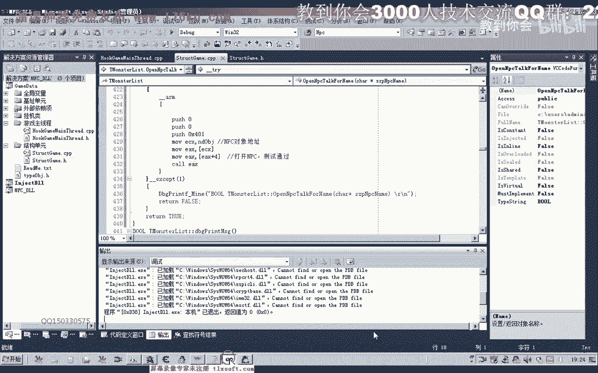
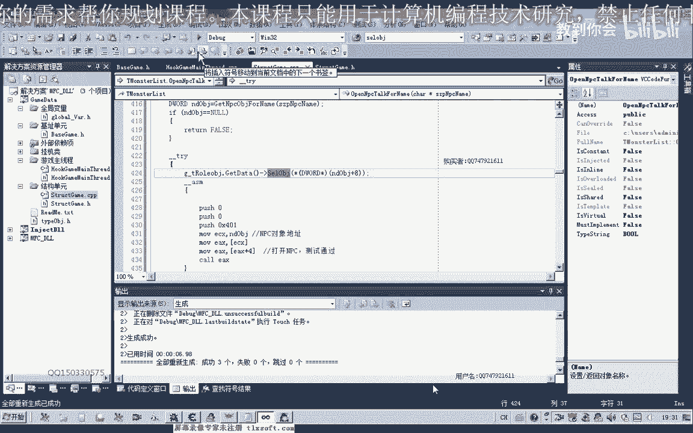
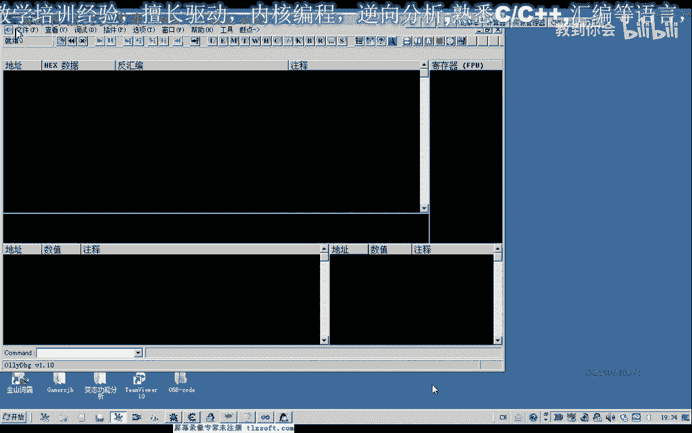
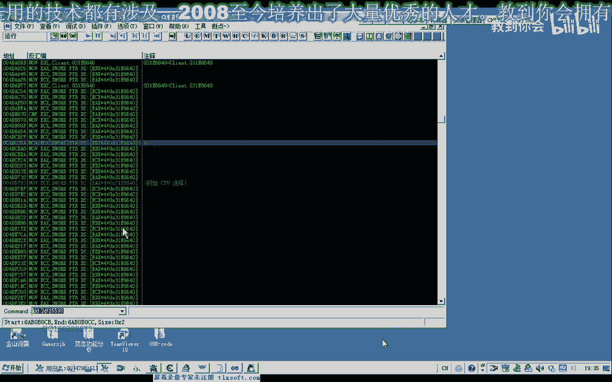

# 课程P58：069-打开指定NPC对话 🗣️➡️💬

在本节课中，我们将学习如何封装一个函数，通过NPC的名字来打开与其对应的对话窗口。我们将基于上一节课获取NPC对象的功能，进一步实现交互操作。

---

## 封装打开NPC对话的函数

上一节我们介绍了如何通过NPC名字获取其对象地址。本节中，我们来看看如何利用这个对象来打开对话。



首先，我们需要在代码的结构单元中添加一个名为 `OpenNPCDialog` 的函数。这个函数可以封装在与怪物列表相关的模块中，因为它与游戏中的对象操作紧密相关。


以下是实现该函数的核心步骤：

1.  **获取NPC对象地址**：调用上一节课封装的函数，传入NPC名字，获取对应的对象地址。
2.  **调用游戏内部功能**：使用汇编代码块，将获取到的NPC对象地址作为 `this` 指针（通常存放在 `ECX` 寄存器中），调用游戏内打开对话的函数（`Call`）。
3.  **添加异常处理**：在调用前后添加异常处理逻辑，确保程序稳定性。如果获取的NPC对象地址为空，则直接返回失败。
4.  **可选：确保对象被选中**：某些游戏内部函数可能依赖于“当前选中目标”。为了兼容性，可以在打开对话前，先调用选中目标的功能。

核心的汇编调用逻辑可以用以下伪代码表示：
```assembly
MOV ECX, [NPC对象地址]
CALL [打开NPC对话的函数地址]
```

---



## 代码实现与调试


我们将代码添加到三个指定位置（92、112等）。在主线程单元进行测试。

测试时需要注意，传入的NPC名字必须完全正确。首次编译测试时，程序出错了。错误可能源于没有选中任何游戏内对象，导致内部函数访问了无效指针。




为了解决这个问题，我们优化了流程：




以下是优化后的步骤列表：
*   **步骤一**：在打开对话前，先调用一个 `SelectNPC` 函数来选中目标NPC。
*   **步骤二**：`SelectNPC` 函数会遍历周围对象列表，比对名字，找到对应NPC的ID并执行选中操作。
*   **步骤三**：选中成功后，再执行打开对话的调用。

经过修正和测试，函数最终能够稳定地打开指定NPC的对话窗口（例如仓库管理员）。

---

## 代码优化与维护建议

为了使代码更清晰、易于维护，我们进行了以下优化：

1.  **分离关注点**：将“选中NPC”的功能独立封装成 `SelectNPC` 函数，使 `OpenNPCDialog` 函数逻辑更简洁。
2.  **集中管理偏移量**：将游戏数据的偏移量（如对象ID偏移 `+0C`）定义在常量或结构体中。未来游戏更新时，只需修改这些偏移量定义即可。
3.  **增强健壮性**：在循环比对NPC名字时，增加对空字符串的判断，避免无效操作。

优化后的调用流程如下：
```pascal
// 伪代码示例
if SelectNPC(NPC名称) then
begin
  OpenNPCDialog(NPC名称);
end;
```

---


本节课中我们一起学习了如何通过NPC名字打开其对话。关键点在于：获取对象地址、通过汇编调用游戏内部函数、以及通过预先选中目标来保证调用的稳定性。通过将功能模块化（选中、打开对话），代码变得更具可读性和可维护性。下一节课我们将继续探索其他游戏功能的实现。