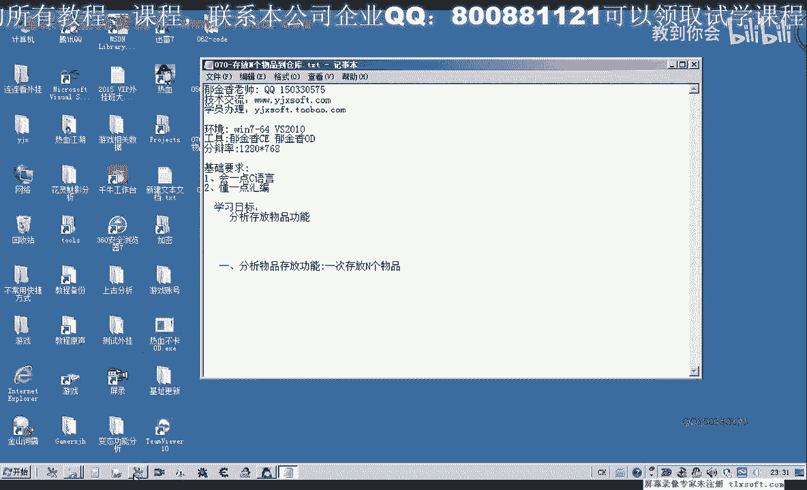
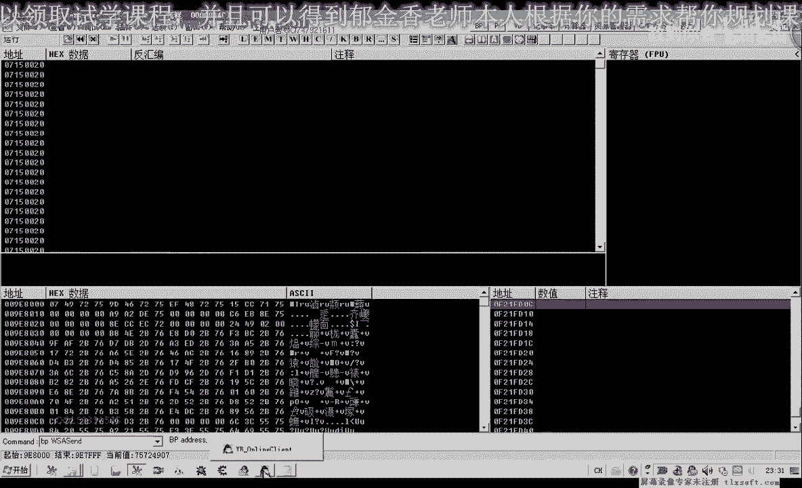
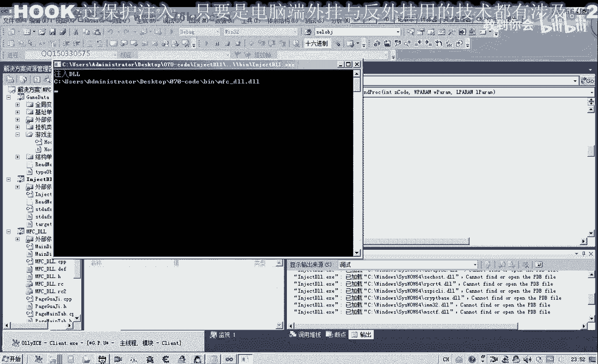
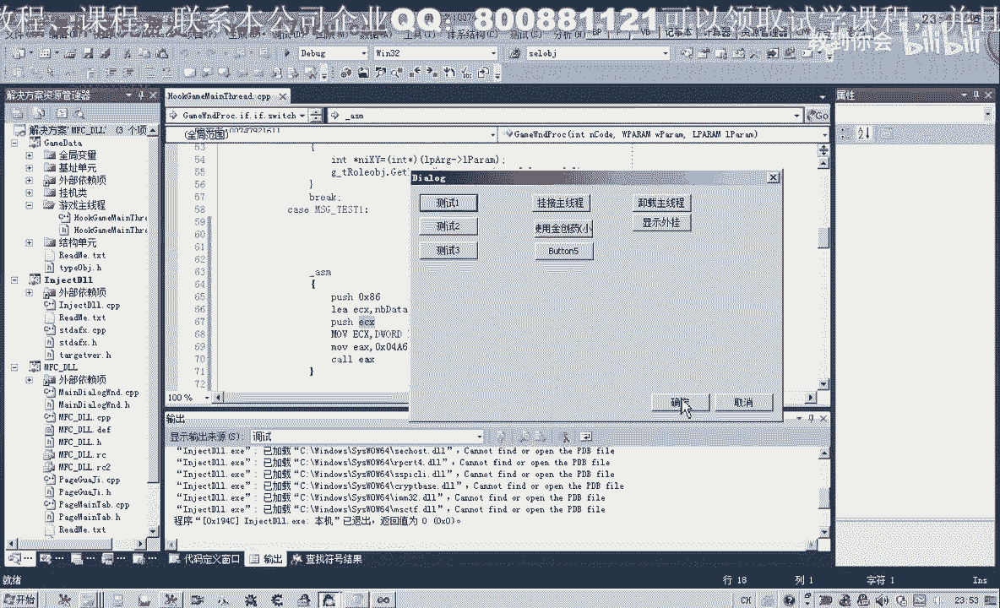

# 逆向工程课程 P59：070-存放N个物品到仓库 🧳

在本节课中，我们将学习如何分析并实现一次性将多个相同物品存入游戏仓库的功能。我们将通过逆向分析找到关键的数据包发送函数，并理解其中物品数量和标识的存储方式。

---

## 分析目标与思路



上一节我们介绍了基本的物品操作，本节中我们来看看如何批量存放物品。



游戏在存放如药品、回城符等可堆叠物品时，需要输入数量。我们的目标是找到并调用一个函数，实现一次性存放指定数量物品到仓库，避免多次移动物品的繁琐步骤。

分析可以从两个方向入手：
1.  服务器通信：存放物品必然要向服务器发送数据包。
2.  关键数据“数量”：逆向追踪数量数据的处理流程，最终在发包函数中找到存放数量的关键数据位置。

---

## 定位发包函数

首先，我们需要定位负责发送存放物品数据包的函数。

1.  在数据包发送函数上设置断点。
2.  在游戏内输入要存放的物品数量（例如33个），然后点击“确定”。
3.  此时游戏会中断在发包函数。取消断点，使用 `Ctrl+F9` 执行到返回。
4.  观察调用栈，发包操作通常在其上一层的函数中完成。我们在那个调用位置下断点，并备注为“存仓库”。
5.  再次执行存放操作，程序会中断在备注处。这很可能就是我们要找的“存放物品”的函数。

---

## 分析数据包结构

找到疑似函数后，我们需要分析其发送的数据包结构，特别是物品数量和标识的存储位置。

我们通过改变存放数量来观察数据变化：

1.  第一次存放时，记录下数据缓冲区（例如地址 `18A488`）的内容。
2.  改变存放数量（例如从9个改为7个），再次中断并对比缓冲区数据。
3.  可以发现，在缓冲区起始地址偏移 `+0x1A` 的位置，数据从 `09` 变为了 `07`。这很可能就是**物品数量**的存储位置（低位）。
4.  同时，在偏移 `+0xB7` 的位置，数据也从 `2A` 变为了 `3A`，这个值可能与其他计数机制相关。

为了找到**物品的唯一标识**，我们需要用不同物品进行测试。

以下是测试不同物品时的数据变化规律：

*   **使用物品A（金创药）存放3个**：偏移 `+0x80` 附近的一长串数据（例如 `67 CA 9A 3B ...`）发生变化，这串数据很可能就是该物品在服务器端的唯一编号。
*   **使用物品B（雪原声）存放3个**：同样是偏移 `+0x80` 附近的另一串不同数据（例如 `7A ...`）发生变化，而 `+0x1A` 处的数量值仍为 `03`。

通过对比可以初步确定：
*   **偏移 `+0x1A`**：存储要存放的**物品数量**。
*   **偏移 `+0x80` 附近**：存储该**物品的唯一标识符**。

---

## 构造调用代码

分析出关键数据位置后，我们可以构造代码来调用这个函数。

首先，我们需要准备一个数据缓冲区。观察发现，整个数据包长度大约为 `0x90` 个字节。

我们将捕获到的数据包字节数组进行处理，使其符合C语言数组的格式，并预留出修改数量的位置。

```c
unsigned char data_buffer[0x90] = {
    0x86, 0x00, 0x00, 0x00, 0x00, 0x00, 0x00, 0x00, 0x00, 0x00,
    0x00, 0x00, 0x00, 0x00, 0x00, 0x00, 0x00, 0x00, 0x00, 0x00,
    0x00, 0x00, 0x00, 0x00, 0x00, 0x00, 0x03, // 数量位于 0x1A (第27个字节)
    // ... 后续是物品ID等其他数据
};
```

接下来，我们编写汇编指令来调用找到的函数。假设函数地址存储在 `ecx` 寄存器中。

```asm
push 0x86          ; 可能是一个参数或标识
push 0x00          ; 另一个参数
mov eax, [ebp-0x18] ; 获取数据缓冲区地址
push eax           ; 压入缓冲区指针作为参数
call ecx           ; 调用存放物品的函数
```

在C代码中，我们需要获取函数的地址并组织调用。

```c
// 假设 function_addr 是我们找到的“存放物品”函数的地址
DWORD function_addr = 0xXXXXXXX; // 需替换为实际地址
__asm {
    mov ecx, function_addr
    push 0x86
    push 0x00
    lea eax, data_buffer
    push eax
    call ecx
}
```

---

## 功能测试

将编写好的代码注入游戏进行测试。

1.  打开游戏仓库界面。
2.  执行我们的测试代码。
3.  观察仓库内目标物品的数量是否增加了指定的个数（例如每次增加3个）。

如果测试成功，则证明我们正确找到了存放N个物品的函数并成功调用。

---

## 总结




本节课中我们一起学习了如何逆向分析游戏批量存放物品的功能。

我们首先定位了关键的数据包发送函数，然后通过对比测试，分析了数据包中**物品数量（偏移+0x1A）**和**物品唯一标识（偏移+0x80附近）**的存储位置。最后，我们构造了数据缓冲区并编写调用代码，成功实现了一次性存放多个物品到仓库的功能。



这为后续分析更复杂的物品操作（如取出、移动）打下了基础。下节课我们将对数据包中的其他参数进行更详细的分析。