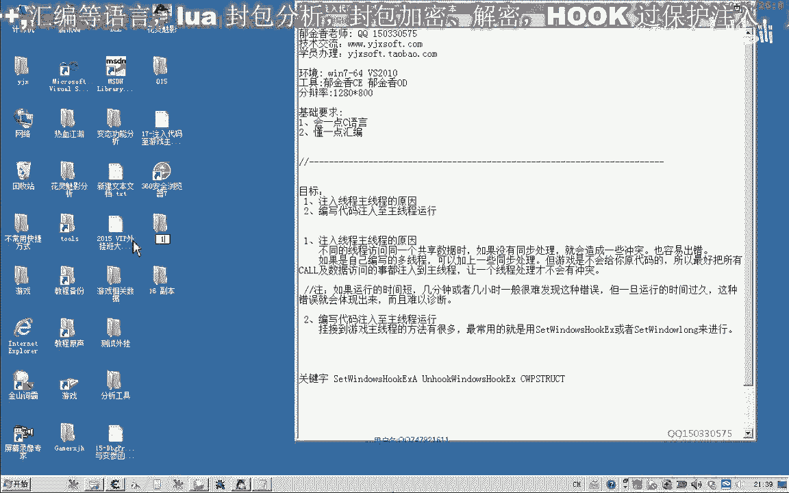
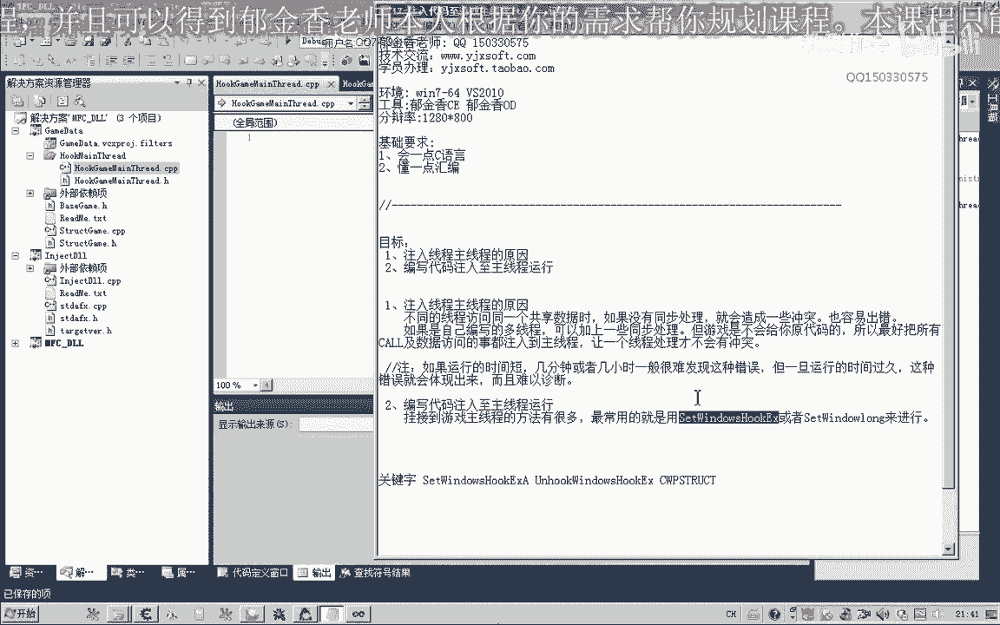
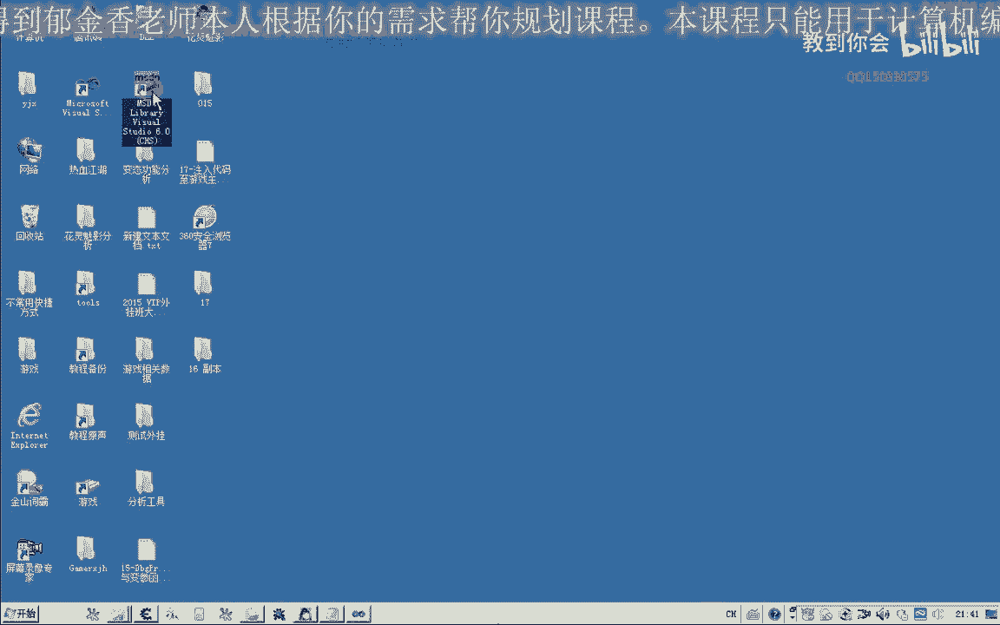
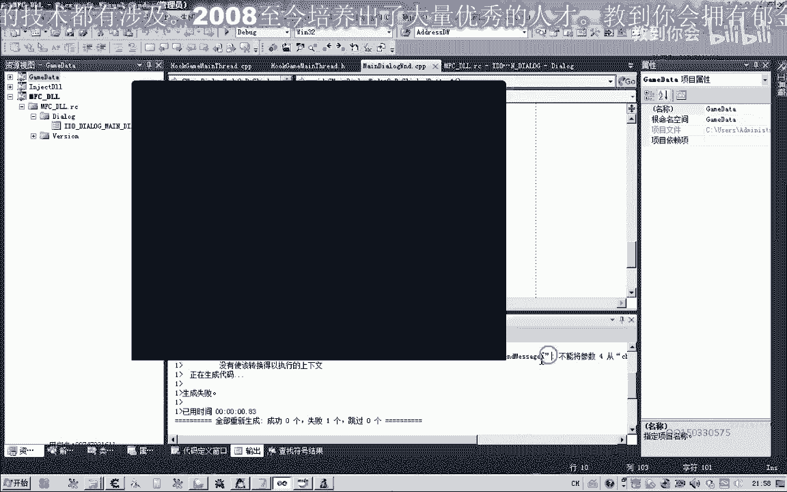
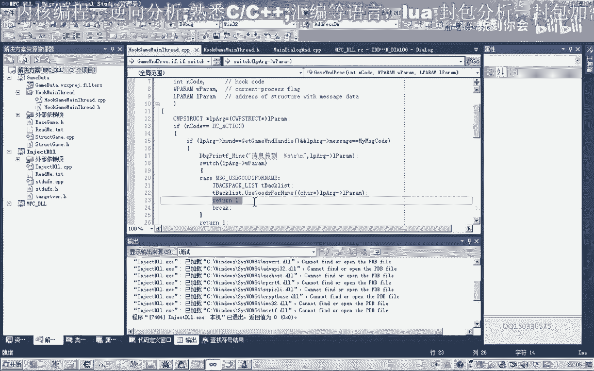

# 课程 P6：017 - 将代码注入游戏主线程 🎮

在本节课中，我们将学习如何将外部代码安全地注入到游戏的主线程中运行。这样做的主要目的是为了避免在多线程环境下访问共享数据（如全局变量）时可能引发的冲突和不稳定问题。通过将代码挂载到游戏主线程，我们可以确保操作的同步性和稳定性。

---



## 获取游戏窗口句柄

上一节我们讨论了多线程冲突的问题，本节中我们来看看如何获取游戏窗口句柄，这是注入代码的第一步。

首先，我们需要找到游戏存放窗口句柄的内存地址。通过内存扫描工具，我们可以定位到存储窗口句柄的地址。例如，我们可能找到地址 `F010-6574`，它存放着游戏窗口的句柄。

为了在代码中使用这个地址，我们定义一个函数来读取其中的值。以下是相关的代码示例：



```c
// 假设 g_hWndAddr 是存放窗口句柄地址的变量
DWORD GetGameWindowHandle() {
    DWORD hWnd = 0;
    __try {
        // 从指定地址读取窗口句柄
        hWnd = *(DWORD*)g_hWndAddr;
    } __except(EXCEPTION_EXECUTE_HANDLER) {
        // 异常处理，返回0
        hWnd = 0;
    }
    return hWnd;
}
```



获取到窗口句柄后，我们可以进一步获取游戏主线程的ID。

---

## 安装Windows钩子

有了游戏窗口句柄和线程ID，接下来我们可以使用 `SetWindowsHookEx` 函数将我们的代码挂载到游戏主线程。

`SetWindowsHookEx` 函数用于安装一个应用程序定义的钩子过程到钩子链中。以下是该函数的基本用法：

```c
HHOOK SetWindowsHookEx(
  int       idHook,      // 钩子类型
  HOOKPROC  lpfn,        // 钩子过程回调函数
  HINSTANCE hmod,        // 包含钩子过程的DLL句柄（全局钩子需要）
  DWORD     dwThreadId   // 目标线程ID
);
```

在我们的场景中，我们将使用 `WH_GETMESSAGE` 钩子类型，并将回调函数运行在游戏主线程中。

---

## 编写钩子回调函数

钩子安装后，系统会在特定事件发生时调用我们定义的回调函数。以下是回调函数的基本结构：

```c
LRESULT CALLBACK GetMsgProc(int code, WPARAM wParam, LPARAM lParam) {
    // 判断是否为我们需要处理的消息
    if (code == HC_ACTION) {
        // 将 lParam 转换为 MSG 结构指针
        MSG* pMsg = (MSG*)lParam;
        
        // 检查消息是否发送到我们的游戏窗口
        if (pMsg->hwnd == g_hGameWnd) {
            // 处理自定义消息
            if (pMsg->message == g_MyMessageCode) {
                // 在这里执行注入的代码
                OutputDebugString("自定义消息已收到。");
                return 0; // 消息已处理，不再传递
            }
        }
    }
    // 将消息传递给钩子链中的下一个钩子
    return CallNextHookEx(g_hHook, code, wParam, lParam);
}
```

在回调函数中，我们检查传入的消息是否为我们自定义的消息。如果是，则执行相应的操作；否则，将消息传递给下一个钩子。

---

## 发送自定义消息到主线程

为了触发我们注入的代码，我们需要从外部向游戏主线程发送自定义消息。可以使用 `SendMessage` 函数来实现：

```c
// 发送自定义消息到游戏窗口
void SendCustomMessageToGame() {
    // g_hGameWnd 是游戏窗口句柄
    // g_MyMessageCode 是注册的自定义消息ID
    // 0 和 0 是附加参数（可根据需要传递数据）
    SendMessage(g_hGameWnd, g_MyMessageCode, 0, 0);
}
```

`SendMessage` 会等待消息处理完毕才返回，确保操作的同步性。

---

## 整合与测试

现在，我们将上述步骤整合起来，并创建一个简单的测试界面。

以下是创建测试界面的步骤：

1.  在资源窗口中添加三个按钮：“挂接主线程”、“测试消息”和“卸载钩子”。
2.  为“挂接主线程”按钮编写代码，调用 `SetWindowsHookEx` 安装钩子。
3.  为“测试消息”按钮编写代码，调用 `SendCustomMessageToGame` 发送消息。
4.  为“卸载钩子”按钮编写代码，调用 `UnhookWindowsHookEx` 卸载钩子。

测试流程如下：

1.  点击“挂接主线程”按钮，将钩子安装到游戏主线程。
2.  点击“测试消息”按钮，观察调试输出是否显示“自定义消息已收到”。
3.  点击“卸载钩子”按钮，卸载钩子。
4.  再次点击“测试消息”按钮，确认消息不再被接收。

通过这个测试，我们可以验证代码是否成功注入并在游戏主线程中运行。

---

## 扩展应用：处理复杂操作


在实际应用中，我们可能需要执行更复杂的操作，例如使用游戏内的物品。我们可以通过扩展自定义消息的参数来实现。



首先，定义一系列操作类型：

```c
#define ACTION_USE_ITEM 1
#define ACTION_SKILL_CAST 2
// ... 其他操作
```

然后，修改消息发送函数，传递操作类型和参数：

```c
void SendGameAction(int actionType, DWORD param) {
    SendMessage(g_hGameWnd, g_MyMessageCode, actionType, param);
}
```

在钩子回调函数中，根据操作类型执行相应的代码：

```c
LRESULT CALLBACK GetMsgProc(int code, WPARAM wParam, LPARAM lParam) {
    if (code == HC_ACTION) {
        MSG* pMsg = (MSG*)lParam;
        if (pMsg->hwnd == g_hGameWnd && pMsg->message == g_MyMessageCode) {
            int actionType = pMsg->wParam; // 操作类型
            DWORD param = pMsg->lParam;    // 参数
            
            switch (actionType) {
                case ACTION_USE_ITEM:
                    UseGameItem(param); // 调用使用物品的函数
                    break;
                // 处理其他操作...
            }
            return 0;
        }
    }
    return CallNextHookEx(g_hHook, code, wParam, lParam);
}
```

这样，我们就可以通过发送不同的消息来触发游戏主线程中的各种操作。

---

## 总结

本节课中我们一起学习了将代码注入游戏主线程的完整流程。我们首先通过内存扫描获取游戏窗口句柄，然后使用 `SetWindowsHookEx` 函数安装全局钩子，将自定义的回调函数挂载到主线程。通过发送自定义消息，我们可以在主线程中安全地执行代码，从而避免多线程冲突。最后，我们通过一个测试界面验证了注入效果，并探讨了如何扩展以处理更复杂的游戏操作。



这种方法能有效提升外部程序与游戏交互的稳定性，是游戏辅助开发中的一项重要技术。