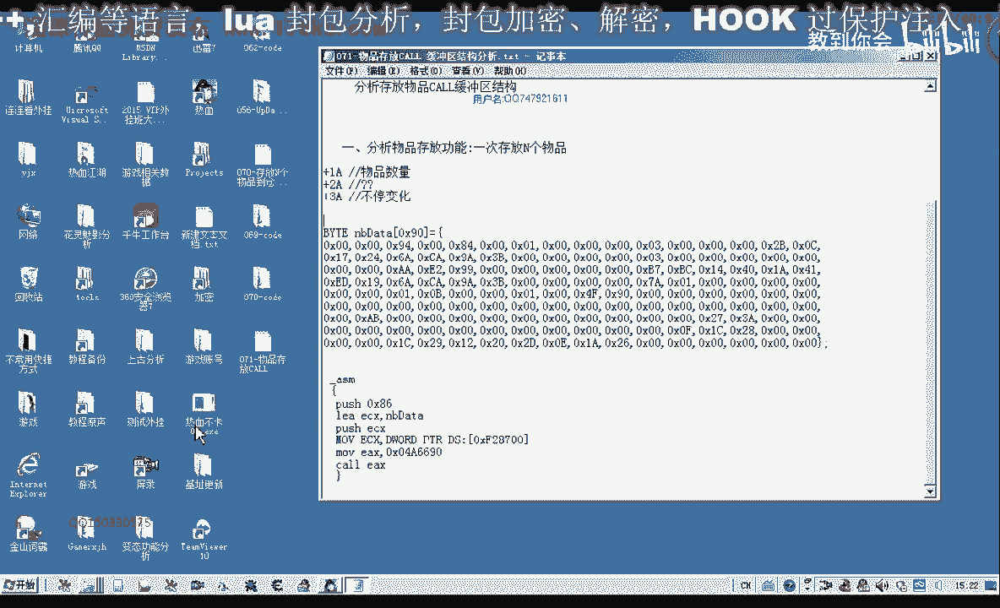
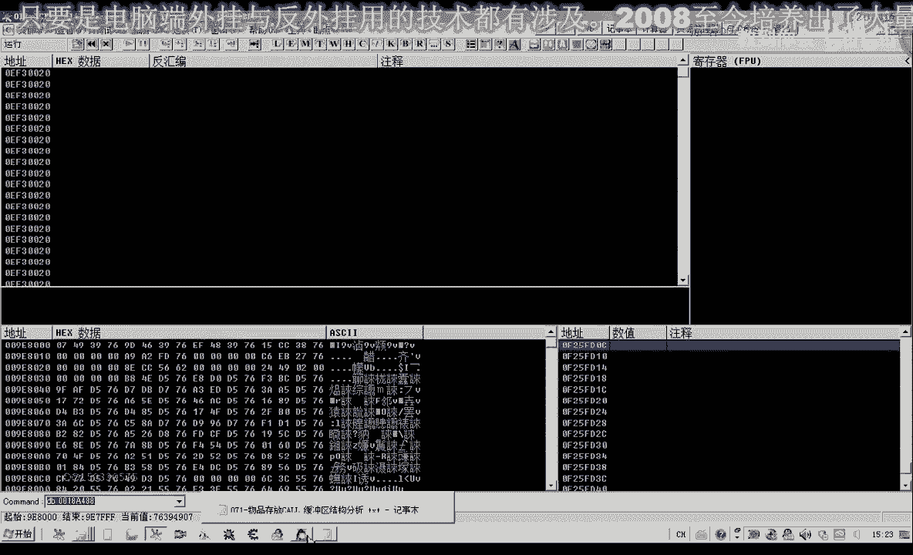
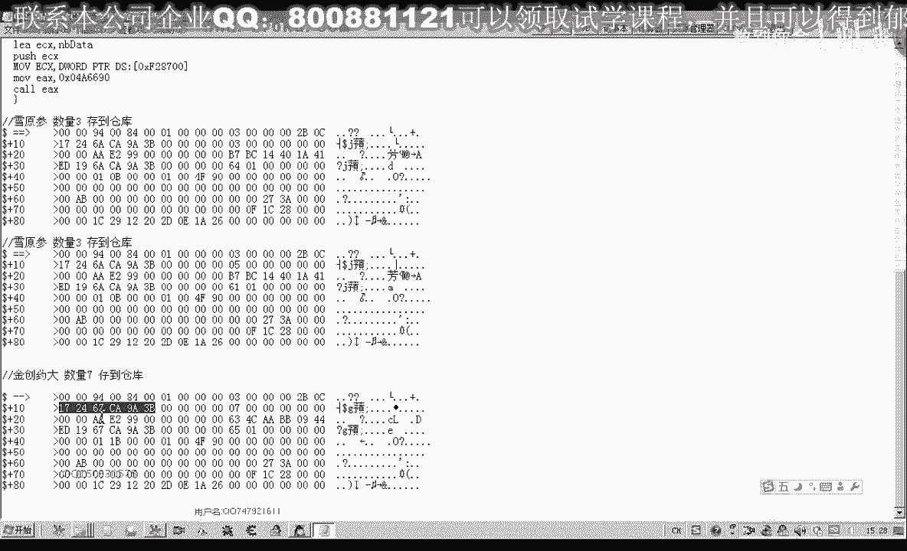
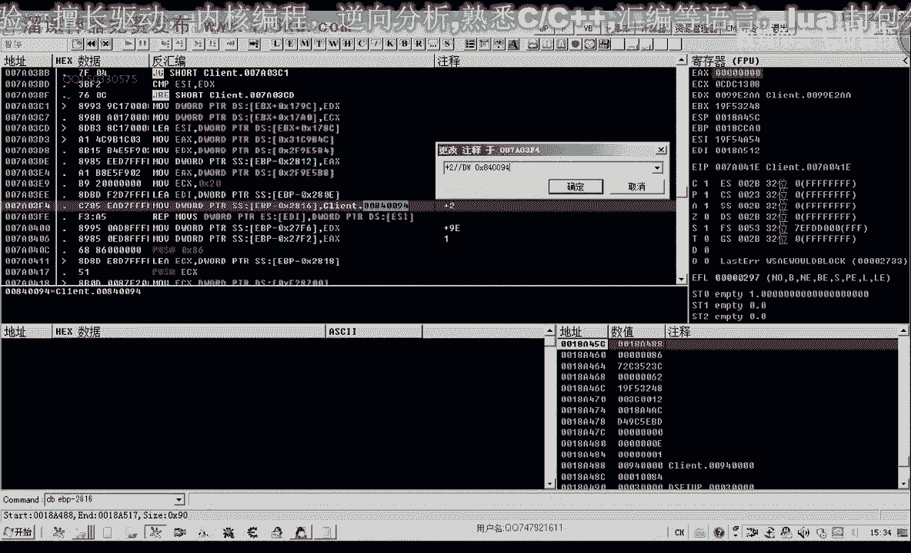
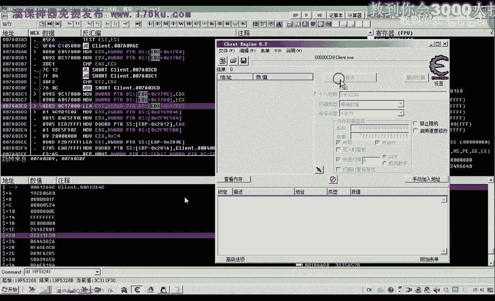
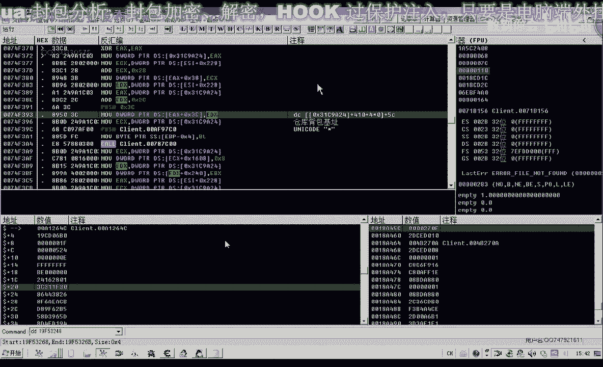
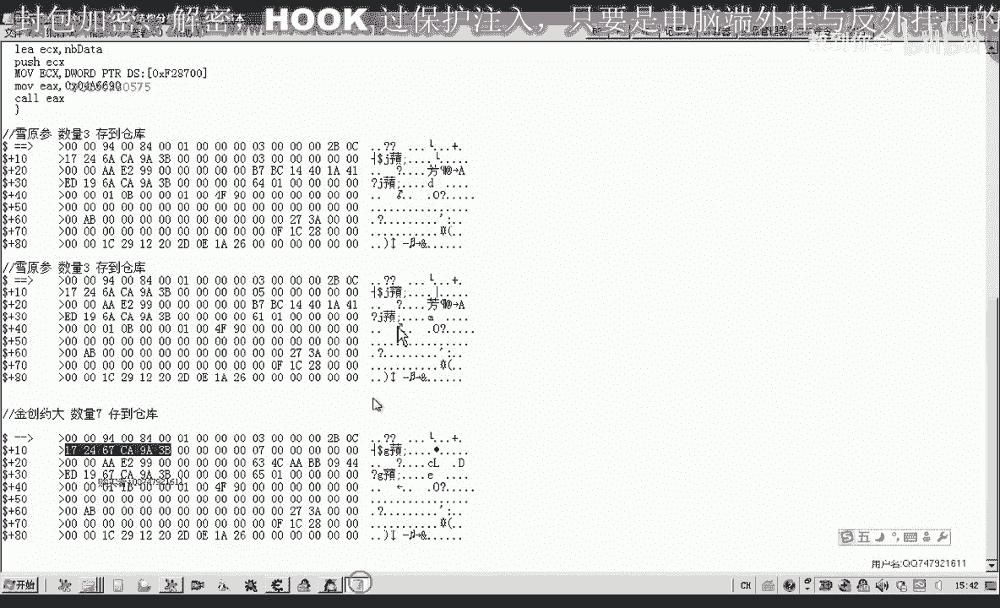
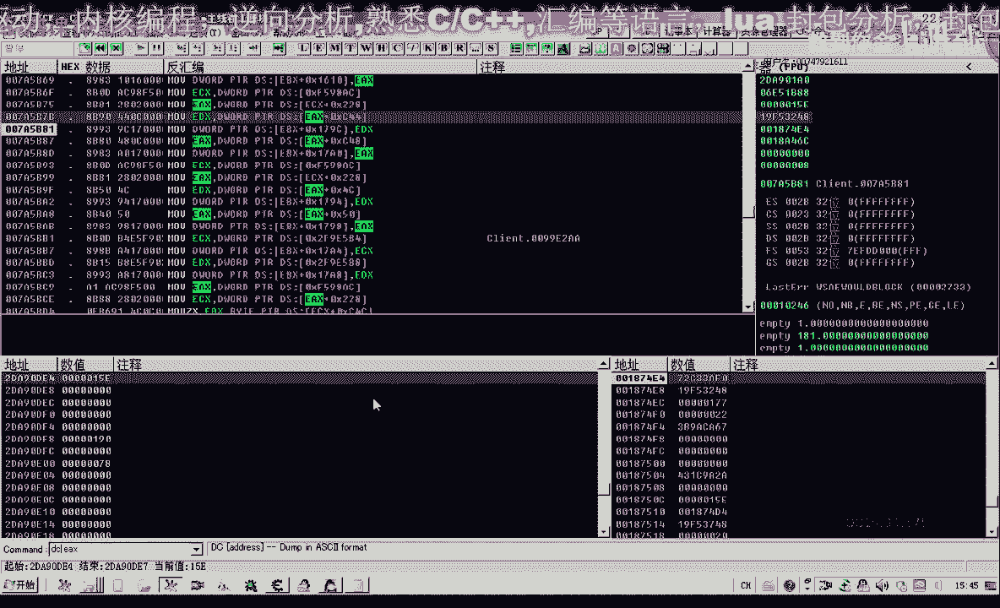

# P60：071-物品存放CALL 缓冲区结构解密 - 教到你会 - BV1DS4y1n7qF

大家好，我是郁金香老师，那么上一节课的时候呢，我们分析并且测试了存放多个物品啊，嗯这个功能扣，那么但是它的相关的参数的一个结构的话，我们没有分析出来，那么所以说这一节课我们重点来分析一下这个缓冲区的啊。

这个结构啊，也就是这一片数据，那么这片数据里面的这些数值它究竟代代表的是什么啊，那么我们需要把它分析出来，那么才能够知道呃，那么我们在存放不同的物品的时候，那么我们该传递怎样的参数，好的。

那么我们打开游戏。

然后我们打开哈这个断点相关的这个窗口，那么我们再一次啊转一下我们的这个存放物品的这个数据，那么我们以这个雪原声为例来看一下存放三个，那么这个时候的话我们最好是在这前面这里下段，那么我们直接来就可以了。

查看ec x里面的数据，那么在这个地方下段的话，它这里呢是18a488 啊，也就是我们也可以这样啊，d d d d p减2818，那么这样也可以显示我们这个缓冲区的所有数据，那么我们把里边的数据呢。

嗯以这个相对地址的方式来加偏移的方式呢来显示，然后把前面的90个字节把它复制出来，那，么这个时候我们备注一下，去延伸数量，三陈道长裤，那么然后呢我们再乘不同的数量进去啊，乘个。

那么这个时候呢我们同样的复制这一块缓冲区的数据，复制到我们的剪贴板，然后再把它粘贴出来，那么我们可以看到前边这一段的话都是没有变化的，那么这个地方才是我们的数量，嗯之前呢我们也有分析。

因为这个地方是数量，那么我们就确定了一个数据啊，好再让它跑起来，然后我们可以再乘一个哈，这个罗汉附身，但是我们可以看到存放这个物品的时候呢，因为它没有输入这个数量，所以说调用的嗯。

这个后来可能是不一样啊，那么我们在盛放金疮药大啊，盛放我们六个或者是七个，那么这个时候也会断一下断一下，我们把缓冲期里边的数据来复制出来，然后让让它跑起来哈，这里呢我们再注释一下，金汤药到七个啊。

存放到我们的仓库里面，那么现在我们把我们所收集的这些数据来进行一些比较，那么首先呢我们看一下它什么地方不相同，那么在前面这一段的话，我们可以看到在前面这一段都是相同的啊，在前面这一段啊都是相同的。

那么我们发现这前面这一段的话基本上都是相同的啊，呃数据，那么只有这个位置，这里是六七，前面这两个地方呢是6a啊，那么首先呢我们确定一下这个六七与前面的6a这个数据的来源。

那么看一下这两个数据它究竟代表的是一个什么意义啊，我们来分析一下第一个不同的地方是，那么可能是从这个幺零这个地方开始，可能是两次结呃，也可能是这几个字节都是连起来的，那么我们先找一下。

那么这个数据的一个来源，那么我们先回到我们的o d里面来查看一下，那么前边对e p嗯有写入的地方哈，对e b p相关的偏移了，有写入的地方，那么有写入的地方呢，我们把它标，标记一下啊，标记一。

那么这两个地方呢都是有写入的啊，还有这个地方以及这个地方，那么这里呢是读取，那么以后呢从这前面这一段代码来看的话，一共就是这四个地方有写入啊，有写入，那我们从第一个地方开始看呢，减一bp减2812。

那么我们看是什么，是哪一个位置，2812，那么2812的话，这个地方的偏移呢，我们给它标注一下，这个地方是加a6 啊，这个偏移对于相对于我们的这个缓冲区来说啊，对家a6 这个这个地方呢在写入。

那么在这个地方的话，我们再来看一下2816，那么2816的话，这个地方呢我们是对加a2 ，这个地方呢写入了我们的四肢解，那么也就是我们后边的这个840094，那么这个840094的话。

它可能就是就是一个固定值，从这里来看的话，那么这个呢可能就是表示我们在存放到仓库啊，对这这样一个指令，那么所以说这个加a2 呢，这里是一个固定值，那么再到后来这里也有一个写入，那么这里一共写入了多少呢。

呃一共1c x加二零，大概写出了80个字节，它的来源的话是来源于e s i来源于这个位置，e bx呢加178c啊，一共往e d i这个位置，也就是我们家2801这个地方，那么也就是往加aa这个地方。

那么这个地方写出了多少个自己来，前面的是e4 x来，是二零的话，也就是循环执行32次，32x4，有空写出了这么多个知己，32啊1c x，那么这里呢他也是我们看一下加aa这个位置啊。

然后我们再看一下27f6 ，那么27f6 的话，这个地方呢它是9亿的，加9g，那这样算的话是不对的啊，因为我们现在的e bp的话应当是变化的啊，那么我们需要呢在这个地方断下来之后呢。

再来计算它的这个数字才是正确的啊，好的，那么我们再次存放我们的数据，那么存放一个好，那么这个时候呢我们断下来了，那么它的这个缓冲区的首地址的话就是一bp减掉2818，那么我们再来重新计算一下哈。

因为刚才计算有误，我们一bp减2812，那么这个地方呢是加六偏，那么加六偏移呢，这里写入的是什么呢，dw warrior 4肢解的零，那么我们可以可以看到啊，z x写入的是零。

那么我们再来看一下这下边啊，然后是1p p减2801，那么这个地方呢是加a这个地方，那么这个地方呢一共写入了我们的嗯，0x20 零14啊，这么多个字节，也就是16进制的啊，0x80 这么多个字节。

那么这么多个字体，它的数据来源是来源于1p x加幺七，哇塞这个地方好，那么我们再往后边看2816，2816的话是加二这个位置，2816，我们看一下2816呢，这里写的是就是后边的这一个常量。

那么这里呢写的也是gw定类型的d word的。

那么写了这样一个常量，那么我们再重新计算一下啊，缓冲区开始是2818，这里是2816，好那么接着往下看，这里呢是27f6 ，那么这个地方呢是加r2 这个位置，那么显示的也是一dx的数数值。

那么dx呢它来源于哪里呢，来源于我们这个机制里边，那么所以说我们在这里的话，直接把这个机子的数字呢写入到里面就可以了，那么我们再看一下这里呢是2。7f2 ，ex也是零。

那么27f2 也就是加二六这个地方，那么写入四字解析w类型的写入的是零好，然后后边就没有我们相应的写入，大概这个数据的结构啊，就是这些好，那么我们先让它跑起来，那么这里呢有最长的一段数据呢。

就是来源于我们ebx加上我们的178c啊，那么这个数据呢是最关键的，也是最多的，那么我们要想办法找到这个eb x，看它是什么，那么而且在这里的话还有呢对我们这个eb x呢也有一些改动的。

这里写出来叫一dx或一个e4 x向向你表示写入哈，那么写入之后的话，它也会影响到我们这个178岁后边的一个数据，但是这里我们不知道他有没有执行到我们下一个断点。

或者它可能是直接就从上边跳到了这一行来执行一课，好的，我们再一次盛放三个哈数据到仓库，那么我们发现了这前面的这一段呢并没有被执行，然后我们按f8 继续往下执行，那么我们可以看到这里呢他已经控了14x呢。

它会执行20次啊，因为要ec x等于零的时候，这里的循环呢它才才退出哈，它会循环的执行这个啊move指令，那么我们可以按f7 ，那么就可以呢在这里来不断的啊跟踪它的数值的一个变化。

因为现在我们看一下缓冲区的一个数值是2818，那么这个时候里边的数据的话，只有前面这几个数字呢是被初始化的，然后呢从加二这个位置呢，他他会来重新的啊，我们这个e si我再来看一下吧，应该是从加a。

这个位置它会呢呃每每次写入四次解，那么我们按f7 来看一下，那么首先呢它是写入的三，然后写的写入的2b0 c1724 好，然后写入的6a c a9 a3 b好，这边后面呢写入的是零。

每写入一次呢e c x的数值来减一，现在变成，那么我们只要把这个数据的来源找到的话，呃，我们整个结构的数据的话就填充完成了啊，那么我们再一次啊让他断一下，找一下eb x的一个来源。

把一bx的数值啊投制出来，好先让他跑起来，然后我们看一下这个刚才复制出来的数据ebx，那么ebx的话它是从，从这个1784这里开始复制的，我们再来看一下17842。

那么这里呢我们能够看到好几个熟悉的数据啊，这个d a c a9 a3 b啊，这里面也有这样一串数据，那么这里的一共40个字节啊，应该是80个自己哈，在前面的这80个字节呢都是来源于这里。

那么我们来看一下这个对象是一个什么对象，用dd先来看一下它的类型，那么这个类型的话是ef，那么ef的话好像，嗯有一些我们在修炼红的时候呢，好像接触到这个类型的对象。

那么我们看里面有没有什么字串这一类的能够给我们提供帮助，但是呢这些字串的话我们也看不出任何问题，这个时候我们先找一下哈，这个ebx的一个机子，用c一打开，找一下。

那么这里呢一共有两个啊，那么其中一个的话应该是一个机制，那么我们把这两个相关的数据复制出来，那么一个是31c，9a24 ，那么我们找一下，看这个是不是我们所料的机子，仓库背包机制啊，这个是。

那么之前的话我们有备注，这个啊应该是一个仓库的一个背包机制，那么第二个的话可能就是其他的这个对象了啊，我们可能这个应该是找不到，再找一下三，所有常量，那么这个是找不到的，说明的话机子呢就是这一个机制。

它就是一个仓库的一个背包机制。

好的。

那么我们把它复制出来，那么也就是说我们现在的这一块数据的话，有一段数据呢是来源于这个仓库的呃，数据机制里面的加上一个幺七多少，我们看一下，加上我们的1784啊，正好，因为这里是取得地址哈。

所以说呢就是这个，也就是这个19f53248 好，我们再来看一下，看一下这里的地址，但是我们这样搜索出来，我们发现不对哈，呃刚才这个是ebx的一个数字，应该是这一个，28啊，对的呃。

这是我们仓库背包对象，那么再加上我们的178c啊，就是这个数值，好的，那么我们再次来看一下，那么我们主要看一下这个里边的数据，它会不会变动啊，如果不变动的话，我们直接就把里面的40个字节的把它复制出来。

那么我们在这里呢给他下一个呃，如果它是变动的话，肯定就有一个呃内存写入的一个断点，那么我们在前面的这80个字节呢，给它下一个路程写入的断点，再一次我们存放相应的数据。

但是这个时候我们发现物品拖到这个仓库背包里边的时候呢，这个时候就断下了呃，它就会向里边会像这个腰1794这个地方来写入这个数据，而数据的来源是来源于我们的1d x d x呢来源于c44 这个地方。

那我们看这个ex是什么，ex加c，那么c44 的话，这个我们有一些认识啊，就是物品的数量应该是我们，那么这个ex的话很有可能就是我们呃背包里边的呃，我们这个药品的一个数量，那么如果是的话。

它也有一个名字，那么我们用dc来查看一下这个对象。

那么我们发现的话这个对象呢就是我们的金疮药啊，金创药大，那么在这里的话它是什么呢，首先呢呃写入我们的物品数量，那么ex我们也给他标注一下，对了，这里有个28，我们也应该很清楚这个。

那么这个f9 f598 ，ac加28，这个是我们选中的对象，选中对象，那么然后呢他从这个选中对象里面它取出来，那么这个选中的对象的话，就是我们的要存放的物品，要存放到仓库的物品，那么在这里的话。

我们的选中对象呢就是我们要存放到仓库的物品，那么这是我们物品的数量，好的我们先把断点取消掉，让它跑起来，那么我们再来分析一下后边的一个数字，那么把ex的数字呢，先把这个对象的数字呢我们先复制出来。

2d a901 a0 ，好的我们接着往下看啊，这里呢我们是物品的数量写到我们的背包的这个1794这个地方，哈哈，那么然后一整块数据的话，可能都是从我们的这个选中对象里边来提取的，那么如果真的是这样的话。

那么我们在存放物品的时候呢，我们就可以以背包里边的这个对象的数据来做一个参数，那么就可以直接来存放我们的呃这个物品，那么这种呃设计的一个逻辑思路啊，它也是正确的啊，那我们接着再往下面看一下。

除了这个c44 之后呢，这里是c48 嗯，然后呢我们看一下ex相关的，然后这里有一个四岁五零啊这些地方，那么我们再一次让它断一下，来看一下，那么金川要大哈，我们突放在这个时候。

好像我们需要在这里下一个断点，这里是数量，那么我们看一下c s8 ，这里是不是，好那么这个时候在拖动的这一瞬间呢，它就会像我们的仓库列表呃，里边的相关偏移来写入这个数据啊，首先写的是数量。

然后我们按f8 往下执行，这个时候呢ex呢是零啊，这里写一个是零，那么是您的这种呢，我们暂时忽略他们啊，不管，然后我们再往下边一cx，取了一个e4 x出来，然后再次把我们的这个对象ex取出来了。

这个1a0 ，这一个，那我取出来之后呢，这个时候呢他先取出了ex加4c这个地方，我们来看一下加4c这个地方是什么d b等显示，那么我们发现恰好也就是我们的67c a99 a3 b，那么这个数据的话，在。

大概是在这个地方啊，还有是这个地方，也就是我们的1012哈，在101112的这四个字，四个字节，那么也就是说我们可以这样来备注，那么ya呢是物品数量，那么之前的幺二。

这里呢有四个数据是来源于我们物品对象加4c，一共有四次解，我们可以用d w来表示，或者是直接标注自制解啊，来源于我们物品对象加4c那么这个幺二的话，我们可以看到幺二的这四字节和三二的这四字四字解哈。

都是来源于这个地方，那么我们可以把它复制一下l2 ，然后三二这个地方四字节也是来源于我们物品对象是c啊，这个偏移好，那么我们继续往后来执行，啊f8 ，那么是把这四个字节写入到他相关的四个字节。

然后是ex加五零，也取了四个字节出来，我们看一下这个时候圣灵啊圣灵，那么零的话肯定也就是它的这个数据零，也就是我们的请安卓的，这里的话应该是取了八字节出来的，八字节来源于4c这个地方。

因为4c与五零呢是i做的，然后我们接着往后边看，然后这里呢也取了一个ecx出来网1b x里边写，那么这个呢是来源于一个机子啊，这个它把它弄得比较复杂，那么这个时候忘的是17a4 里边来写的这个数据。

那么实际上也就是这这一串啊，这一串也就是一个数据的一个对了，80个自己的一个填充，填充的比较复杂，那么我们先呢就给他把与我们ex相关的啊，与对象相关的，我们先把它取出来，那么与对象相关的。

这里有一个4c，这里有个五零，然后再一次取对象之后呢，变成了ec x，e d x d l e f4 这个地方啊，有一个还有一个是ef 2这个地方，还有一个是a2 a4 这个地方，那么这三个地方的话。

他也进行了一个相关数据的一个填充，那么我们看一下ef 4这个地方是什么呃，e f4 ，e f2 以及a4 ，还有一个ac，那，么这里呢是取得一致解，这里相当于也是取得一致解的，因为下面这里呢是一个b。

然后加a4 这个地方的话，那么下面呢它也是第二只写了一字节进去，那么这里呢也是一致结论，那，么再往下边看吧，那么再次取出来这个我们的对象啊，加28这个地方，然后呢把ac这个地方呢也是取了一次解。

写到我们的17c8 这个位置，然后在这里呢再次我们的对象变成了ec x e x，然后取了一个五四，取了一个五八出来，那么这个时候来补四个五四和五八的话，也就是取了八至九。

这个时候相当于从四这个地方来取了八次几，那么后边这个地方我们就用不着注释啊，取出来取出来之后呢，分别写到了我们的17b0 和ac这两个地方也是ac过来是b0 ，这两个地方也是挨着的。

好那么最后这里的话嗯，他把一bx加幺七cc，那么传到了这个框里面，可能这里边还有一些数据的填充，好看的，他这个的话这样写的话显得非常的复杂，那么我们也可以来来调用这个库。

来对这个幺七cc这个地方来进行初始化，那么这这也是一种初始化数据的一个方法，或者是呃我们把这整段代码啊把它复制下来，然后呢以我们的对象作为一个参数来初始化我们的一个缓冲区域。

那么另外一种方法呢就是我们自己把所有的这在缓冲区里面的啊，80 90个自己的这个结构弄清楚，我们自己来填充数据啊，好的，那么我们现在能够分析多少是多少，再来看一下前面的啊，这里e x相关的4c50 啊。

这里呢我们4c和五零的话，这里是八字结，那么我们来看一下里边的相应的这些数据，那么我们先把我们的备注哈，先把它取出来，先复制一下之前的ec x，那么这里还有一个cc 40，也写了一字截进去，c40 。

这里还有一个c484 字节，这里是一个字解，这里是一个c40 ，这里是c44 啊，那么相当于这个地方的话是写了各自接进去，从440这个地方，那么我们还是把它分开一下，340，44。

那么我们看一下最最小的偏移是多少，五四，04c，四四啊，这个偏移应该是最小的，或者我们还有一种简单的做法呢，我们是找一下这个扩，然后调用这个库也可以。

在上面的话可能呢它会把我们的应该是一个相相关的一个库，然后呢来调用的时候呢，它也会自动的初始化这一块数据，但是我们看了一下这个扩的呃，比较复杂，比较大啊，按减号我们再退回来一下。

但是呢我们这个时候把金疮药啊啊放进来，那我们再看一下，看一下这个ex这个对象加四四这个地方啊，开始的它最小的一个偏移，我们背出的话应该是四四，c40 ，是谁，那么我们先把它从四四开始的这一段数据呢。

我们把它复制出来，也是80个字节左右，然后我们进行一下比较，但是后边的这一段呢都是零啊，加四四它最大的我们是ac，我们看它最大的数值的话，ef那么后边还有数据。

