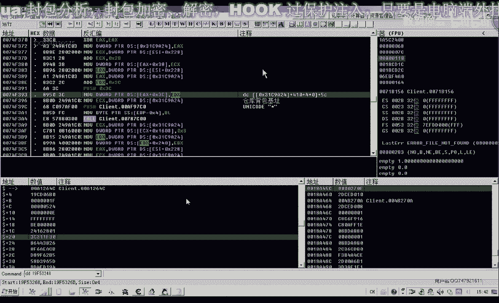
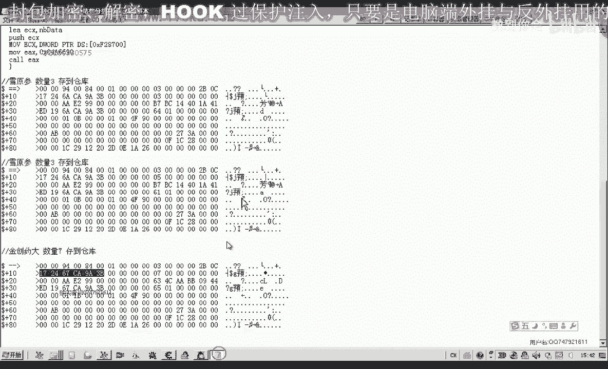
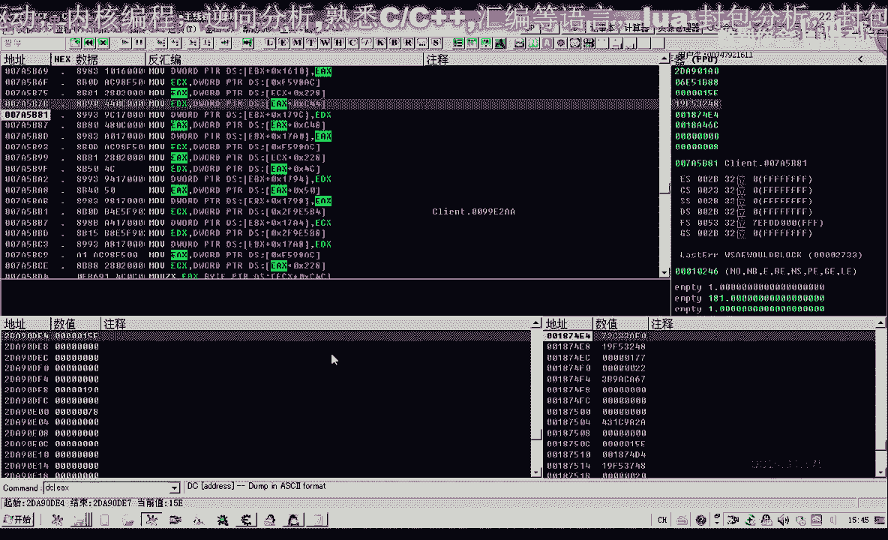

# 课程 P60：071-物品存放CALL 缓冲区结构解密 🔍


在本节课中，我们将深入分析并解密存放物品功能CALL所使用的缓冲区数据结构。上一节我们测试了存放多个物品的CALL，但未解析其参数结构。本节我们将重点剖析这片数据，明确每个数值的含义，以便在存放不同物品时能正确传递参数。


---

## 打开游戏与调试环境

首先，我们打开游戏和调试工具，并设置断点来捕获存放物品时的数据。


我们以存放“雪原声”为例，并设置断点来查看 `ECX` 寄存器中的数据。缓冲区起始地址为 `EBP - 0x2818`。我们可以使用命令 `dd dd dd ebp-0x2818` 来显示缓冲区的所有数据。


以下是存放不同数量物品时捕获的数据片段：

*   **存放三个雪原声：** 复制缓冲区前90个字节。
*   **存放不同数量物品：** 再次复制缓冲区数据进行比较。

通过比较发现，数据前段大部分相同，只有特定位置（如 `0x67` 与 `0x6A`）的数值随操作变化。我们的目标是找出这些变化数据的来源和意义。

---

## 分析缓冲区写入点

为了理解结构，我们需要在OD中查找所有向缓冲区（即 `EBP` 相关偏移地址）写入数据的位置。

以下是主要的写入点及其对应的缓冲区偏移和写入内容：


1.  **写入点 1 (`EBP - 0x2812`):**
    *   偏移：`缓冲区首地址 + 0x06`
    *   写入：`0` (双字)

2.  **写入点 2 (`EBP - 0x2816`):**
    *   偏移：`缓冲区首地址 + 0x02`
    *   写入：固定常量 `0x840094` (可能代表“存放到仓库”的指令)

3.  **写入点 3 (`EBP - 0x2801`):**
    *   偏移：`缓冲区首地址 + 0x17`
    *   写入：从源地址复制 `0x80` (128) 个字节的数据。

4.  **写入点 4 (`EBP - 0x27F6`):**
    *   偏移：`缓冲区首地址 + 0x22`
    *   写入：来源于某个基址的数值。

5.  **写入点 5 (`EBP - 0x27F2`):**
    *   偏移：`缓冲区首地址 + 0x26`
    *   写入：`0` (双字)

其中，**写入点 3** 复制的数据量最大，也最关键。其数据来源于 `EBX + 0x178C`。

---


## 追踪关键数据来源

我们需要找到 `EBX` 的来源。通过搜索和比对，发现 `EBX` 指向一个仓库背包对象的基址。





**公式表示：**
```
关键数据块来源地址 = 仓库背包对象基址 + 0x178C
```

该地址存放的数据会被复制到缓冲区的 `+0x17` 偏移处，共 `0x80` 字节。

进一步调试发现，当向仓库拖动物品时，程序会向 `仓库背包对象基址 + 0x1794` 的地址写入数据，而写入的**来源正是当前选中物品对象的地址**。

**核心逻辑：**
存放物品时，CALL会从**背包中选中的物品对象**里提取大量信息，填充到缓冲区中。



---

## 解析物品对象与缓冲区的映射关系

通过单步跟踪，我们可以逐步建立物品对象属性与缓冲区特定偏移的对应关系。

以下是已分析出的部分映射关系（偏移均为相对于缓冲区首地址）：

*   **偏移 `0x10` - `0x11` (4字节):** 来源于 `物品对象地址 + 0x4C`。
*   **偏移 `0x30` - `0x31` (4字节):** 同样来源于 `物品对象地址 + 0x4C`（与上方连续8字节）。
*   **偏移 `0x44` (1字节):** 来源于 `物品对象地址 + 0x44`（可能是物品数量等属性）。
*   **其他属性:** 跟踪发现，程序还从物品对象的 `+0x28`, `+0x40`, `+0x50`, `+0x54`, `+0x58`, `+0xAC`, `+0xEF4` 等多个偏移读取数据，并填充到缓冲区的 `0x17B0`, `0x17C8` 等对应位置。


**简单来说，缓冲区的填充是一个复杂但有序的过程：**
1.  写入固定的指令头（如 `0x840094`）。
2.  从仓库背包对象复制一段固定数据。
3.  **最关键的一步：** 从当前要存放的**背包物品对象**中，提取大量属性（ID、数量、类型等），分散写入缓冲区的各个指定偏移。

---

## 两种实现思路

理解了结构后，我们有两种方式来实现调用：

1.  **手动填充缓冲区：** 彻底分析物品对象所有必要属性与缓冲区偏移的对应关系，然后自行构造完整的数据块。这种方法透明、可控，但初期分析工作量大。
2.  **调用游戏内部函数：** 定位并直接调用游戏中用于初始化这块缓冲区的库函数。我们只需传入**物品对象地址**等少量参数，由游戏函数完成复杂的填充工作。这种方法更简洁，但需要找到正确的函数入口点。

---

## 总结

本节课我们一起深入分析了存放物品CALL的缓冲区结构。

*   我们确定了缓冲区的基本布局，包含固定头、仓库数据和物品详情三大部分。
*   我们发现了关键数据来源于**背包中的物品对象**，并追踪了部分属性（如物品ID、数量）在缓冲区中的映射位置。
*   我们提出了两种实现该功能调用的可行思路。

虽然完整的映射关系非常复杂，但核心原理已清晰：**存放物品的本质，就是将背包内指定对象的详细信息，按照特定格式打包到一个缓冲区中，然后调用功能CALL**。这为我们后续实现自动存放物品功能奠定了坚实的基础。