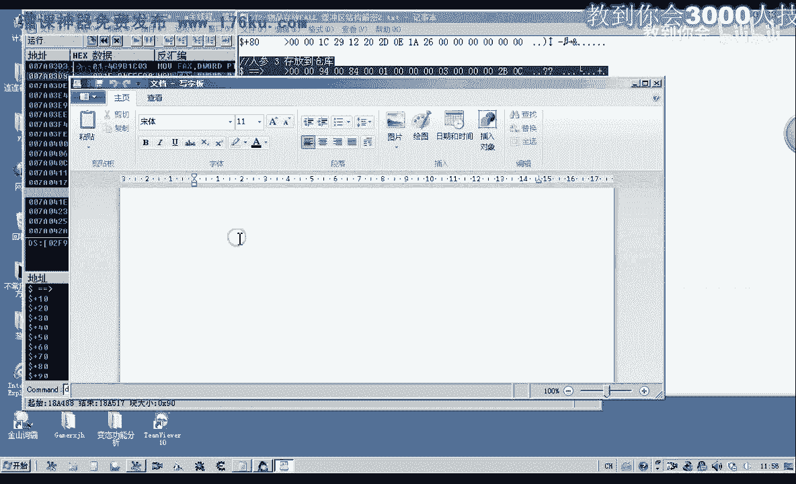
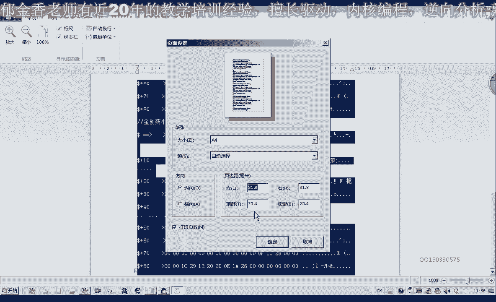
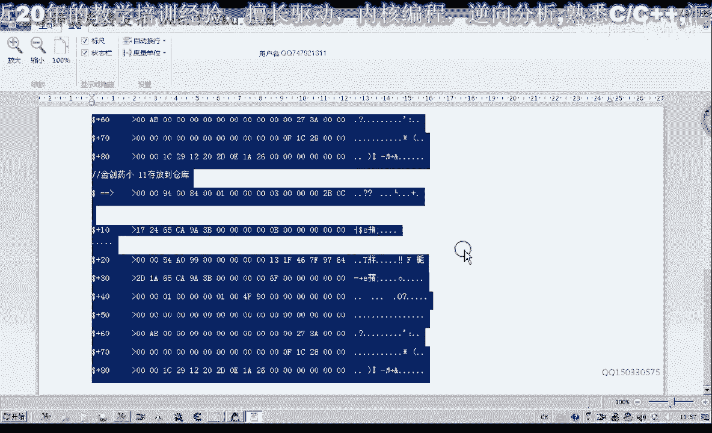

# 课程 P61：072-物品存放CALL 缓冲区结构解密2 🔍

在本节课中，我们将继续深入分析游戏内物品存放操作的缓冲区结构。我们将通过对比存放不同物品时的数据变化，定位出缓冲区中与物品ID、数量、类型等关键信息相关的偏移位置。






---



上一节我们介绍了缓冲区的基本概念和初步分析方法，本节中我们来看看如何通过对比数据变化来精确定位关键信息。

首先，我们进入游戏，对存放物品的操作进行下断点。我们先存放3个人参到仓库，并抓取相关的缓冲区数据。

```
// 示例：存放人参后的部分缓冲区数据（十六进制）
... (前90字节) ...
68 00 00 00 23 00 00 00 ...
```


接着，我们存放35个血人参到仓库，并再次抓取数据。


```
// 示例：存放血人参后的部分缓冲区数据
... (前90字节) ...
68 00 00 00 0B 00 00 00 ...
```

最后，我们存放11个金创药（小）到仓库，并抓取第三次数据。

```
// 示例：存放金创药后的部分缓冲区数据
... (前90字节) ...
68 00 00 00 2B 00 00 00 ...
```

为了方便比较这三组数据的差异，我们将它们放入文本编辑器中进行高亮标记。通过对比发现，从第二行开始出现差异，特别是以下几处数据段发生了明显变化：

1.  一段约12字节的数据（从偏移 `0x2A` 开始）。
2.  一个4字节的数据块。
3.  表示物品数量的数据（例如 `0x23`、`0x0B`、`0x2B` 分别对应十进制35、11、3）。

---

接下来，我们重点分析那串12字节的关键数据。通过调试器追踪，我们发现这段数据来源于一个计算出的地址：

**公式：数据来源地址 = [ebx] + 0x178C + (0x2A - 0x0A)**

我们通过CE（Cheat Engine）搜索这串特定数据，发现它只存在于一个动态地址中，这证实了它是组合数据，并非直接来源于单一的静态地址。其根源是 `ebx` 寄存器所指向的一个基址。

这段数据会随着存放物品的不同而改变，说明有代码在向这个地址写入数据。通过逆向跟踪写入指令，我们发现写入的数据来源于另一个地址的计算：

**公式：写入数据 = [eax] + 0x54**

进一步分析 `[eax] + 0x54` 指向的内存，我们发现这里存放着物品的关键标识信息。例如，对于金创药，这里的数据是 `09 44 1D 19`。

以下是缓冲区中已分析出的关键偏移与物品对象属性的对应关系列表：

*   **偏移 `0x11` 处（1字节）**：表示物品在容器中的下标索引。来源于物品对象地址 + `0x1F4`。
*   **偏移 `0x12` 处（4字节）与 `0x32` 处（4字节）**：都来源于物品对象地址 + `0x4C`，可能表示物品类型或分类ID。
*   **偏移 `0x1A` 处（8字节）**：核心的物品标识ID。来源于物品对象地址 + `0x54`。
*   **偏移 `0x2A` 处（12字节）**：组合数据，动态生成，与物品唯一标识相关。
*   **偏移 `0x3A` 处（2字节）**：表示该组物品的堆叠数量上限。来源于物品对象地址 + `0xC4`。
*   **偏移 `0xEA` 处（2字节）**：表示本次存放或取出的物品数量。


---

本节课中我们一起学习了如何通过对比和逆向跟踪，逐步解密物品存放CALL的缓冲区结构。我们成功定位了物品下标、ID、类型、数量上限以及当前操作数量等多个关键信息在缓冲区中的具体偏移位置。

目前，除了上述动态变化的关键数据外，缓冲区其余部分多为固定不变的填充或协议头数据。在下一节课中，我们将利用本节课得出的偏移结论，构建完整的缓冲区数据，并进行实际的调用测试，以验证我们的分析是否正确。