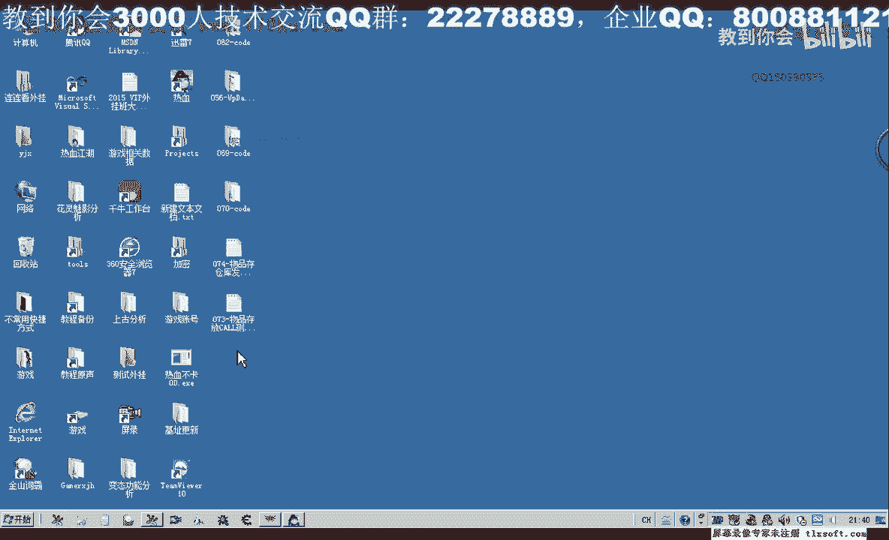
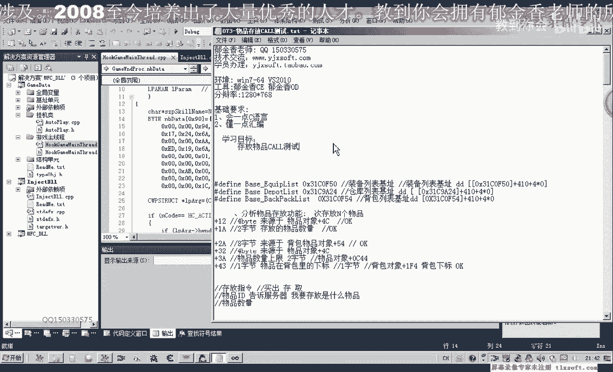
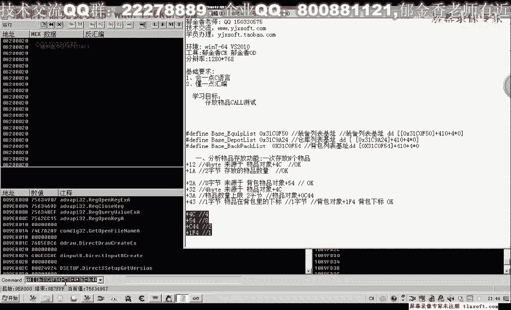
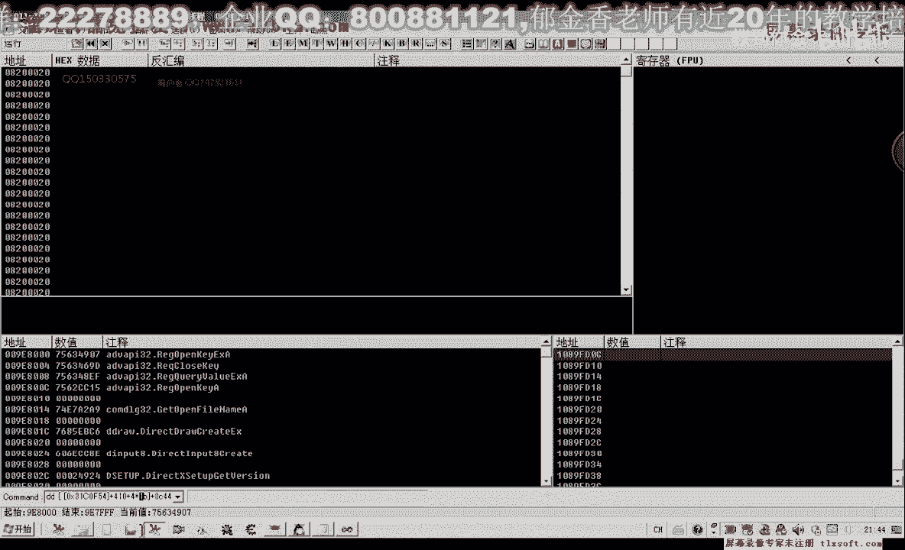
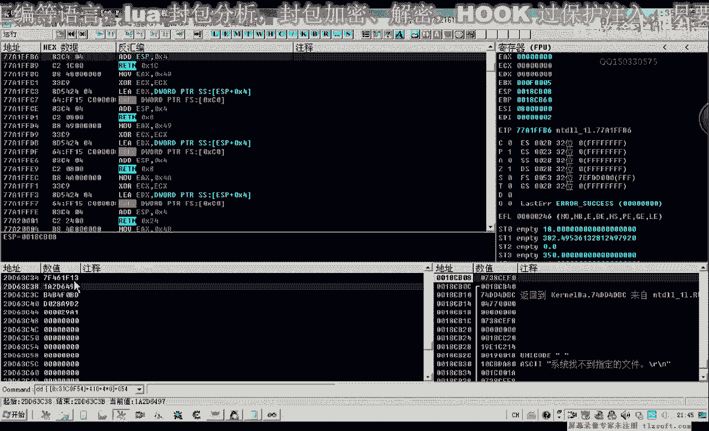
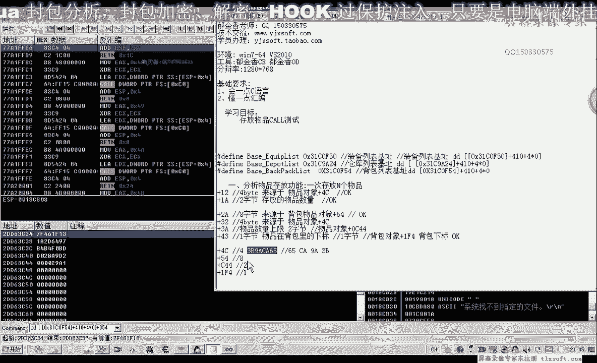
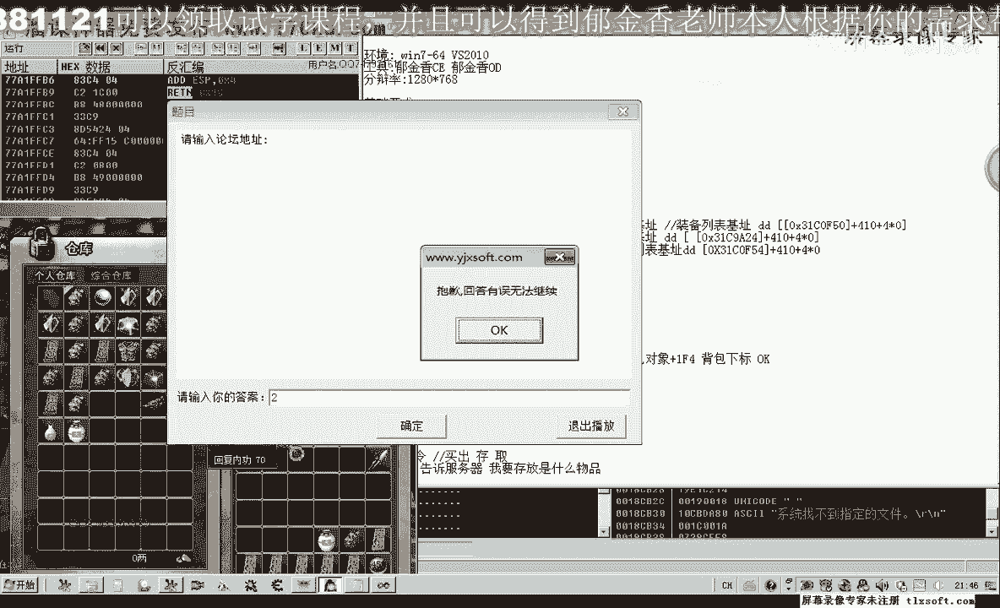
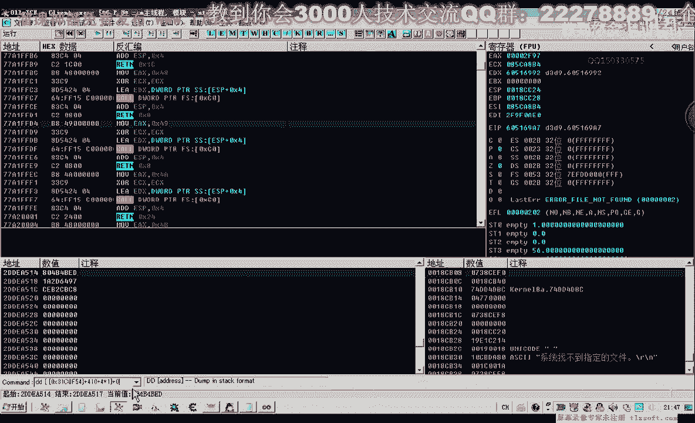
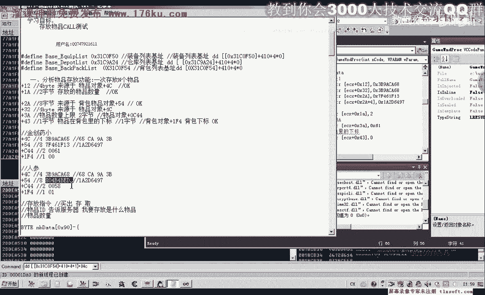

# P62：073-物品存放CALL测试 - 教到你会 - BV1DS4y1n7qF

大家好，我是郁金香老师，那么前面一个呢，我们对这个物品存放货的这个缓冲区参数来做了一些分析，那么这节课呢我们对这个物品存放的啊，存放物品的过来进行一个测试啊，那么首先我们打开前边第70课的代码。

这这这这这，那么我们切换到我们的主线程单元，那么当时呢我们之前在第70课的时候也进行了一个测试啊，出售一个相应的物品，那么这节课呢主要我们是嗯对这个所谓的结构来进行修改啊，方便我们出存放其他的这个物品。

那么我们打开我们的游戏，比如说我们要存放这个人声，那么它的参参数我们该怎么传，那么如果是呃存放的是这个金窗要小，那么我们这个参数又该怎么修改啊，那么我们已经分析了一些偏移出来。

那么首先呢我们要取得的是呃一二这个地方物品对象，腰围这个地方的四字节要取出来进行替换，另外呢我们ea这个地方的啊两个字节呢是物品的数量啊，那么我们要把它写进去。

那么还有另类这个地方把自己来源于背包里面的呃，八个自己，我们也也要给他替换进去，那么先让我们手工的哈进行测试，那么测试成功了之后呢，我们下一节课呢再具体来对它进行啊函数的一个封装。

那么首先为了方便提取我们的物品呢，我们先用o d附加到我们的游戏里边，那么我们先提取我们相应的参数和手动的提取。

那么首先我们要提取的提取的是这个物品对象，一个是加四色这里的四字解，那么一个是加我是这个地方的八字形，那么我们来看一下啊，呃除了五四这个地方，这里三二哈，这里呢也是啊，主要是提取的是544c啊。

这两个地方还有一个是物品数量的上限啊，3a这个地方，那么这里我们提取的是c a44 啊，物品数量两个字节，那么还有一个呢是我们背包的下标，在ef 4这个地方，当然我们也可以直接观察这个背包的下标。

也也可以观察出来，那么在这里呢是它的一个下标啊，一个字节，那么我们先把这相关的几个偏移取出来取出来，那么我们首先从第一个呃精创要小做一个测试。

金创要小的话，它的下标呢肯定就是零，那么我们看一下，首先我们取四岁这个地方的四字减。

那么我们把这四个字节取出来。

那么注意如果我们是字节类型的话，就应该是6c9 a3 b啊，是这样，那么如果我们是低位的类型呢，的16进制呢就是这样的显示。

那么接着说我们五四，五四的这八个字体啊。

那么我们直接用低位的的类型呢来提取。

对。

好的，那么这里的八字形我们也提取出来。

还有cs 4，这里两个字节，就是当前物品的一个数量。

注意这里是dw微星的，赢钱最好，那么这里是97个哈，我们也就是061，00661，然后是ef 4这种，那么e f4 ，这里的话肯定是一字写的话是零，它的下标是零，因为好，那么这里呢我们是零。

这是我们的精创，要小的所有数据，那么我们看第二个的。

话是人生啊，那么我们看一下人生的数据，那么第一个它的下标呢肯定有变化，那么我们把这个复制一下，那么首先呢这里呢我们是它的下标是零一，然后我们再看一下c44 这个地方，这里的它是16进制的58008。

然后我们在上边五四这个地方，所以这里呢我们也用dt来显示，也是显示四个字节，那么五四这个地方的数据复制出来。

那么后面这个哈2d6497 ，1a2 d6497 ，它这两个是相连的啊，这个呢是相同的，那么我们再次啊不必更新。

那么还有一个是四岁这个地方，我们看一下。

把它的数据复制出来，那么从最后这呃第一位的这个六八呢，我们要把它改一下，以前的六改成了六八哈，这是他们的人生的和精创要小的这两个i d的一个差值，好的。

那么接下来呢我们就可以对我们上边的这个结构来进行修改，那么我们首先呢如果我们要存放金窗要小，要存放多少的数量，那么当然数量还有一个偏移啊，数量这个位置的话，我们要在什么地方改了。

我们要参照我们分析的资料来改这个代码，那么我们在这前边来改我们的参数，那么首先呢我们数量数量的话，我们看在什么地方改物品数量，这里呢是ea这个地方，那么我们在椰子这个地方呢，给他送两个字节的数量进去出。

那么首先呢我们把这个nb代替的这个机子呢先取出来，把这一句提前，那么取出来之后呢，然后我们可以相对ec x的这个机制来对它进行协助，move world，挺难的，那么这个修饰符来可以不要。

如果是局部变量的话，就是在堆栈里面可以用s来修饰，如果是全局变量的，你一般可以用js它在数据段来修饰呃，当然了也可以取消掉这个这个前缀的一个说明啊，然后呢我们这里呢是e4 x加上我们的0x12 。

这个地方j a哈，这个地方沉默的是数量，那么比如说我们要存放两个啊，这个数量进去，那么除了数量之后呢，我们是一个数量的一个上限，当前数量，那么当前数量这个偏移的话在什么地方呢，当前数量在3a这个地方。

那么我们对3a这个地方进行修改，等一会儿，啊这一句的复制一下，这里的d word啊，数量的话数量上限也是两个字节，用word来修饰它，那么现在它的数量上限的话，我们看一下轻松要小的话是0061啊。

直接传你x61 进去就可以了，然后除了这个数量之外，我们再看一下幺二这个地方来源于4c有四肢解，那么我们在前边复制一下这段，这里加上d word，这里是幺二，它的四字节的话来源于我们青创要小。

加上0x的前缀啊，幺二的这四个字节呢，我们就给它写进去了，那么这个呢可能是一个可能也是不平ip相关的嘛，我们就给他取一个物品id相关机，那么还有一个地方我们看一下，还有一个地方呢就是从五湖四这里开始。

那么从五四这个地方开始呢，我们有八个字节，那么我们呃向里边进行协助啊，这一段呢复制一下，那么这里呢我们添加五四，那么五四这里精通要小的话，首先这里开始，那么50+4个字节的话就是八啊。

那么因为我们一次信息写的是四字节，所以说需要需要写两次啊，也就是五四再加上四，实际上就是五八，那么五花的话就是后边这一段数据，好那么关于还有一个是我们的cs是这是取出的物品，1a乘放数量。

八字解二零这个地方，还有二代这个地方呢也来源于我们的这个物品对象啊，也需要写一下啊，这个地方我记一下，这个偏移呢我们改为分类，然后我们再核对一下3a这个地方啊，物品上限3a这个地方我们还没开始写。

二类商业物品上线两次节，好这里是3a，我们需要修改一下啊，这是当前数量，这里是3a，那么三位还有一个是四三，在背包里面的下标，那么把前面这一句啊复制一下，那么现在呢我们它的下边呢是零啊，是第一个数值。

那么在这里呢四三这前面的修饰符我们要改改为b，那么呢他每次来才是写入了一个字节啊，才是写入一字节，写到四三这个位置，好的，那么我们这样修改之后呢，我们测试一下，重新编译。

那么看一下能不能够把我们的精创要小存放两个啊，存放到我们的这个仓库里边，啊，嗯先挂接到主线程，然后呢我们测试一下，让我看一下现在的数量97个，那么这个时候呢我们看一下啊，没有存放进去，显示的是五品啊。

无法转移物品，嗯那么我们再来看一下我们分析的这些呃，是不是已经写进去了，嗯首先是幺二这个地方1a这个地方写写的是存放物品物品两个，然后这是二类的八字几，2a的八字形，对了，我们这里是写的五四的八字解啊。

写错了，那么我们这里呢应该写成2a的八字解，那各类的八字节来源于物品对象的五四啊，这里应该是，对a加四，这样才对，日月的八字节，还有一个我们看一下，继续看，一个是2a5 ，看1a，434哦。

还有一个是三二，这个地方应该是三个人啊，当时我们填错了，一个是幺二或三个人，都是来源于物品对象的4c这个位置，那么二类的八字写的是单独的，那么这里呢应该是二类，后面呢应该是加四。

那么这样写的话才是正确的，再重新编辑一下，那么在挂接到主线程，然后切换到游戏里边啊，再测试一下，那么这个时候我们可以看到金创药呢每按一下这个测试呢，它会存放两个啊，到我们的仓库里面。

那么说明的话我们的测试的话是正确的，那么如果要存放人声呢，那么我们就要去修改相应的一个数字，那么而且我们发现存放第一次，第二次的时候呢，它都能够存放进去，那么也就是说我们这个物品数量。

当前物品数数量的话，它不是很关键啊，也就是说它只要比我们存放的这个数字来大，可能就可以来向里面存放这个数据，那么关键的应该是这前面的这几个啊，那么这个数量的话看来他不是很关键啊，数量的当前数量。

如果是当前数量，它是一个关键数据图啊，那么我们按第二次的时候，他当前的数量呢就已经改变了啊，那么应该是不能够存放到我们的仓库里面，好的，也就是说这个数字的话可以是不关紧要的啊，但是这个是非常关键。

那么我们再来看一下，是在这个地方人生，那么我们要存放的是就应该是六八这个问题，那么再复制一下，那么呃aa这个地方呢我们看一下五四这个地方，也就是那么武士呢它只有前面的四个字节呢不相同。

后边的这里都是相同的，那么所以说我们在这里写的时候呢，只需要修改在前面这一部分就可以，那么这样的话，理论上呢我们就能够把我们的人生啊存放到我们的仓库里面去，好的我们再次测试一下，挂接到主线程。

然后看一下人生88个测试嗯，这个时候呢显示无法转移物品，那么刚才的话我们金创药能够可以，那么是不是我们少写了一个它的下标，我们忘了写，忘了修改，那么人生它所在的下标位置来应当是一啊。

所以说这个时候呢我们应当修改为一，再重新编译一下，没有注入成功，那么我们看一下是不是动态链接库已经没有卸载掉，啊再次输入，那么这次呢我们打开游戏过街道主线成88个测试，86个，24个。

那么说明这个下标的话肯定是一个关键的一个数据，那么如果我们要存放的是这个血原声呢，那么它的下标呢是11，那么我们取一下它另外的数字，再做一下相应的测试，那么首先呢它的下边呢是11，我们进行一下修改。

11的话就是b尼克斯bb，嗯然后呢这前面的应该说这个参数呢不是很关键啊，嗯都可以不修改，那么这里呢我们存放的是数量，比如说一次存放三个，那么我们来看一下，你必不，它是设的参数是多少。

那么首先呢四射这个地方我们要对它进行相应的修改。

那么除了实施这个地方呢，然后是五四。

五四这里的八字节，进行修改，好的，理论上这样修本来就可以了嗯那么这个是i d相关的啊，这几个应该都是与我们物品这个身份相关的啊，也就是他的id相关的一些数据，那么我们再进行相应的测试，嗯就是。

好的我们再次来打开游戏挂，接到主线程，然后我们看一下雪原生的数量，469，那么这个时候呢我们也可以看到提示信息存放了三颗水原声，这里的数量呢每测试一次呢，它就会减少啊，就会减少，好的。

那么下一节课呢我们再把它再把这个数据来封装成函数啊，到时候呢我们可以来直接啊要存放的，直接传一个要存放物品的名字进来，那么如果存在的话，我们就存放到仓库里边，然后呢再有一个参数呢。

应该是一个物品的数量啊，那么这个也也当做是一个坐列啊，你给大家进行实现一下，那么这个作业呢我们就要求了写一个函数，save dep，sp groups成泡物品到仓库，然后呢，我们是，物品的名字。

然后呢我们另外一个参数，是我们物品的数量，啊要存放物品的数量，那么这个参数这个函数我们写好了啊，如果是存放成功的话啊，执行完的话，我们返回一个增值，如果这个指定的这个名字呢在背包里面不存在的话。

那么我们返回一个假啊，假肢啊，也就是发灵活一啊，我们的这个数字好的，那么这个就当成是一个作业啊，大家去完成一下，那么这个呢也将是我们第74课的内容，当然这个扩的话它也有一个前提啊，然后有个什么前提呢。

那么也就是要先要打开我们的这个仓库啊，如果没有打，要打开npc啊，再打开仓库，那么在这种情况下呢才能够调用这个库啊，那么也好的，那么这节课呢我们就讨论到这里。

