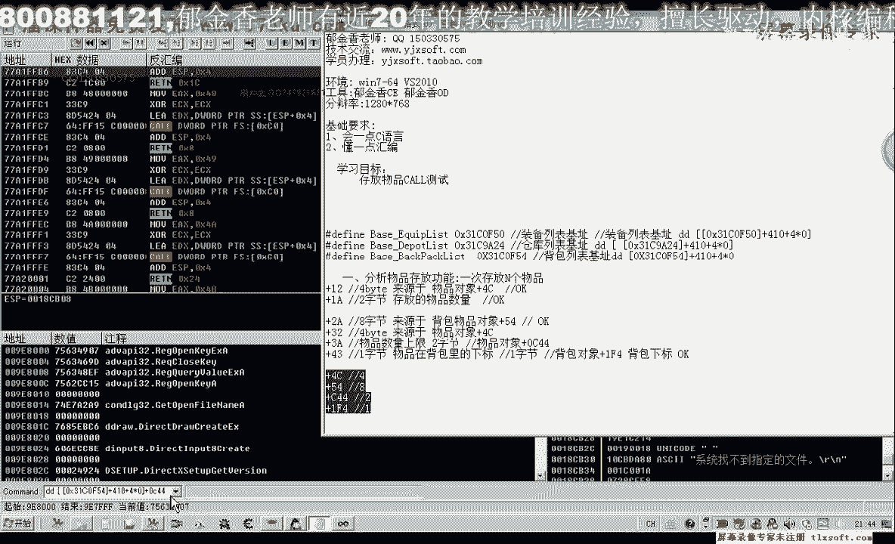
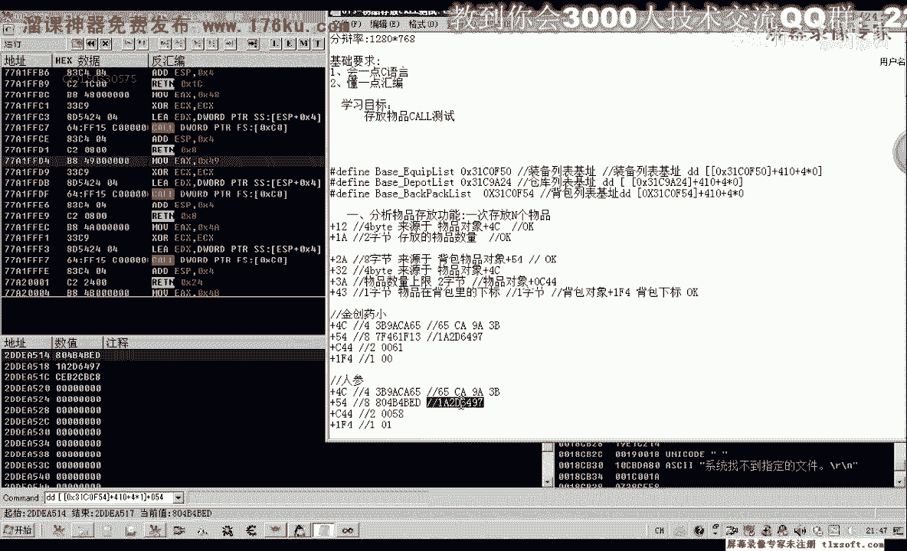

# 课程P62：073-物品存放CALL测试 🧪

在本节课中，我们将学习如何对游戏中的“物品存放CALL”进行手动测试。我们将通过修改内存参数，实现将背包中的不同物品（如金创药、人参）成功存入仓库。课程将详细讲解关键偏移地址的提取与修改方法。


---


上一节我们分析了物品存放CALL的缓冲区参数。本节中，我们来看看如何通过手动修改这些参数，来测试存放不同物品的功能。

首先，打开第70课的代码，并切换到主线程单元。本节课的目标是修改相关结构，以便存放背包中的其他物品。




我们需要关注几个关键的内存偏移地址，它们决定了存放哪个物品以及存放多少。


以下是需要提取和修改的关键数据偏移：


*   **物品对象偏移 `+0x4C` 处的4字节**：与物品ID相关。
*   **物品对象偏移 `+0x54` 处的8字节**：与物品身份相关。
*   **物品对象偏移 `+0xEA` 处的2字节**：代表要存放的物品数量。
*   **物品对象偏移 `+0x3A` 处的2字节**：代表物品的当前数量上限。
*   **背包下标偏移 `+0xEF` 处的1字节**：代表物品在背包中的位置。


为了方便提取参数，我们先用调试器附加到游戏进程，并手动读取这些值。


我们以“金创药小”为例进行首次测试。首先，读取其相关数据：


1.  **读取 `+0x4C` 偏移的4字节**：值为 `0x6C9A3B6C`（注意字节序）。
2.  **读取 `+0x54` 偏移的8字节**：值为 `0x1A2D6497` 和 `0x1A2D6497`（前后4字节相同）。
3.  **读取 `+0xEA` 偏移的2字节**：当前数量为97个（`0x0061`）。
4.  **背包下标**：第一个物品，下标为0。




接下来，我们修改代码中的参数，尝试存放2个金创药小。修改逻辑如下：


```cpp
// 假设 ecx 是物品对象基址
// 1. 写入存放数量 (偏移 +0xEA)
mov word ptr [ecx+0xEA], 0x0002

// 2. 写入当前数量上限 (偏移 +0x3A)，金创药小为97个
mov word ptr [ecx+0x3A], 0x0061

// 3. 写入物品ID相关数据 (偏移 +0x12)，来源于物品对象 +0x4C
mov dword ptr [ecx+0x12], 0x6C9A3B6C

// 4. 写入物品身份数据 (偏移 +0x2A 的8字节)，来源于物品对象 +0x54
mov dword ptr [ecx+0x2A], 0x1A2D6497 // 前4字节
mov dword ptr [ecx+0x2A+4], 0x1A2D6497 // 后4字节

// 5. 写入背包下标 (偏移 +0x43)
mov byte ptr [ecx+0x43], 0x00
```

修改完成后，编译并注入测试。成功的话，每执行一次，仓库会增加2个金创药小。

---

成功测试金创药小后，我们再来测试存放“人参”。关键区别在于物品ID和背包下标。

以下是“人参”的关键数据：

1.  **物品ID相关 (`+0x4C`)**：值为 `0x6C9A3B68`（与金创药差 `0x04`）。
2.  **物品身份数据 (`+0x54`)**：前4字节不同，后4字节相同。
3.  **背包下标**：第二个物品，下标为1。

因此，在代码中需要相应修改：
*   将写入 `+0x12` 偏移的4字节改为 `0x6C9A3B68`。
*   将写入 `+0x2A` 偏移的前4字节改为人参对应的值。
*   将写入 `+0x43` 偏移的下标改为 `0x01`。


再次测试，成功将人参存入仓库。

---

通过以上测试，我们发现几个关键点：
1.  物品ID相关数据（`+0x4C`, `+0x54`）和背包下标（`+0x43`）是决定存放哪个物品的关键。
2.  存放数量（`+0xEA`）可以自由指定。
3.  物品的当前数量上限（`+0x3A`）似乎不是关键校验数据，只要不小于存放数量即可。


---


本节课中我们一起学习了如何手动测试游戏中的物品存放CALL。我们提取并修改了关键的内存偏移地址，成功实现了存放金创药小和人参到仓库。关键步骤包括定位物品对象、读取关键数据、修改参数并注入测试。

下一节课，我们将把这些手动操作封装成一个通用的函数，以便更灵活地调用。

**课后作业**：
编写一个函数 `SaveItemToDepot`，实现以下功能：
*   **函数原型**：`bool SaveItemToDepot(const char* item_name, int count)`
*   **参数**：
    *   `item_name`: 要存放的物品名称。
    *   `count`: 要存放的数量。
*   **返回值**：
    *   存放成功返回 `true`。
    *   物品在背包中不存在则返回 `false`。
*   **前提条件**：调用此函数前，需要确保已打开游戏内的仓库界面。


这个函数将是我们第74课要实现的内容。