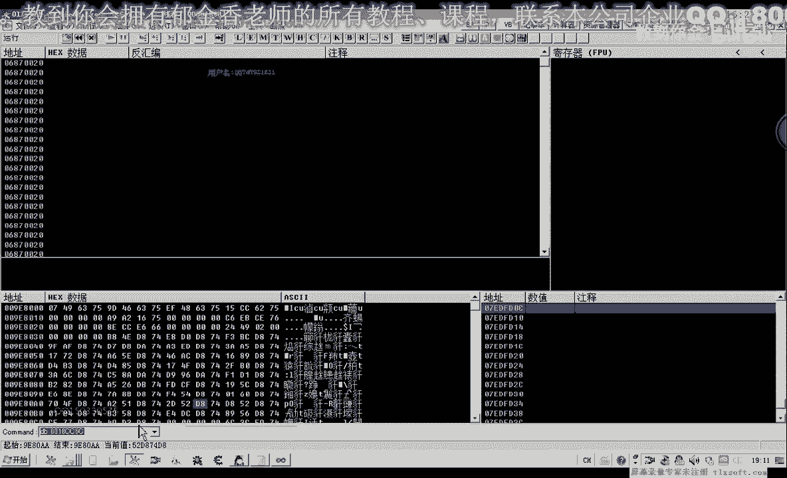
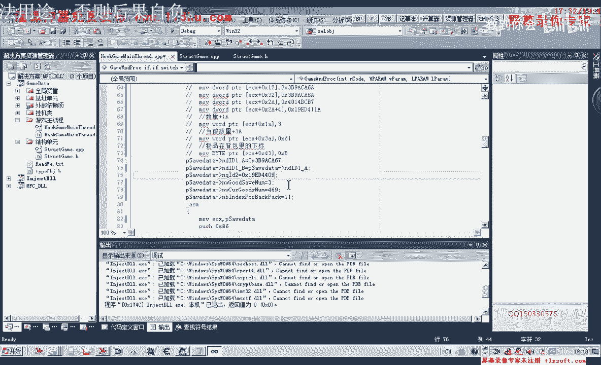
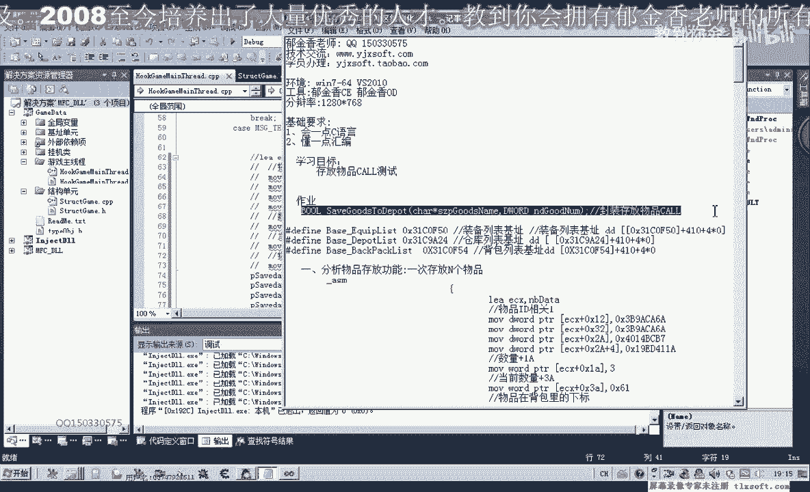

# 课程 P63：074-物品存放CALL缓冲区结构化 📦

在本节课中，我们将对上一节课的代码进行优化。我们将为存放物品的CALL定义结构，并为背包对象添加新的属性，以提高代码的可读性和结构化程度。

---

上一节我们介绍了物品存放的基本调用。本节中，我们来看看如何通过定义结构来优化代码。

首先，我们打开第73课的代码。

我们移动到结构单元，然后定位到背包对象。现在，背包对象新增了几个属性。

以下是新增的属性及其偏移量：

*   **偏移 4C**：这是一个四字节属性，可以命名为 `id1`。可以用 `int` 或 `DWORD` 类型表示。
*   **偏移 54**：这是一个八字节属性，可以命名为 `id2`。可以用 `DWORD` 数组或 `QWORD` 类型表示。
*   **偏移 C44**：这是一个已有的属性，表示物品数量。
*   **偏移 EF4**：这是一个一字节属性，表示背包下标。可以用 `char` 或 `BYTE` 类型表示。

添加好属性后，我们需要在背包的初始化函数中添加读取这些数据的代码。

以下是初始化代码的关键部分：

```c
// 读取 id1 (4字节)
背包对象->id1 = *(DWORD*)(背包基地址 + 0x4C);

// 读取 id2 (8字节)
背包对象->id2 = *(QWORD*)(背包基地址 + 0x54);

// 读取背包下标 (1字节)
背包对象->下标 = *(BYTE*)(背包基地址 + 0xEF4);
```

接下来，我们要定义一个结构体，用于组织存放物品CALL所需的缓冲区数据。这样做可以使代码更专业、更具可读性。

我们可以在结构单元文件的末尾添加这个结构体。

以下是该结构体的定义：

```c
#pragma pack(push, 1) // 1字节对齐，确保偏移准确
struct 存放物品缓冲区 {
    BYTE  未知数据1[0x16]; // 填充前0x16个字节
    DWORD id1;           // 偏移 0x16，对应背包对象的 id1
    DWORD 数量;          // 偏移 0x1A，要存放到仓库的数量
    DWORD 当前数量;      // 偏移 0x1E，物品的当前数量
    BYTE  未知数据2[0x20]; // 填充数据
    BYTE  背包下标;      // 偏移 0x3F，背包中的位置
    QWORD id2;           // 偏移 0x40，对应背包对象的 id2
    // ... 后续可能还有其他未知数据
};
#pragma pack(pop)
```

定义好结构体后，我们就可以在主线程单元的代码中进行优化了。

以下是优化后的赋值逻辑：

```c
// 创建缓冲区结构体实例并赋值
struct 存放物品缓冲区 缓冲区数据;

缓冲区数据.id1 = 背包对象->id1; // 设置 id1

// 组合 id2 (来自背包对象偏移 0x54 的8字节数据)
缓冲区数据.id2 = ((QWORD)高四字节 << 32) | 低四字节;

缓冲区数据.数量 = 3;           // 设置本次要存放的数量，例如3个
缓冲区数据.当前数量 = 背包对象->数量; // 设置物品当前数量
缓冲区数据.背包下标 = 背包对象->下标; // 设置背包下标

// 调用存放物品CALL，直接传入结构体指针
存放物品CALL(&缓冲区数据);
```


这种使用结构体的方法，明显比直接操作原始字节的代码具有更高的可读性，尽管两者的实际功能完全相同。选择哪种方法取决于你的个人偏好。



现在，让我们测试优化后的代码。


我们挂接程序到主线程并进行测试。假设当前物品（例如“金疮药(大)”）数量为469。

每次按下测试按钮，代码会尝试存放指定数量（例如11个）的物品到仓库。




以下是测试过程的要点：

1.  确认背包中目标物品的 `id1`、`id2` 和下标值。
2.  运行程序，点击测试按钮。
3.  观察游戏中该物品的数量是否按预期减少，并成功存入仓库。


测试成功后，可以看到物品数量从469开始递减，证明我们的结构化调用是有效的。


---

本节课中，我们一起学习了如何通过定义结构体来优化物品存放CALL的缓冲区操作。我们为背包对象添加了必要属性，并创建了一个清晰的结构来描述调用参数，从而提升了代码的可维护性和可读性。



下一节课，我们将进一步封装这个功能，将其完善成一个独立的、可复用的函数。