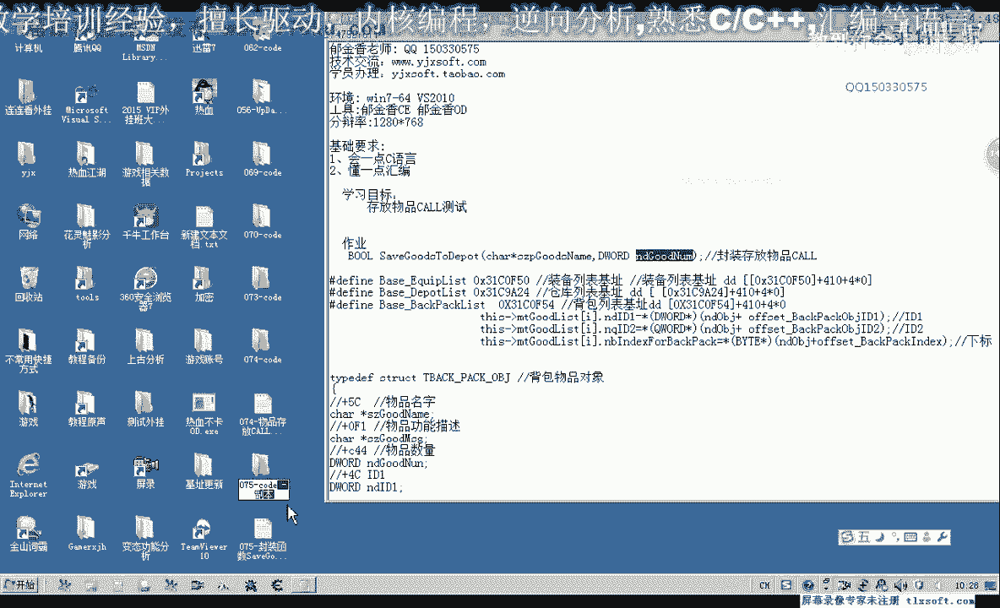
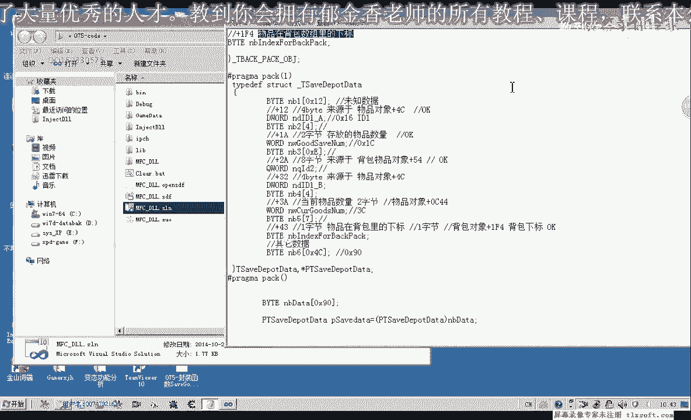

# 课程 P64：075-封装函数 SaveGoodsToDepot 🧳➡️🏚️


在本节课中，我们将学习如何封装一个名为 `SaveGoodsToDepot` 的函数。这个函数的功能是将背包中的指定物品存放到仓库中。我们将基于第74课的代码进行构建，并确保函数能够正确获取物品属性、处理异常，并最终完成物品的转移操作。


---



## 函数功能与参数说明


上一节我们介绍了函数的基本概念，本节中我们来看看 `SaveGoodsToDepot` 函数的具体职责。

该函数接收两个参数：
1.  `goodsName`：背包中物品的名称。
2.  `count`：要存放到仓库的物品数量。

函数的目标是找到背包中名为 `goodsName` 的物品，并将指定 `count` 数量的该物品移动到仓库。

---

## 代码实现步骤

接下来，我们将分步实现这个函数。首先需要打开第74课的代码，并在背包结构单元中添加新的成员函数。

### 1. 添加成员函数

在背包的结构单元中，添加 `SaveGoodsToDepot` 作为成员函数。为其添加适当的前缀以便于代码管理和复制。

### 2. 获取物品下标与属性

要操作物品，首先需要获取它在背包数组中的位置（下标）以及其他关键属性。

以下是获取物品下标的代码示例：
```pascal
itemIndex := GetGoodsIndexForName(goodsName);
```
我们通过调用现有的 `GetGoodsIndexForName` 函数来获取下标。如果函数返回 `-1`，则表示背包中没有该物品，此时应返回 `False` 并可能输出调试信息。

如果成功获取下标（`itemIndex >= 0`），我们就可以通过背包对象数组访问该物品的详细信息。

### 3. 准备调用数据

获得下标后，需要提取调用仓库存储功能所需的具体数据。

所需数据包括：
*   **物品ID1**：`backpackList[itemIndex].id1`
*   **物品ID2**：`backpackList[itemIndex].id2`
*   **当前数量**：`backpackList[itemIndex].currentCount`
*   **物品下标**：`itemIndex`

其中，要存储的数量由参数 `count` 直接提供。

### 4. 调用主线程存储功能并处理异常

核心的存储操作需要调用主线程中的一段特定代码。我们将那段代码复制到新函数中。

为了保证代码的健壮性，使用 `try...except` 块进行异常处理。

以下是包含异常处理的调用框架：
```pascal
try
  // 调用主线程的仓库存储代码
  CallDepotSave(id1, id2, count, itemIndex);
  Result := True; // 操作成功
except
  on E: Exception do
  begin
    PrintDebugInfo('保存到仓库时出错: ' + E.Message);
    Result := False; // 操作失败
  end;
end;
```

### 5. 编译与修正错误

完成代码编写后，进行编译。编译器可能会提示一些错误，例如成员变量名不匹配。我们需要根据提示逐一修正这些错误，例如将 `itemCount` 修正为 `currentCount`。

---

## 测试函数功能

编译成功后，我们需要对函数进行测试，以确保其按预期工作。

### 测试准备

回到主线程单元，将之前用于测试的旧代码注释掉。然后，直接调用新封装的 `SaveGoodsToDepot` 函数进行测试。


以下是测试调用示例：
```pascal
// 示例：将3个名为“人参”的物品存入仓库
SaveGoodsToDepot('人参', 3);
```



### 执行测试

打开游戏，并将脚本挂接到游戏主线程。执行测试代码，观察背包中“人参”的数量是否减少了3个，同时仓库中是否增加了3个“人参”。可以尝试不同的物品名称和数量进行多次测试，以验证函数的通用性和稳定性。

---

## 课后作业与扩展

本节课我们一起学习了如何封装 `SaveGoodsToDepot` 函数。为了使其更易于在主线程以外的其他上下文中调用，建议完成以下扩展练习：

**课后作业**：封装一个MS级的函数，将 `SaveGoodsToDepot` 挂接到主线程。这个新函数应接收相同的参数（`goodsName` 和 `count`），并在内部调用我们今天实现的成员函数。这能提供一个更清晰、更安全的接口供外部代码使用。

---


本节课中，我们逐步实现了将背包物品存入仓库的封装函数，涵盖了从获取数据、调用核心功能到异常处理和测试的完整流程。通过这个练习，你应该对如何封装一个具有实际功能的函数有了更深入的理解。