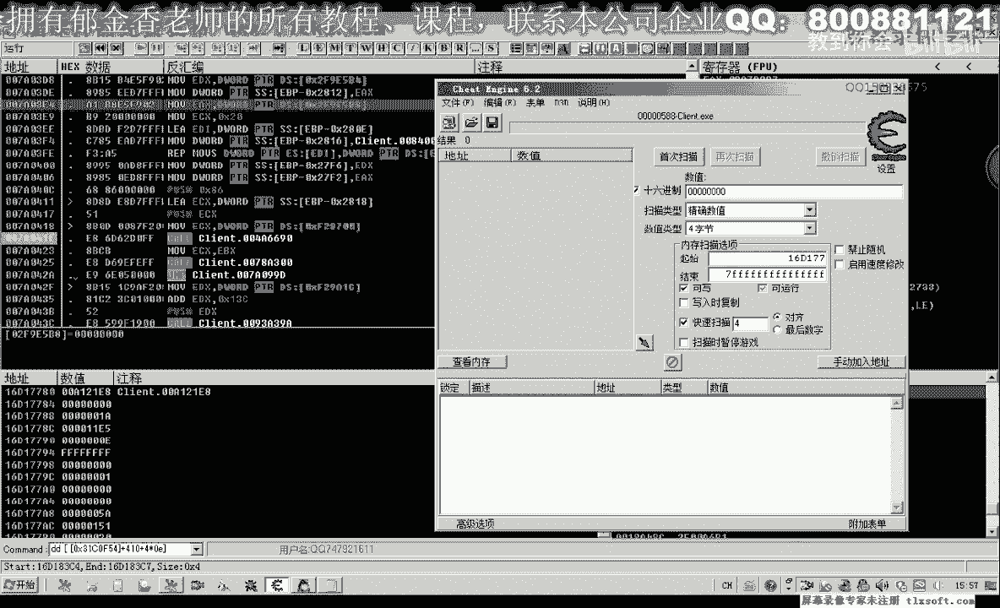
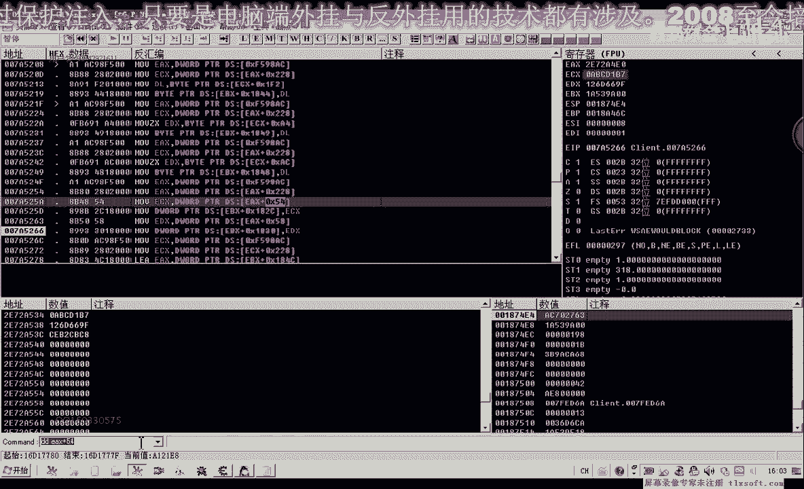
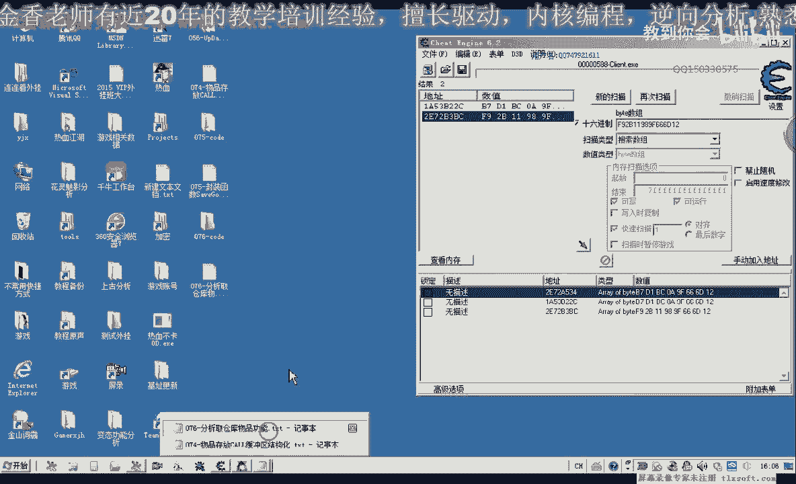

# 课程 P65：076 - 分析仓库取物功能 📦➡️🎒


在本节课中，我们将分析从游戏仓库中取出物品的功能。我们将通过逆向工程，对比存放物品的数据包，找出取物功能的关键数据结构和指令，并对上一节课的代码进行必要的修改和补充。

## 概述与准备工作

上一节我们分析了存放物品到仓库的功能。本节中，我们来看看如何从仓库取出物品。首先，我们需要对第75课的代码进行修改，因为当时没有为存放物品的相关发包机制进行定义。现在我们来补上这部分。

首先，在代码的机制单元中，添加一个向服务器发送数据包的函数。然后，转到结构单元，用新定义的机制替换上一节课所写函数的相关部分。最后，重新编译并保存代码。

## 使用OD附加游戏进行分析

现在，我们使用OD（OllyDbg）附加到游戏进程，开始分析取物功能。

1.  在游戏中，尝试从仓库取出一个物品，输入数量，但在点击确认按钮**之前**，先在OD中下一个断点。
2.  点击确认后，程序会断下。首次断下的通常是心跳包，我们忽略它，继续运行。
3.  当再次断下时，才是我们要找的取物数据包。此时，取消断点，并执行到返回（`Ctrl+F9`）。
4.  我们发现，取物功能的调用返回到了与存物功能相同的地方。这表明存放和取出物品可能使用的是同一个函数入口。

## 对比存取物品的数据包



为了找出差异，我们需要对比存放和取出物品时，数据缓冲区的内容。

以下是分析取物数据包的关键步骤：

1.  让游戏继续运行，我们为这个函数命名为“存取仓库物品”。
2.  再次尝试从仓库取出一个物品（例如人参）。
3.  由于机制变化，ECX寄存器可能已改变，我们通过查看栈地址（如 `ESP+4` 或 `EBP-2818`）来定位缓冲区数据。假设地址是 `18A488`。
4.  查看该地址开始的数据，直到 `0x90`（数据包结束标志）。这是取物时的数据。
5.  接着，我们存放11个人参到仓库，并查看存放时的数据。

通过对比，我们发现取物数据包比存物数据包更简单。关键差异在于几个特定的4字节数据段。

## 识别关键数据字段

通过多次存放和取出不同物品（如人参、金创药），我们对比数据包，可以识别出以下关键字段：

*   **存取指令**：数据包中有一段4字节数据，在存放和取出时完全不同，但同一种操作下是固定的。
    *   存放物品指令（十六进制）：`24 17 0C 2B`
    *   取出物品指令（十六进制）：`A4 B3 C6 B2`
*   **物品真实ID**：另一段4字节数据，随物品不同而变化，但在同一次存取操作中保持不变。
*   **物品数量**：表示本次操作涉及的数量。
*   **来源对象偏移**：数据包中的 `0x12` 偏移处的4字节，来源于物品对象的 `+0x4C` 偏移。
*   **对象标识数据**：数据包中的8字节数据，在取物时来源于仓库物品对象的 `+0x54` 偏移；在存物时则来源于背包物品对象的相同偏移。

以下是数据包结构的核心部分示意（以取物为例）：

```cpp
struct TakeItemPacket {
    DWORD opCode;        // 操作码，例如 0xB2C6B3A4 (取物)
    DWORD itemRealId;    // 物品真实ID
    WORD  count;         // 本次操作数量
    DWORD unk_12;        // 来源于物品对象+0x4C
    BYTE  objData[8];    // 来源于仓库物品对象+0x54
    DWORD currentStock;  // 仓库中该物品当前剩余数量
    BYTE  gridIndex;     // 物品在仓库格子中的下标
    // ... 其他字段
};
```

## 确定数据来源



为了验证 `objData[8]` 的来源，我们在OD中搜索取物数据包中的这8个字节。

1.  计算仓库中某物品（如人参）的对象地址。
2.  在内存中搜索该8字节序列。
3.  搜索结果指向一个地址，通过检查该地址附近的数据（如 `+0x44` 偏移处的物品数量），确认它正是仓库物品列表中的对象地址。

这证实了我们的判断：**取物时，数据来源于仓库物品对象；存物时，数据则来源于背包物品对象**。对象不同，但它们在各自容器中的数据结构是相似的。



## 总结与下节预告


本节课中，我们一起学习了如何分析从仓库取出物品的功能。

我们通过OD动态调试，对比了存取操作的数据包，识别出了代表“存放”和“取出”的**固定指令码**，并明确了数据包中关键字段（如物品ID、数量、对象数据）的来源。最重要的是，我们区分了存物和取物时操作的对象源不同（背包 vs 仓库），但数据包主体结构一致。

下一节课，我们将根据本节课的分析结果，修改和完善代码中的相关结构定义，并编写测试功能来验证我们的实现是否正确。

好的，我们下期再见。