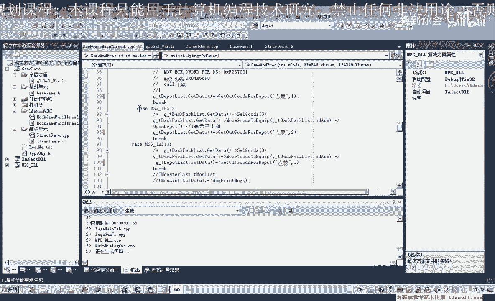
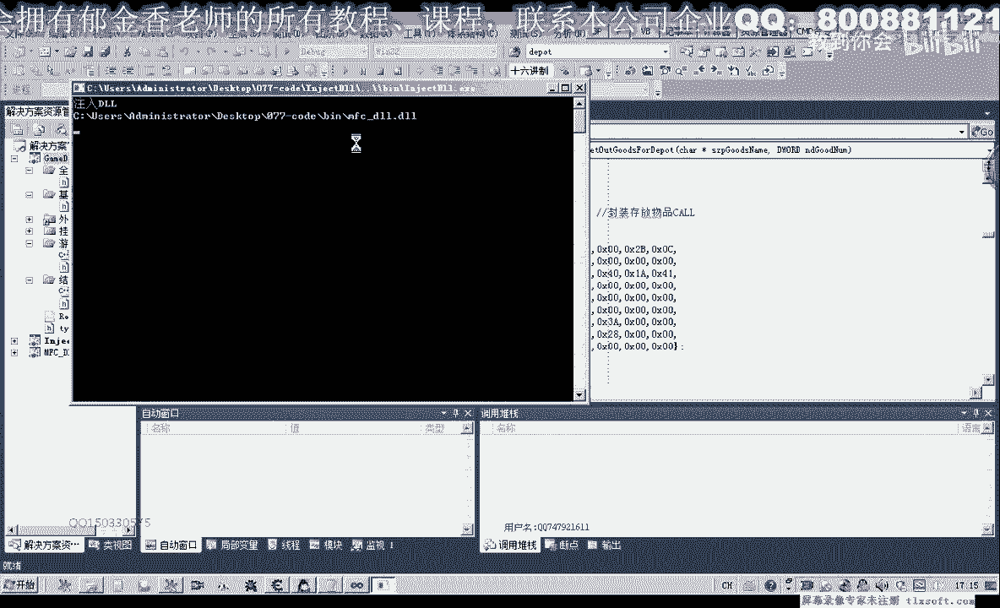
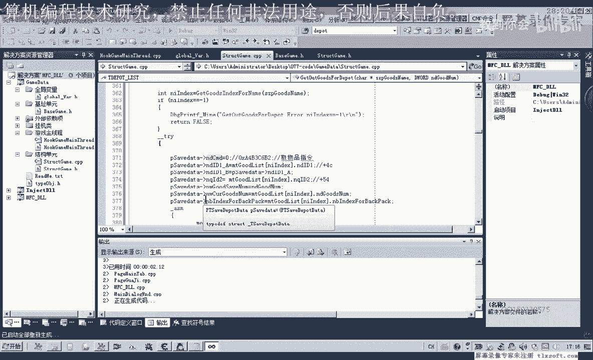
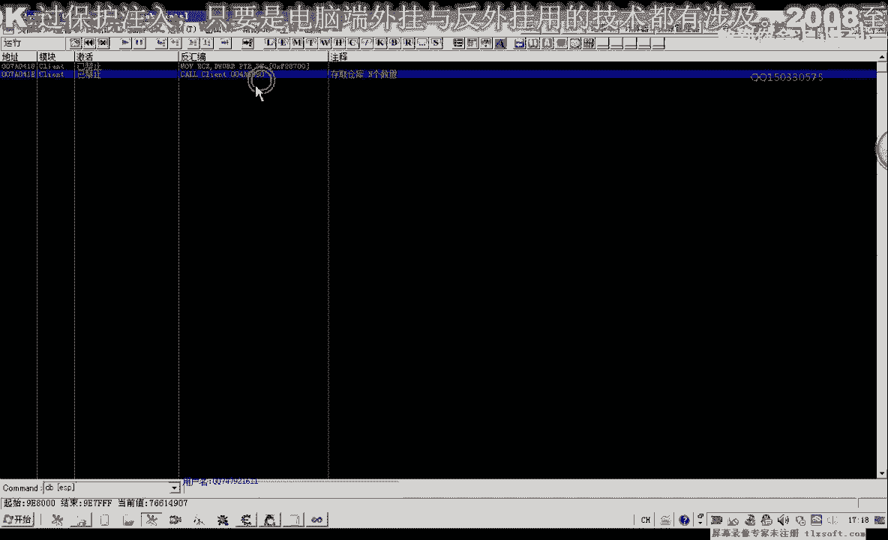

# 课程 P66：077-封装仓库列表结构及取仓库物品函数 📦➡️🎒

## 概述
在本节课中，我们将学习如何封装仓库列表的数据结构，并实现一个从仓库中取出物品的函数。这是实现自动化仓库管理功能的重要一步。

---


## 封装仓库列表结构


上一节我们分析了从仓库取物品的功能逻辑。本节中，我们来看看如何为仓库数据定义合适的数据结构，以便后续操作。

首先，我们需要修改缓冲区结构。根据上一节课的分析，从偏移 `0x0C` 开始的四个字节很可能是一个用于区分“存”或“取”动作的指令。

因此，我们在结构定义中，将缓冲区的前12个字节保留为未知数据，然后定义四个字节来存放这个指令。

**代码示例：缓冲区结构**
```pascal
TBufferStruct = packed record
  Unknown1: array [0..$B] of Byte; // 前12个未知字节
  Command: Cardinal;               // 存取指令 (偏移 0x0C)
  // ... 其他字段
end;
```
其中，存放物品和取出物品会使用不同的 `Command` 值来区分。

修改并保存结构后，接下来需要定义仓库列表本身的结构。我们发现，仓库内物品对象的偏移和类型（`0xEA`）与背包物品对象完全一致。

**代码示例：仓库列表结构**
```pascal
// 背包物品对象（复用）
TItemObject = packed record
  // ... 物品相关字段（如ID、数量等）
end;

// 仓库列表结构
TDepotList = packed record
  Items: array [0..59] of TItemObject; // 仓库共60格
end;
```
由于对象类型相同，我们可以复用背包的物品对象结构来定义仓库列表。仓库大小为60格。

---



## 初始化仓库列表


定义好结构后，我们需要一个初始化函数来获取仓库列表的指针。

以下是初始化函数的实现步骤，我们仿照背包列表的初始化代码进行编写。

**代码示例：初始化仓库列表**
```pascal
function GetDepotList: Pointer;
var
  ListPtr: PCardinal;
begin
  // 通过游戏内固定地址或调用获取列表指针
  ListPtr := PCardinal($GameBase + $DepotListOffset);
  if (ListPtr <> nil) and (PCardinal(ListPtr^ + $TypeOffset)^ = $EA) then
    Result := Pointer(ListPtr^ + $ItemStartOffset)
  else
    Result := nil;
end;
```
此函数会验证指针有效性并返回仓库物品数组的起始地址。

---

## 实现取物品功能函数

初始化工作完成后，我们就可以实现核心的“从仓库取物品”函数了。

以下是该函数的关键步骤，它需要构建一个包含正确指令的缓冲区，并发送给游戏服务器。

**代码示例：从仓库取物品**
```pascal
function TakeItemFromDepot(ItemIndex: Integer; Count: Integer): Boolean;
var
  Buffer: TBufferStruct;
begin
  Result := False;
  // 1. 初始化缓冲区
  FillChar(Buffer, SizeOf(Buffer), 0);
  
  // 2. 设置指令：取出物品（例如 0x5）
  Buffer.Command := $5;
  
  // 3. 设置要操作的物品下标和数量
  Buffer.ItemIndex := ItemIndex;
  Buffer.ItemCount := Count;
  
  // 4. 调用游戏发包函数
  if SendPacket(@Buffer, SizeOf(Buffer)) then
    Result := True;
end;
```
函数会填充缓冲区，其中 `Command` 字段用于告诉服务器这是“取”操作，然后发送数据包。

---





## 功能测试与调试


编写完代码后，必须进行测试以确保功能正常工作。我们通过注入动态链接库(DLL)并调用函数来测试。

测试过程中，我们使用调试器（如OD）下断点，观察发送的数据包是否与游戏正常操作时发出的包一致。



**调试发现的问题与解决：**
1.  **首次测试失败**：发送包后游戏提示“无法转移物品”。
2.  **对比数据包**：通过OD截取游戏正常“取物品”操作的数据包，与我们代码发送的包进行对比。
3.  **发现差异**：正常数据包中，`Command` 字段后的某些字节（可能是另一个分类标识）与我们预设的不同。正常“取”操作为 `5`，“存”操作为 `3`。
4.  **修正代码**：根据分析结果，修正 `Buffer` 结构中相应字段的值，最终测试成功。

这个调试过程强调了逆向工程中对比验证的重要性。

---

## 总结

本节课中我们一起学习了：
1.  **封装数据结构**：定义了用于仓库操作的缓冲区和仓库列表结构。
2.  **初始化指针**：编写了获取仓库列表地址的初始化函数。
3.  **实现核心功能**：完成了从仓库取出指定数量物品的函数 `TakeItemFromDepot`。
4.  **测试与调试**：通过实际测试和调试，修正了数据包中的关键指令字段，确保了功能的正确性。


通过本课，我们掌握了封装游戏数据和实现基础交互功能的方法，这是构建更复杂自动化工具的基础。下一节课，我们可以在此基础上实现存放物品、整理仓库等更多功能。