# 课程 P67：078-物品购买功能分析 🛒

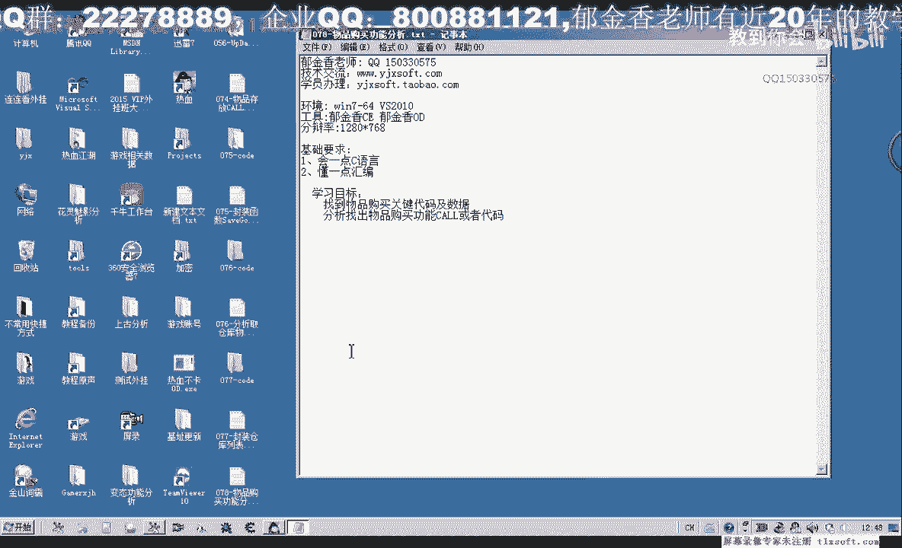

在本节课中，我们将学习如何分析游戏中的物品购买功能。我们将通过逆向工程的方法，定位购买物品时发送给服务器的数据包，并解析其数据结构，最终实现一个可以调用购买功能的代码片段。

---

## 概述

物品购买是游戏中的常见功能。当玩家与NPC交互并选择购买物品时，客户端会向服务器发送一个数据包。本节课的目标是找到这个数据包的发送函数，分析其数据结构，并理解各个字段的含义。

上一节我们介绍了逆向分析的基本思路，本节中我们来看看如何具体分析购买物品的数据包。

---

## 定位购买物品的数据包发送函数

首先，移动到NPC处并打开商店。选择购买物品（例如“金创药小”）并点击确认。此时，游戏客户端会向服务器发送购买请求。

为了分析这个请求，我们需要在发包函数处设置断点。通过调试发现，点击确认按钮后，程序会中断在一个特定的函数调用处。这个函数负责处理购买物品的逻辑。

以下是定位到的关键函数调用：

```assembly
; 示例调用指令
call dword ptr [eax+0x28]
```

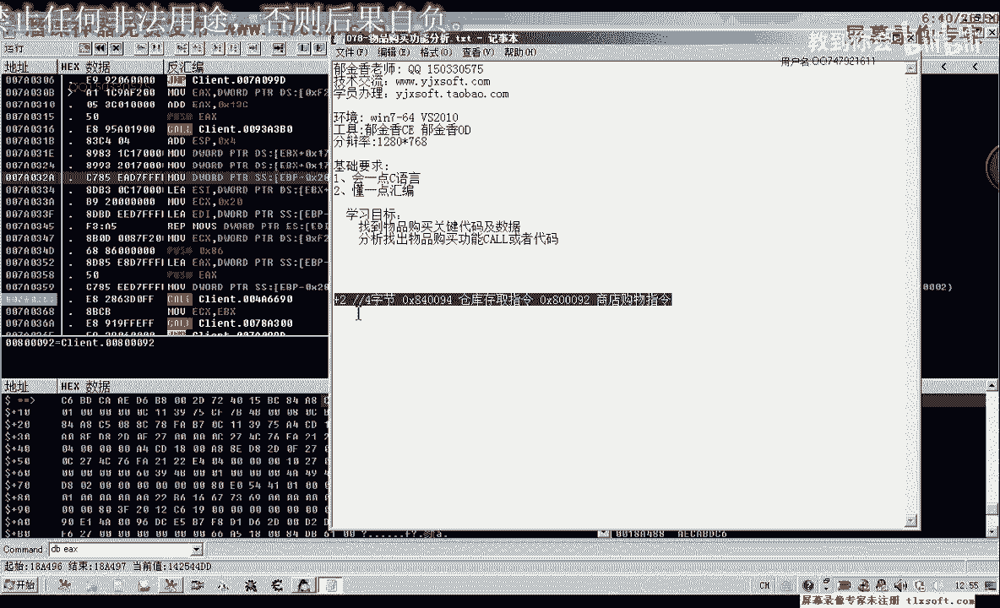

在这个调用之前，程序会准备一个缓冲区，其中包含了购买物品所需的所有信息。

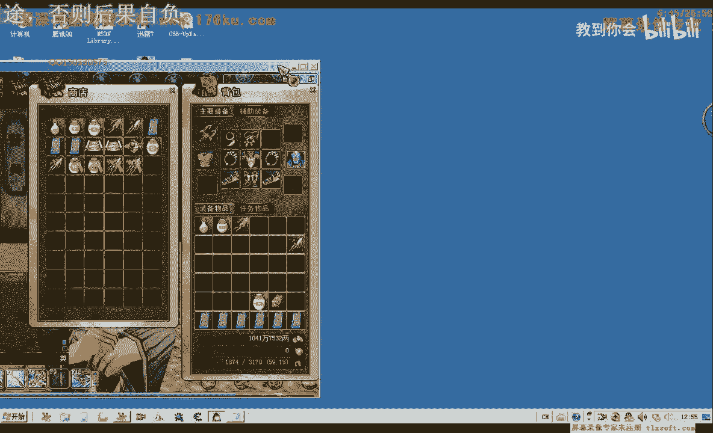

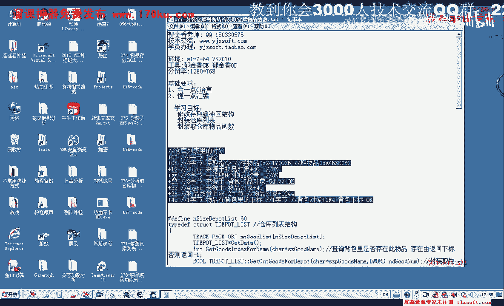

---

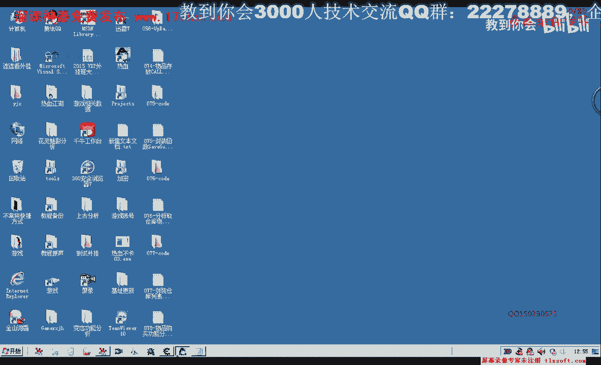

## 分析购买物品的数据结构

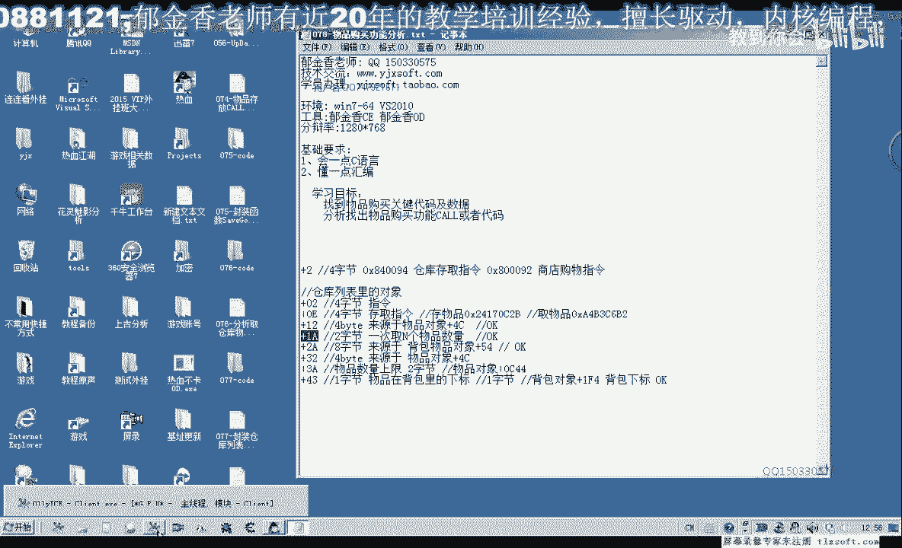

取消断点后，让程序继续运行，然后再次触发购买。程序会中断在同一个位置。此时，我们可以检查传递给函数的缓冲区内容。

通过分析缓冲区数据，我们发现其结构如下：

```
+0x00: 指令码 (4字节)
+0x04: 未知字段 (4字节，常为0x01)
+0x08: 物品ID (4字节)
+0x0C: 物品数量低位 (2字节)
+0x0E: 物品数量高位 (2字节)
+0x10: 后续数据...
```

以下是缓冲区数据的示例：

```
00 00 00 09  // 指令码
01 00 00 00  // 未知字段，常为1
B7 A3 A9 4A  // 物品ID (例如金创药小)
07 00 00 00  // 物品数量 (7个)
...          // 其他数据
```

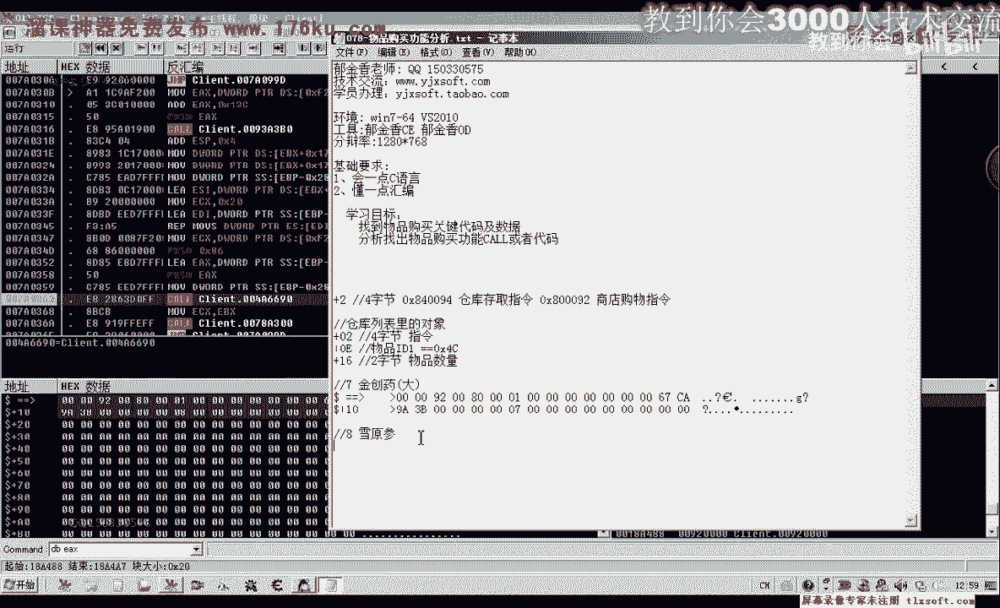

通过对比购买不同物品和不同数量时的缓冲区，我们确认了物品ID和数量字段的位置。指令码用于区分操作类型（例如购买、出售、存入仓库等）。

---

## 与仓库操作数据结构的对比

之前分析仓库存取物品时，也遇到了类似的数据结构。两者都使用相同的函数进行处理，但通过指令码来区分具体操作。

仓库存取物品的缓冲区结构如下：

```
+0x00: 指令码 (例如0x12表示存入)
+0x04: 物品ID
+0x08: 物品数量
...
```

购买物品的指令码不同，并且缓冲区中多了一个常为`0x01`的字段。这可能是用于标识操作来源或类型。

---

## 出售物品数据结构的初步观察

为了更全面地理解，我们也尝试分析了出售物品的数据包。发现出售物品的缓冲区更长、更复杂，可能包含了物品存在性验证等信息。

出售物品的指令码与购买不同，并且其数据结构不能简单地用购买物品的结构清零后复用。这表明出售逻辑可能包含额外的检查步骤。

由于出售物品的分析更为复杂，我们将在下一节课中详细讨论。本节课我们专注于购买功能。

---

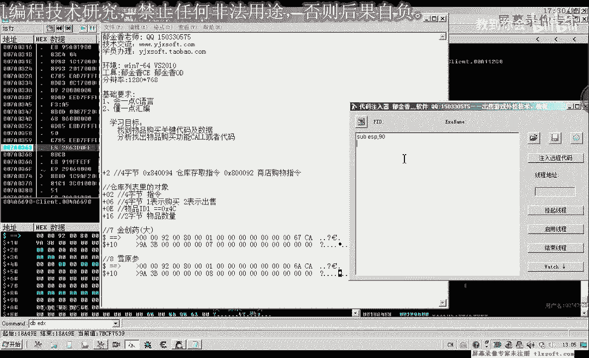

## 实现购买物品的代码

根据以上分析，我们可以编写代码来模拟购买物品的操作。以下是使用汇编语言实现的示例：

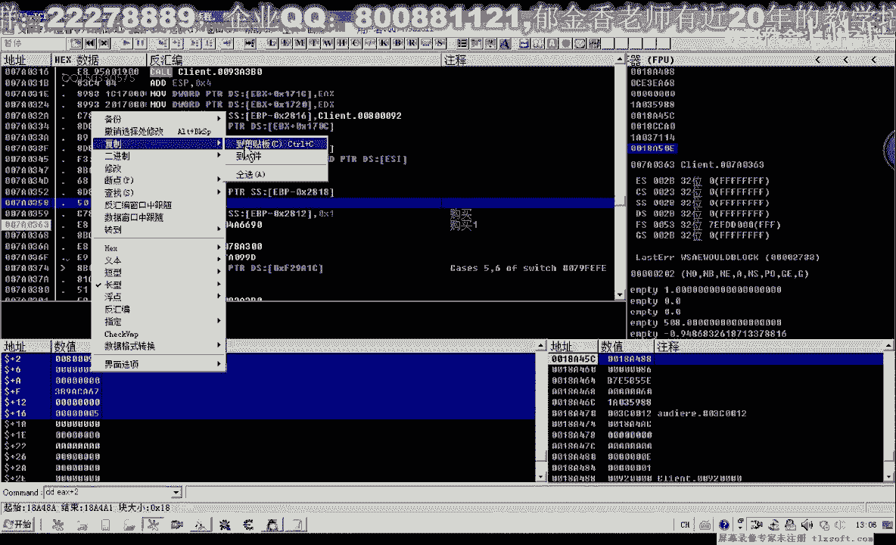

```assembly
; 分配缓冲区空间
sub esp, 0x90

; 设置缓冲区数据
mov eax, [ebp-0x2818]
mov dword ptr [eax+0x00], 0x09000000  ; 指令码
mov dword ptr [eax+0x04], 0x01000000  ; 未知字段
mov dword ptr [eax+0x08], 0x4AA9A3B7  ; 物品ID (金创药小)
mov dword ptr [eax+0x0C], 0x0C000000  ; 物品数量 (12个)

; 调用发包函数
push 0x86
push eax
call dword ptr [0xXXXXXXXX]  ; 替换为实际函数地址

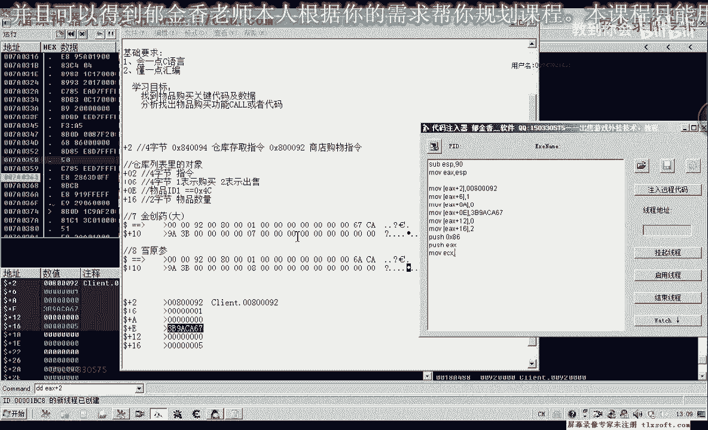

; 释放缓冲区空间
add esp, 0x90
```

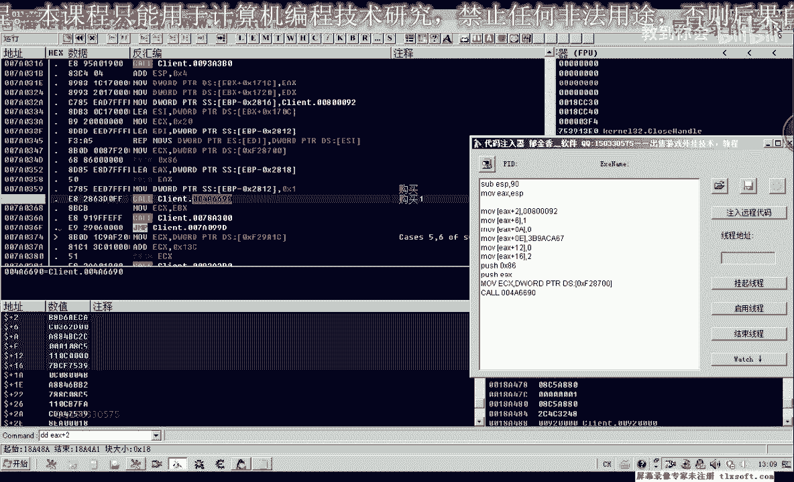

将上述代码注入游戏并执行，可以成功购买指定数量的物品。这验证了我们对数据结构的分析是正确的。

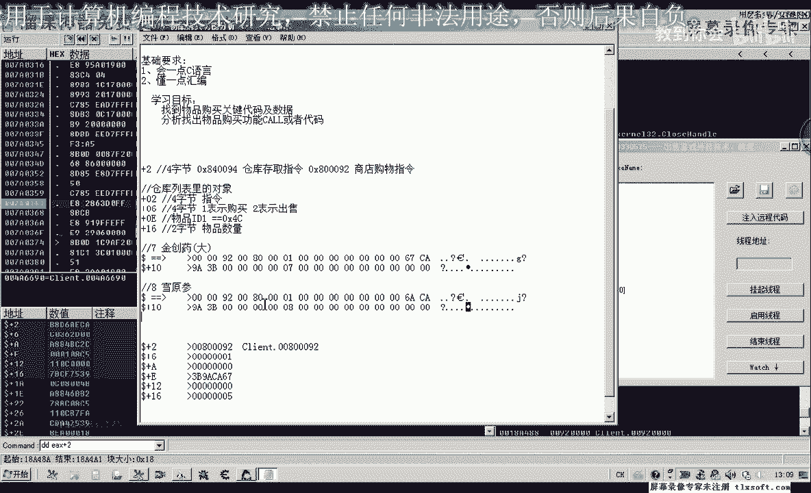

---

## 作业与下节预告

本节课我们分析了购买物品的数据包结构并实现了购买功能。然而，目前的实现依赖于硬编码的物品ID，这在实际使用中并不方便。

以下是本节课的作业：

1.  **结构化缓冲区**：将购买物品的缓冲区定义为一个清晰的结构体。
2.  **封装函数**：尝试将购买逻辑封装成一个可调用的函数。
3.  **寻找物品列表**：为了动态获取物品ID，需要找到游戏中商店物品列表的数据结构。

在下一节课中，我们将：
*   详细分析出售物品的数据结构。
*   寻找并解析商店的物品列表。
*   封装一个完整的物品购买函数，使其可以通过物品名称和数量进行调用。

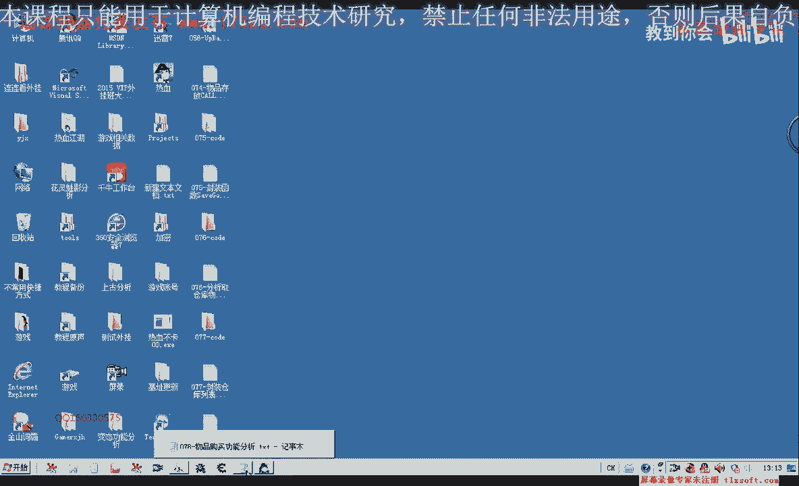

---

## 总结

本节课中我们一起学习了如何逆向分析游戏中的物品购买功能。我们定位了关键的数据包发送函数，解析了购买数据包的结构，并通过编写代码成功模拟了购买操作。理解这些底层数据交互是进行游戏功能修改和自动化的重要基础。

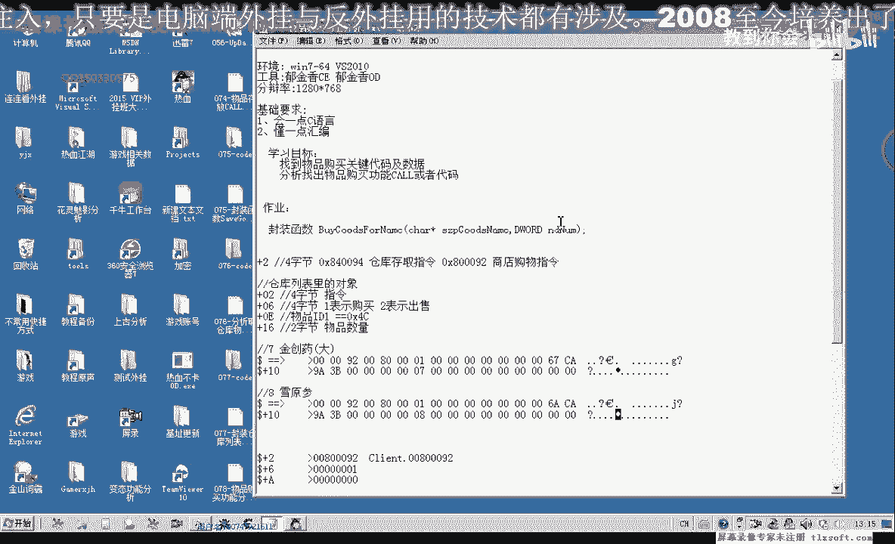

通过动手实践，我们不仅巩固了逆向分析的方法，也为后续更复杂的功能实现打下了基础。