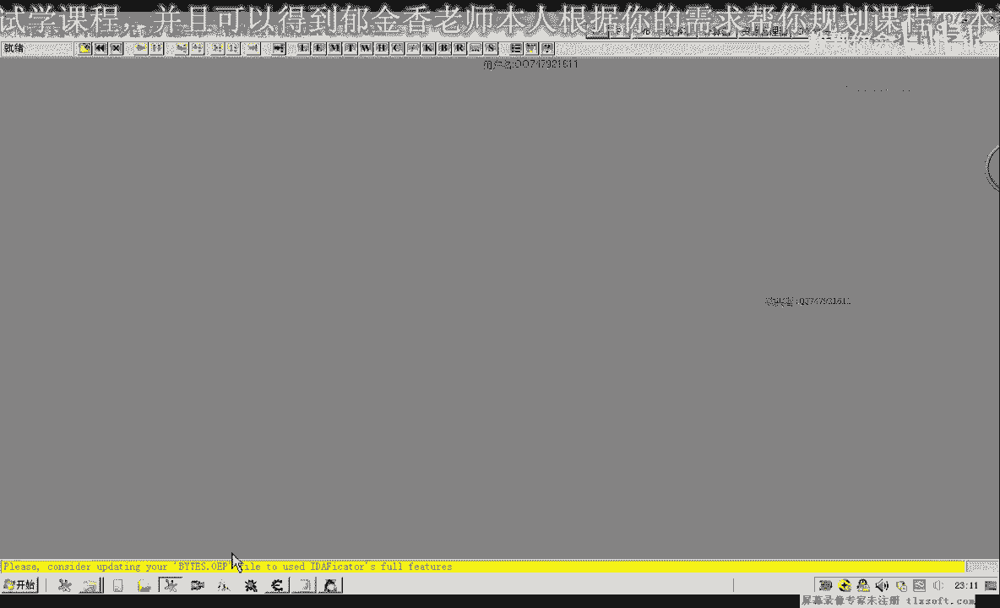
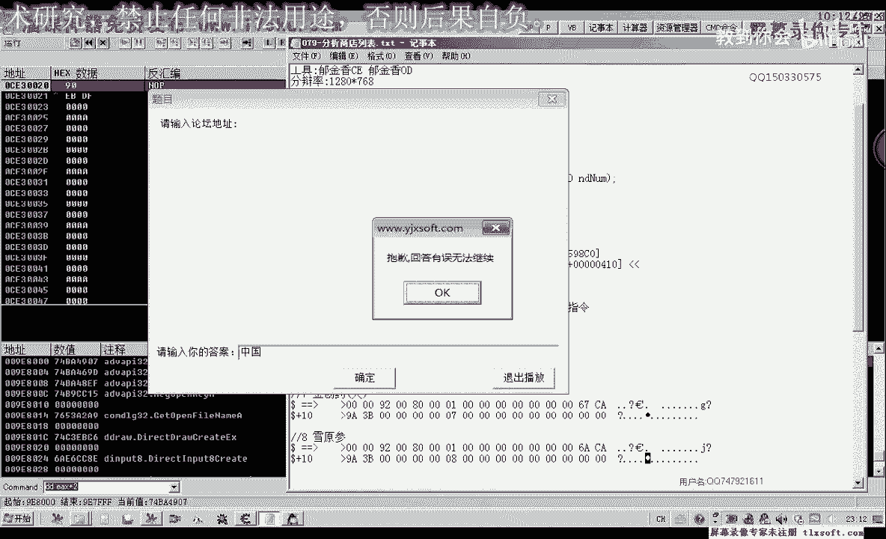
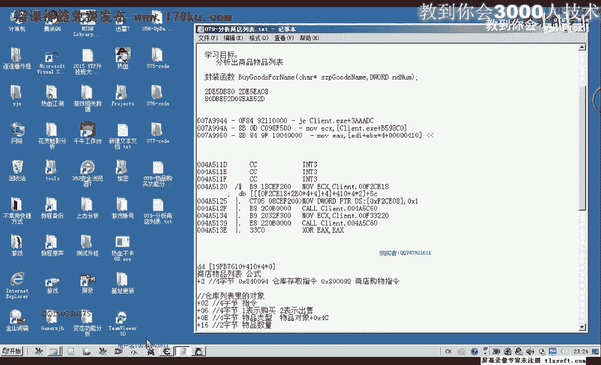
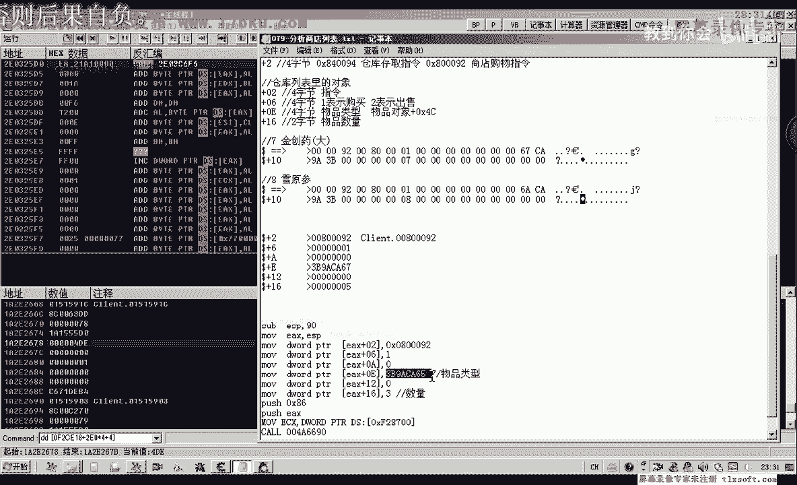

# 课程 P68：079-分析商店列表 📚

在本节课中，我们将学习如何分析游戏中的商店物品列表。我们将通过逆向工程的方法，找到存储商店物品数据的地址和访问公式，为后续实现自动化购买功能打下基础。

---

## 回顾与目标 🎯

上一节我们分析了物品购买功能的数据结构，其中偏移 `0x01` 处用于表示物品的类型（Item Type）。物品类型用4个字节表示，这与仓库中表示唯一物品ID的8个字节不同。

本节中，我们将重点分析商店物品列表对象。我们的目标是找到一个稳定的公式或地址，能够准确读取商店中每个物品的类型编号。

---

## 分析思路 💡

商店物品列表的分析方式与我们之前分析背包列表类似，可以从一个关键数据作为突破口。这个关键数据就是当我们选中商店中某个物品时，游戏会写入内存的特定地址。

以下是分析步骤：

1.  **定位选中物品的地址**：首先，我们需要找到当玩家选中商店物品时，游戏写入的对象地址。这个地址通常是一个基址加上一个固定偏移。
2.  **搜索物品列表**：利用两个不同但相邻的物品对象地址，在内存中搜索包含它们的字节数组，从而定位到物品列表的起始地址。
3.  **推导访问公式**：通过分析访问列表的汇编代码，推导出通过下标（Index）访问列表中特定物品对象的完整公式。
4.  **验证公式稳定性**：重启游戏，验证推导出的公式中的偏移量是否固定不变。

---

## 详细分析过程 🔍


### 第一步：定位选中物品的地址




通过之前的分析，我们知道选中技能或物品时，会向一个特定地址写入数据。这个地址的计算公式为：
`基址 + 0x28`



在本次游戏版本中，我们找到了最新的基址。通过测试，确认选中商店物品时，访问的是同一个基址。例如，选中“金创药(小)”时，其对象地址可以通过 `基址 + 0x5C` 访问到名字信息。

### 第二步：搜索物品列表

为了找到存储这些物品对象的列表，我们可以搜索连续的两个物品对象地址。

以下是具体操作：
1.  记下“金创药(小)”的对象地址：`0x80DBDE52D`
2.  记下“金创药(中)”的对象地址：`0x081A12D`
3.  在内存中搜索包含这两个地址的字节数组（注意字节序，需从低位到高位排列）。
4.  搜索到的结果很可能就是商店物品列表的相对地址。

### 第三步：推导访问公式

通过分析访问上述列表地址的汇编代码，我们可以推导出完整的访问公式。

代码分析显示，物品对象的地址通过以下方式计算：
`[[[基址] + 0x210*4 + 4] + 0xE670] + 0x410 + 4 * 下标`

其中：
*   `[[基址] + 0x210*4 + 4]` 计算出一个中间地址。
*   `+ 0xE670` 是从该中间地址读取出的另一个基址。
*   `+ 0x410` 是商店列表的起始偏移。
*   `+ 4 * 下标` 用于定位列表中的特定物品。下标从0开始。
*   最终地址指向一个物品对象。在该对象中，偏移 `+0x4C` 处存储的4字节数据即为**物品的类型编号**。

### 第四步：验证公式


为了确保公式的可靠性，我们进行了以下验证：
1.  使用公式计算不同下标对应的地址，确认能正确读出“金创药(小)”、“金创药(中)”、“回城卷轴”等物品。
2.  退出并重启游戏，重新附加进程。
3.  再次使用相同的公式和基址进行计算，确认仍能正确访问商店列表中的物品。

验证结果表明，在当前游戏版本中，该公式是稳定有效的。公式中的偏移量（如 `0x210`, `0xE670`, `0x410`, `0x4C`）在本次重启后没有发生变化。



---

## 核心概念与公式 📝

本节课的核心是找到了访问商店物品列表并获取物品类型编号的公式。


**最终访问公式如下：**
```
物品类型 = ReadMemory4Byte([[ReadMemory4Byte(基址 + 0x210*4 + 4)] + 0xE670] + 0x410 + 4 * 下标 + 0x4C)
```


**代码描述（伪代码）：**
```cpp
DWORD baseAddress = 0xXXXXXXX; // 游戏基址
DWORD intermediate = ReadMemory4Byte(baseAddress + 0x210*4 + 4);
DWORD listBase = ReadMemory4Byte(intermediate + 0xE670);
DWORD itemObjectAddress = listBase + 0x410 + 4 * index;
DWORD itemTypeId = ReadMemory4Byte(itemObjectAddress + 0x4C);
```

---

## 总结与下节预告 📌

本节课中，我们一起学习了如何逆向分析游戏中的商店物品列表。


我们首先回顾了物品类型与物品ID的区别，然后通过“选中物品”这一关键操作定位到内存地址。接着，我们通过搜索连续对象和逆向汇编代码，成功推导出访问商店列表及获取物品类型编号的完整内存公式，并对其进行了稳定性验证。

下一节课，我们将基于本节课找到的公式，开始封装具体的读取函数。我们将编写代码来遍历商店列表，获取所有物品的类型编号，并将其与物品名称关联起来，为最终实现指定物品的购买功能做好准备。当然，也可以选择将物品类型编号硬编码，但动态读取列表的方式更具通用性和可维护性。



---
**课程要点回顾：**
*   物品**类型**（4字节）不同于物品**唯一ID**（8字节）。
*   商店列表可通过 `基址 -> 中间层 -> 列表基址 -> 下标偏移` 的链式公式访问。
*   物品对象中，偏移 `+0x4C` 处存储的是物品类型编号。
*   分析的关键在于找到稳定的基址和偏移量。