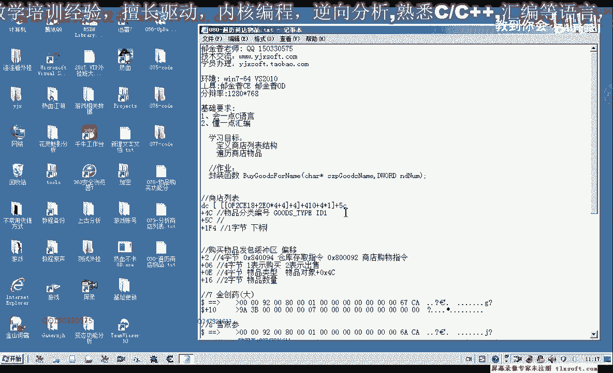
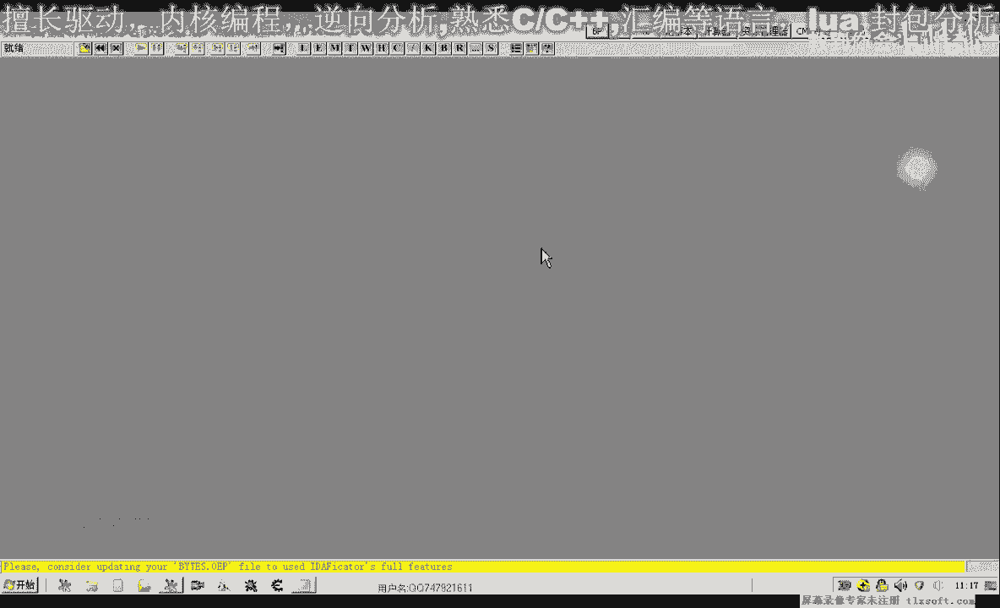
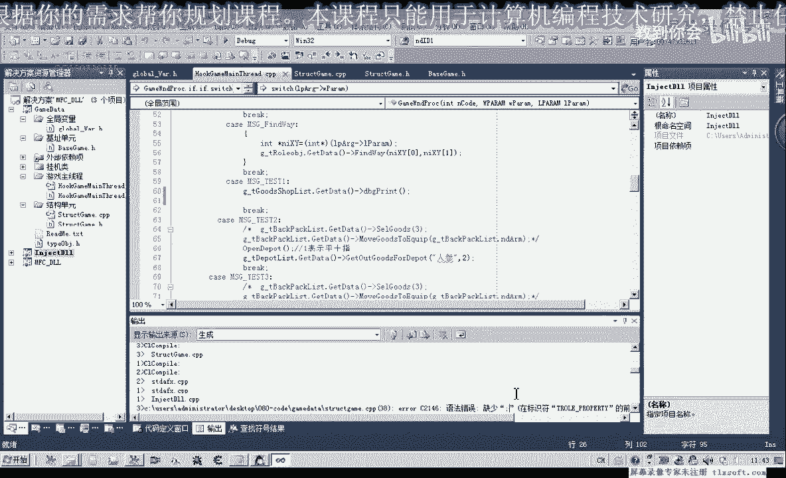
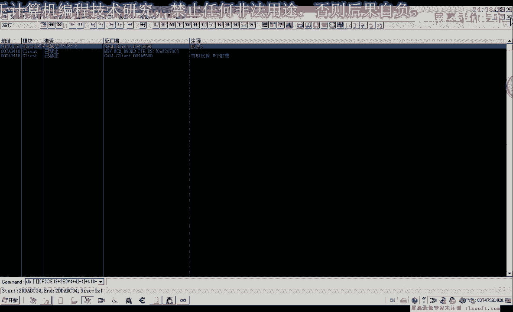
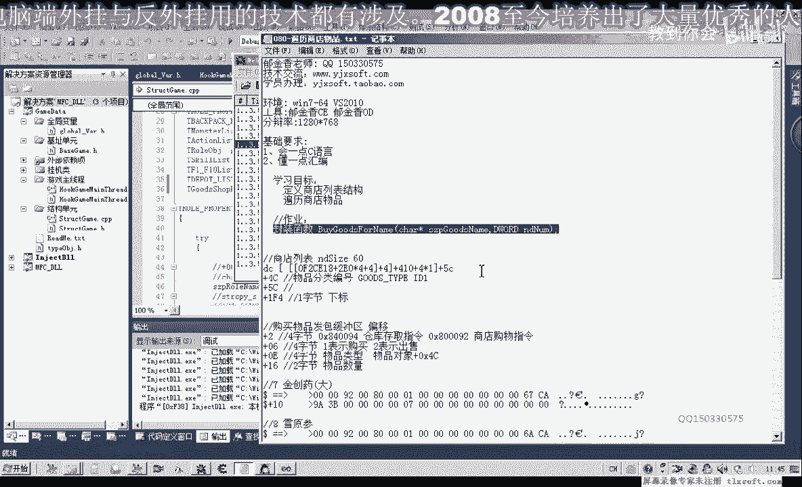

# 课程 P69：080-遍历商店物品 🛒






在本节课中，我们将学习如何分析并遍历游戏中的商店物品列表。我们将定位商店列表的结构，读取物品的分类编号、名称以及其在列表中的下标，并编写代码将这些信息显示出来。


---

## 商店列表结构分析 🔍

上一节我们介绍了背包物品的分析方法，本节中我们来看看如何分析商店物品列表。首先，我们需要确定商店列表在内存中的基址和结构。

通过分析，我们得知商店列表的基址可以通过以下公式计算得出：
```
商店列表基址 = [[[游戏基址] + 偏移1] + 偏移2] + 偏移3
```
其中，具体的偏移值需要通过调试工具（如CE）动态获取。在我们的案例中，完整的计算路径是：先取游戏基址，加偏移 `0x210` 并乘以4，再加偏移 `0x4`，最后加偏移 `0x410`。

商店列表中的每个物品对象，其结构与背包物品对象类似。我们需要关注的偏移量如下：
*   **物品分类编号偏移**：`0x4`
*   **物品名称偏移**：`0x8`
*   **物品在列表中的下标偏移**：`0x1F4`

商店列表的最大容量为60个物品。

---

## 代码实现：定义与初始化 🛠️

接下来，我们将把上述分析转化为代码。我们将基于已有的背包物品结构，创建商店物品的相关结构体和函数。

首先，在头文件中定义商店列表的大小和全局变量指针：
```cpp
#define SHOP_ITEM_MAX 60 // 商店最大物品数量
extern ShopItemManager* g_pShopItemMgr; // 全局商店物品管理器指针
```

然后，我们创建商店物品管理类。其初始化函数 `Init` 的核心任务是计算并存储商店列表的基址。
```cpp
bool ShopItemManager::Init() {
    DWORD dwBase = 0;
    DWORD dwAddr = 0;
    // 计算商店列表基址
    __try {
        dwBase = *(DWORD*)(GAME_BASE_ADDR);
        dwAddr = *(DWORD*)(dwBase + 0x210 * 4 + 0x4);
        m_dwShopListBase = *(DWORD*)(dwAddr + 0x410);
    } __except(EXCEPTION_EXECUTE_HANDLER) {
        m_dwShopListBase = 0;
        return false;
    }
    // 初始化物品列表数组
    for(int i = 0; i < SHOP_ITEM_MAX; i++) {
        m_ItemList[i].dwTypeID = 0;
        memset(m_ItemList[i].szName, 0, sizeof(m_ItemList[i].szName));
    }
    return true;
}
```

---

## 代码实现：遍历与信息获取 🔄

初始化完成后，我们需要能够获取列表中特定下标的物品信息。以下是获取物品信息的函数：

```cpp
// 根据下标获取商店物品信息
bool ShopItemManager::GetItemByIndex(int index, DWORD& dwTypeID, char* szName) {
    if(index < 0 || index >= SHOP_ITEM_MAX || m_dwShopListBase == 0) {
        return false;
    }
    DWORD dwItemAddr = m_dwShopListBase + index * ITEM_OBJECT_SIZE; // 计算物品对象地址
    __try {
        dwTypeID = *(DWORD*)(dwItemAddr + 0x4); // 读取分类编号
        strcpy_s(szName, NAME_MAX_LEN, (char*)(dwItemAddr + 0x8)); // 读取名称
    } __except(EXCEPTION_EXECUTE_HANDLER) {
        return false;
    }
    return true;
}
```

为了验证我们的代码是否正确，我们编写一个测试函数来遍历并打印所有商店物品的信息：

以下是遍历商店物品并打印信息的步骤：
1.  调用 `Init` 函数初始化商店管理器。
2.  循环从 `0` 到 `SHOP_ITEM_MAX`。
3.  在循环中调用 `GetItemByIndex` 获取每个位置物品的类型ID和名称。
4.  如果名称不为空，则打印该物品的索引、类型ID和名称。

```cpp
void TestShopItems() {
    if(g_pShopItemMgr->Init()) {
        for(int i = 0; i < SHOP_ITEM_MAX; i++) {
            DWORD typeID = 0;
            char name[256] = {0};
            if(g_pShopItemMgr->GetItemByIndex(i, typeID, name)) {
                if(strlen(name) > 0) { // 只打印有名称的物品
                    printf("下标[%d] -> 类型ID: 0x%X, 名称: %s\n", i, typeID, name);
                }
            }
        }
    }
}
```

运行测试函数后，控制台会输出商店中所有有效物品的信息，例如：
```
下标[0] -> 类型ID: 0x65, 名称: 小型生命药水
下标[1] -> 类型ID: 0x66, 名称: 中型生命药水
...
```
这证明我们成功地遍历并读取了商店列表数据。

---





## 总结与后续 🎯

本节课中我们一起学习了如何定位和分析游戏中的商店物品列表结构。我们通过动态计算得到了列表基址，并编写代码实现了商店列表的初始化、遍历以及物品信息的读取。

关键点在于理解多层指针寻址计算基址的方法，以及复用类似结构（如背包物品）来定义商店物品。通过测试函数，我们验证了代码的正确性，成功获取了商店内所有物品的分类编号和名称。



下一节课，我们将利用本节课获得的物品信息，进一步封装完整的物品购买函数。