# 课程P7：018-分析怪物列表 🧟‍♂️

在本节课中，我们将学习如何通过逆向分析工具（如Cheat Engine和OllyDbg）来定位和分析游戏中的怪物列表、怪物对象及其关键属性。我们将从怪物的血量入手，逐步找到怪物对象在内存中的地址，并分析出如名字、等级、坐标、状态等关键属性的偏移量。

---

## 分析思路与准备工作

上一节我们介绍了课程的目标。本节中我们来看看具体的分析思路和准备工作。

分析怪物数组的思路是从怪物对象入手。要分析出怪物对象，可以从怪物的属性来入手，例如怪物的名字和血量。这两个属性比较明显。名字数据可能是固定的，且相同名字的怪物较多。具有唯一性的属性是血量，因为血量在受到攻击时会改变。

打开Cheat Engine工具，先附加到游戏进程里。

附加进去之后，先选中一个怪物。以离我们最近的怪物为例选中它。现在它的血量没有变动，是一个固定值。

这个值大致在100~2000这个范围之间。先搜索一下这个范围的数值。

搜索之后，再搜索一下未变动的数值，多过滤几次。然后让角色走动两步，再搜索变动的数值。

搜索几次之后，对这个怪物进行攻击。攻击之后它的数值就变动了，搜索一下变动的数值。然后搜索未变动的数值。不知道这个怪物是否回血。

再次让它的血量改变一下。然后搜索减少的数值。再进行一下范围过滤。

最后收到这几个地址。再次对它进行攻击，攻击后血量减少，再搜索一下减少的数值。

这时它的数字可能为零，因为怪物死掉了，血量消失。过一会儿怪物的血量数值会刷新。这时可以通过它的血量来找到这个对象，附加调试器上去。

怪物可能刷新在别处。对它攻击之后，看一下产生变化的数字。应该是这个范围，或者怪物被其他玩家消灭掉了。这时数值为零。怪物死掉了，也可能是被周围其他玩家杀掉了。

这时可以得到两个对象。一个偏移是`+0x54`，`esi`加上；另一个是`+0x5C`，它们之间相差了一个`0x8`的偏移。

先看一下后面这个。记一下，这是我们找到的一个基址`+0x5C`，这是怪物的血量。另外还有一个基址在这个地方，复制一下。

这时我们的`esi`的值等于这个地址，它加上的是`+0x54`，怪物血量。这两个对象，看哪一个更适合于获取怪物的信息。

接下来的分析再搜索一下。因为怪物列表就是用来保存怪物对象的数组。这两个对象如果真正是对象，就便于搜索。这两个数据都存放在怪物列表里面。

再通过它来搜索一下怪物列表的周围。怪物列表一般是一个全局的。这两个数据在变，实际上是在堆栈里面。

刚才搜索到的是这两个地址。但这个地址也变动了，再重新扫描一下。

这两个地址离得比较近。反正这几个都是基址，先把它记录一下。

另外还有一个`0x690`的地址，也来搜索一下。这个没有搜索出结果，可能是另外某个对象里面的。这个暂时先保留。

先看一下这两个基址里面有没有所需要的东西。没有需要的就关掉。这个数字也在不断变化，这里已经有一个相同的数字。等一会就进去看一下，都进去看一下。

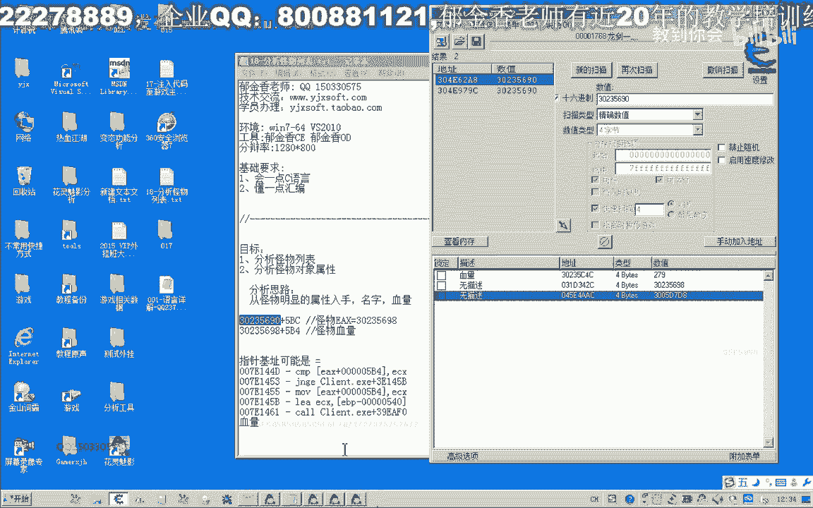

打开OllyDbg。

先把OllyDbg里的这个进程先取消掉。

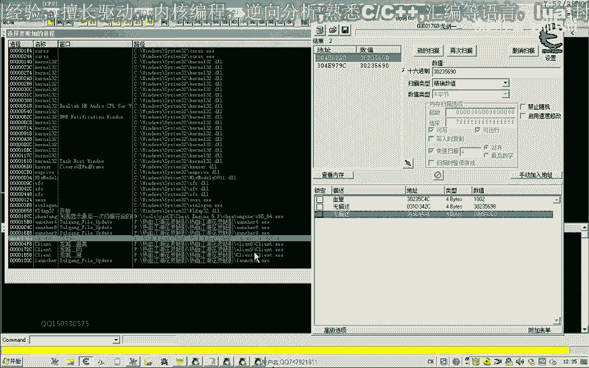

再用OllyDbg附加进程。附加进来之后，把Cheat Engine里所找到的这两个地址先记录一下。

是`0x31D34233`，这是第一个，在这里看一下。

这时在这里边发现了很多地址，很多很多的地址。这些地址可能就是怪物对象，也可能是其他的东西。

先进去看一下。先进入怪物对象，刚才`+0x54`，这里是血量`1300`，这是我们搜索到的。看血量附近有没有怪物的名字。怪物的名字这个属性也可能在这里。

这里有个大概在`+0x320`左右的地址，有一个字符串名字。取下`+0x320`，用`dc`来显示一下。

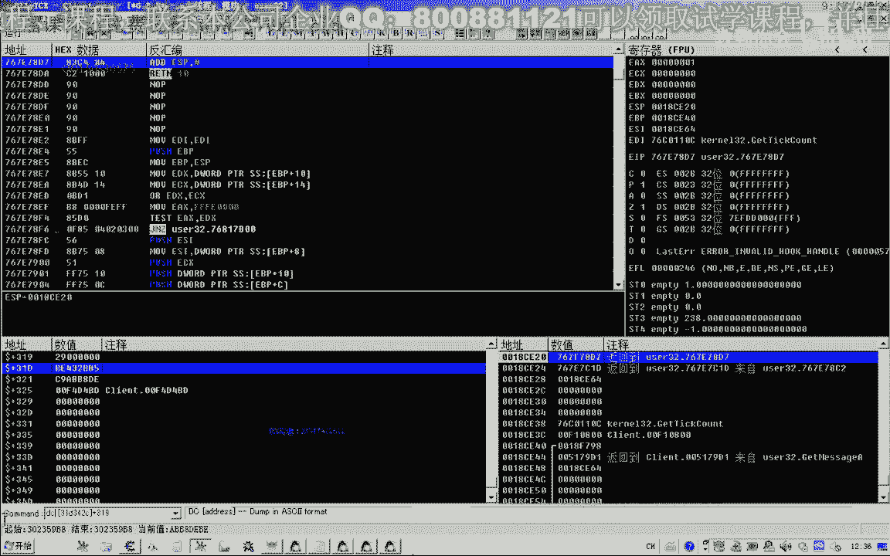

还在后面`+0x365`左右，再后`+0x320`。从这里来确定的话，它的偏移就是`+0x320`。当然是从`+0x54`下面一个对象和偏移来算，这里是`+0x320`，是怪物的名字。

如果这是一个怪物的列表的话。

那么在后面`+0x4`这个位置的话，他也应该是怪物的名字。这里可以看到是“大白条山贼”这样的字符串。

后面的数组的表现形式是`[edi*4]`。再看一下，`[edi*4]`，修复三句，这模型已删了。那么`[edi*4]`的话，这里是“终极的奇幻书”。说明这个对象列表里面，除了怪物列表，在这个地址可能是空的，没有东西。“金刚石”也是游戏里的物品。

说明所找到的这里也是一个对象的列表。但从目前的分析来说，再来看一下这个基址。再在上面下一个访问的断点，看一下能不能找到所谓的基地址。

在这里就能够找到一个数组，就是`0x31CE740`，这里一个槽，一个槽。这里就是所谓的对象列表。把它备注一下，把这个删掉。先把这个复制一下。

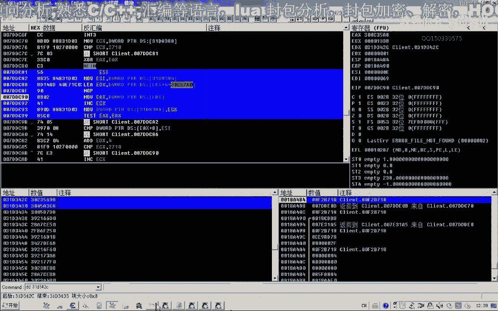

看还有没有其他的地方。

这个地方也有访问`ebx`，`[esi+ebx*4]`。那么`ebx`的来源向上找一下，`ebx`来源于这个`0x31CE740`，就是来源于这个地方。这里能够看到的对象没有奇迹。

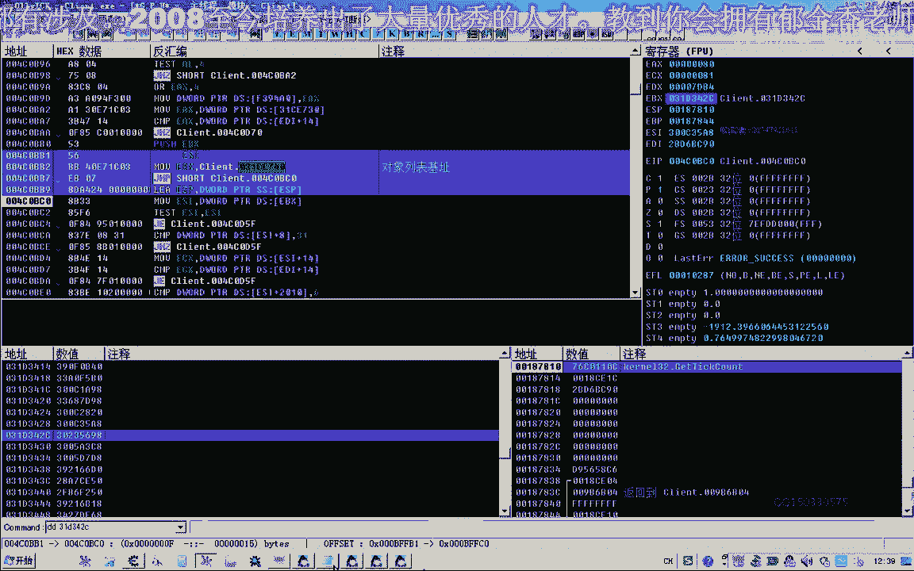

这里是数组的形式。

这里直接出现了一个基址。删掉这个相应的断点。

接下来再看一下另外找到的基址`0x1144A3F3`。

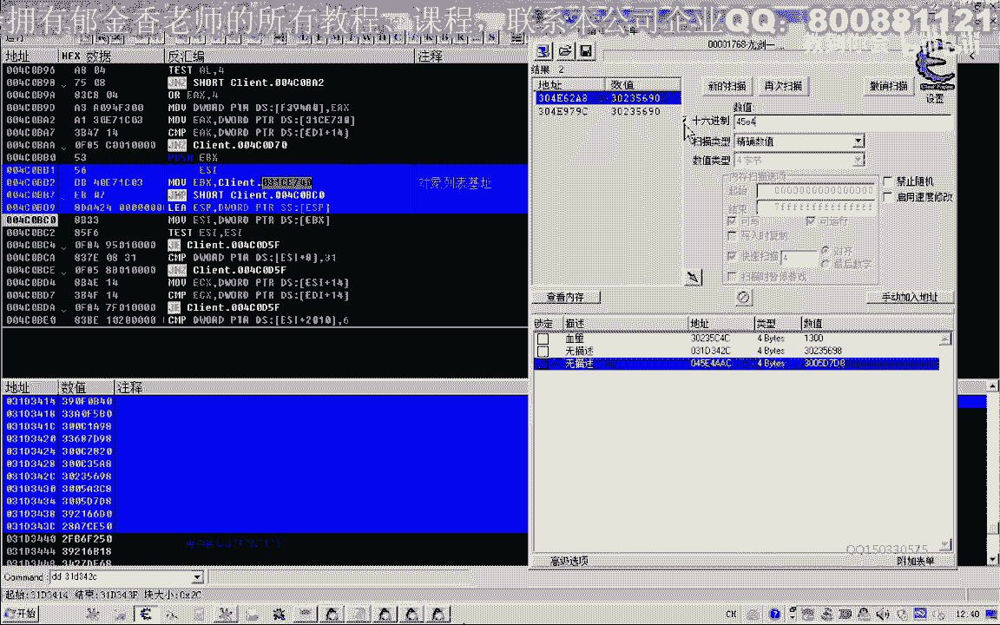

从这里来看的话，里面的对象不断在变化，不断在更新。这里可以看到。进去看一下，加上一个括号，进去看一下。先用看一下对象的名字。在这个地方大概也是`+0x320`左右，能够看到“大块头山贼”。

加上数组的访问方式，`[0]`，这里也是“大块头山贼”。`[1]`，这里是“大骨头山贼”。`[2]`，聚不上去。`[3]`，`[4]`，`[5]`，`[6]`，怪物七。其实这里没有尺寸，所以看不到。`[7]`，`[8]`，后面都没有了`[9]`。

说明这个地方全部都是怪物对象。这个才应该是周围的怪物列表。从这个形式上来看，可能`[0]`归零的这个地方可能就是基址。在这里下一个内存访问断点，然后断到了`ecx`这里。看一下`ecx`这个数字的来源。

再让它跑一下，看一下有没有其他的地址。其实他在这里直接现了一个数组出来，直接现了一个数组出来，也就是这个`+0xA88`这个地方。也就是这里是数据。这时它会清零了。先删掉这个断点，让它跑起来。

这里可能才是周围的怪物列表。对象列表基址里面放的才是怪物对象。把这个地址记下来。

这时找到两个对象，一个是周围的怪物，另外一个是其他的对象列表。这个内存基址里面，但现在分析的是怪物列表的基址，暂时用不上它，先做一个记号。

这个就是怪物列表的一个基址。可以把它整理一下。整理一下，把基址放在前边，加上数组里的下标就行了。它是用`eax`代表了下标。这里从零开始。

这就是访问到对象。

第一个对象看一下。刚才分析了`+0x320`这个地方是它的名字。还有一个`+0x54`这个地方是它的血量。

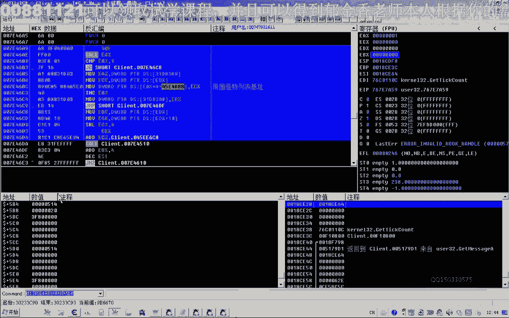

血量，把它记录一下。

另外还有一个属性，这里有个`+0x20`，它是`32`。`32`代表的恰好是它的一个等级。很有可能这个`32`就是它的等级。修改一下，看有没有效果。当然现在不知道所选择的这个怪物对象究竟是哪一个。

可以先改它的名字，看看有没有效果。用`dc`来显示一下，对了就是选中的这个，它的名字就变化了。还有一个是等级`+0x28`，看改一下它的等级，改成`30`了，它的级别也变了。说明这个地方。

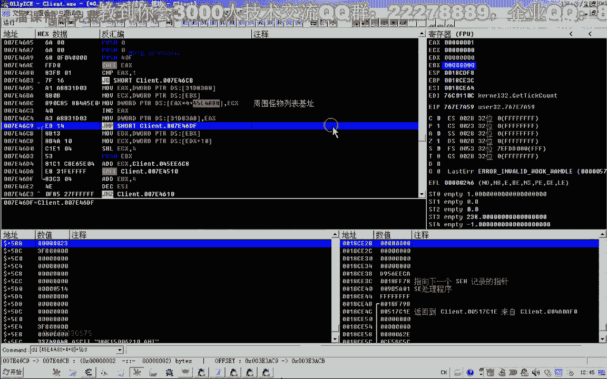

`+0x28`这个地方是怪物的等级。

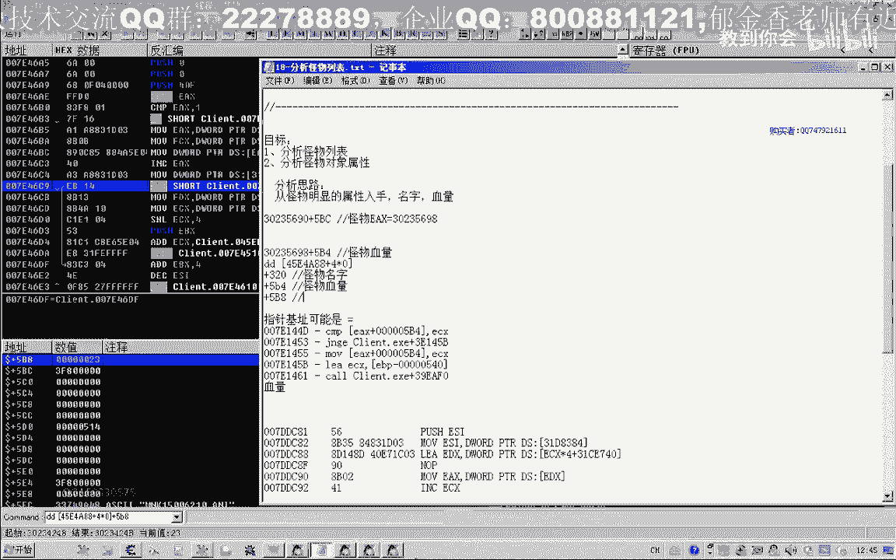

还有一些是怪物的坐标。看一下，用浮点数来看一下。要看一下当前坐标是多少，`218.1`。怪物的坐标也不会相差太多。这里有一个坐标，`221.9`。对了，`201`是`201.81`，它是`217.1`。这个是负的。

那么这个就是怪物的坐标了。把它记录一下。当然前面还有一个坐标，这里一共有两个坐标。`+0x1018`，看一下`+0x1018`。

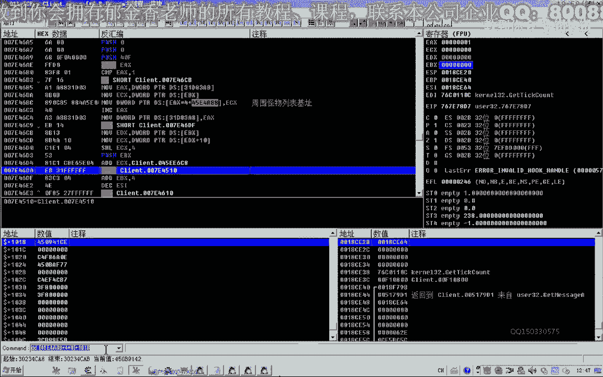

这两个坐标都是怪物坐标。因为怪物有两个来回移动的点，可能是它在移动。再看一下，日，要求前任要求，哈哈哈，是这个怪物，它在移动在变化。看一下哪一个数值是变化的。走到它跟前去，`218.7`，`198.4`。

这样`198.4`这个离得比较近一点，应该是后面这个。这是`70`，我这个是`80`。这时怪物的坐标与我们重合`198.4`，`218.7`。而要放弃，然后`985`这个是`84`。

应该是后面一个坐标离我们比较近。那就是这两个坐标之间，到时候大概是过滤，都把它记下。怪物的坐标有两个，可能是来回移动的两个点。一个是`+0x1018`，是X坐标。还有一个是`+0x101C`，是Y坐标。

`+0x1018`，这个是`+0x101C`，这个是`+0x1020`。再看一下这个视频，还有一个坐标是`+0x1024`的地方，还有一个坐标是`+0x102C`这个地方。

这就是常用的几个属性。

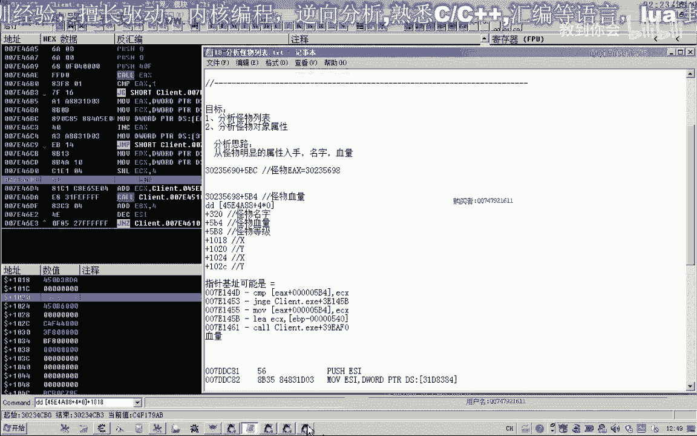

当然还有一个怪物的状态。再看一下它的血量这个地方。当前攻击的这个怪物来说，是刚才改动的那一个怪物。这个才是改动的怪物。

另外怪物应该还有一个死亡的状态。这个数值可以通过Cheat Engine搜一下。先移动到它的基址这个地方。

搜索的时候来看，就从基址开始搜索，`0x30233C9`。它活着的时候，这时已经被杀死掉了。应该有一个状态是`0`或者是`1`两种状态。搜索两个状态之间的一个数字，`0`和`1`。

这个地方，一般来说，再搜一下未变动的。但不知道它是用`1`表示死亡还是用`1`表示未死亡。这一点不了解。

不了解的话，这时搜一下未变动的数据，变动的数值。然后攻击它，让它死亡之后，选择变动的数值。换一把武器，然后死亡之后，这个数字变动，搜索变动的数值。然后再搜一个两者之间的数字，`0`和`1`之间的。

看它有没有复活。它已经复活了。复活之后这个数值应该再次变动，变动的数值。离得比较近的这两个，它活着如果是一的话，那么极有可能就是这两个数字代表它的状态。

数字之间的再扫一下，`FAS`和`B`这两个地方。

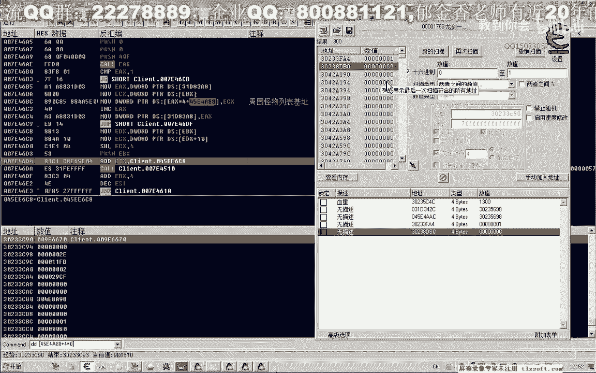

当然一个是哪个为`0`，一个是为`1`。看一下偏移是多少。

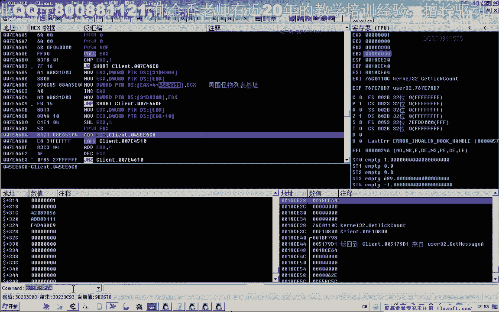

`+0x314`，记一下这个。离他很近，这个地方`+0x314`。另外还有一个地方。

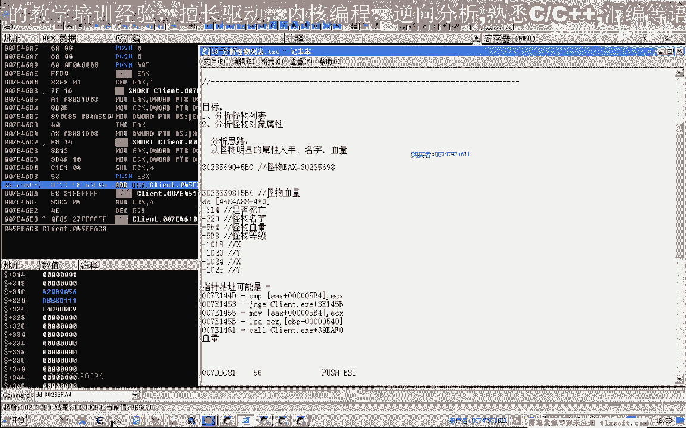

这个地方离得比较远一点。离得太远的话，可能性就比较低了。因为对象不会太大，应该不会到这个位置，不会有前多个字节。就应该是刚才的这个位置，在`+0x314`，在这个地方。

再次攻击它，让它死亡，看一下。死亡之后这里就为`0`了。所以说这个东西，怪物的状态，活着为`1`。

是否，好久。死亡就为`0`。很多时候在攻击的时候，要判断怪物是否死亡了。如果怪物死亡了，就对他继续进行攻击了。

今天这节课就分析到这里。另外当然还有一个对象的列表，也把它整理出来。这个是对象列表。这个对象列表的话，暂时还不知道。

目前所知道的而言，下节课再编写代码，把怪物的这些属性偏移找出来。怪物的名字、血量、等级、是否死亡，这些属性在编写代码，然后把它封装好相应的数据。

---

## 关键属性偏移总结

以下是分析得出的怪物对象关键属性偏移量：

*   **怪物列表基址**：`0x1144A3F3`
*   **怪物对象数组访问**：`基址 + 0xA88 + 索引 * 0x4`
*   **怪物名字偏移**：`+0x320`
*   **怪物血量偏移**：`+0x54`
*   **怪物等级偏移**：`+0x28`
*   **怪物坐标X1偏移**：`+0x1018`
*   **怪物坐标Y1偏移**：`+0x101C`
*   **怪物坐标X2偏移**：`+0x1024`
*   **怪物坐标Y2偏移**：`+0x1028`
*   **怪物存活状态偏移**：`+0x314` （1=存活，0=死亡）

---

## 其他对象列表

另外发现一个全局对象列表，基址为 `0x31CE740`，其结构可能与怪物列表类似，但包含游戏内其他类型的对象（如物品）。此列表暂不深入分析，仅作记录。

---

## 总结

本节课中我们一起学习了如何定位和分析游戏中的怪物列表。我们从怪物血量这个动态属性入手，使用Cheat Engine进行多次变化搜索，定位到怪物对象地址。随后，利用OllyDbg进行深入分析，找到了怪物列表的基址和访问方式，并逐一分析出了怪物对象的名字、血量、等级、坐标以及存活状态等关键属性的内存偏移量。这些偏移量为后续编写读取怪物信息的代码打下了坚实的基础。下节课我们将基于这些发现，开始编写代码来读取并封装这些怪物数据。