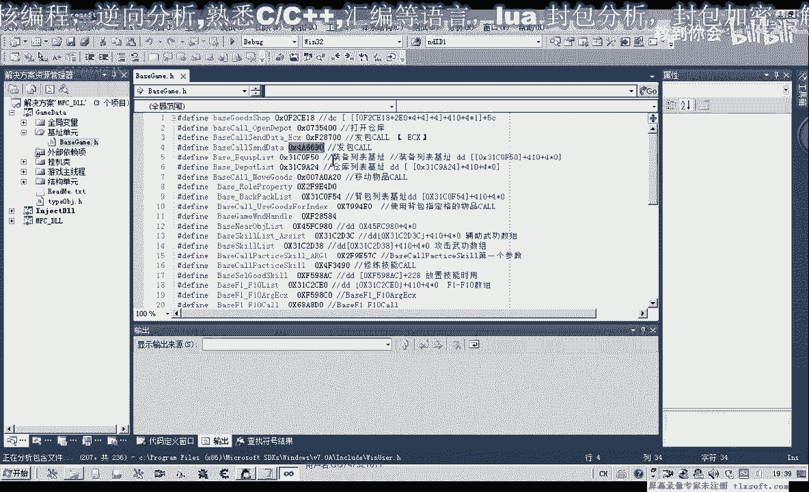
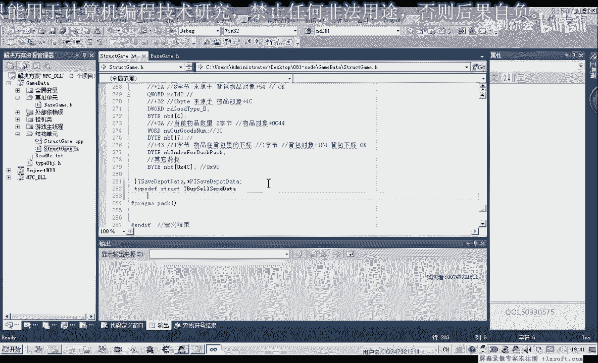
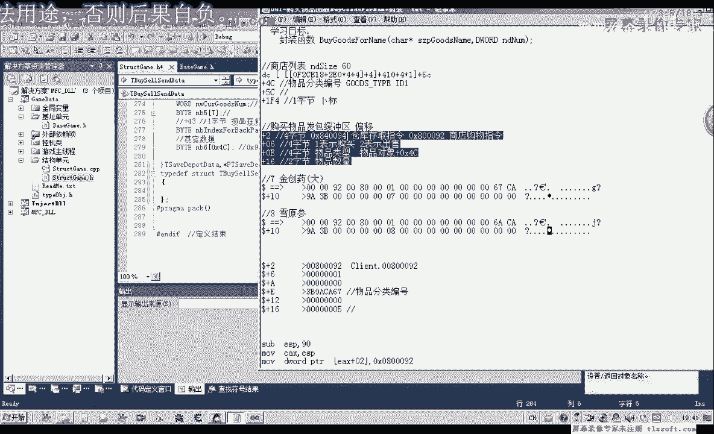
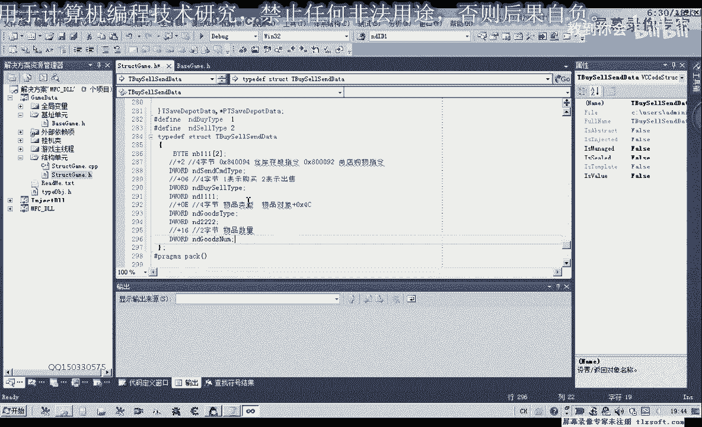
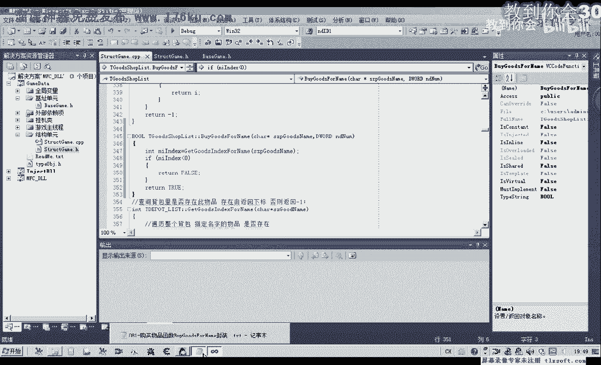
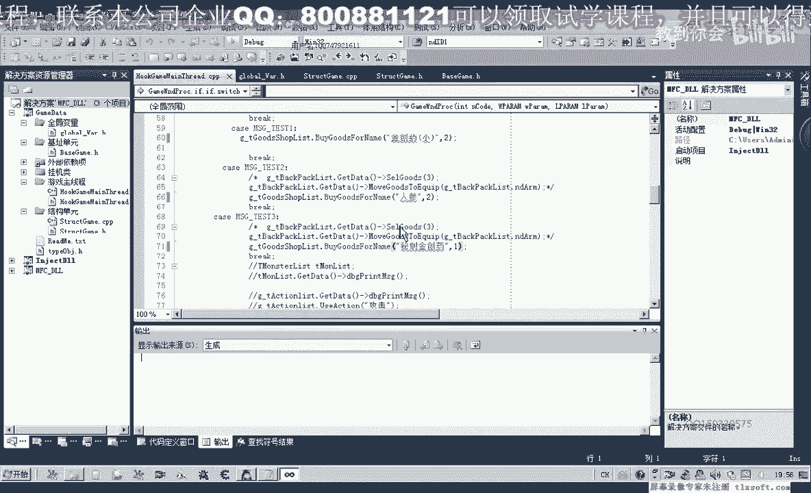
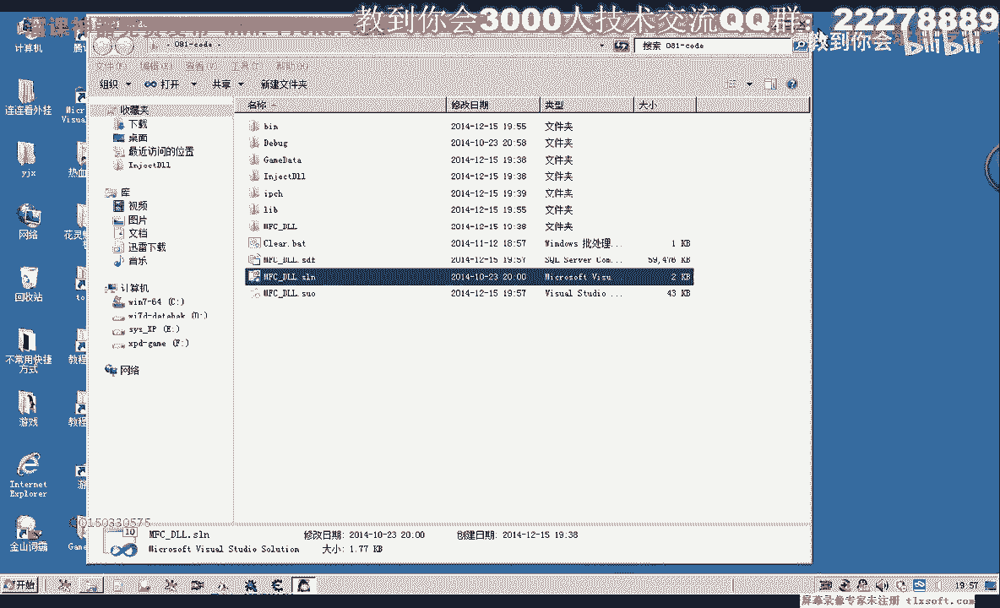

# P70：081-购买物品函数BuyGoodsForName封装 - 教到你会 - BV1DS4y1n7qF

大家好，我是郁金香老师，那么这节课呢我们一起来完成之前的作业啊，也就是呃书写这个购买物品的这个功能，那么这第一个参数呢是需要购买物品的名字，第二个是购买物品的数量，首先我们打开第八次课的代码。

在它的基础上呢，我们来进行代码的书写。

那么首先我们要做的第一件事情呢，就是添加相关扩展嗯，这个机制展开我们的基础单元，但是我们发现啊，这个发包的这个扩展我们已经有添加了啊。

还有这个参数700的这个我们也有添加，那么于是我们替换掉它，所以这里替换的话，我们需要先放到一个计时器或者是变量里面，然后呢再来调用，参数我们也进行一个替换，好那么我们把它保存好。

那么实际上我们之前的话也有调用这个括号，那么我们可以把这个扩的话单独的封装成一个函数，那么我们先把这一课的内容完成了，后面的我们再来做一些优化啊，呃代码的一些优化，那么这节课呢我们就不做过多的一个了解。

那么首先呢我们来看一下这里呢我们首先要需要添加一个结构啊，因为之前的存存放仓库的这个结构的话，我们这里呢他用不上用不上。

那么这里呢我们需要另外写一个结构，先转到我们的结构单元，在这个仓库啊保存物品的这个缓冲区结构，后边呢我们再定一个购买物品的结构。

那么在这个结构里面的话，我们来看一下啊，主要是这几个偏移呢，我们需要来进行相关的修改，那么我们主要就定义呃这里面的数据。

那么我们把它复制一下，那么首先是加二这个偏移我们需要来对它进行了修改，那么也就是说在他前面呢，我们需要有两个自己的站位啊，也就是要分配一个这个内存空间，占两个字节的位置，然后呢从加二这个偏移这里开始了。

有四次解，那么四次解的话，我们可以用d2 来表示，那么是一个嗯存放的一个指令啊，哒哒哒，指令类型，那么然后呢再加二这个位置来加上这四字节的话，就到了加六这个偏移这里。

那么在这里呢我们需要来表示来购买或者是出售，那么这里我们可以在前面来定义两个红，咳咳那么这两个红呢分别来表示购买出售啊，那么然后呢是零一这个地方，但是灵异的话与这个加六来这个地方差八个字体。

那么所以说我们在这里呢也需要四个字节的站位，那么四个字节呢我们可以定义为d word来站位，也可以用前面的代替四的一个数字来来站位也可以，那么我们这里呢用，这个d word。

那么然后呢再加上我们前面的这里呢，一共341 12，再加上四呢等于幺四，幺四的话恰好了等于16进制的0x1 ，那么所以说在这个地方的话，我们再来定义四个字阶段，第一个word呃，也就是物品的分类编号。

那么在这里呢再加上八个字节，也就是说在它的后面呢再加上啊四字节能才是我们的幺六，所以说在这里呢我需要40几的空间呢来掌握，好那么我们保存一下。

当然这个空间啊，这个缓冲区的空间呢，我们之前的分析的话，它可能是九零个自己啊，16进制的九零，那么在这里的话，我们前面的话才只有16个字节啊，加上这四个字节的话啊，才是ya这么多个知己。

那么所以说在后边呢我们还需要额分配一片空间，那么在这里呢我们同样的用ba类型来表示5p5 x80 ，那么这个空间呢只要大于整体，这个空间只只需要大于我大于等于我们九零个字节了，应该就不会出错了啊。

因为我们就是怕的就是呢后边呢它还有在后边这一块区域呢，有可能是用来做一个啊其他的临时的处理一些数据的啊，那么如果没有这分配这片空间的话，它可能会产生这个数据的一些啊移出。

那么可能会造成一些未知的一些错误，当然这个数额这个结构的最终，大小呢我们也可以通过啊多花一些时间来逆向这个发包的这个函数的，内部呢，我们也能够确定它的大小，那是那样的嗯，会浪费更多的时间啊。

所以说我们在这里的话直接分配啊0x80 个字节就可以了，好那么我们再保存一下，那么这个结构我们分配好好了之后呢，接下来呢我们就来啊工作这个相应的这个函数啊，对它进行一下复制，那么这个函数的话。

我们呢把它封装在我们的这个商店列表里面。

那我们找一下，这里呢是我们的商店列表，那么我们一到这个函数的后面啊，添加这个相应的成员函数，也加上这个绿的前缀啊，作用域的一个限定，然后把这个说明呢复制一下，转到根据估值。

indext for name，那么在这里来添加这个内成员函数的说明，首先给它返回返回一个数字，那么然后我们做的第一步呢，就是通过它传进来的这个呃物品的名字，那么通过这个物品的名字呢。

我们去搜索这个商店领域的商品，看它是否在这个商店列表里边存在，那么我们可以调用前面的这个函数，在这里我们需要再定义一个变量，用来接收返回值，那，么我们通过这个函数去查询。

如果这个整个商店列表都搜索完了之后呢，我们又找到这个名字，那么我们就直接就返回一个数值角，那么如果这个数值它小于零，因为我们的这个下标是从零开始的，如果是小于零的话，就是-1这一类的。

那么我们这里来直接返回，那么如果我们在偏离的时候找到了这个相应的物品，那么这个下标呢它会从大于零大于等于零，那么在大于等于零的情况下呢，我们就可以调用啊下面的这个空购买我们的物品。

当然这里呢我们涉及到扩的一些调用呢，涉及到指针的一些运用，那么我们要加上一个异常的处理，那么在这个位置呢，我们打印出相关的调试信息，如果出现了异常的，那么我们这里呢也返回返回角价值。

那么在这里的话我们也需要呢，呃把我们的，i said send g，在这里我们需要在汇编y啊，定义这个变量，啊啊，那么我们在这个外边我们分配了这个相应的空间的话，呃。

在里边我们就不用分配这个站到这个空间了啊，在这里呢我们就删掉相应的代码，在这里呢我们也给他做一个初始化，因为没有赋值的地方呢，我们都用零来填充，然后对它进行相应的副词，那么首先呢是这个淘宝的一个类型。

那么类型的话在这里呢我们是80092，这个呢表示我们商店和购物的这个指令，那么接下来我们看一下，这是我们的表示购买或者是出售啊，零六这个地方，那么这里呢我们定义了两个相应的红，这个呢表示购买。

然后我们接下来呢是要购买的一个数量，那么这个数量呢来源参参数第兰博，那么最后呢是要购买的这个物品的类型，那么这个物品的类型的话，就需要通过我们之前查询的这个下标来获取啊。

因为我们可以通过这个下标来来访问我们的这个物品列表啵啵，因为这个类型的话在里边呢啊也就是说这个故事type，那么这样的话理论上我们就能够购买所有的物品。

但是我们还需要来把这个缓冲区来传递给我们的这个相应的参数，就是也就是传递给ex，那么前面的这种汇编代码的话，我们就不需要用了，因为它的这个功能的话已经被这一段代码取代调度啊。

那么在这里呢我们首先呢把结构的地址输给我们的一，好，那么我们编译一下，那么在这里呢我们给它添加一个变量，嗯变量的左侧，这里呢给它添加一个类类型，不然它有一个很烦人的一个警告，那么添加之后呢。

我们在这里呢呃转到啊全局变量单元，通过这个商店列表了的这个全局变量呢来调用，转到主线程单元，那么我们这里呢有三个测试按钮，那么呢我们通过它来购买物品，那么比如说购买人三，每次来更为一个或者是两个。

都可以啊，这个数量呢自己来修改，然后我们在测试仪这里的购买金疮医药，那么一次呢就我们两个，在测试三这里呢我们呃看各位什么啊，购买这个密集秘制金疮药，那我们在这里，那么一次呢我们购买三个。

那或者是你去购买一个啊，这个比较贵，那么我们再次编译一下啊，好那么偏移成功之后呢，我们进入到我们的游戏里边。

那么首先呢我们挂接到主线程啊，测试这个时候呢我们看到金窗要小，购买了两个，那么同时它的数量肯定也会变化，这边那么测试二这里我们看到啊人生呢购买了两种啊，这里它的数量呢也会购买一次也会变。

那么测试三的话将会购买这个秘制金创药啊，这里呢他一次呢会购买一个啊，好的，那么我们所有的测试都成功，那么这节课呢我们就讲到这里。

