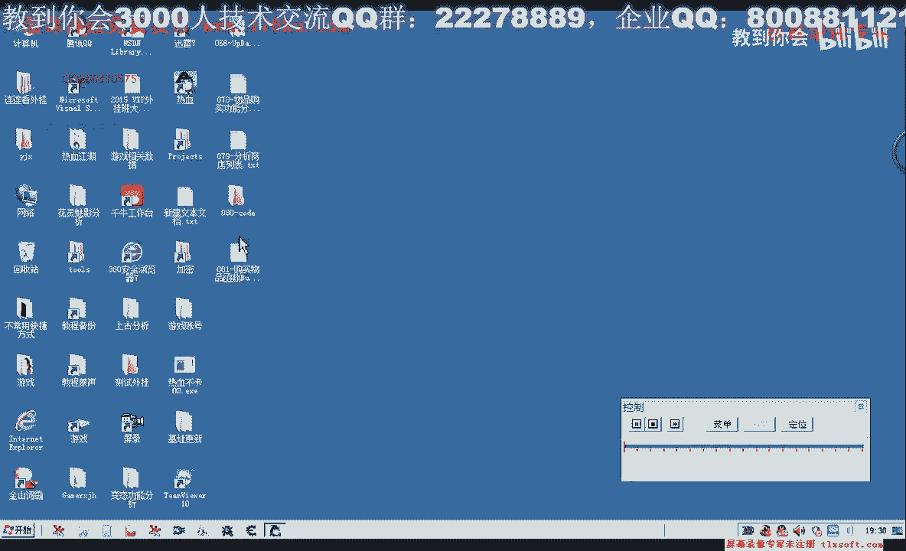

# 课程 P70：081-购买物品函数 BuyGoodsForName 封装 🛒

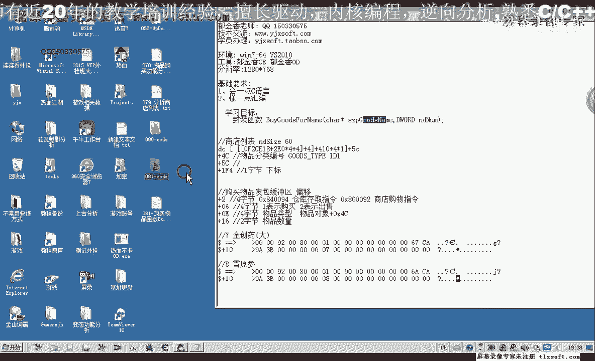

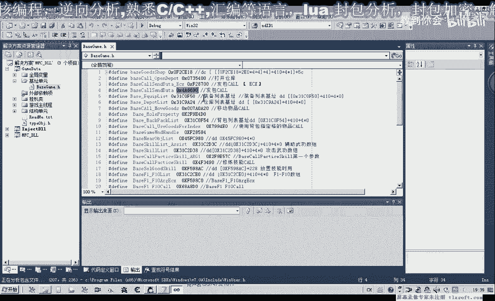

在本节课中，我们将学习如何封装一个名为 `BuyGoodsForName` 的函数，用于根据物品名称和数量购买游戏中的物品。我们将基于第八次课的代码进行扩展，完成购买功能的实现。

---

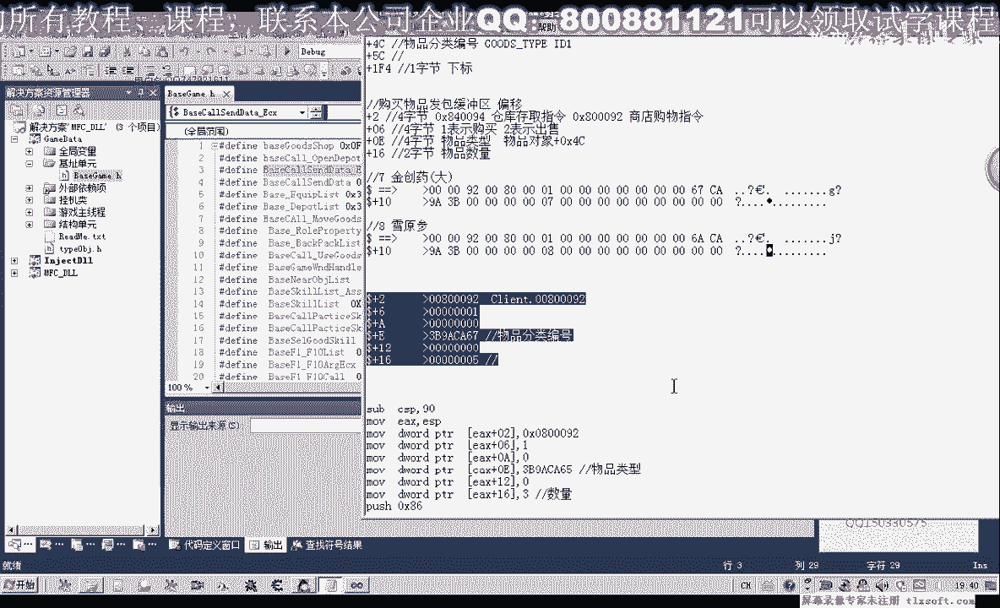

上一节我们介绍了商店列表的查询功能，本节中我们来看看如何封装一个完整的购买函数。

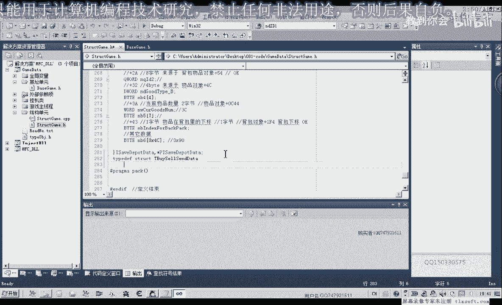


首先，打开第八次课的代码，并在此基础上进行编写。

第一件事是添加相关的扩展机制。展开基础单元后，我们发现发包扩展和参数 700 的扩展已经添加。因此，我们需要替换掉原有的调用部分。替换时，需要先将数据存入计时器或变量，再进行调用，并对参数进行替换。

实际上，之前的调用部分可以单独封装成一个函数。我们先完成本节课的内容，后续再进行代码优化。

首先，我们需要添加一个新的结构体。之前用于存放仓库物品的缓冲区结构体在此不适用。

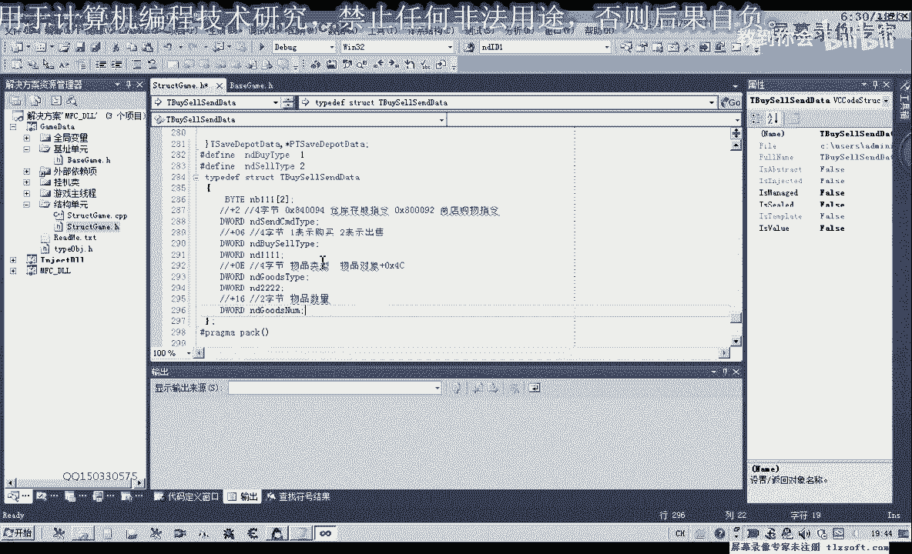

以下是购买物品所需的结构体定义：

```pascal
TBuyGoodsBuffer = packed record
  // 前两个字节占位
  Placeholder1: Word;
  // 指令类型，4字节
  CommandType: DWORD;
  // 购买/出售标识，4字节占位
  Placeholder2: DWORD;
  // 物品分类编号，4字节
  GoodsType: DWORD;
  // 后续80字节缓冲区，用于防止数据溢出
  Buffer: array [0..$7F] of Byte;
end;
```

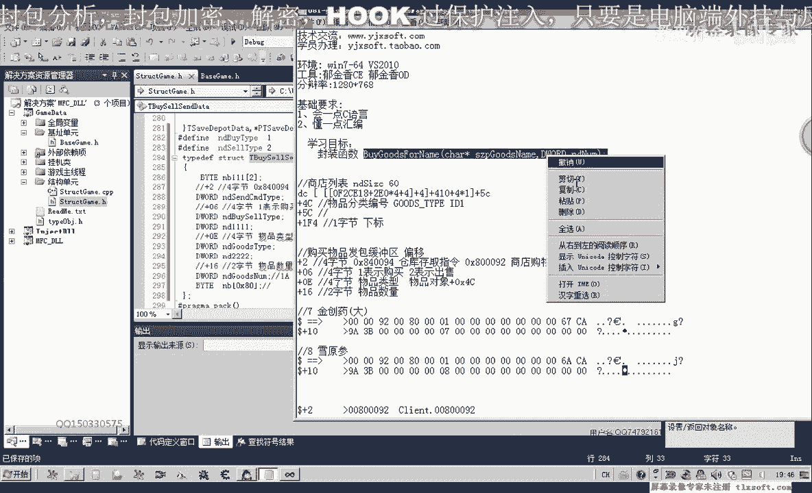

结构体定义好后，接下来在商店列表单元中封装购买函数。

我们在商店列表类的末尾添加一个成员函数，并加上作用域限定前缀。函数说明如下：根据传入的物品名称搜索商店列表，如果找到该物品，则调用购买功能；如果未找到，则返回错误值。

以下是函数实现的核心步骤：

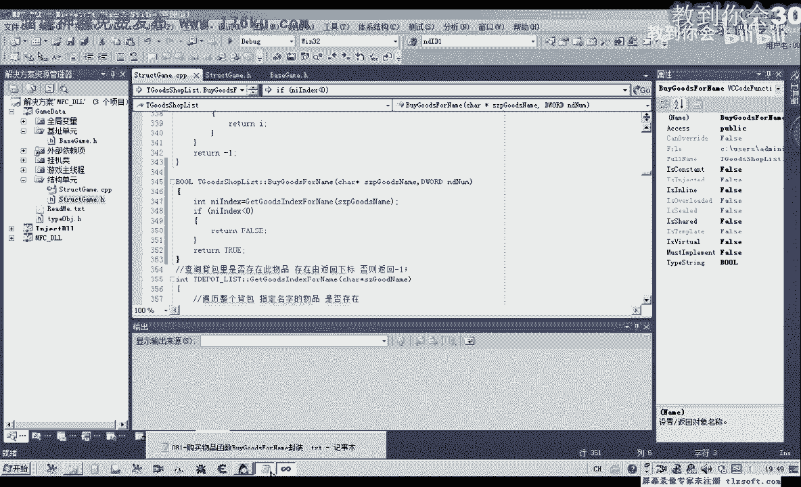

1.  通过物品名称调用查询函数，获取物品在列表中的下标。
2.  如果下标小于0（即未找到），则直接返回。
3.  如果找到物品，则进行购买操作，此过程涉及指针操作，需添加异常处理。
4.  在异常处理中打印调试信息，若出现异常则返回错误值。

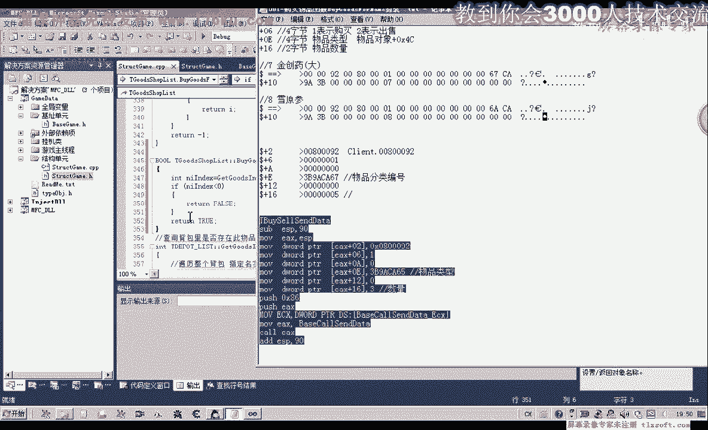

购买操作需要填充我们定义的结构体：

```pascal
// 初始化结构体
FillChar(BuyBuffer, SizeOf(BuyBuffer), 0);
// 设置指令类型
BuyBuffer.CommandType := $80092;
// 设置操作为购买
BuyBuffer.Operation := BUY_OPERATION; // 假设 BUY_OPERATION 是定义为购买的红
// 设置购买数量
BuyBuffer.Quantity := AQuantity;
// 通过下标获取物品类型并设置
BuyBuffer.GoodsType := FGoodsList[ItemIndex].GoodsType;
// 将结构体地址传递给发包函数
SendPacket(@BuyBuffer);
```

编译成功后，我们转到主线程单元进行测试。我们设置了三个测试按钮：

*   测试一：购买“金疮药（小）”，数量为2。
*   测试二：购买“人参”，数量为1。
*   测试三：购买“秘制金疮药”，数量为1。

进入游戏并挂接主线程后，分别点击测试按钮。可以观察到，商店中对应物品的数量成功减少，说明购买功能封装成功。

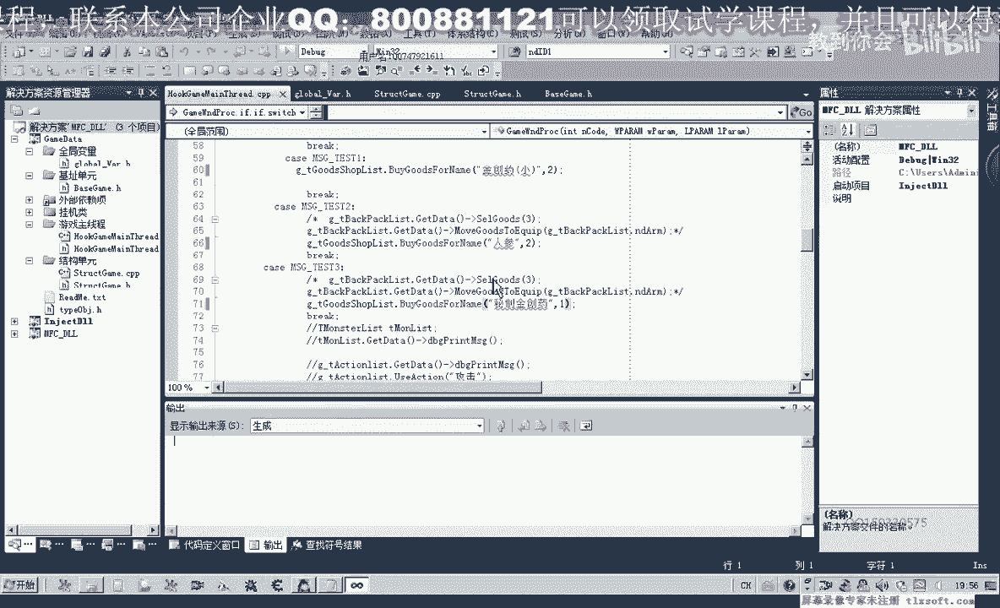

---

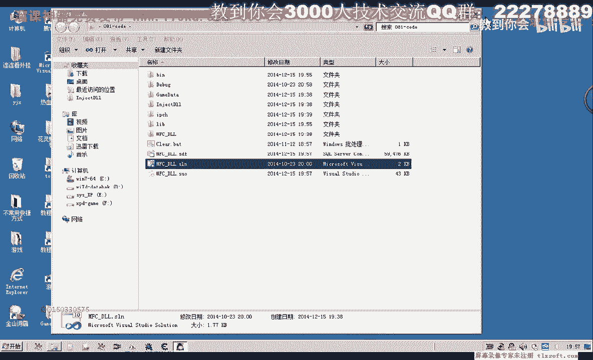

本节课中我们一起学习了如何封装 `BuyGoodsForName` 函数。我们定义了购买所需的结构体，实现了根据名称查询并购买物品的逻辑，并通过多个测试案例验证了功能的正确性。这个函数为后续自动化商店操作提供了基础。