# 课程 P71：082-分析出售物品封包结构 📦➡️💰

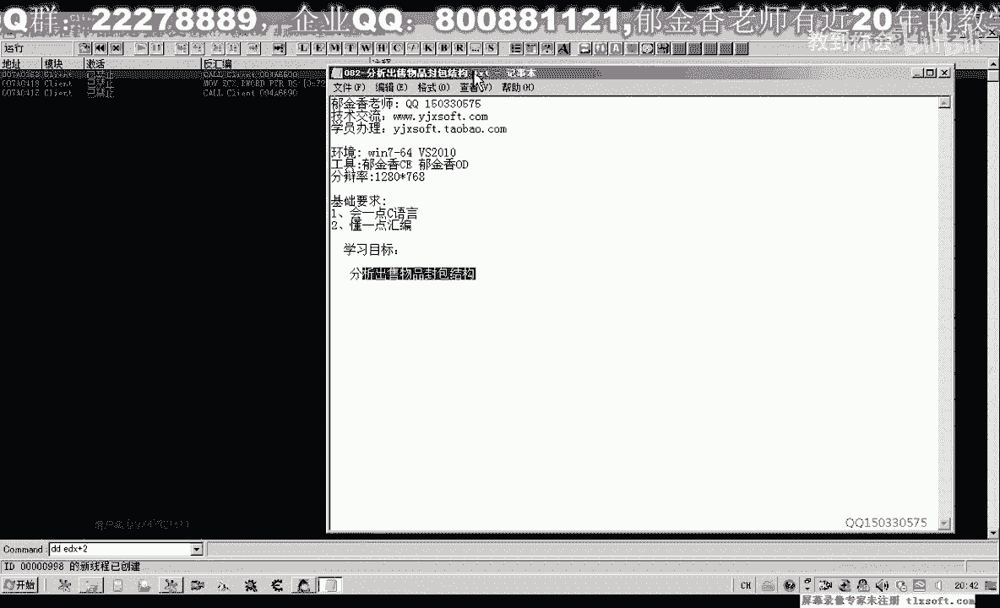

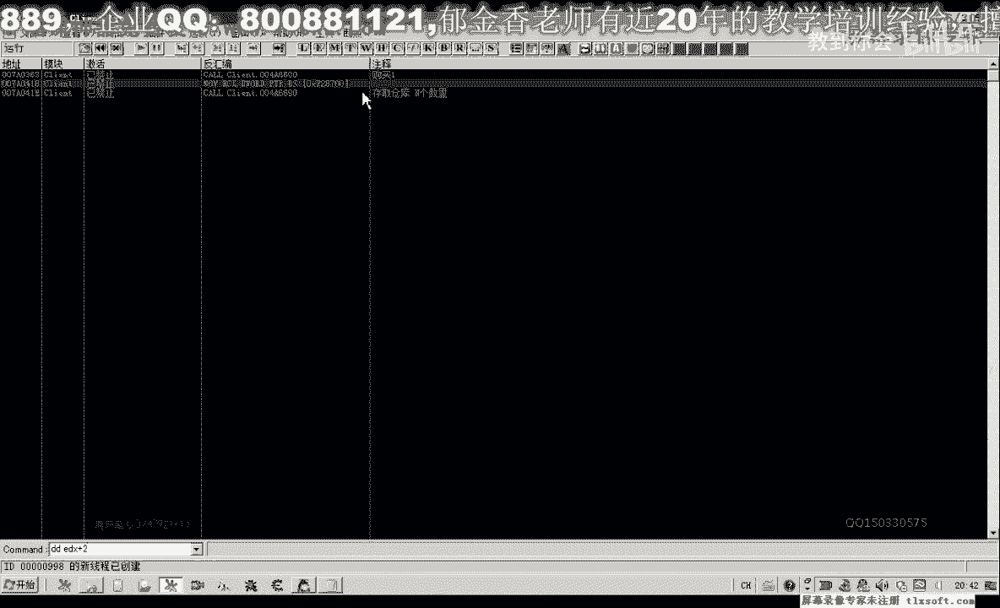

在本节课中，我们将学习如何分析网络游戏中“出售物品”这一操作所对应的数据包结构。我们将通过对比之前学习的“购买物品”和“仓库存取”的封包，来理解出售物品封包的特点，并最终通过代码进行测试验证。

---

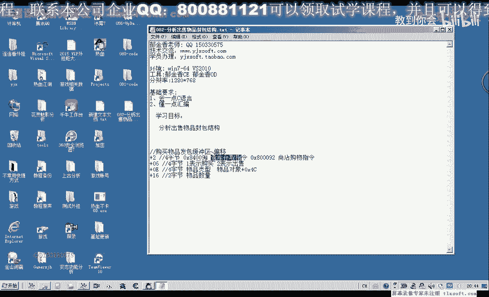

## 概述

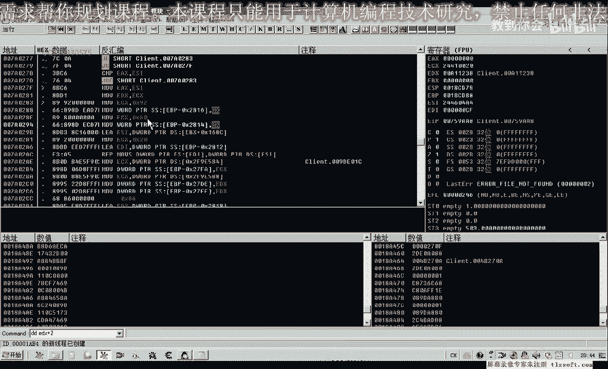

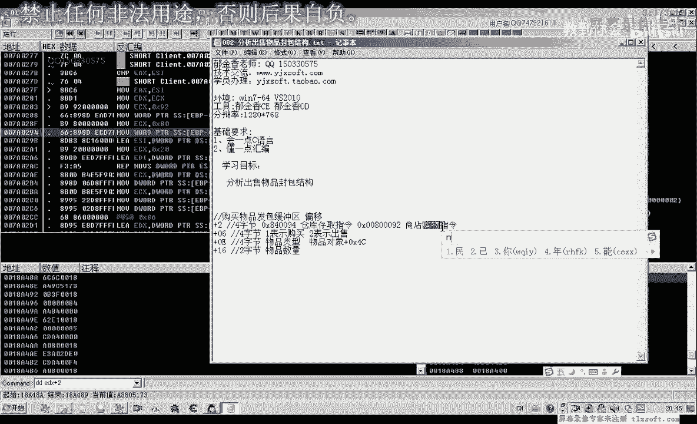

出售物品、购买物品以及仓库存取等交易行为，在游戏底层通常调用同一个功能库，并通过向服务器发送特定结构的数据包来实现。本节课的核心目标是解析出售物品时发送的数据包（封包）格式。

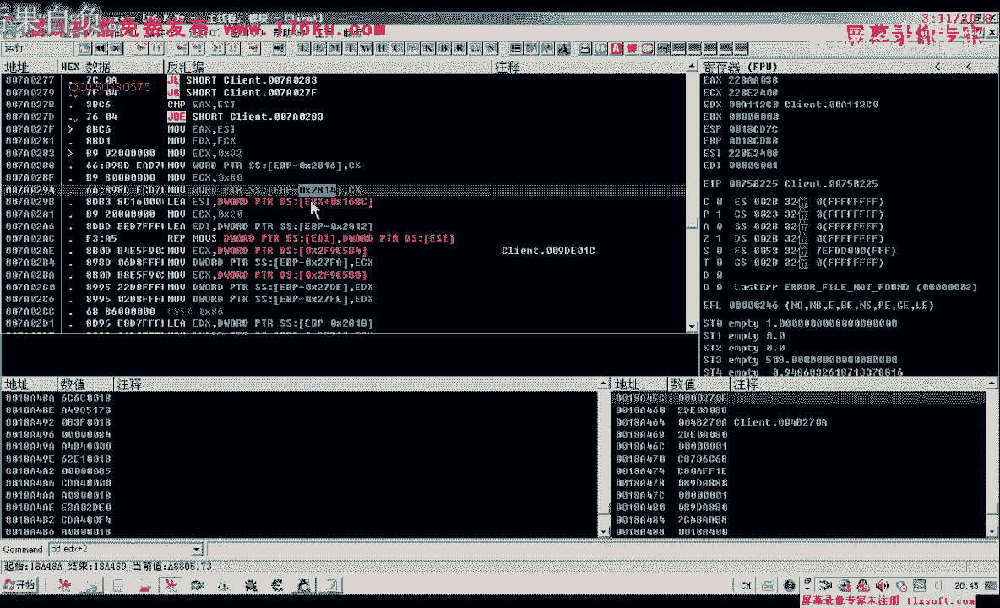

上一节我们分析了购买物品的封包结构，本节中我们来看看出售物品的封包有何异同。

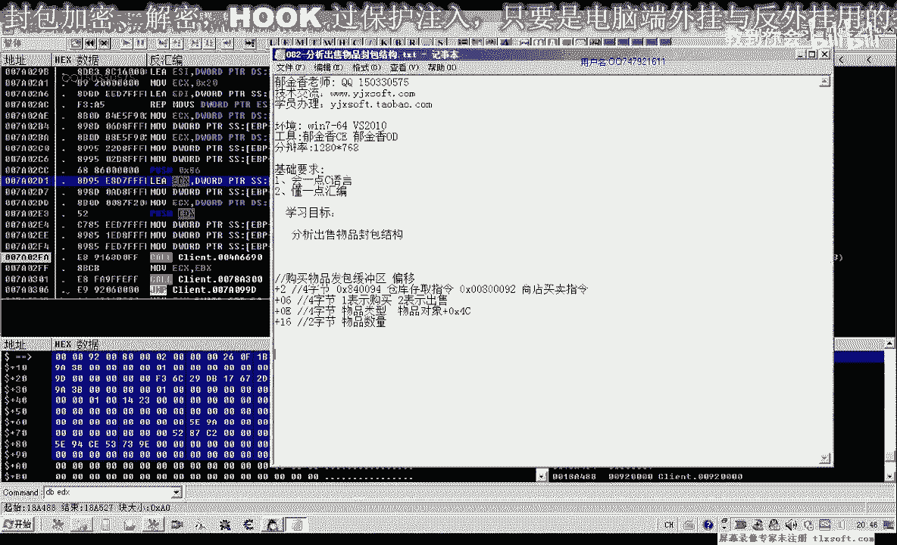

---

## 封包指令分析

首先，我们确认出售物品所使用的指令。通过调试工具观察内存，发现出售物品时，向服务器发送的指令与商店购物、仓库存取是同一个。

**核心指令代码**：
```
8000 92
```
虽然写入内存的字节顺序可能不同（例如 `09 00 80 00`），但组合起来依然是 `8000 92` 这个指令。这证实了商店的买卖操作共享同一套底层通信指令。

---

## 缓冲区数据结构对比

接下来，我们分析存放出售物品数据的缓冲区。其起始地址通常为 `2818`（十六进制）。通过对比出售不同物品时的缓冲区数据，我们可以找出固定不变的部分和需要动态填充的部分。

以下是缓冲区关键偏移量的分析：

*   **偏移 `+02`**：存放指令 `8000 92`。
*   **偏移 `+06`**：存放操作类型。`02` 代表“出售”。
*   **偏移 `+0A` 至 `+0D`**：通常为一串固定值，例如 `26 0F 1B 28`。在初始化缓冲区时可以直接填充。
*   **偏移 `+16`**：存放要出售的物品**数量**。这是一个4字节（DWORD）整数。
*   **偏移 `+26` 至 `+2D`**：共8个字节，来源于**游戏内物品对象**在内存中 `+54` 偏移处的数据。这8个字节唯一标识了一个物品。
*   **偏移 `+3F`**：存放该物品在**背包中的下标位置**（从0开始）。这是一个1字节的整数。

通过出售不同物品（如“金创药小”和“人参”），并对比缓冲区变化，可以确认以上偏移量是正确且关键的。

---

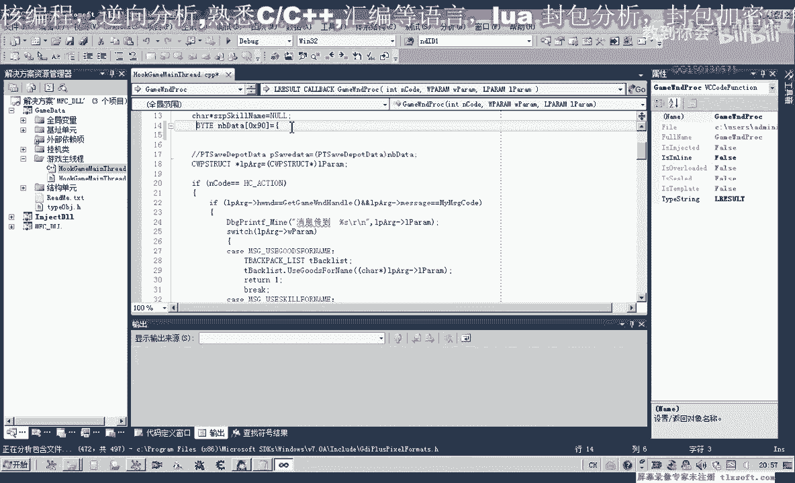

## 代码实现与测试

理解了数据结构后，我们就可以用代码来构造并发送这个封包。以下是实现步骤：

1.  **定义缓冲区**：首先，我们需要定义一个字节数组，并用一次出售操作捕获的完整缓冲区数据来初始化它。这确保了所有固定字段都被正确设置。
    ```c
    BYTE buffer[144] = {
        0x00, 0x00, 0x00, 0x00, 0x00, 0x00, 0x00, 0x00, 0x00, 0x00, 0x00, 0x00, 0x00, 0x00, 0x00, 0x00,
        0x00, 0x00, 0x00, 0x00, 0x00, 0x00, 0x00, 0x00, 0x00, 0x00, 0x00, 0x00, 0x00, 0x00, 0x00, 0x00,
        // ... 更多初始化数据
    };
    ```

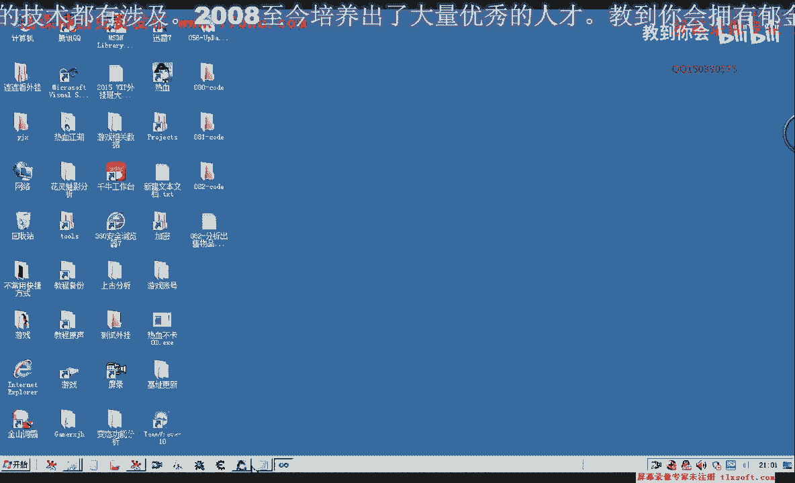

2.  **修改关键数据**：然后，我们只需要修改缓冲区中几个特定的位置，即可完成一次新的出售请求。
    ```assembly
    ; 假设 edx 指向了我们的缓冲区 buffer
    mov dword ptr [edx+0x02], 0x00800092 ; 写入指令
    mov byte ptr [edx+0x06], 0x02        ; 写入操作类型：出售
    mov dword ptr [edx+0x16], 0x03       ; 写入出售数量：3个
    ; 写入物品标识 (8字节，来自物品对象+54偏移)
    mov eax, [物品对象地址+0x54]
    mov dword ptr [edx+0x26], eax
    mov eax, [物品对象地址+0x58]
    mov dword ptr [edx+0x2A], eax
    mov byte ptr [edx+0x3F], 0x0B        ; 写入背包下标：11
    ```

3.  **调用发送函数**：最后，像之前课程一样，调用游戏内发送网络封包的函数，将我们构造好的 `buffer` 发送给服务器。

通过上述代码测试，可以成功实现出售指定数量物品的功能。

---

## 总结

本节课中我们一起学习了出售物品的封包结构。我们了解到：

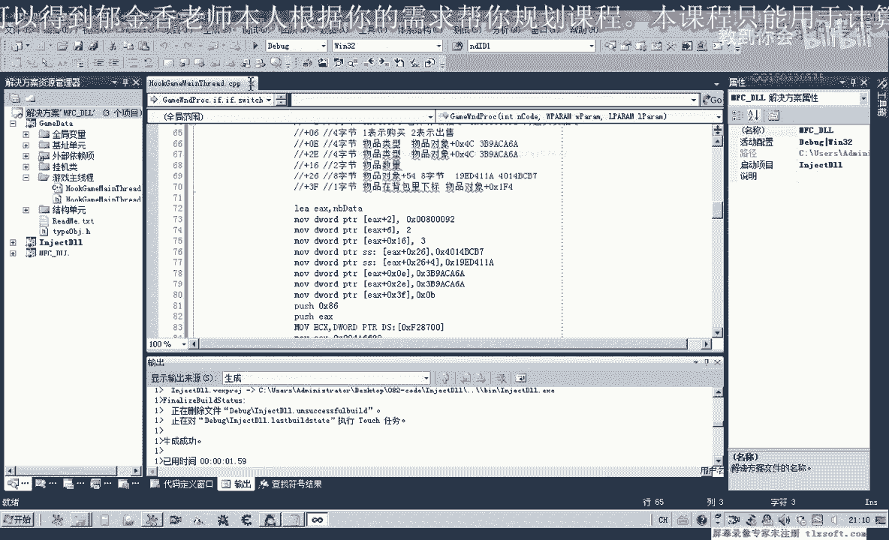

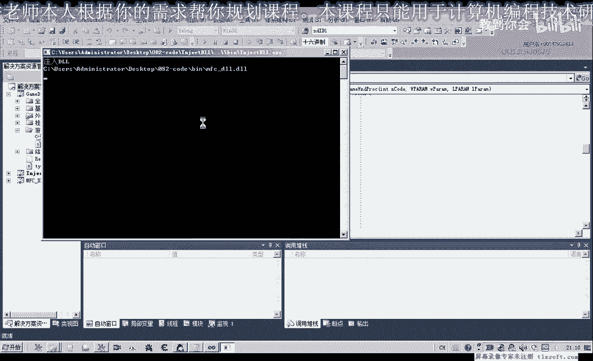

1.  出售物品与购买、存取使用相同的网络指令 (`8000 92`)。
2.  出售封包在缓冲区 `+06` 偏移处用 `02` 标识操作类型。
3.  封包中需要动态填充的关键信息包括：物品数量 (`+16`)、物品的唯一标识符 (`+26`，来自物品对象) 以及背包下标 (`+3F`)。
4.  通过初始化一个完整的缓冲区模板，然后仅修改少数几个字段，即可高效地构造出售请求。

**课后作业**：请参考第81课（购买物品）的代码结构，封装一个出售物品的函数。函数原型可设计为 `SellItem(物品名称, 出售数量)`，以提高代码的可读性和复用性。

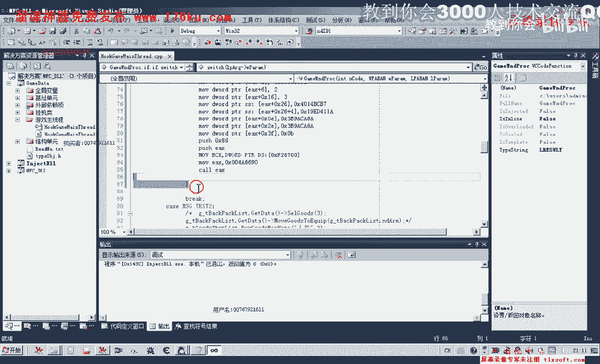

---
**下节预告**：在下一节课中，我们将对这个出售功能进行更完善的函数封装，并融入错误处理机制。