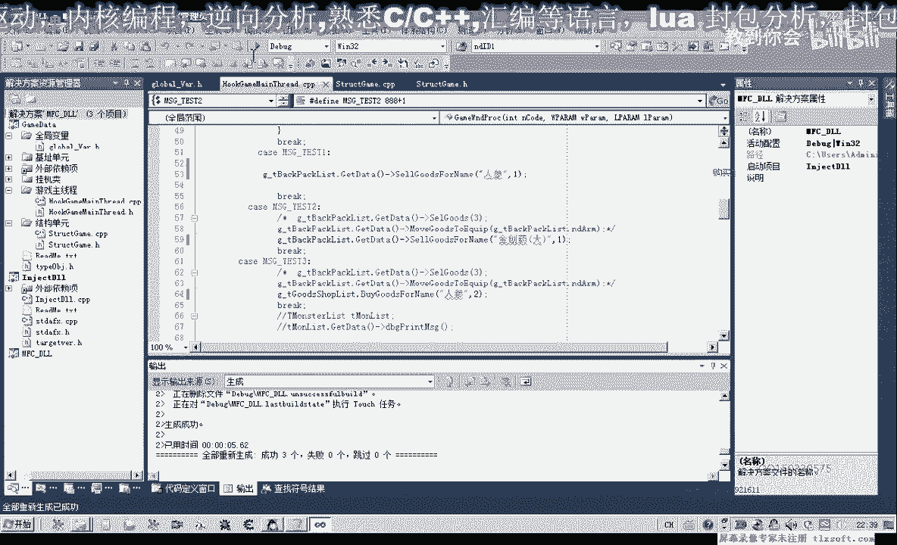
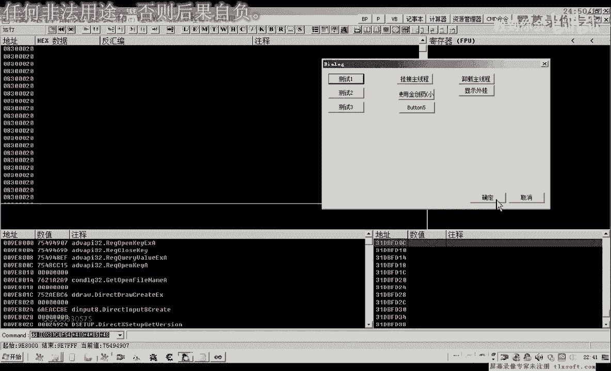
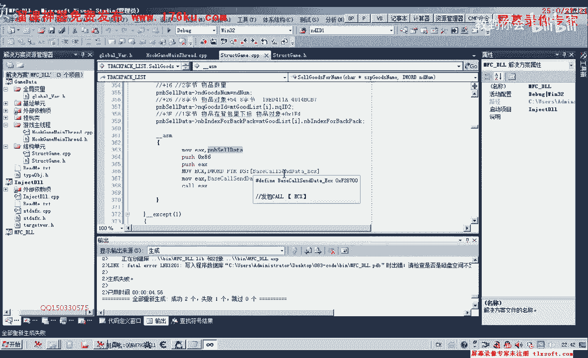
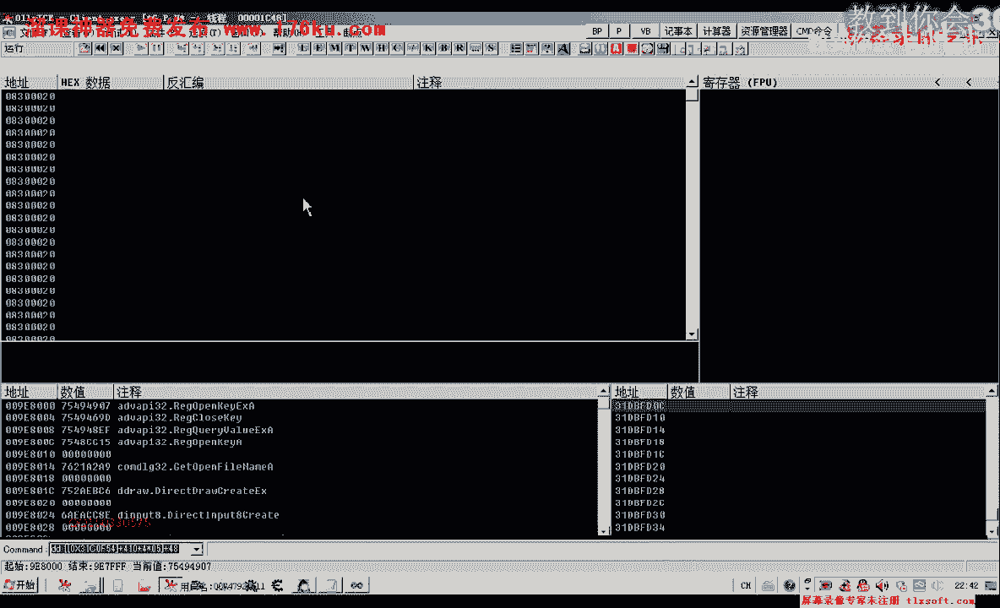
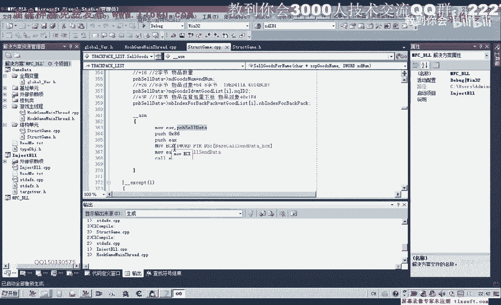

# 课程 P72：083-封装物品出售函数SellGoodsForName 📦➡️💰

在本节课中，我们将学习如何封装一个向商店出售物品的函数。我们将基于上一节课对物品出售封包结构的分析，编写并测试一个名为 `SellGoodsForName` 的函数，该函数可以根据物品名称和数量出售背包中的物品。

---

## 回顾与准备

上一节我们分析了物品出售封包的结构并计算了相关偏移。本节中，我们将基于这些偏移来封装出售函数。

首先，我们需要打开第82课的代码作为基础。第82课的代码包含了物品出售相关的初步分析。

接下来，我们转到结构体单元，检查是否需要重新定义结构。我们需要整合之前用到的偏移，并添加新的数据。

## 修改结构体定义

我们需要对结构体进行修改，以包含出售操作所需的所有字段。以下是关键偏移的整合与计算：

*   **+2**： 需要修改，代表某种类型标识。
*   **+6**： 代表出售操作码。
*   **+1** 和 **+2**： 代表物品类型。
*   **+16**： 代表物品数量。
*   **+26**： 代表物品对象的8字节标识。
*   **+21**： 代表买卖类型，占4字节。
*   **+3F**： 代表背包物品下标，占1字节。

基于以上偏移，我们重新计算并定义结构体。核心是确保从 **+2E** 到 **+3F** 的字节空间被正确划分。经过计算，我们在 **+21**（4字节）之后，需要预留13个字节的空间，才能到达 **+3F** 这个1字节的下标字段。

因此，结构体定义大致如下（使用伪代码表示核心布局）：
```c
struct SellPacket {
    // ... 其他前置字段 ...
    DWORD type_flag;      // 偏移 +2
    DWORD op_code;        // 偏移 +6
    WORD  item_type1;     // 偏移 +1, +2
    // ... 中间字段 ...
    QWORD item_count;     // 偏移 +16
    // ... 中间字段 ...
    QWORD item_id;        // 偏移 +26， 8字节
    DWORD trade_type;     // 偏移 +21， 4字节
    BYTE  reserved[13];   // 填充字节，用于对齐
    BYTE  bag_index;      // 偏移 +3F， 1字节
    // ... 可能的后置字段 ...
};
```
编译结构体，确保没有错误。

## 封装出售函数

结构体定义完成后，我们开始封装函数。我们将函数添加到与背包相关的模块中。

函数的主要逻辑步骤如下：
1.  根据传入的物品名称，在背包中查找对应的物品下标。
2.  如果下标小于0，表示背包中没有该物品，函数直接返回。
3.  如果找到物品，则构造出售封包并发送。



以下是函数实现的核心步骤：

首先，我们定义并初始化一个结构体变量来存放封包数据。由于编译器可能不支持直接的字节集初始化，我们改用指针操作来填充缓冲区。

接着，我们填充结构体的各个字段：
*   设置操作类型（+2）。
*   设置出售操作码（+6）。
*   设置物品类型（+1， +2）。
*   设置要出售的物品数量（+16），数量由函数参数传入。
*   设置物品ID（+26）。
*   设置买卖类型（+21）。
*   最关键的一步，设置背包中该物品的下标（+3F）。这个下标来自第一步的查询结果。

对于指针操作的部分，我们将其移到汇编代码调用之外进行，以确保安全性和可读性。



## 测试函数





函数封装完成后，我们进行测试。



首先，在主线程单元中，我们找到背包的全局变量。然后，我们调用新封装的 `SellGoodsForName` 函数，例如尝试出售1个人参。

设置好工作目录并挂接主线程后，我们转到游戏内进行测试。**注意：出售操作需要先打开正确的NPC商店窗口（例如平一指）。**

如果出售没有成功，我们需要按以下步骤排查：
1.  检查封包缓冲区的参数是否正确。
2.  对比我们代码中使用的偏移量与之前分析的结果是否一致。
3.  在出售操作触发时，检查游戏状态和我们的数据是否同步。

通过调试和对比，逐步修正可能存在的问题，直到出售功能正常工作。

---

本节课中我们一起学习了如何封装一个完整的物品出售函数 `SellGoodsForName`。我们从修改结构体定义开始，逐步实现了根据物品名称查找、构造封包并发送的完整逻辑，最后进行了测试和问题排查。这个函数封装了底层细节，使得通过名称出售物品变得简单直接。