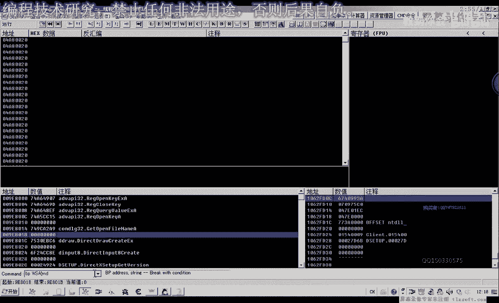
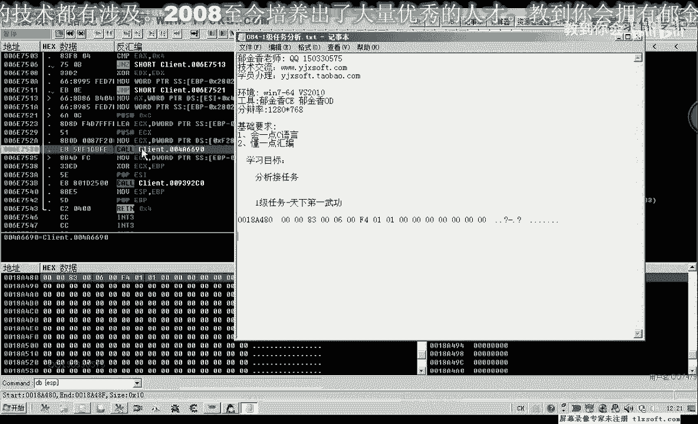
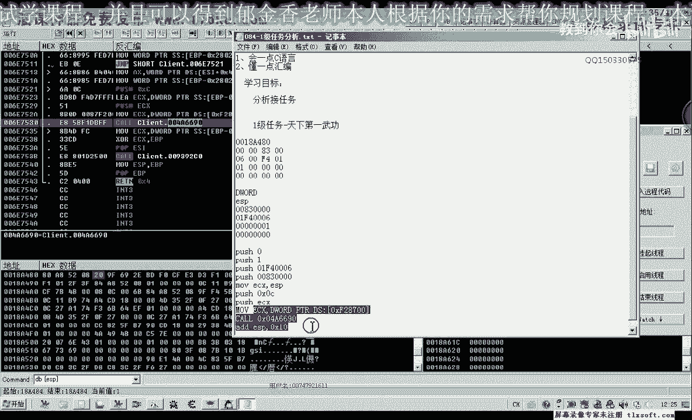
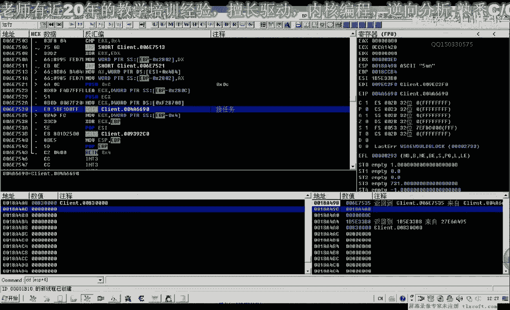
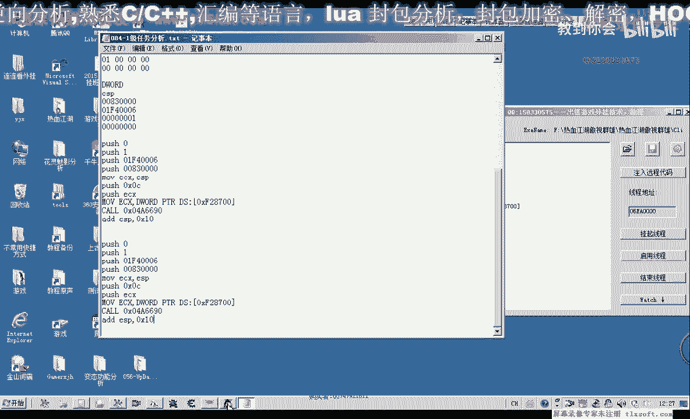
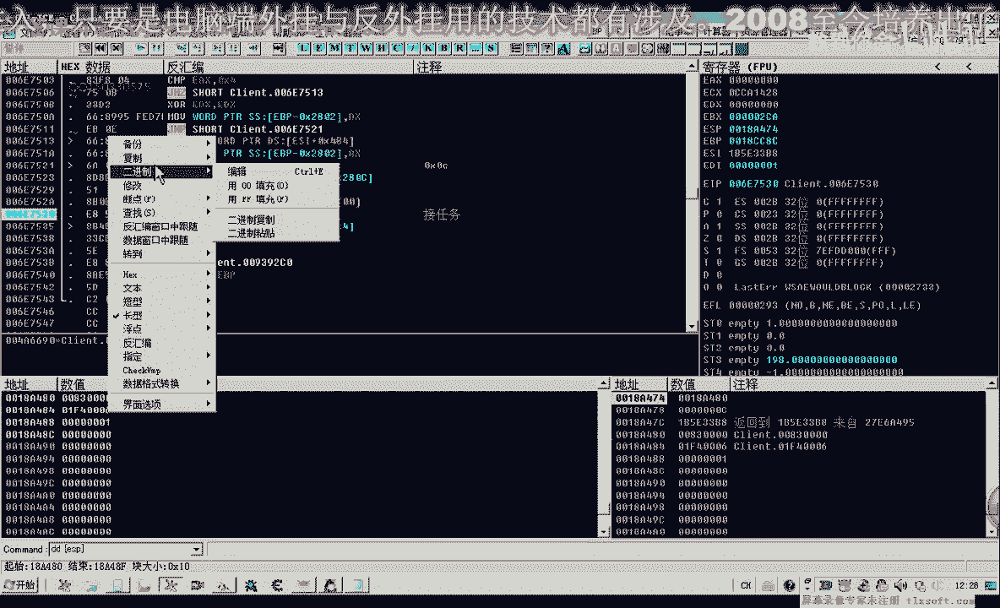
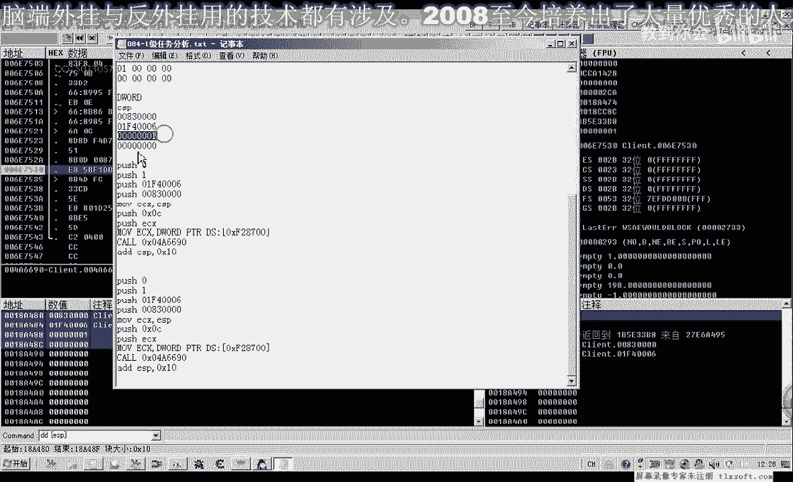
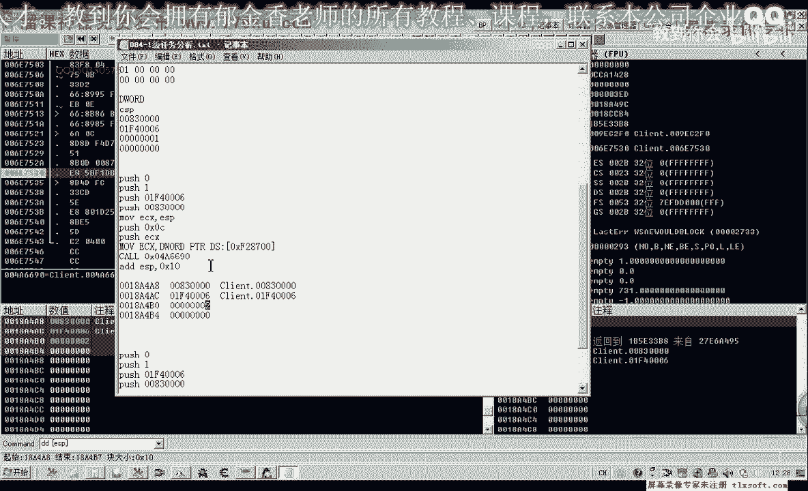
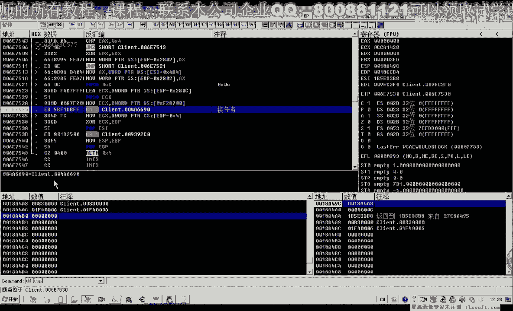
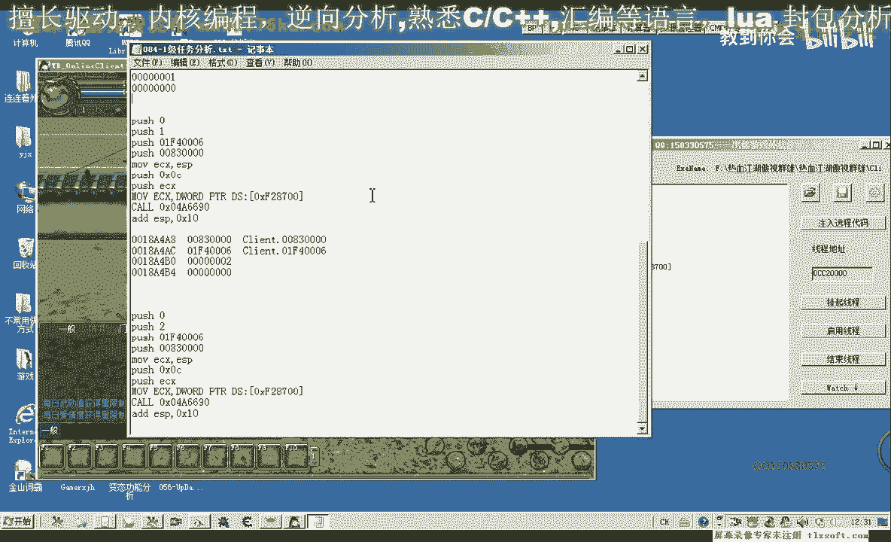

# 课程 P73：084-1级任务分析_接任务 📝

在本节课中，我们将学习如何分析并实现游戏内接取任务的逻辑。我们将以一级任务“天下第一虎空”为例，通过分析数据包和调用过程，理解接任务的核心机制。

---

## 任务接取流程概述


上一节我们介绍了任务相关的界面和NPC交互。本节中，我们来看看如何具体接取一个任务。


接取任务通常涉及与服务器通信。其基本流程如下：
1.  找到并打开发布任务的NPC。
2.  在任务列表中确认要接取的任务。
3.  点击“接受”按钮，向服务器发送接取请求。



我们将重点分析第三步中发送的数据包。

---

## 定位接任务的数据包

首先，我们需要使用调试工具（如OD）来拦截接取任务时发送的网络数据包。



以下是定位关键调用点的步骤：

1.  在游戏中打开NPC“京香玉”的任务列表。
2.  对“天下第一虎空”任务点击“接受”。
3.  在调试器中，程序会中断在发送网络封包的关键函数处。
4.  通过分析堆栈和寄存器，我们可以找到存放任务数据的缓冲区地址。

核心的调用代码通常类似于一个通用发包函数，其参数可能如下：
```assembly
PUSH 0C          ; 数据包长度
PUSH ECX         ; 数据缓冲区地址
CALL SEND_PACKET ; 调用发包函数
```

---

## 分析任务数据缓冲区


当程序中断在发包函数时，我们需要检查 `ECX` 或 `[ESP+4]` 所指向的缓冲区数据。

以“天下第一虎空”任务为例，接取时捕获到的缓冲区数据（十六进制）可能如下：
```
83 00 00 00 01 F4 00 00 00 01 00 00
```
这段数据仅有12个字节。



我们需要理解这些字节的含义。通常，任务数据包的结构是固定的：
*   **前4个字节**：代表任务ID。例如 `83 00 00 00` 表示任务ID是0x83（131）。
*   **中间4个字节**：可能代表NPC ID或其他标识。`01 F4 00 00` 可能对应NPC“京香玉”。
*   **最后4个字节**：代表操作类型。`00 01 00 00` 可能表示“接取”操作（1），而 `00 02 00 00` 可能表示“放弃”操作。

在内存中，数据以小端序（Little-Endian）排列，因此我们在构造数据时需要注意字节顺序。

---



## 构造并测试接任务调用



理解了数据结构后，我们可以尝试用汇编代码模拟发送这个数据包，以实现自动接任务。





以下是构造调用的一种方法：


1.  在堆栈上分配空间并填充任务数据。
2.  将缓冲区地址放入 `ECX`。
3.  压入数据长度和缓冲区地址参数。
4.  调用发包函数。
5.  平衡堆栈。





对应的汇编代码示例如下：
```assembly
SUB ESP, 10h                ; 在堆栈上分配16字节空间
MOV DWORD PTR [ESP], 83000000h ; 填充任务ID (小端序: 0x83)
MOV DWORD PTR [ESP+4], 0000F401h ; 填充NPC ID
MOV DWORD PTR [ESP+8], 00000001h ; 填充操作码 (接取)
MOV DWORD PTR [ESP+0Ch], 0       ; 填充剩余部分为0
LEA ECX, [ESP]                  ; ECX指向缓冲区
PUSH 0Ch                        ; 参数2: 数据长度=12
PUSH ECX                        ; 参数1: 缓冲区地址
CALL 发送封包函数地址           ; 调用发包函数
ADD ESP, 20h                    ; 平衡堆栈 (16+4+4=24=0x18，需根据实际情况调整)
```

**重要提示**：在实际测试时，为了安全起见，可以先修改缓冲区数据（例如将一个字节改为无效值），让第一次调用失败，以避免重复接取已完成的任务。确认逻辑无误后，再使用正确的数据进行成功调用。

---

## 关键点与常见问题

在分析和测试过程中，需要注意以下几点：



*   **操作步骤**：接取任务通常是两步操作。第一步点击任务列表中的任务名（数据包操作码可能为1），第二步点击“接受”按钮（数据包操作码可能为2）。我们分析的是第二步。
*   **数据长度**：不同任务的数据包长度可能不同，需根据实际情况调整。
*   **字节顺序**：所有多字节数据（如ID）都必须转换为小端序格式。
*   **堆栈平衡**：调用函数后，必须正确恢复堆栈指针，否则会导致程序崩溃。

---

## 总结

本节课中，我们一起学习了如何分析游戏接取任务的功能。

我们首先回顾了接任务的整体流程，然后使用调试工具定位到发送接任务请求的关键代码和数据缓冲区。通过分析缓冲区的十六进制数据，我们解读了任务ID、NPC ID和操作类型等核心信息的存储格式。最后，我们学习了如何用汇编代码构造并发送这个数据包，以模拟接任务的操作。


掌握这一分析过程，是理解游戏网络通信机制和实现自动化功能的重要基础。在后续课程中，我们将运用类似的方法分析其他游戏功能。