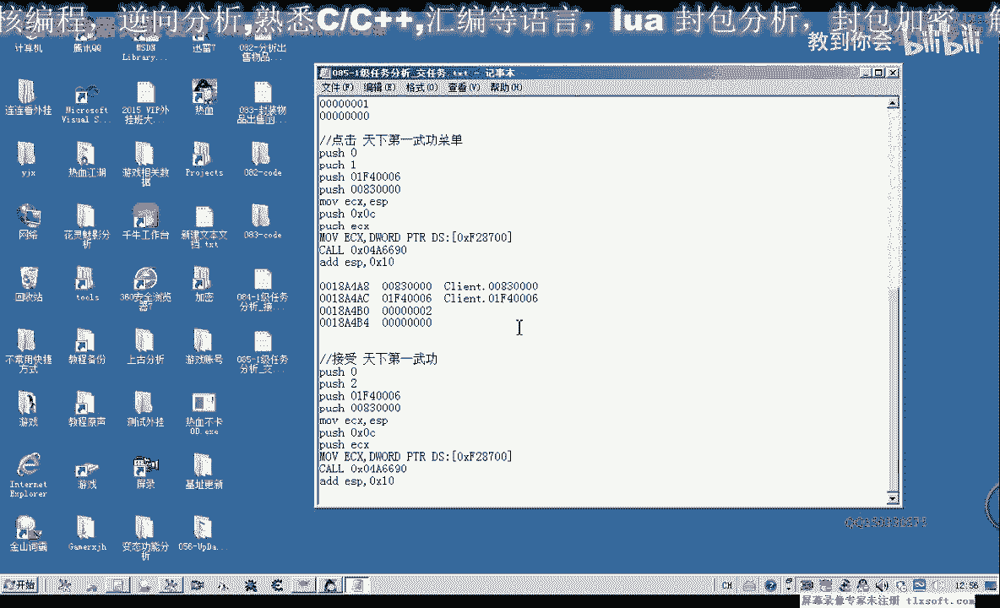
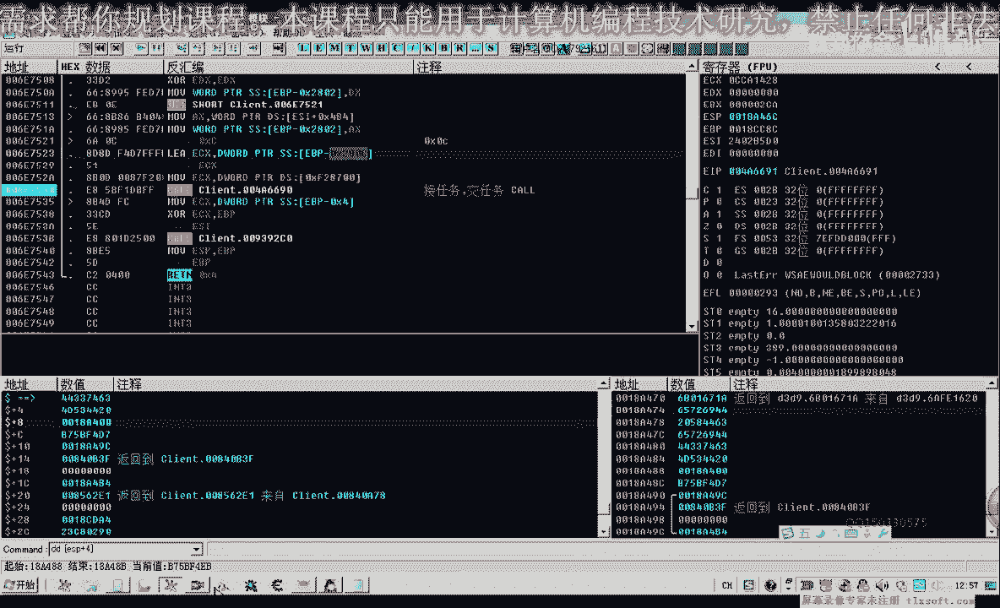
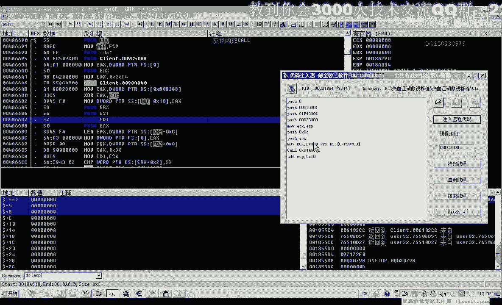
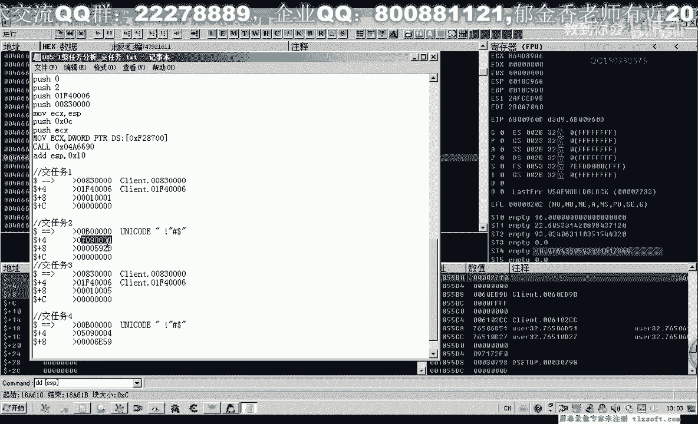

# 逆向工程教程 P74：085-1级任务分析_交任务 🎮

在本节课中，我们将要学习如何分析并完成游戏中的任务提交过程。我们将通过逆向工程的方法，定位并理解客户端向服务器提交任务时发送的数据包结构。

上一节我们介绍了如何分析并接取任务，本节中我们来看看如何将已完成的任务提交给NPC。

## 任务提交流程分析

接取任务后，任务物品栏中会出现“金镶玉的书信”。按 `Ctrl+Q` 打开任务列表，可以看到“天下第一武功”任务，描述要求我们带着书信去找盟主。

我们需要找到盟主NPC的位置。

到达盟主位置后，点击“天下第一武功”即可完成任务提交。

## 数据包断点分析

为了分析提交任务时发送的数据，我们在发包函数 `46690` 处下断点。点击提交任务后，程序会在此处中断。

返回上一层调用，我们发现接任务与交任务调用了同一个函数，使用了相同的结构。

以下是分析步骤：

1.  首先，转到 `[esp+4]` 地址处，此处存放了数据包缓冲区的地址。
2.  数据包前8个字节可能表示任务操作类型（接取/提交），其后的数据可能包含任务编号。
3.  在本例中，任务编号为 `1001`。

我们先将此处的数据破坏（例如用0填充），让程序继续运行，然后使用代码注入器进行测试。

## 关键数据包定位

任务提交可能涉及多个数据包。我们再次下断点并点击提交，捕获到了另一组数据。

这可能是真正的提交任务数据包，或者需要与之前的数据包组合才能生效。我们让程序继续运行，并观察堆栈变化。

程序可能发送了四到五个数据包来完成整个提交过程。

## 多账户测试验证

由于当前角色的任务物品已消失，我们换一个新账户进行测试。

新账户的“天下第一武功”任务显示未完成。我们使用代码注入器，依次注入之前捕获的各个缓冲区数据进行测试。

以下是测试的数据包示例：

*   **数据包1:** `1001...`
*   **数据包2:** `00 52 59 20 ... 00 0B ...`
*   **数据包3:** `01 00 ... EF 04 10 05 ... 83 00`

测试发现，**数据包3** 成功触发了任务提交。这表明任务提交可能需要多个步骤的数据交互。

## 完整流程模拟测试

我们新建一个账号，模拟完整流程：

1.  **第一步：** 注入接任务的数据包（不打开NPC对话也可接取任务）。
2.  **第二步：** 控制角色移动到盟主位置。
3.  **第三步：** 尝试直接注入提交任务的数据包（数据包3），发现无效。
4.  **第四步：** 打开NPC对话框后，再注入数据包3，仍然无效。
5.  **第五步：** 在打开NPC对话框后，先注入一个交互数据包（可能是“任务二”或第一步的数据），再注入提交数据包（数据包3），成功获得任务奖励“金链子”。

这说明完整的任务提交可能需要至少两个阶段的数据交换。

## 总结

本节课中我们一起学习了游戏任务提交的逆向分析过程。我们通过下断点捕获了客户端与服务器通信的数据包，并通过多轮测试，初步确定了提交任务可能需要多个数据包按顺序发送才能成功，例如一个用于初始化NPC交互，另一个用于确认提交。更详细的包结构分析和组合逻辑，建议大家在课后自行深入测试。