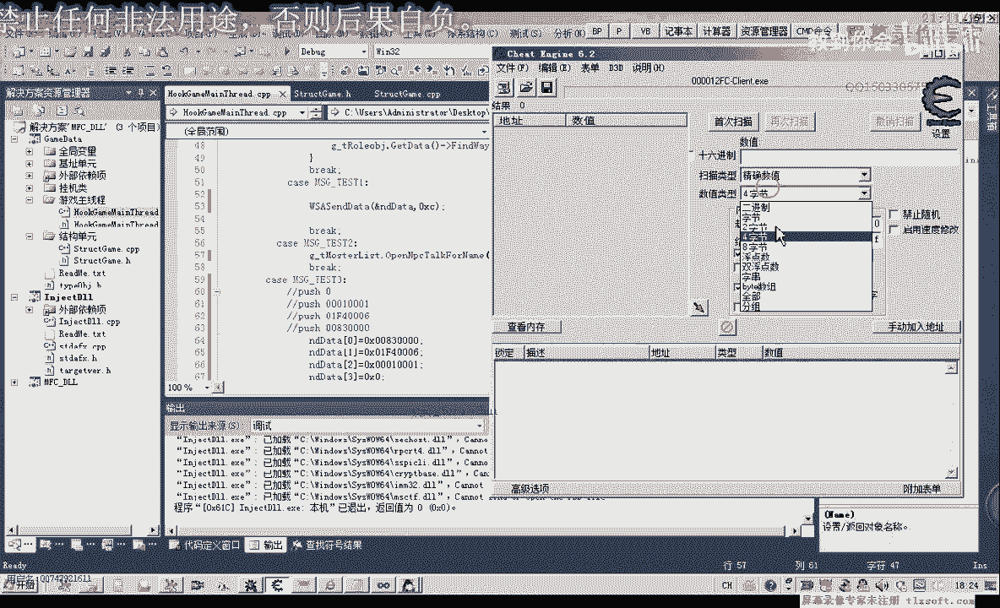
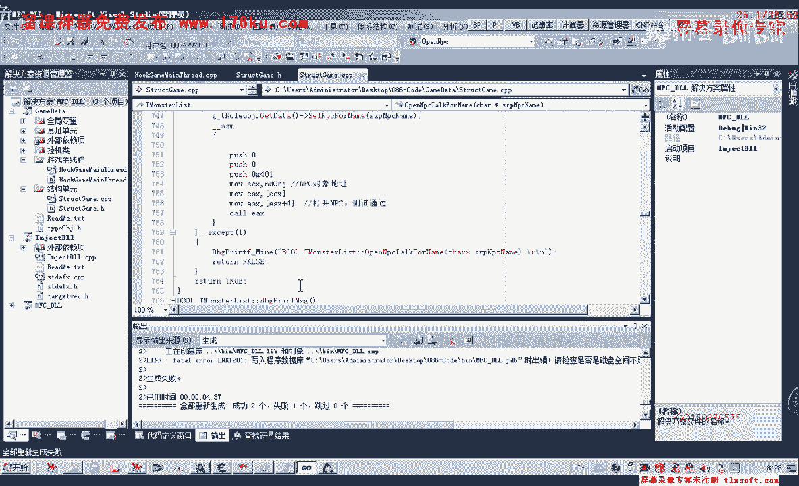
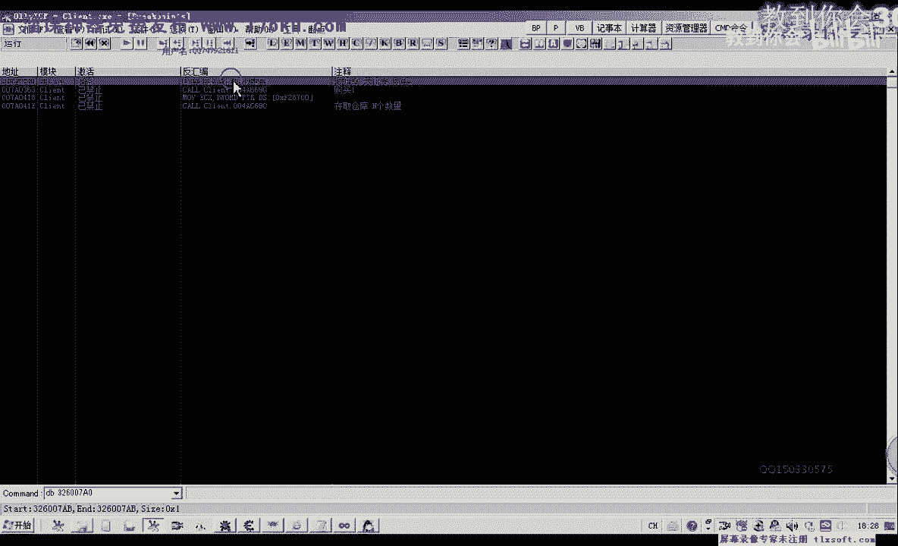
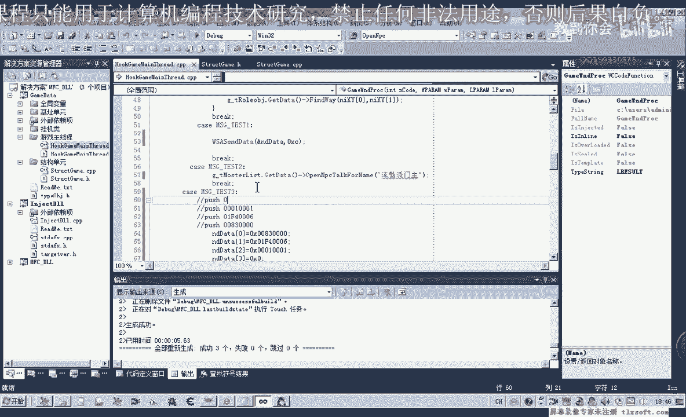
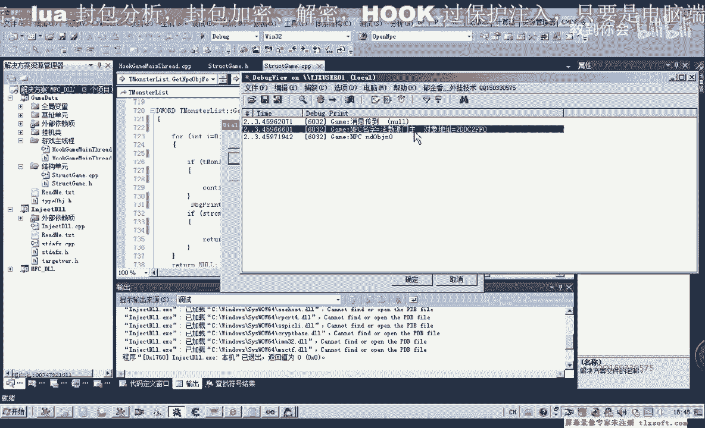
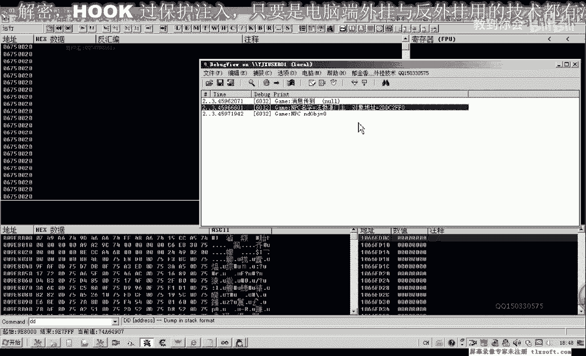
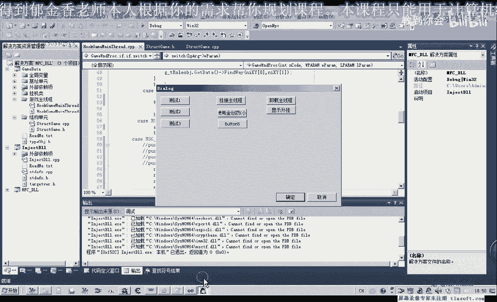

# 课程 P75：086-封装发包函数及测试1级任务代码 📦➡️🎯

在本节课中，我们将学习如何封装一个通用的发包函数，并利用它来测试一个游戏中的1级任务流程。我们将从调整程序权限开始，逐步封装函数，并最终实现自动接取、对话和提交任务的完整代码。

## 概述

我们将修改第83课的代码，首先解决程序权限问题以确保注入成功。接着，封装一个通用的发包函数以简化多处调用。最后，利用这个封装函数，构建并测试一个自动完成1级任务的脚本。

## 调整程序权限

由于权限问题，代码有时无法注入到目标程序。我们可以通过调整链接器设置来解决。

以下是具体步骤：
1.  打开项目属性。
2.  转到“链接器” -> “清单文件” -> “UAC执行级别”。
3.  将其设置为 `requireAdministrator`（即“管理员”级别）。

这样设置后，生成的注入程序（exe）部分便会以管理员权限运行，使注入操作更加方便。

## 封装通用发包函数

上一节我们解决了权限问题，本节中我们来看看如何封装一个通用的发包函数。这个函数将被多处调用，它接收两个参数：数据缓冲区的指针和缓冲区的大小。

首先，我们转到结构定义单元。在文件最前面，我们添加一个参数定义，其类型为 `void*`，表示缓冲区指针；另一个参数是 `DWORD` 类型，表示缓冲区大小。


接着，我们转到源代码单元。以下是封装函数的实现步骤：

1.  添加异常处理机制。
2.  编写内联汇编代码，将传入的参数（缓冲区大小和指针地址）分别加载到合适的寄存器中。
3.  调用目标发包函数（地址为 `0x4A6690`）。
4.  函数需要返回值：如果出现异常则返回 `false`，成功则返回 `true`。

以下是核心的汇编代码逻辑：
```assembly
mov ecx, [缓冲区指针]
push [缓冲区大小]
call 0x4A6690
```
封装完成后，我们编译测试一下。之后，我们就可以在代码中直接调用这个封装函数，例如：
```cpp
bool result = SendPacket(pBuffer, bufferSize);
```


## 修改现有功能调用




封装好通用函数后，我们可以用它来简化之前编写的功能代码。


以下是需要修改的功能点列表：
*   **出售物品**：直接调用封装函数，传入物品数据结构的指针和固定大小 `0x86`。
*   **存入仓库**：同样调用封装函数，传入仓库操作数据结构的指针和大小 `0x86`。
*   **取出仓库物品**：此功能原使用 `move` 指令实现，现改为调用封装函数。注意，这里需要传递结构体的地址（使用 `&` 操作符取址）。





逐一修改并编译通过后，这些功能的实现将更加简洁和统一。

## 构建并测试1级任务脚本

现在，我们利用封装好的函数来构建一个自动完成1级任务的脚本。该任务流程分为三步：接任务、打开NPC对话框、提交任务。



首先，我们在主线程单元中编写测试代码。以下是每一步的具体实现：


1.  **接任务**：
    *   构建一个特定的数据结构，填充任务ID（例如 `0xEF4006`）等信息。
    *   调用封装函数 `SendPacket` 发送这个数据包。



2.  **打开NPC对话框**：
    *   此步骤需要先选中名为“门主”的NPC。
    *   通过遍历游戏对象列表，比较名称来找到目标NPC。**注意**：我们发现游戏中的NPC名称后可能带有一个空格字符（ASCII `0x20`），在比较字符串时必须包含它，否则无法正确识别。
    *   找到NPC后，发送打开对话框的封包。





3.  **提交任务**：
    *   提交任务需要发送两个连续的封包。
    *   构建两个略有不同的数据结构（主要是任务状态标识不同）。
    *   依次调用两次 `SendPacket` 函数发送。

编写完成后，我们创建一个新的游戏角色进行测试。依次执行三步操作，观察角色是否成功接取任务、打开NPC对话框并获得任务奖励（如经验值），以验证脚本功能。



## 总结

本节课中我们一起学习了如何封装通用发包函数并应用于实际游戏任务自动化。我们首先通过调整UAC权限解决了注入问题，然后封装了一个接收缓冲区和大小参数的函数，简化了多处调用。接着，我们用这个函数重构了出售、存仓等已有功能。最后，我们设计并实现了一个完整的1级任务自动化脚本，涵盖了接任务、寻路对话、交任务的全流程，并通过新建角色进行了成功测试。下一节课，我们将把这个任务流程进一步封装成一个独立的、可复用的函数。