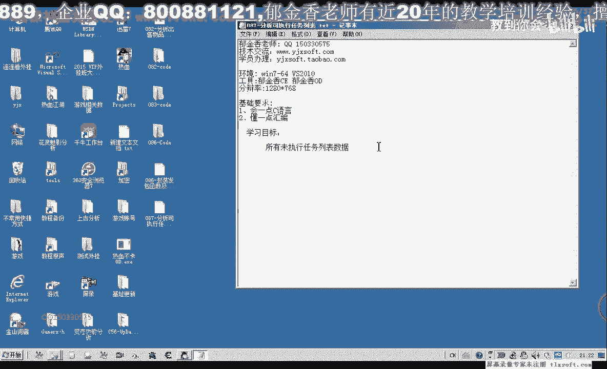

# 逆向课程 P76：087-分析可执行任务列表 📋


在本节课中，我们将学习如何分析游戏中的可执行任务列表数据。我们将通过动态调试，定位并解析任务列表在内存中的存储结构与读取逻辑。

---

## 一、定位任务列表数据缓冲区

上一节我们介绍了任务相关的数据分析，本节中我们来看看如何定位未执行任务列表的数据来源。

首先，在游戏中按下 `Ctrl+Q` 打开“全部任务”列表。我们选择一个任务（例如“保护农田”）作为分析目标。


使用调试器附加到游戏进程，并搜索任务名称字符串。修改字符串后返回游戏观察变化，可以定位到显示任务名的内存地址。通过反复打开/关闭任务列表并修改字符串，可以确定任务列表数据的来源缓冲区地址。


最终，我们定位到一个关键地址，它是任务相关数据的缓冲区起点。我们将以此为基础进行回溯分析。

---

## 二、回溯读取任务名的代码

定位到数据缓冲区后，我们需要找到读取这些数据的代码。

在调试器中查找访问了该关键地址的代码。通常会有多处读取操作。我们将这些代码地址记录下来。

以下是访问该地址的几处关键代码（均为读取操作）：
1.  地址 A: 读取一个字节的任务数据。
2.  地址 B: 另一处读取操作。
3.  地址 C: 可能涉及任务列表更新的读取。

写入操作可能发生在任务状态改变（如完成任务）后，重新打开列表时服务器更新数据。

接下来，我们使用 OD 附加游戏，转到第一个读取代码处下断点。

---

## 三、分析任务名获取公式

当游戏断下后，我们观察堆栈和寄存器，追踪任务名数据的来源。

代码显示，任务名来源于一个基址加上一个计算出的偏移。分析汇编代码，其逻辑可以概括为以下公式：

**任务名指针 = [基址 + 偏移 * 0x40 + 0x4]**

其中：
*   **基址** 是一个全局的游戏对象指针。
*   **偏移** 是从任务列表结构体中循环读取的一个索引值（每次循环增加 8）。
*   **0x40** 是每个任务名数据块的大小。
*   **+ 0x4** 是任务名字符串在数据块内的偏移。

核心的汇编代码逻辑如下：
```assembly
mov edx, [edi]          ; 从EDI指向的内存取出偏移值
imul edx, edx, 0x40     ; 偏移值乘以 0x40
add edx, [ecx+0x4]      ; 加上基址ECX中的地址再加4
mov eax, [edx]          ; 最终得到任务名字符串指针
```

我们的目标是找到 **基址** 和存储 **偏移数组** 的源头。

---

## 四、追踪基址与循环结构

通过逐步回溯寄存器 `ECX`（基址）和 `EDI`（偏移数组指针）的来源，我们最终定位到：

*   **基址** 来源于一个我们之前已知的全局游戏对象指针，例如 `[GameObj + 0x2A4]`。
*   **偏移数组的起始地址** 计算公式为：`起始地址 = [某个指针 + 0x44]`。
*   **偏移数组的结束地址** 计算公式为：`结束地址 = 起始地址 + 0x48`。

代码通过一个循环遍历这个数组，每次取出一个偏移值，代入上述公式计算，从而获取列表中的每一个任务名。循环结束的条件就是当前指针 `EDI` 是否等于结束地址。

关键循环与结束判断代码如下：
```assembly
; 循环开始
add edi, 0x8                ; 每次循环，指针增加8字节
cmp edi, esi                ; ESI 是结束地址（起始地址+0x48）
jl loop_start               ; 如果未到达结束地址，继续循环
```

---

## 五、验证与总结

本节课中我们一起学习了如何分析游戏任务列表的数据结构。

1.  **定位数据**：通过内存修改与对比，找到任务列表的显示缓冲区。
2.  **回溯代码**：找到读取任务数据的关键代码片段。
3.  **解析公式**：分析出获取单个任务名的核心计算公式：**`任务名 = [[基址] + (偏移 * 0x40) + 0x4]`**。
4.  **理解结构**：明确了任务列表是以一个“偏移值数组”的形式存储，程序通过遍历该数组，结合基址和固定步长（0x40）来获取所有任务名。

我们得到了以下核心信息：
*   **基址指针**：通常是一个全局游戏对象。
*   **偏移数组起始**：`[某指针 + 0x44]`
*   **偏移数组结束**：`起始地址 + 0x48`
*   **任务名计算**：对数组中每个值 `N`，任务名地址为 `[[BasePtr] + (N * 0x40) + 0x4]`

在下一节课中，我们将基于本节课分析出的公式和地址，编写代码来自动遍历并打印出所有的可执行任务列表。