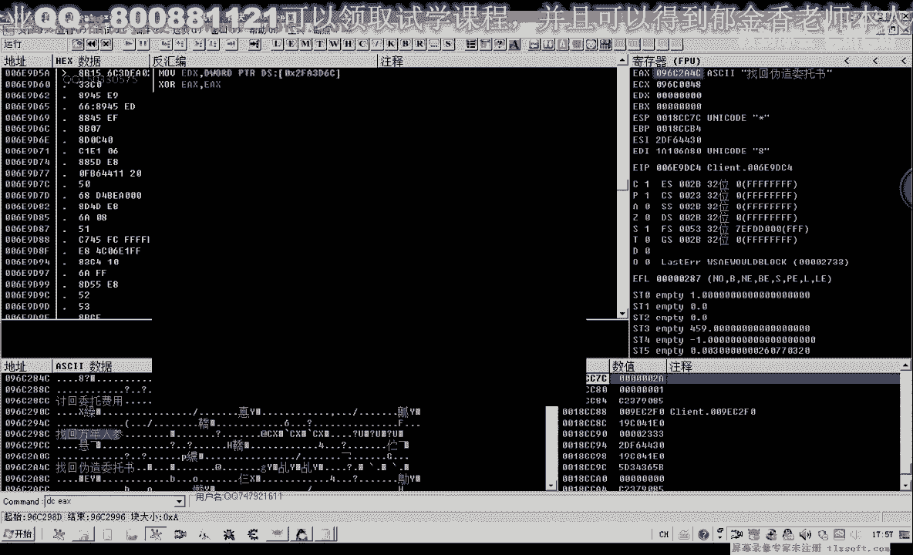
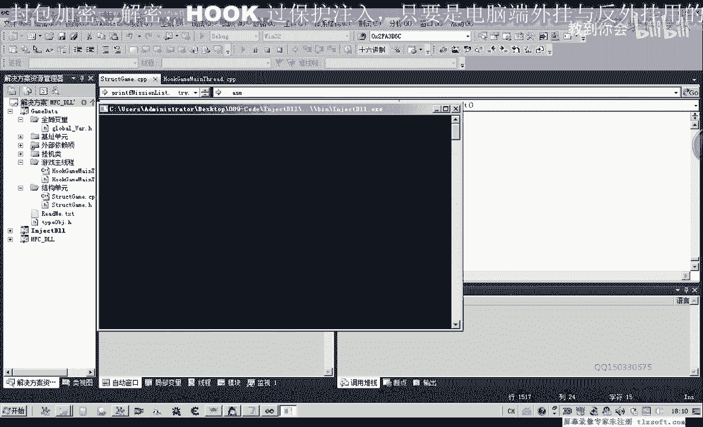
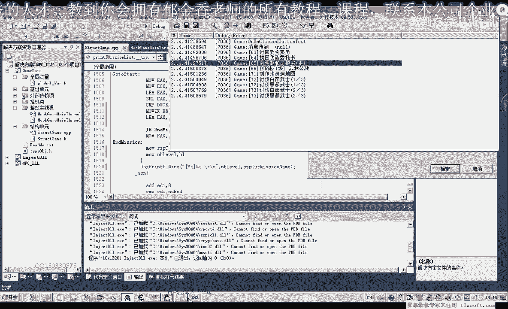
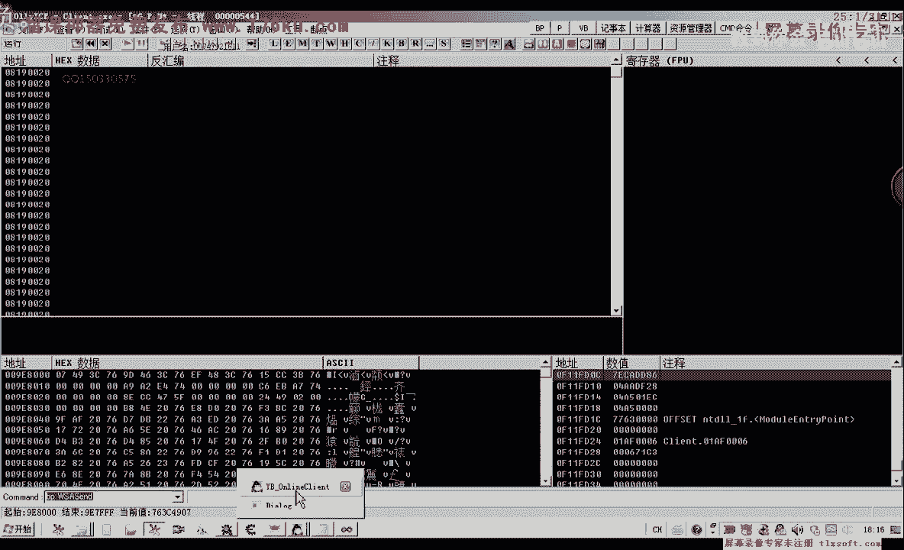
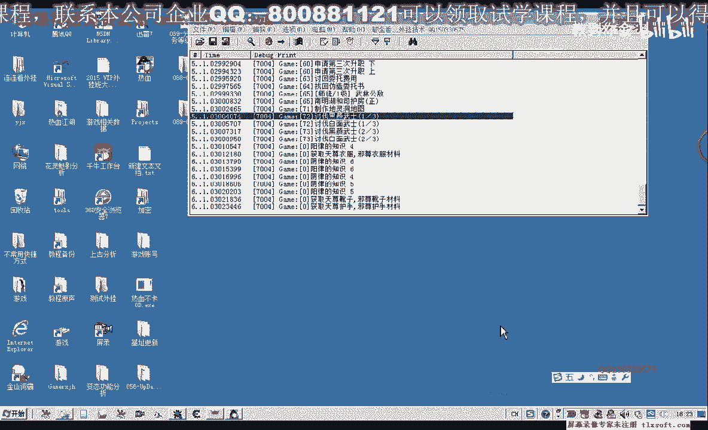

# 课程 P78：089-分析任务等级需求并测试 📊


在本节课中，我们将学习如何分析游戏中的任务等级数据，并通过编写代码来读取任务名称和等级信息。我们将从定位相关数据开始，逐步理解其结构，并最终实现一个简单的测试程序。

***

## 概述

本节课的目标是分析游戏任务列表的数据结构，特别是任务名称和等级信息的存储方式。我们将通过逆向工程的方法，定位关键的内存偏移量，并编写代码来读取这些数据。

***

## 定位任务列表数据

首先，我们需要在游戏中找到任务列表的显示位置。通过调试工具，我们可以在任务列表的显示代码处设置断点，以观察相关数据的读取过程。



在游戏内打开所有任务列表，并在此处下断点。使用快捷键 `Ctrl+Q` 可以显示出所有任务列表。列表中，每个任务前都有一个括号内的等级数字，例如 `(25)`，表示需要达到25级才能接取该任务。

我们的目标是找到存储这些任务等级数据的内存地址和结构。

***

## 分析等级数据来源

通过观察断点处的汇编代码，我们发现任务等级的显示与一个格式化字符串有关。代码中出现了类似 `%d` 的格式化字符串，用于将等级数值嵌入到显示的文本中。

进一步分析，我们发现等级数据来源于一个特定的内存偏移量。在代码中，等级值通过类似 `movzx eax, byte ptr [ecx+edx+0x20]` 的指令读取，其中 `0x20` 是关键偏移。

同时，任务名称的地址也存储在附近，通常位于 `[ecx+edx+0x4]` 的位置。但这里有一个判断条件：需要检查 `[ecx+edx+0x18]` 处的值是否大于 `0x10`，以决定名称是直接存储的字符串还是一个指向字符串的指针。

以下是关键偏移的总结：

*   **任务名称指针/字符串**：偏移 `+0x4`
*   **名称类型判断**：偏移 `+0x18`（用于判断 `+0x4` 处是直接字符串还是指针）
*   **任务等级**：偏移 `+0x20`

***

## 编写测试代码

在理解了数据结构后，我们将在现有代码的基础上进行修改，添加读取任务等级的功能。

上一节我们分析了任务数据的关键偏移，本节中我们来看看如何用代码实现读取。




我们需要新增一个变量来存储任务等级。由于等级通常是一个字节（BYTE），我们需要使用 `movzx` 指令来正确读取并扩展它。

以下是修改代码的核心步骤：

1.  在读取任务名称地址之前，先读取任务等级。
2.  将等级值存储到一个局部变量中。
3.  在输出任务信息时，将等级一并打印出来。

关键代码片段如下：
```assembly
; 假设 ebx 保存了基地址，edx 保存了索引偏移
; 读取任务等级 (BYTE)
movzx eax, byte ptr [ebx+edx+0x20]
mov [local_task_level], eax ; 存储到局部变量

; 读取任务名称地址/字符串
mov eax, [ebx+edx+0x4]
; ... 后续判断和名称处理代码 ...



; 打印时包含等级
invoke wsprintf, addr buffer, addr szTaskFormat, [local_task_name], [local_task_level]
```
***

## 测试与发现问题



编译并运行修改后的代码进行测试。我们发现，成功注入了代码并能够读取到任务列表。

然而，测试过程中发现了两个重要问题：

1.  **代码执行顺序导致数据错误**：最初，读取等级的代码被放在了错误的位置，导致使用的基地址 `eax` 已经变化，从而读到了错误的内存地址。必须确保在正确的上下文（即基地址还未被改变时）读取等级数据。
2.  **数据初始化依赖**：我们的代码能够遍历到的任务列表数据，似乎依赖于游戏内任务界面是否被主动打开过（例如按过 `Ctrl+Q`）。如果游戏刚启动，从未打开过任务列表，则遍历会失败或得到空数据。这表明任务列表数据可能是在界面打开时才从服务器获取或进行本地初始化的。

***

## 总结与思考题

本节课中我们一起学习了如何分析游戏任务等级的数据结构，并通过实践编写代码来读取任务名称和等级信息。我们掌握了关键的内存偏移量（`+0x4`, `+0x18`, `+0x20`）及其作用，也遇到了实际编码和测试中的典型问题。




目前我们实现的功能还依赖于游戏内任务列表已被初始化。留给大家的思考题是：如何主动触发或模拟这个初始化过程？例如，是否可以找到游戏内部调用打开任务列表的函数（`Call`），并在我们的代码中调用它，以确保数据总是可用？请大家尝试分析和寻找这个更新任务数据的相关调用。