# 课程 P79：090-更新任务列表分析 📝

在本节课中，我们将学习如何分析并更新游戏中的任务列表数据。我们将通过逆向工程的方法，定位初始化任务列表的关键代码，并理解其数据结构与调用流程。


---

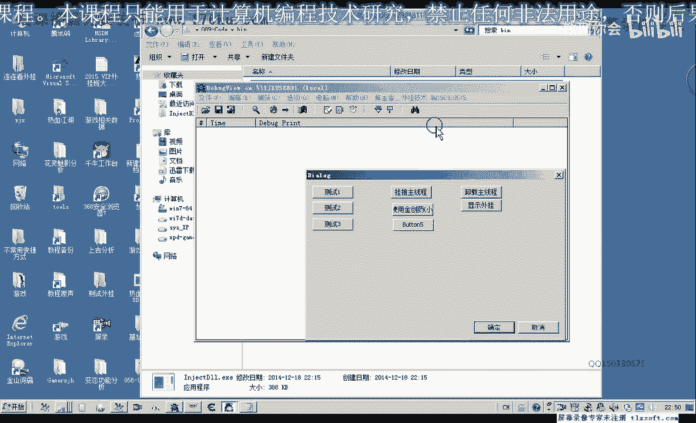

## 概述

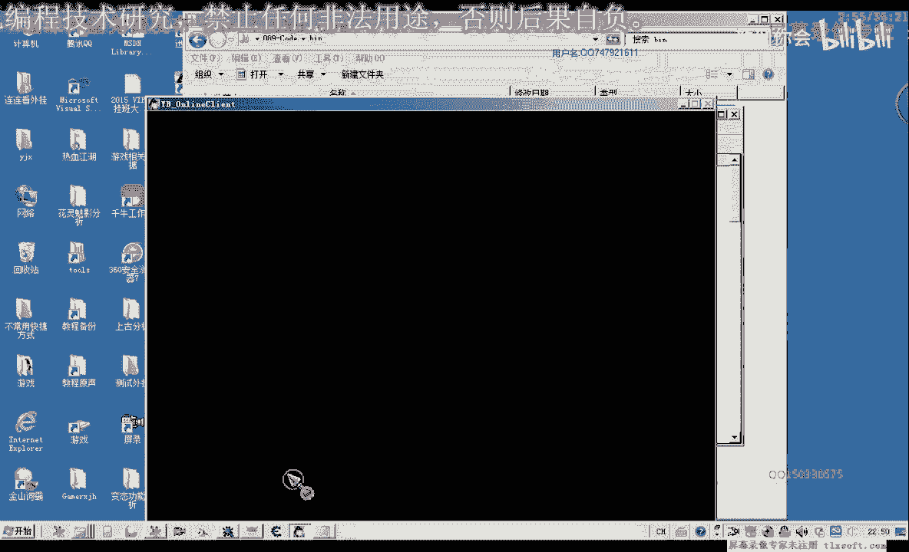

游戏中的任务列表分为“执行中的任务”和“可执行的任务”两类，它们分别存储在不同的内存偏移地址中。我们的目标是找到初始化这些任务列表数据的函数，以便能够通过代码直接获取或更新任务信息，而无需手动点击游戏界面。

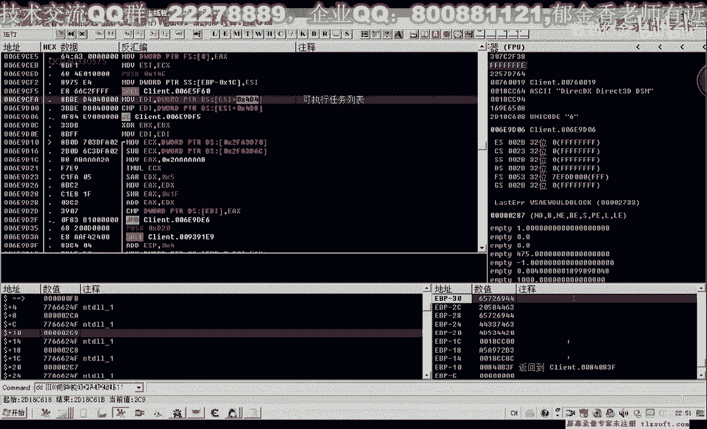

上一节我们分析了任务列表的基本结构，本节中我们来看看如何定位并调用初始化任务列表数据的核心函数。

---


## 任务列表的内存偏移


在游戏中，按下特定快捷键（如Ctrl+C）打开任务界面时，任务列表数据会被初始化并写入内存。

以下是两类任务列表对应的关键内存偏移地址：


*   **执行中的任务列表**
    *   起始地址：`0x4C4`
    *   结束地址：`0x4C8`

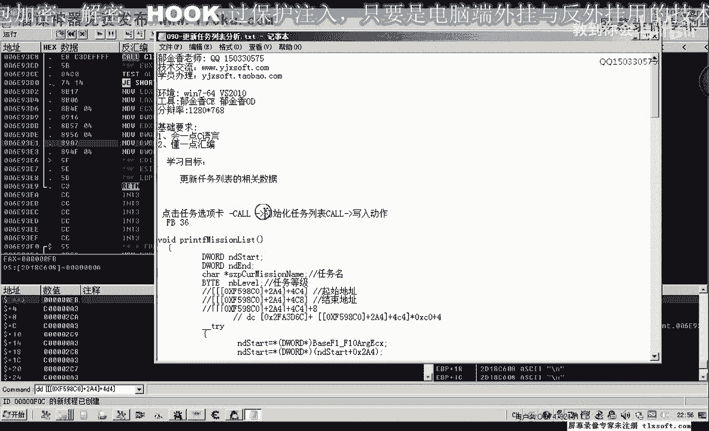

*   **可执行的任务列表**
    *   起始地址：`0x4D4`
    *   结束地址：`0x4D8`


通过在这些地址下断点，可以观察到当切换任务选项卡（如“全部任务”、“适合自己”）时，游戏会向这些地址写入数据，从而触发断点。

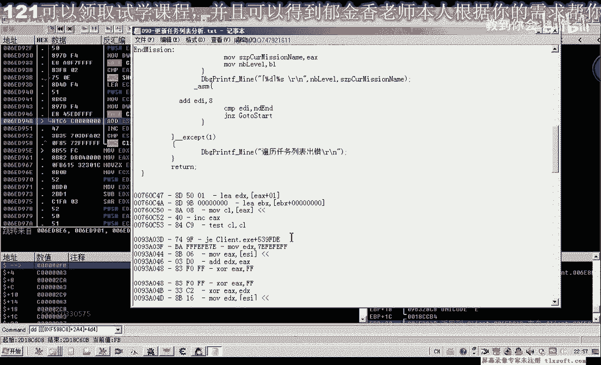

---

## 定位数据写入点

为了找到初始化列表的代码，我们从数据写入点开始逆向分析。

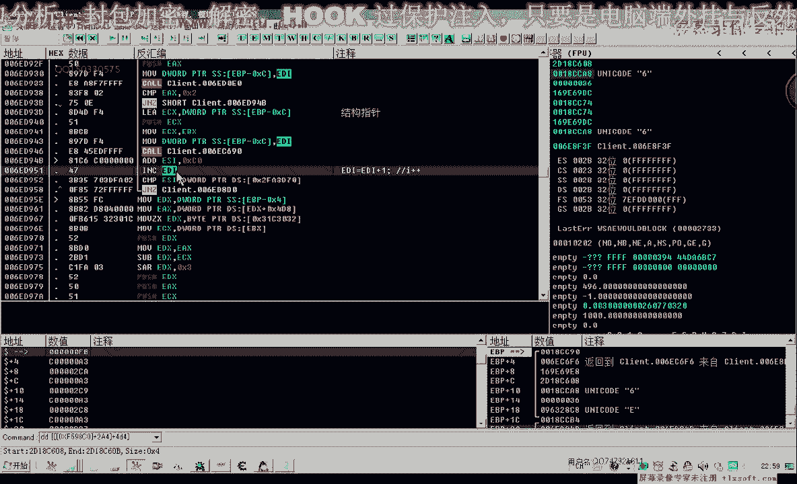

在地址 `0x4D8` 处下内存写入断点，然后点击“全部任务”选项卡。游戏会断在向该地址写入数据（例如 `0x0A`）的代码处。

同样，点击“适合自己”选项卡时，也会向同一地址写入另一个数据（例如 `0x36`）。

**核心观察**：写入 `0x4D8` 地址的数值（如 `0xFB`, `0x36`）似乎是一个标识，用于关联当前显示的是哪种任务列表。


我们的策略是：通过分析这个写入动作的代码，向上层回溯，找到负责初始化整个任务列表的函数。

---

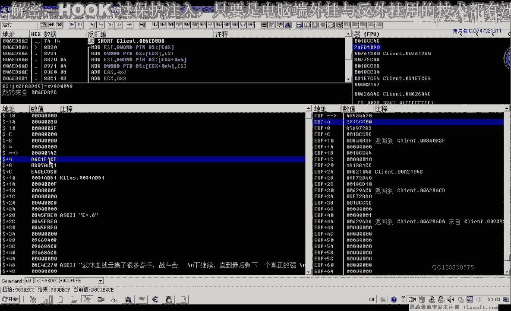

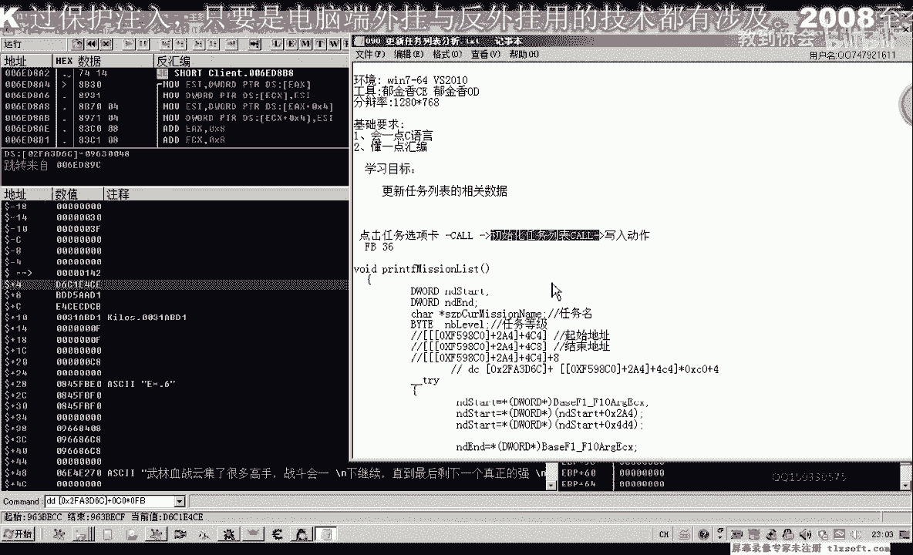

## 分析初始化循环

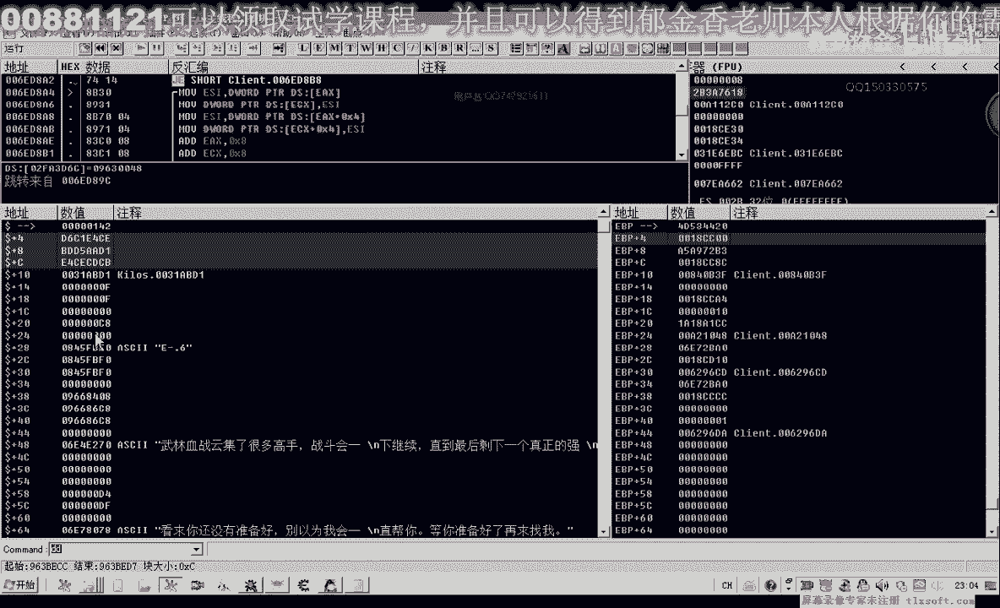

从写入点向上层回溯代码，我们找到了一个关键的函数，其中包含一个循环结构。


以下是该循环中与数据结构相关的关键汇编指令：


```assembly
MOV ECX, 0xC0          ; 每次循环增加 0xC0 偏移，这很可能是一个任务结构体的大小
INC EDI                ; EDI 寄存器递增，类似于循环计数器 i++
MOV [ESI+EDI*4], EDI   ; 将 EDI 的值写入缓冲区，这可能是在填充任务ID或索引
```

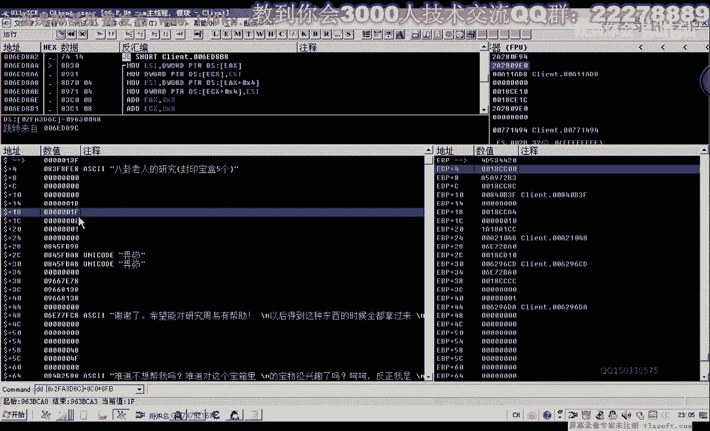


**分析**：
*   `0xC0` 这个值频繁出现，它很可能代表单个任务数据**结构体的大小**。
*   `EDI` 寄存器在循环中递增，其值可能被用作任务数组的**索引**。
*   数据来源 `ESI` 指向一个基址（例如 `0xD6XXXXXX`），这个基址加上索引乘以结构体大小，就能遍历所有任务数据。

这个循环函数的作用是：遍历一个包含所有任务原始数据的结构体数组，根据某些条件（如等级要求、是否完成）进行筛选，然后将符合条件的任务信息写入到任务列表的显示缓冲区中。

---

## 寻找调用入口

我们最终的目标是找到两个关键的调用入口：
1.  **选项卡点击函数**：模拟用户点击界面选项卡，会触发界面更新。
2.  **列表初始化函数**：直接更新任务列表数据，无需界面交互。

通过进一步回溯，我们找到了一个可能是选项卡处理的函数。该函数被调用时，`EAX` 寄存器会传入不同的参数值（如 `2332`, `2333`, `2335`），这些值对应不同的任务选项卡。

我们可以尝试直接调用这个函数：

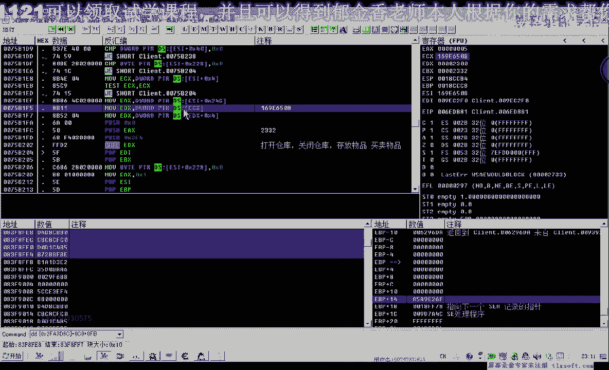

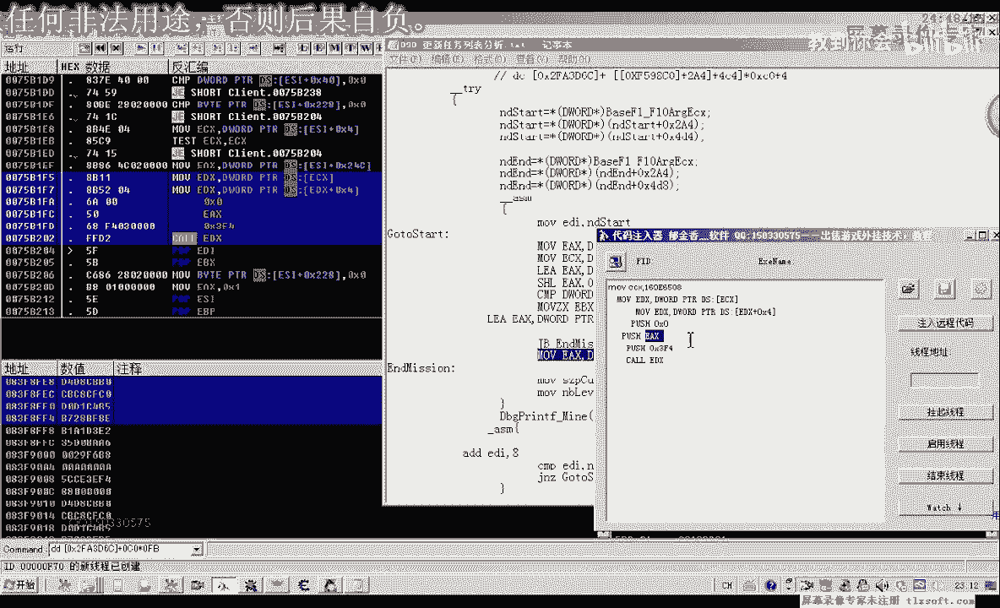

```cpp
// 伪代码示例
DWORD dwECX = 0x6F2FD0; // 对象基址，每次启动游戏可能不同
DWORD dwEAX = 2332;     // 参数，“全部任务”可能对应此值
CallFunction(dwECX, dwEAX); // 调用找到的函数
```


测试发现，调用此函数可以成功切换游戏内的任务选项卡界面。这说明我们找到了界面层的调用点。

然而，如果游戏任务窗口没有打开，直接调用此函数可能会因为 `ECX`（对象指针）未初始化而失败。


---


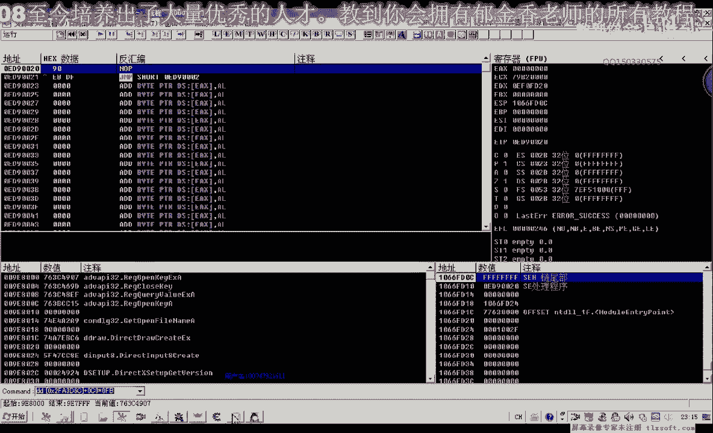

## 更优方案：直接的数据更新函数


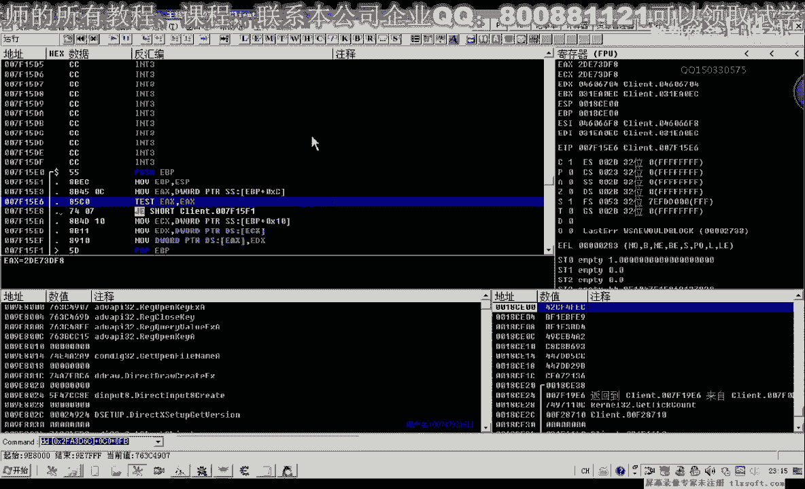

因此，更稳健的方案是寻找介于“数据写入”和“选项卡调用”之间的那个**数据更新函数**。这个函数直接负责将筛选后的任务数据填充到 `0x4C4` 或 `0x4D4` 开始的内存列表中，而不依赖界面状态。


通过分析，我们找到了另一个函数，它内部调用了我们之前分析的循环筛选函数。这个函数可能才是直接更新任务列表数据的核心。

**关键点**：此函数同样需要一个有效的 `ECX` 值（对象指针），但这个指针的来源更为稳定，可能来自游戏的全局管理对象。

---

## 总结与下节预告

本节课中我们一起学习了：
1.  区分了游戏中“执行中”与“可执行”任务列表的内存位置。
2.  通过下内存写入断点，定位了任务列表数据的更新点。
3.  逆向分析了一个关键循环，理解了任务数据如何被遍历和筛选（结构体大小可能为 `0xC0`）。
4.  找到了模拟点击任务选项卡的调用函数。
5.  确定了下一步目标是找到更稳定的、直接更新任务列表数据的函数，并获取其所需的 `ECX` 对象指针。


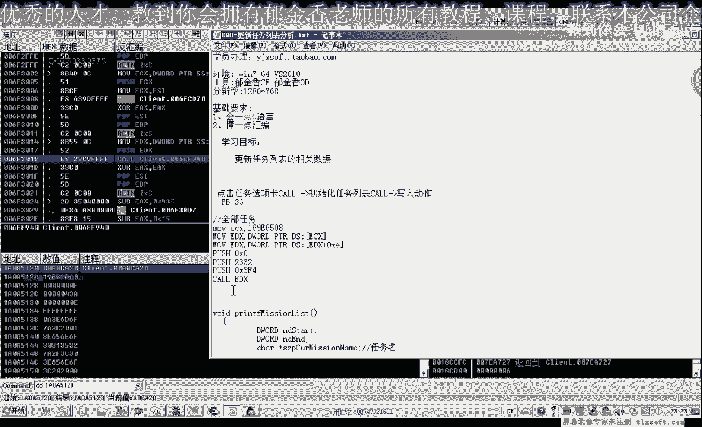


在下节课中，我们将着重寻找这个稳定的 `ECX` 对象指针的来源，并编写完整的代码来测试直接调用任务列表更新函数，实现不依赖游戏界面即可获取任务列表信息的功能。


---


字幕由 Amara.org 社群提供。