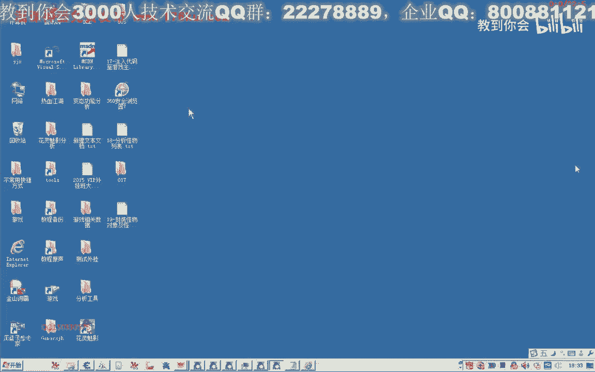
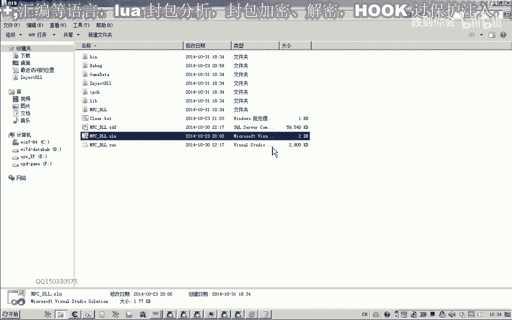
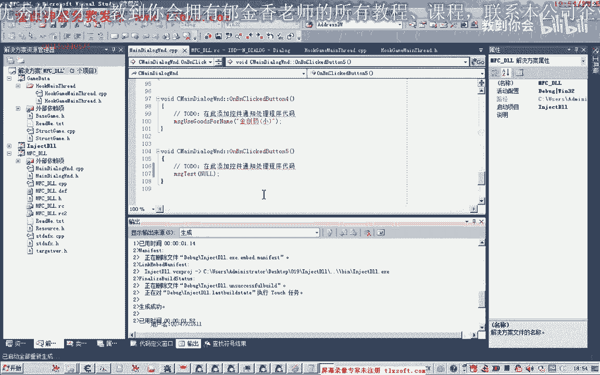
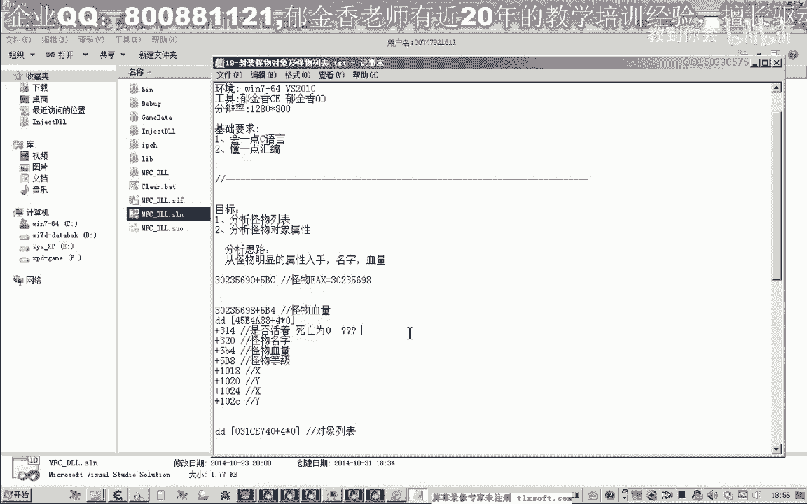

# 课程P8：019-封装怪物对象及怪物列表 🧟‍♂️




在本节课中，我们将学习如何封装怪物对象和怪物列表。我们将基于上一节课的分析，将怪物属性转化为代码结构，并编写函数来初始化和打印怪物信息，以验证我们的分析是否正确。

---

上一节我们分析了怪物列表和怪物的基本属性。本节中，我们来看看如何将这些属性封装成代码。

首先，我们在头文件中添加找到的基址，并定义怪物结构体。

```cpp
struct Monster {
    BOOL isDead;        // 是否死亡
    wchar_t* name;      // 怪物名字指针
    DWORD hp;           // 怪物血量
    DWORD level;        // 怪物等级
    float x;            // 坐标X
    float y;            // 坐标Y
    // 注：坐标具体哪个是当前坐标尚不确定
};
```

接下来，我们定义一个怪物列表。由于目前尚不清楚列表的确切大小，我们先使用一个静态数组进行测试，后续再修改为动态数组。

```cpp
#define MONSTER_COUNT 20
Monster monsterList[MONSTER_COUNT];
```

以下是封装怪物列表功能所需的函数。

首先，我们需要一个初始化函数来填充怪物列表的数据。

```cpp
Monster* InitMonsterList() {
    // 异常处理
    __try {
        DWORD baseAddr = /* 怪物列表基址 */;
        for (int i = 0; i < MONSTER_COUNT; i++) {
            // 计算当前怪物对象的首地址
            DWORD monsterAddr = baseAddr + i * 0x4;
            if (monsterAddr == 0) {
                // 如果地址为空，可能列表结束，跳出循环
                break;
            }
            // 读取怪物名字
            monsterList[i].name = (wchar_t*)(monsterAddr + 0x320);
            // 读取怪物血量
            monsterList[i].hp = *(DWORD*)(monsterAddr + 0x5B4);
            // 读取怪物等级
            monsterList[i].level = *(DWORD*)(monsterAddr + 0x5B8);
            // 读取怪物坐标（示例，偏移待确认）
            monsterList[i].x = *(float*)(monsterAddr + 0x1018);
            monsterList[i].y = *(float*)(monsterAddr + 0x101C);
            // 读取死亡状态
            monsterList[i].isDead = *(BOOL*)(monsterAddr + /* 死亡状态偏移 */);
        }
    } __except(EXCEPTION_EXECUTE_HANDLER) {
        // 异常处理代码
    }
    return monsterList;
}
```

初始化完成后，我们需要一个函数来打印怪物信息，以便测试。

```cpp
BOOL PrintMonsterInfo() {
    for (int i = 0; i < MONSTER_COUNT; i++) {
        // 如果等级为0，说明该位置无有效怪物数据，跳过
        if (monsterList[i].level == 0) {
            continue;
        }
        // 打印怪物信息：下标、名字、等级、血量、坐标、死亡状态
        wprintf(L"下标[%d] 名字:%s 等级:%d 血量:%d 坐标(%.2f,%.2f) 死亡状态:%d\n",
                i,
                monsterList[i].name,
                monsterList[i].level,
                monsterList[i].hp,
                monsterList[i].x,
                monsterList[i].y,
                monsterList[i].isDead);
    }
    return TRUE;
}
```

为了测试上述功能，我们需要在代码中调用这些函数。



```cpp
void TestMonsterList() {
    // 1. 初始化怪物列表
    InitMonsterList();
    // 2. 打印怪物信息
    PrintMonsterInfo();
}
```


最后，在程序界面中添加一个按钮来调用这个测试函数。

---



本节课中我们一起学习了如何封装怪物对象和怪物列表。我们定义了怪物的结构体，编写了初始化列表和打印信息的函数，并进行了初步测试。测试结果显示列表中可能包含其他对象（如玩家或物品），且部分属性偏移（如死亡状态）可能需要修正。我们将在下一节课中继续改进代码并深入分析怪物属性。