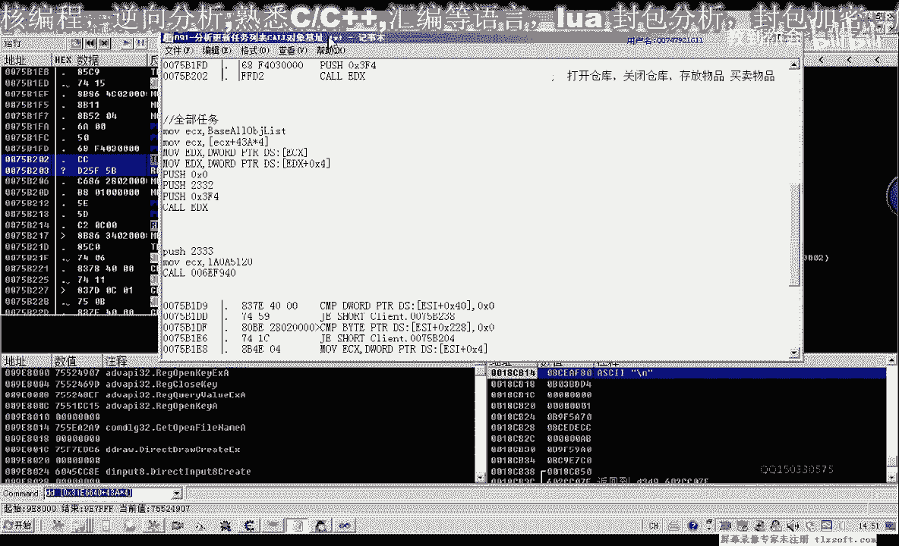

# 逆向工程教程 P80：091-分析任务对象基址及封装任务更新函数 🧩

在本节课中，我们将学习如何分析游戏任务列表更新函数的参数来源，并封装一个可调用的任务更新函数。我们将通过动态调试找到关键数据结构的基址，并用代码实现功能。


---


## 概述

本节课的目标是定位并分析游戏任务列表更新函数中 `ecx` 参数的来源。我们将通过调试找到存储任务对象的数据结构基址，并最终封装一个可以更新“全部任务”或“适合自己任务”列表的函数。

---

## 分析 `ecx` 参数来源

上一节我们介绍了任务列表更新的调用点。本节中，我们来看看传入的 `ecx` 参数是如何计算出来的。

首先，在调试器中转到调用更新任务列表的 `call` 指令地址，并下断点。


打开游戏内的任务列表选项卡，程序会在断点处中断。中断后，我们返回到调用该函数的上一层代码。


我们需要寻找 `ecx` 数据的来源。观察代码发现，`ecx` 可能来源于 `[esi+4]` 或另一个内存地址。我们在这些可能的位置分别下断点，以追踪数据流。

尝试读取“所有任务”时，`ecx` 的值是 `0x450`。但此值在后续操作中会改变。为了找到稳定来源，我们转而追踪 `esi` 寄存器的来源。

将 `esi` 的值加上偏移量 `4`，得到 `ecx` 的一个可能来源地址 `0x4420`。我们需要将此地址附加到游戏进程中进行观察。


我们验证这个地址是否有效。对该地址设置内存访问断点，程序再次中断。最终，数据流指向一个全局对象数组 `0x3116640`。

观察 `eax` 寄存器的数据，它等于 `0x445`。我们可以尝试从这个值推导出任务对象。关键在于，游戏重启后，这个下标值 `0x43A` 是否保持不变。


让程序继续运行，然后再次触发断点。


当前的 `ecx` 值变为 `0xD18`。我们检查其属性，发现其下标依然是 `0x43A`，这证实它属于同一个全局对象数组。


实际上，我们可以通过两个公式获得任务对象：
1.  `对象地址 = [[0x3116640] + 0x43A * 4]`
2.  或通过之前找到的中间地址间接获取。


这两个公式本质是等价的。我们需要重启游戏，验证下标 `0x43A` 是否固定。


关闭并重新启动游戏，然后用调试器附加进程。


再次触发任务列表更新，观察 `ecx` 的值。


测试表明，下标 `0x43A` 在游戏重启后没有改变，可以直接用于定位任务对象。如果此方法失效，也可以通过遍历对象列表，比较特定属性或函数成员来定位。

---

## 封装任务更新函数

解决了 `ecx` 的来源问题后，我们现在可以编写代码来封装任务更新功能。

打开第90课的代码项目，我们在主线程函数中进行测试。原代码已能打印任务列表数据，但现在需要为其添加参数，以区分更新“全部任务”还是“适合自己任务”。

首先，我们需要拦截游戏调用，获取参数值。对更新函数下断点，然后点击游戏内的“适合自己任务”选项。

观察栈数据，发现参数值为 `0x2333`。再点击“全部任务”，参数值为 `0x2332`。我们将使用这两个值作为参数。

以下是实现步骤：

1.  **定义参数常量**：
    在代码中定义两个宏，代表两种任务类型。
    ```c
    #define ALL_QUEST 0x2332
    #define SUITABLE_QUEST 0x2333
    ```

2.  **计算任务对象地址**：
    使用找到的公式，从全局对象数组中获取任务对象基址。
    ```c
    // 假设 g_pObjectArray 是全局对象数组基址 0x3116640
    DWORD dwTaskObject = *(DWORD*)(*(DWORD*)g_pObjectArray + 0x43A * 4);
    ```

3.  **封装更新函数**：
    创建一个函数，接收任务类型参数，调用游戏内部的任务列表更新函数。
    ```c
    void UpdateQuestList(DWORD dwQuestType) {
        DWORD dwTaskObject = GetTaskObjectBase(); // 封装获取对象基址的函数
        __asm {
            mov ecx, dwTaskObject
            push dwQuestType
            mov eax, [UpdateQuestListFunc] // 游戏内部函数地址
            call eax
        }
    }
    ```

4.  **整合与测试**：
    将上述代码整合到主线程中，并添加调试信息输出。编译并注入到游戏进程进行测试。


在测试前，请确保从调试器中退出，并清除所有断点，以免影响游戏或注入器运行。


如果之前修改了游戏代码（例如下了 `INT 3` 断点），需要将其恢复为原始字节。





例如，将 `0xCC` (`INT 3`) 恢复为原来的 `0xFF 0xD2` (`call edx`) 指令。


设置好编译和注入环境后，重新编译DLL并注入游戏。


运行测试。调试信息应能正确显示“所有任务”或“适合自己任务”的列表内容，表明函数封装成功。

---

## 总结

本节课中，我们一起学习了如何通过动态调试分析游戏功能函数的参数来源。我们定位到了任务对象在全局数组中的固定下标，并利用此发现封装了一个可接收参数的任务列表更新函数。通过定义 `ALL_QUEST` 和 `SUITABLE_QUEST` 常量，我们可以方便地控制游戏更新不同类型的任务列表。


关键步骤如下：
1.  使用调试器定位关键 `call` 指令和参数传递。
2.  逆向追踪参数来源，找到稳定的对象基址计算公式。
3.  将分析结果转化为代码，实现功能封装。
4.  进行测试验证，确保功能正确。

请大家课后将封装的函数代码整理规范，为后续更复杂的操作打下基础。


下节课我们将在此基础上，探索如何读取并解析具体的任务信息。