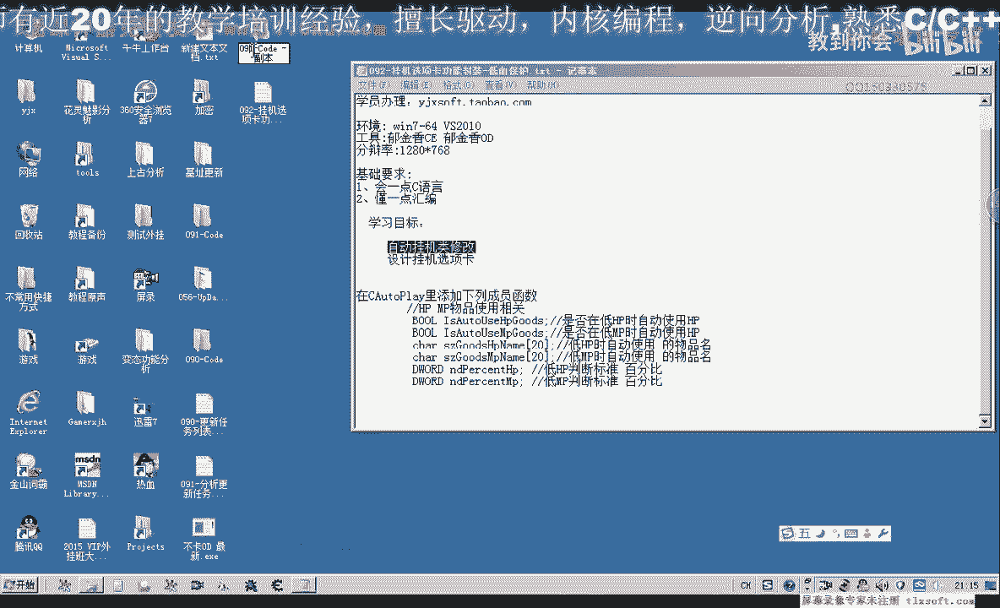

# 课程P81：092-挂机选项卡功能封装-低血保护 🛡️

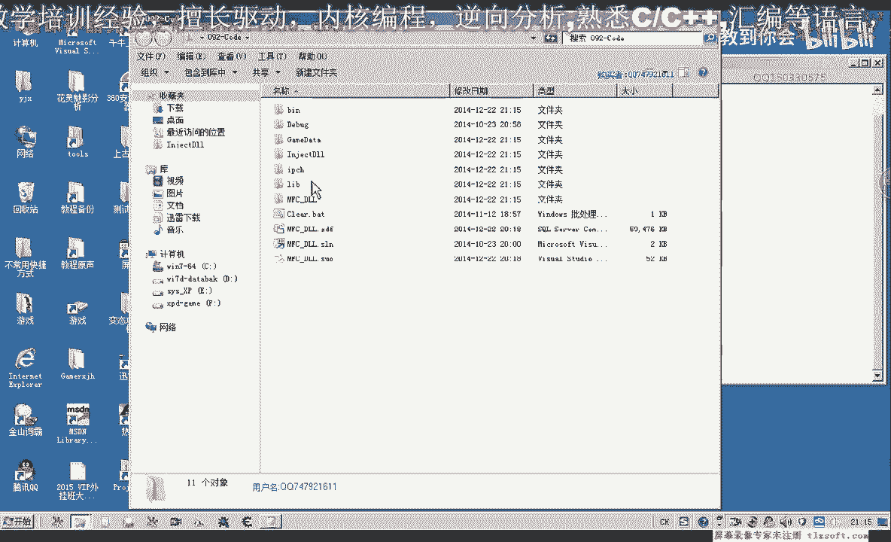

在本节课中，我们将学习如何为挂机功能封装一个低血量/低魔法值保护模块。该功能的核心是：当角色生命值（HP）或魔法值（MP）低于设定的百分比时，自动使用指定的物品进行恢复。

## 概述

上一节我们完成了挂机功能的基础框架。本节中，我们将在挂机类中添加成员变量，并在用户界面上创建对应的控件，以实现低血保护功能的参数配置。

## 修改挂机类头文件

首先，我们需要打开第91课的代码，并转到挂机类的头文件。

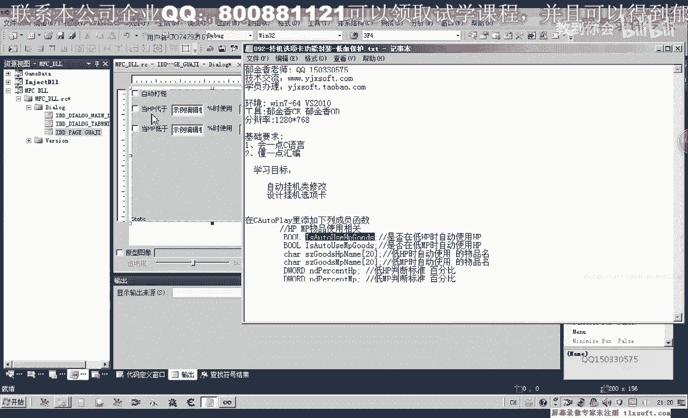

以下是需要在挂机类中添加的成员变量：

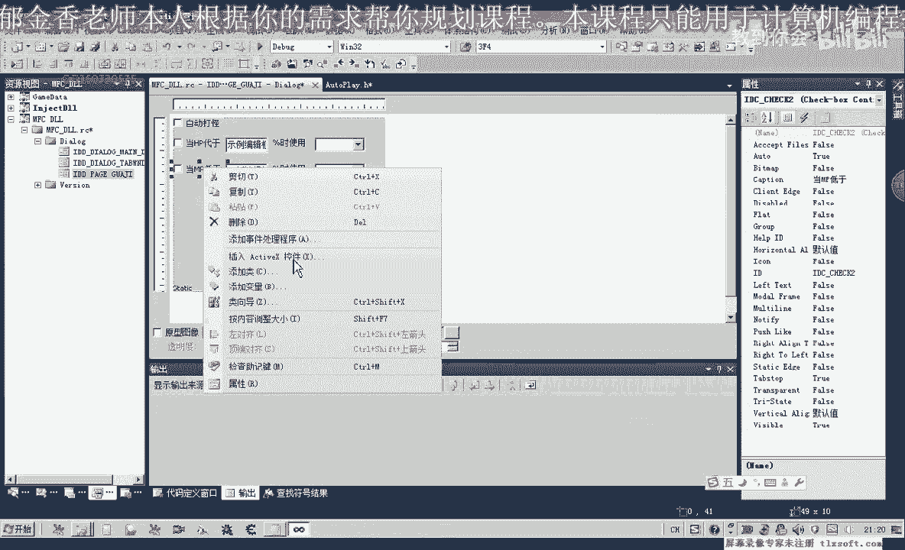

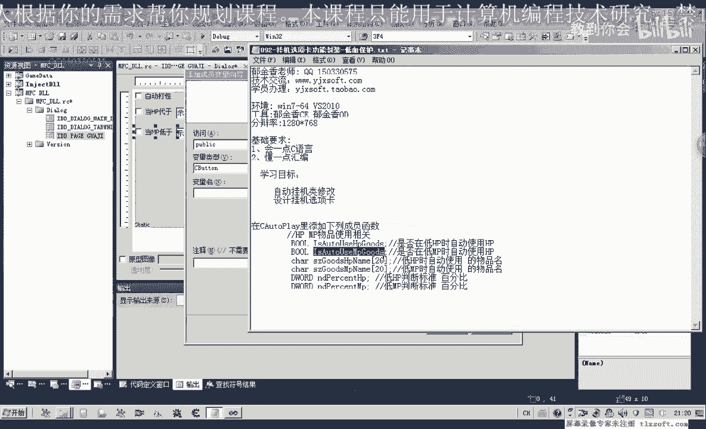

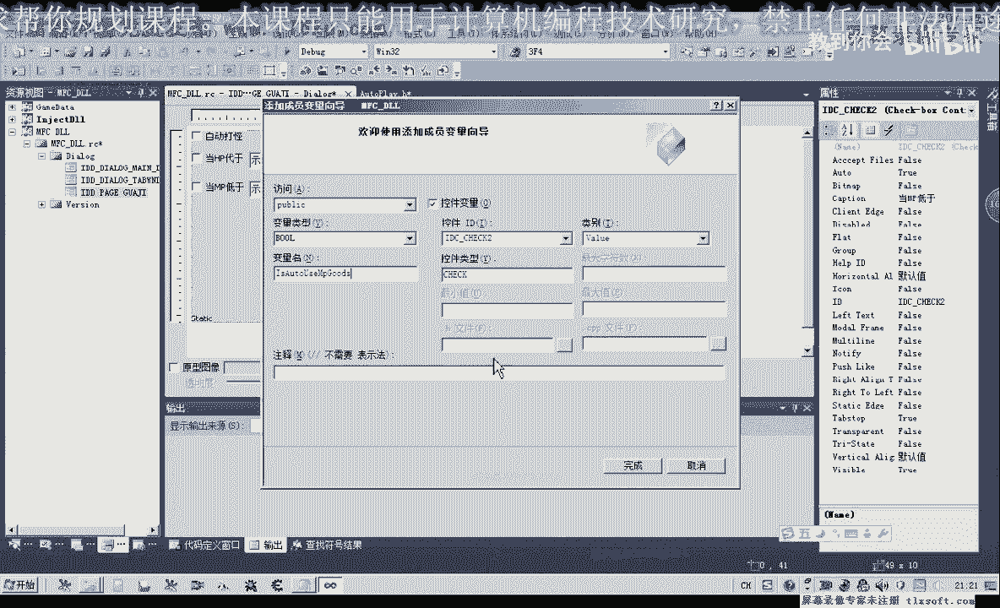

*   **`m_bAutoUseHP`**: 一个布尔值，用于控制是否在HP低于阈值时自动使用物品。
*   **`m_bAutoUseMP`**: 一个布尔值，用于控制是否在MP低于阈值时自动使用物品。
*   **`m_nHpPercent`**: 一个整数值，代表触发自动使用HP物品的生命值百分比阈值。
*   **`m_nMpPercent`**: 一个整数值，代表触发自动使用MP物品的魔法值百分比阈值。
*   **`m_strHPItemName`**: 一个字符串，代表当HP低于阈值时要使用的物品名称。
*   **`m_strMPItemName`**: 一个字符串，代表当MP低于阈值时要使用的物品名称。

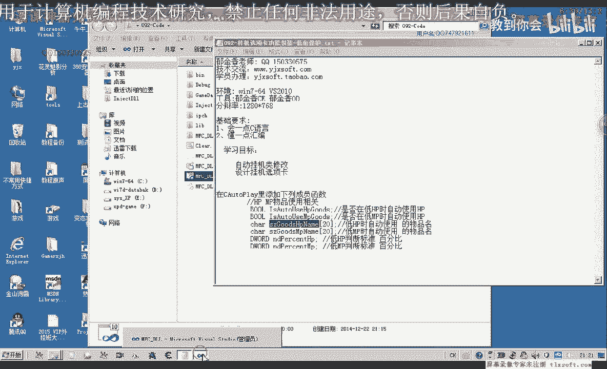

这些变量的设计基于百分比，这通常比固定数值更灵活。当然，你也可以根据需求设计为低于某个固定数值。

## 设计用户界面控件

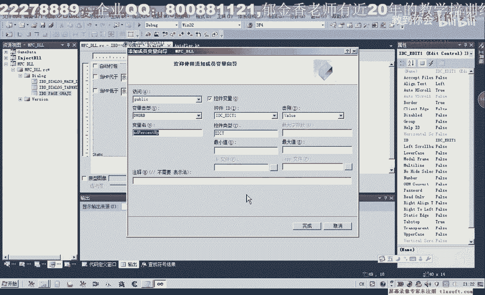

为了将上述参数传递给程序，我们需要在挂机选项卡的窗口界面上添加对应的控件。

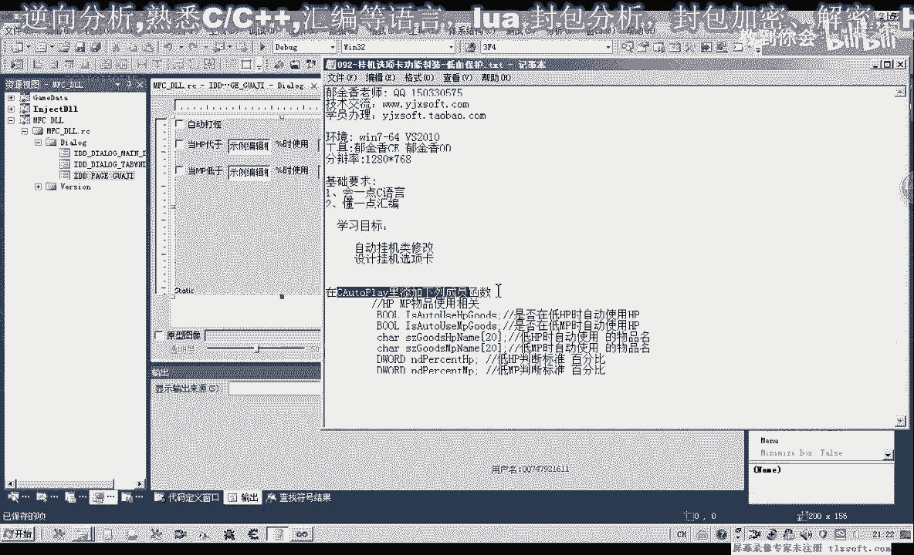

转到挂机页面，我们将添加以下控件：

*   **两个复选框（Check Box）**：分别对应“启用低HP保护”和“启用低MP保护”的开关。
*   **两个编辑框（Edit Control）**：用于输入HP和MP的百分比阈值（1-100）。
*   **两个静态文本（Static Text）**：用于在编辑框后显示“%”符号。
*   **两个组合框（Combo Box）**：以下拉列表的形式，供用户选择要使用的HP和MP物品名称。

你可以按住 `Ctrl` 键并用鼠标拖动控件来快速复制，以提高布局效率。

## 关联控件与变量

界面上的六个控件需要与我们之前在头文件中定义的六个成员变量相关联。

以下是操作步骤：

1.  使用开发工具（如Visual Studio的MFC类向导）为每个控件添加对应的成员变量。
2.  建议使控件关联的变量名与类成员变量名保持一致，这样在后续数据更新时会更加方便直观。
3.  首先为两个复选框控件关联布尔型变量（如 `m_ctlAutoUseHP`, `m_ctlAutoUseMP`）。
4.  接着为两个编辑框控件关联整型变量（如 `m_ctlHpPercent`, `m_ctlMpPercent`）。
5.  最后为两个组合框控件关联字符串型变量（如 `m_ctlHPItemName`, `m_ctlMPItemName`）。
6.  在布局时，可以使用对齐工具使界面更加整洁。

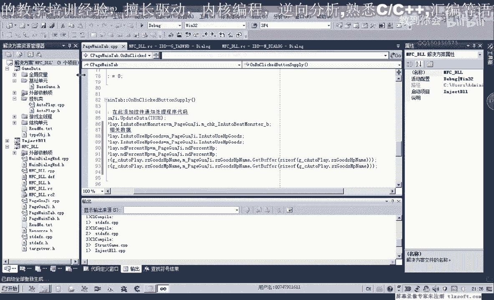

## 总结

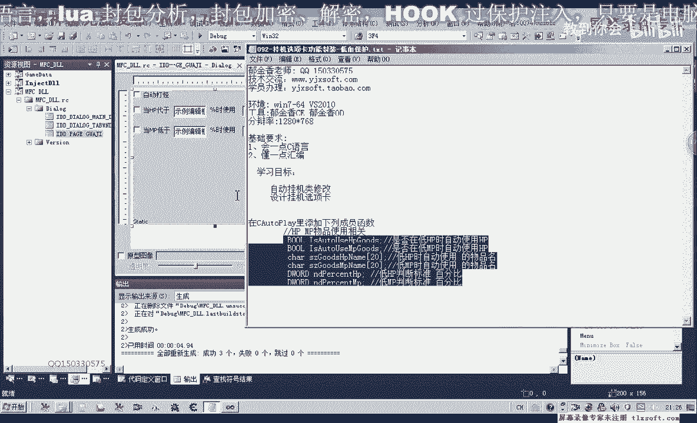

本节课中，我们一起学习了低血保护功能封装的第一步：**数据结构设计与界面搭建**。

我们首先在挂机类的头文件中定义了六个核心成员变量，分别用于控制功能开关、设置百分比阈值以及指定要使用的物品。接着，我们在用户界面上创建了对应的复选框、编辑框和组合框控件，并将它们与类成员变量相关联。

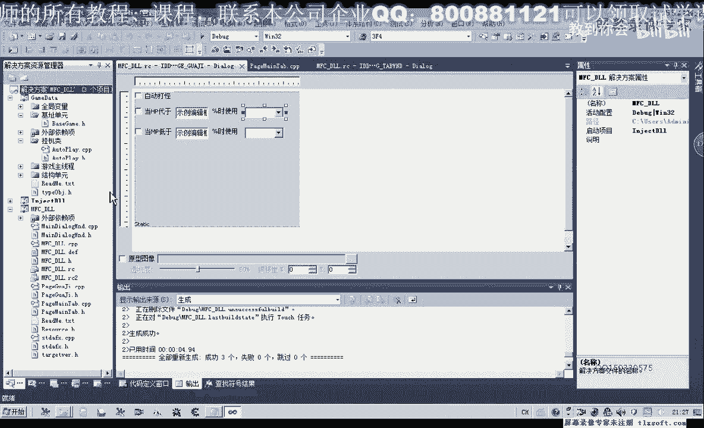

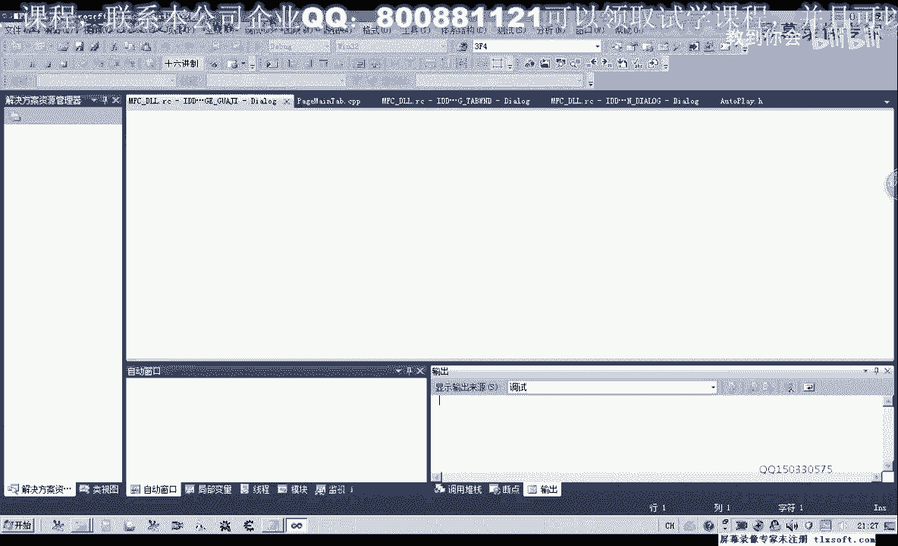

下一节，我们将学习如何编写代码，使界面上的参数能够正确地保存到成员变量中，并在挂机循环中实现实时的血量检测与物品自动使用逻辑。