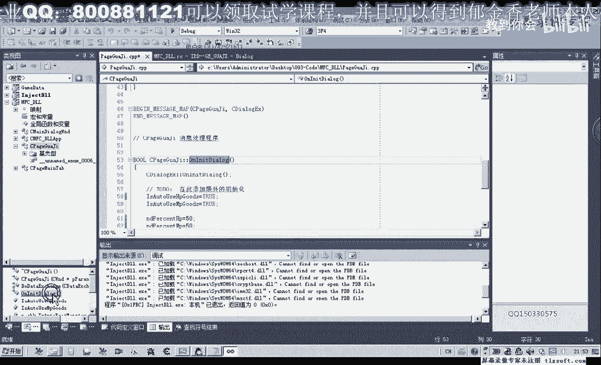
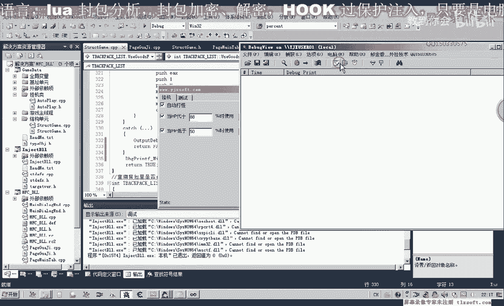
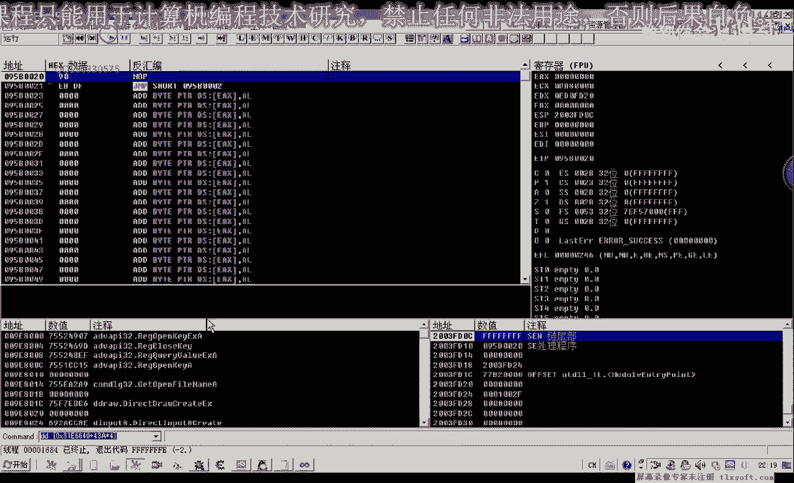
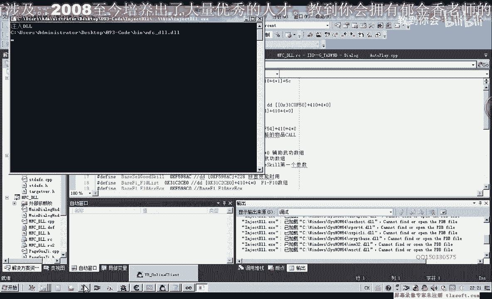
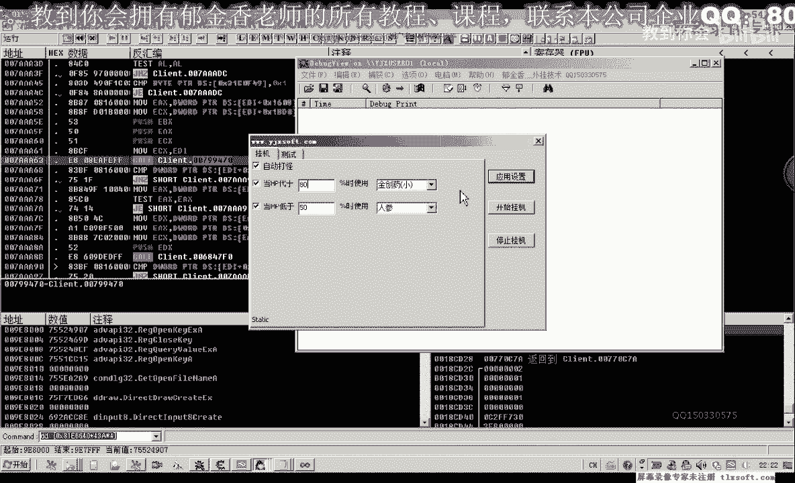
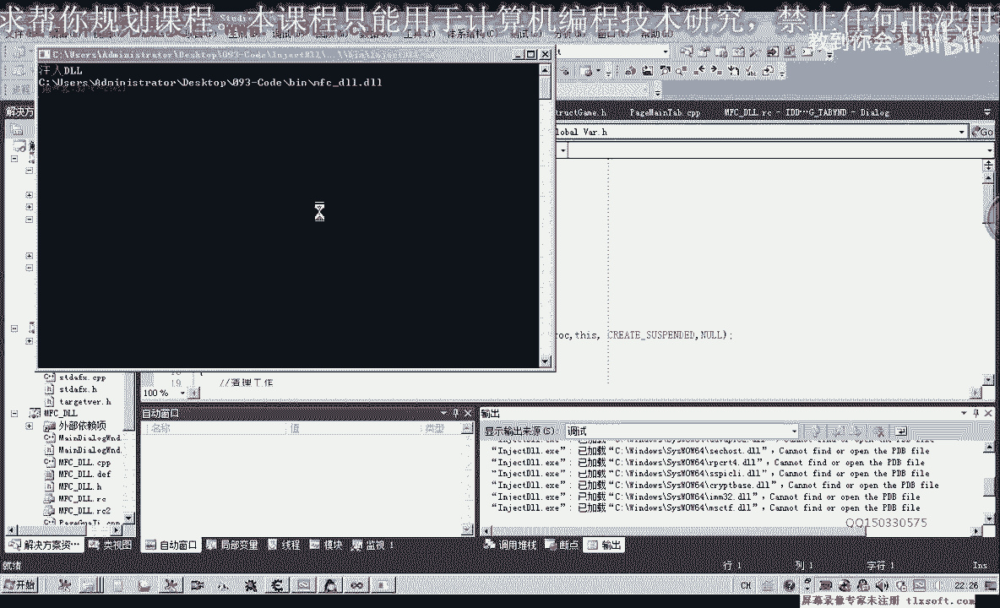
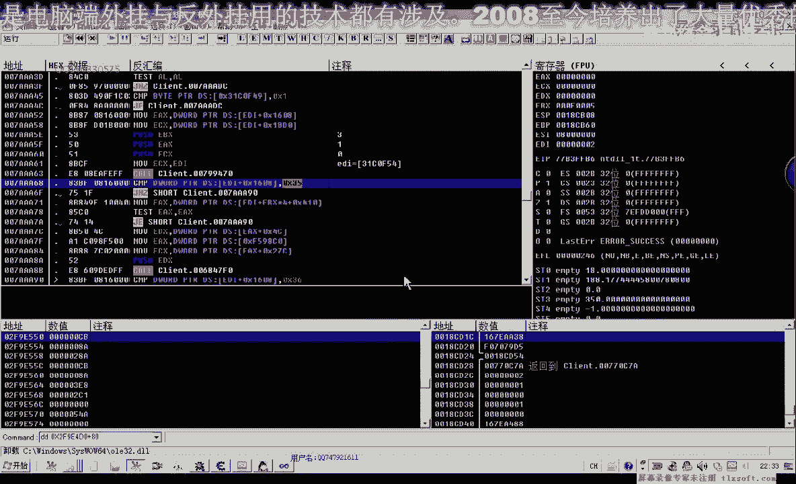
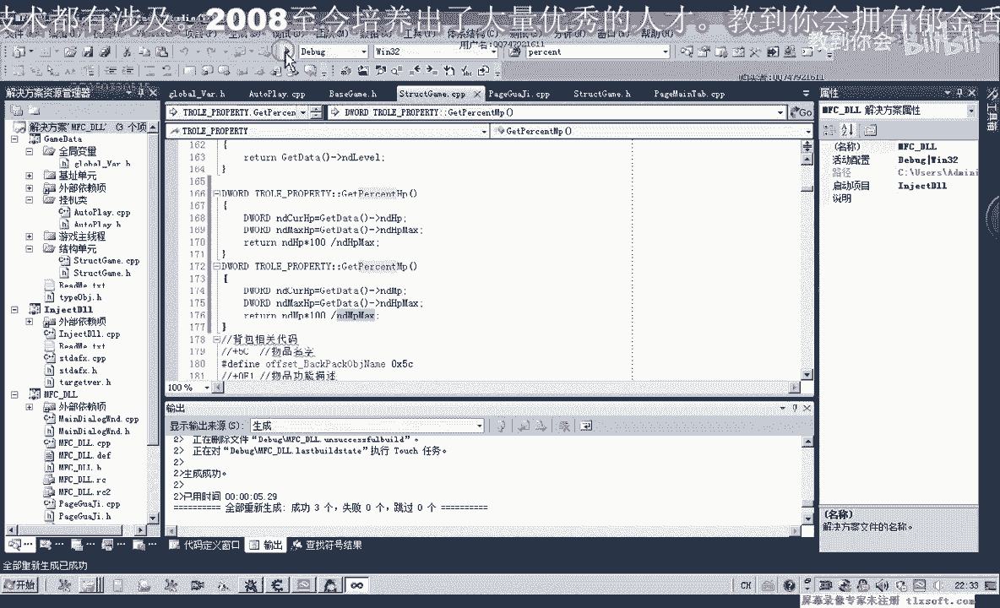

# P82：093-低血保护功能封装2 - 教到你会 - BV1DS4y1n7qF

大家好，我是郁金香老师，那么这节课呢我们将接着上一节课啊，编写代码啊啊低血保护的功能实现，那么我们打开第92课的代码，那么首先呢我们是相关数据的一些初始化挂机页面，那么这里呢有一个dt选项啊。

每一项呢它可以用这个分号来分割这个名项，比如说第一个我们可以是轻松要小，那么我们看一下里边有一些什么物品，那么等级五的时候呢有一个小九转单礼物啊，如果这个物品存在的话，也可以添加进去。

好了目前呢我们暂时可以添加这两个物品，轻松要松的，轻松要放，那么这里呢我们可以选择人生，野山参，雪莲生，这一类的，当然这种做法的话效率会更高一些，另外一种做法呢，我们就去骗你背包啊。

但是那样设计起来要相对要复杂一些，那么还有这里的一个百分比呢，我们也可以给它进行一个相应的初始化，那么这些初始化呢我们转到这个绿的啊，初始化函数里边，找到挂机的这个绿的选项卡。

那么我们重写它的初始化函数，在这里呢我们可以设置是否自动使用这些物品，当然在这里呢我们全部把它设置为真，那么还有这两个是百分比，那么这里的百分比呢，我们全部把它设置为50%，再转到窗口，我们看一下。

在这里的话，我们还可以用一些设置它的一个变量，那么这里呢它可以设置它的一个最小值，我一个它的一个最最大值，那么最小值呢我们可以可以设置为一，那么最大值呢我们可以设置为99%或者是100啊。

不超过110~99，或者是在设置大一些啊，10%到99%，那么下面的它的属性是一样的啊，我们也在添加变量里边选择它的一个最小值幺零，这里我们选择了99，好那么我们先进入到我们的游戏窗口，看一下效果。

但是我们发现呢这里呢他都没有选中相应的数字呢，它没有被初始化，那么我们重新设置一下，还有一个变量我们看有没有设置，挂机选项卡，这里有个自动打怪的个变量。

那么这里呢我们把它就是说初始化之后呢，我们需要更新啊，把这个变量里面的数据来需要更新到我们的窗口。

好那么这个时候呢我们的相应的数据呢已经初始化了，但是我们后边的这个列表里面的这个数据呢还没有初始化，我们需要来来进一步的操作，切换到我们的资源视图，那么这里呢我们把它的大小来修改一下。

那么首先呢这里呢它也需要设置一个默认的一个数值，转到类里面初始化，啊，那么在我们重新编译一下，那么在应用设置里面呢，这里呢我们还需要做一些改动，那么在这里呢我们，获取了它的一个缓冲区，用完之后呢。

我们还需要对这个缓冲区的数据来进行一个释放，嗯，好的我们再重新编译一下，再次出入显示外挂，那么这个时候呢我们就可以了，有相应的数据来的一个初始化呃，当然这个大小呢还小了一些，我们需要来进行一定的改动。

那么我们再往后面调整一下它的大小，那么同时呢它有一个排序啊，那么这个呢我们把它禁用掉，这是fast，那么这样的话我们的参数呢就能够传递进去，那么传递进去之后呢，我们再切换到我们的啊挂机类里边。

那么在这个循环里面呢，我们添加相应的判断，那么在这里呢我们使用物品啊，当然我们使用的就是相关的呃，hp的这个物品它来源于我们窗口的界面界面，那么另外一种情况呢，我们就使用了相应的mp的啊，这个物品。

好的马上我们可以做一下相关的测试，那么每次使用物品之后呢，我们还可以给它设设置一定的这个时间的一个间隔，当然这里呢我们也可以设置为相应的参数，也可以不进行相应的设置，那么我们先测试一下。

那么在测试之前呢，我们还有一个地方需要改动一下使用技能，这里呢我们当前的这个人物呢，他没有这个相应的技能，逆天杀星这个技能，那么这里呢我们为了方便测试，把它改为普通攻击技能，啊然后我们开始测试。

那么这个时候呢我们发现了它没有自动的打坏，那么可能是我们的应用设置或者是开始挂机呢，这里呢相应的代码呢我没有添加好，好的，那么我们再进行相关的检查，那么首先我们已到，这个主窗口我们看一下应用设置。

再看一下开始挂机，那么还有一个主线程的一个挂机，在这里我们看一下相关的代码有没有被执行到，不知道知道，那，我们再重新编译一下，咳咳，首先挂机，主线程三，行显示外挂应用设置，开始挂机，那么我们来看一下。

但是呢这个时候呢不断的在使用金创药小，那么这里呢也没有实际的一个使用，那么这一段信息的话看起来呢有一些问题，那么我们再来看一下相关的代码，物品使用得了，那么这里呢我们还需要呃做一些判断。

那么另外这个物品使用的话好像也存在一些问题，金疮药小，但是呢没有真正的使用到嗯，第二个呢我们是这里的，应该还要加一个百分比的一个判断，那么这个百分比的话，我们看一下有没有写这个相关的这个函数。

你到我们的解除单元，那么在这里我们找到这个过程当中的话没有找到，那么我们还应当呢呃写一个这个百分比计算的一个函数，那么我们先转到这个结构单元，再看一下人物属性的这个单元，那么在这个这个单元里面呢。

我们来添加这个相应的百分比的这个函数，嗯，22，那么这里呢我们还需要添加一个主用率的一个限定啊，是内里，不然的话我们没有办法调用这个代替代替，那么首先呢我们把这个hp的上限和当前的hp来取出来。

那么最后呢我们返回它的这个相应的数值就行啊，当前的hp，那么呢我们除以呃这个hp的这个上限，好的，我们先编译一下，那么这里呢我们换为mp，好再重新再注入一下，但是这个时候出现了一个问题哈。

已经小于相应的这个百分比了，那么这里呢也有这个使用金创药的嗯，没有使用金仓药的这个名字，但是呢我们的这个相应的这个金疮药呢没有被使用掉，那么我们重新再来看一下我们的代码，转到背包这里哈，物品的使用。

那么首先呢我们在这里来看一下这个物品使用的时候，它返回的下标究竟是多少，201218，嗯嗯，那么我们从调试信息这里看的话，嗯这里的下标是二，那么下标12的话。

证明它偏离到的我们背包里面的这个下标的话是正确的，但是呢我们没有使用相应的这个物品，那么可能是这个call呢它发生了一些变化，我们先把外挂推出来，那么也就是说这个函数呢可能我们出了出现了相应的一个问题。

但是我们调用这个函数的时候呢，它也没有产生异常，那么我们看一下它有没有执行到最后，再重新编译生产。

那么我们从这个调试信息里面发现的话，嗯在这里他使用了之后的话，那么这一部分的话，它应当是没有被执行到，他只执行到它的头部啊，那么很有可能呢是这个扩的这个地址的话已经改变了，那么我们再来调试一下啊。

在这个库的头部，那么呢我们也加上相应的代码start，那么我们可以看到啊，它只执行到了这个相应的扩的一个头部，那么最后这一部分呢它们也会执行到，那么说明我们的这个扩的话，可能是已经嗯获得地址了。

已经变化了，或者是我们的其他的某一个参数来已经发生了相应的变化。

那么我们用d附加进去看一下。

那么首先我们转到这个地址看一下，那么我们发现它所转到的地址的话根本就不对啊，那么说明呢的确是我们的这个扩的这个地址来出错了，那么这里呢我们需要重新更新一下物品使用的这个库，那么我们搜一下相应的特征码。

那么大致呢是在这个位置，7a开始的这个位置，那么我们转到这个位置去看一下。

嗯那么最新的这个地址呢应该是799470，好那么我们重新再编译生成。

挂机主线程显示外挂，这个时候我们把这里调为80%。

应用设置开始挂机，那么这个时候我们发现的话，它可以使用我们的这个清创药了啊，只是我们蛇的这个相应的这个百分比的话，那有点大啊，那么我们需要把它设置小一点。

但是呢我们发发现这个百分比我们设置的比较小的时候呢，那么这里呢他也会反复地使用我们的这个金创药，那么说明我们的这个代码的话还是有问题的，那么我们接着再来看一下，啊对了。

这里呢我们没有加上一个百分比的一个判断，那我们到全局变量单元看一下有没有属性相关的啊，这个是属性相关的全局变量，哈哈哈哈哈，那么获得这个当前的这个百分比啊，那么这个比百分比呢。

我们与呃现在这个类里面的这个百分比来进行一下比较，那么如果这个当前的这个百分比小于我们的这个百分比的时候呢，我们才使用下面的这个物品，那么同样的mmp的这个修改了，我们也是一样的。

在这里呢我们需要改为mp，这前面这里也是mp，好的，我们再重新编译生成。

那么这里呢我们需要包含一下全局变量的单元，哈哈，嗯，好的我们再次进行测试。

可莉，那么这个时候呢他没有找到这个清创要小，那么呃这里的金创药呢已经使用完了啊，嗯，我们先停止挂机，先补充一些药品，我们在做测试，好的，那么在这次测试之前呢，我们再来看一下哈，我们的代码。

嗯那么这里呢有一个当前的一个百分比，那么百分比的话，这个函数呢这里呢我们实际上还要需要在前面乘以100才可以呃，因为这个的话它返回的数值呢是一个小于这个，这两个数值如果是相等的话，那么返回应该是零。

那么如果前面这个数值它小于后面这个数值的时候呢，他整除之后呢也是零，那么所以说我们这个是百分比的话，我们需要在前面的乘以100，然后再除以后面的这个数值，那么这这样呢才能够整除后面的呃。

相应的这个数值除出了这个数字呢，才是大于大于零的，啊，那这里我们需要把外挂了，外挂再次推出一下，再重新生产。

把d啊再推出一下。

咳咳。

然后我们再进行相关的测试，好的我们暂时呢我们就测试到这里了，那么这个时候呢当它的百分比小于95%的时候呢，它会这个自动呢使用这个金创药小。

