# 课程P82：低血保护功能封装2 🛡️

在本节课中，我们将继续上一节课的内容，编写代码以实现低血保护功能。我们将从初始化界面数据开始，逐步实现自动使用药品的逻辑，并进行测试和调试。

## 界面数据初始化

上一节我们介绍了低血保护功能的基本框架，本节中我们来看看如何初始化挂机页面的相关数据。

首先，我们打开第92课的代码。在挂机页面中，有一个下拉列表选项。每一项可以用分号来分割。例如，第一项可以是“金创药小”。我们需要查看游戏内有哪些物品，例如在等级5时有一个“小九转丹”。如果该物品存在，也可以添加进去。

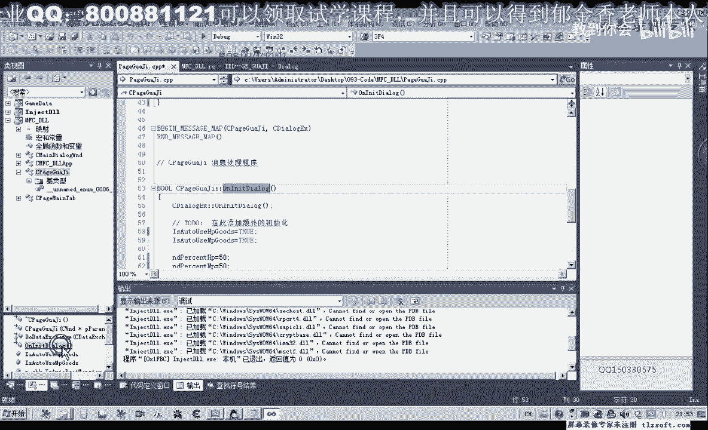

目前，我们可以暂时添加这两个物品：“金创药小”和“金创药中”。此外，我们还可以选择“人参”、“野山参”、“雪莲”等物品。这种做法效率较高。另一种做法是遍历背包，但设计起来相对复杂。

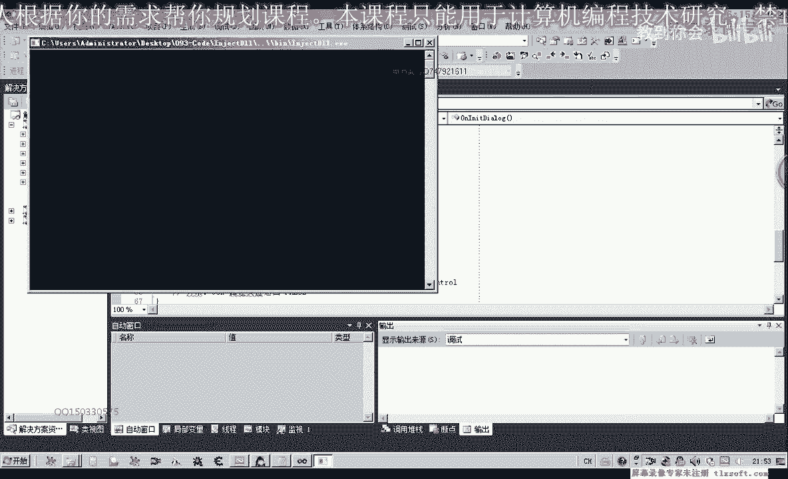

百分比设置也需要进行相应的初始化。这些初始化操作将在“初始化函数”中完成。

## 编写初始化函数

以下是初始化函数的具体步骤：

1.  找到挂机选项卡的初始化函数。
2.  设置是否自动使用这些物品，这里全部设置为“真”。
3.  设置两个百分比变量的初始值，例如全部设置为50%。
4.  在窗口设置中，为百分比变量设置最小值和最大值。最小值可以设置为1，最大值可以设置为99或100，不超过110。例如，范围可以设置为10%到99%。
5.  为另一个属性添加变量，最小值设为10，最大值设为99。

完成上述步骤后，我们进入游戏窗口查看效果。如果发现选项没有被选中或数字没有被初始化，需要检查变量设置是否正确，并更新窗口数据。

## 调整界面控件

切换到资源视图，调整下拉列表的大小。在类初始化中设置默认数值。重新编译代码，并在应用设置中做相应改动。获取缓冲区数据后，需要释放缓冲区。

再次编译并注入显示外挂，此时数据应该能够正确初始化。如果控件大小不合适，可以继续调整。同时，禁用控件的排序功能，以确保参数能够正确传递。

## 实现自动使用物品逻辑

参数传递完成后，我们切换到挂机类，在主循环中添加判断逻辑。

以下是实现自动使用物品的核心代码逻辑：

```pascal
// 检查生命值百分比
if GetHpPercent() < LowHpThreshold then
begin
  // 使用生命值药品
  UseItem(‘金创药小’);
end;

// 检查魔法值百分比
if GetMpPercent() < LowMpThreshold then
begin
  // 使用魔法值药品
  UseItem(‘小九转丹’);
end;
```

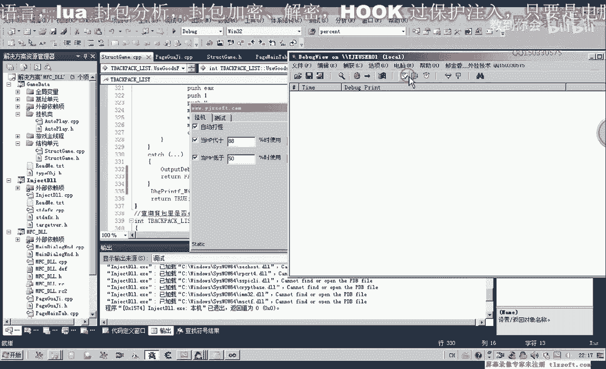

每次使用物品后，可以设置一个时间间隔。这个间隔可以设置为参数，也可以不设置。为了测试方便，我们将技能“逆天杀星”改为“普通攻击”。

## 功能测试与调试

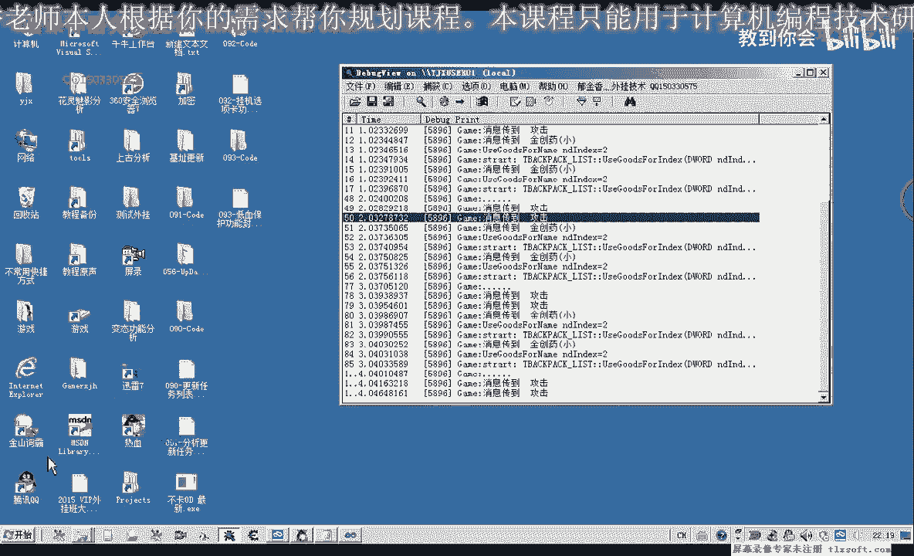

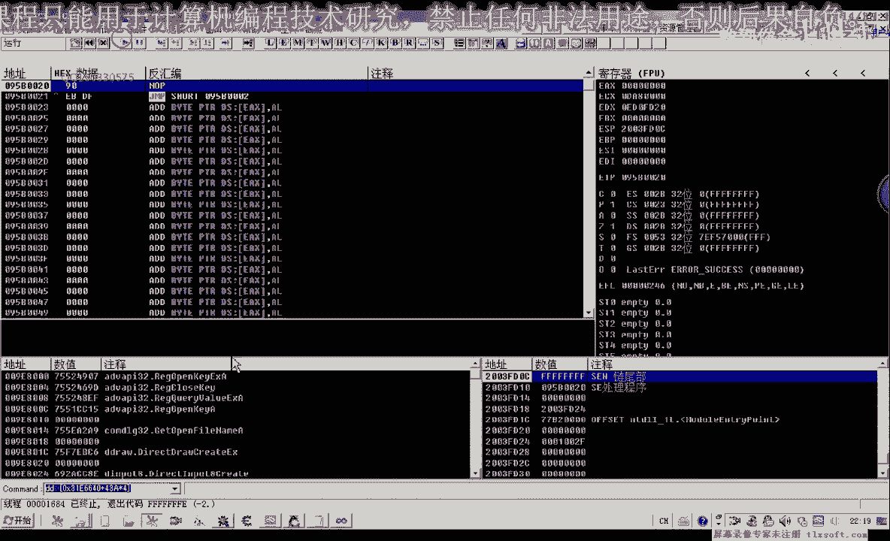

开始测试时，可能发现没有自动打怪。需要检查应用设置、开始挂机以及主线程挂机的代码是否被执行。

重新编译并注入外挂，应用设置，然后开始挂机。测试时，可能会发现程序在不断尝试使用“金创药小”，但没有实际使用。这表示代码逻辑可能存在问题。

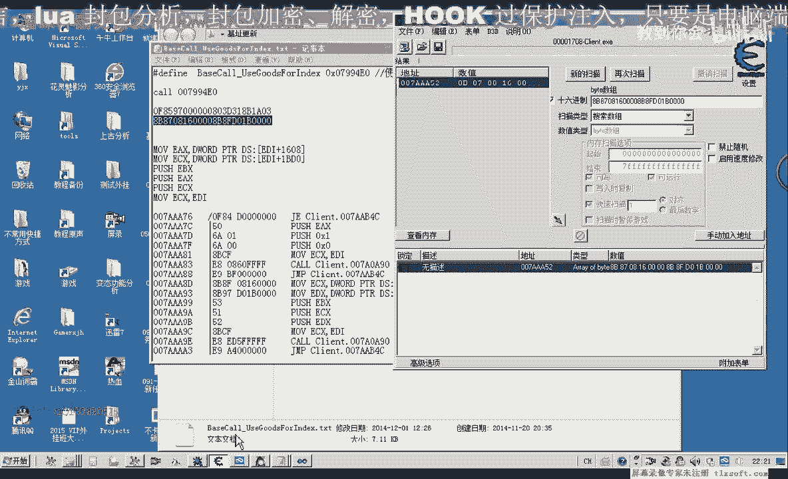

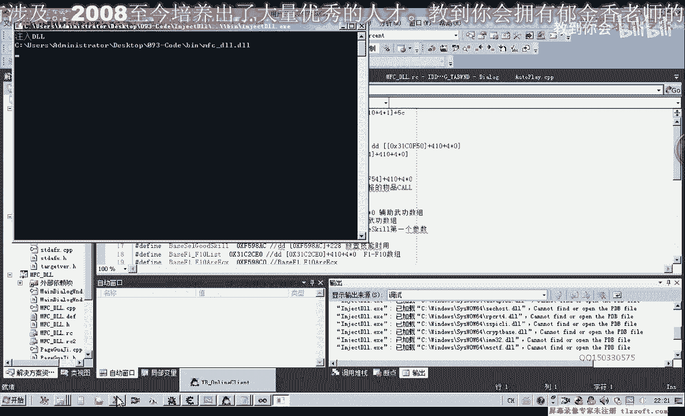

需要检查物品使用函数和百分比判断函数。在结构单元中，添加计算百分比的函数。

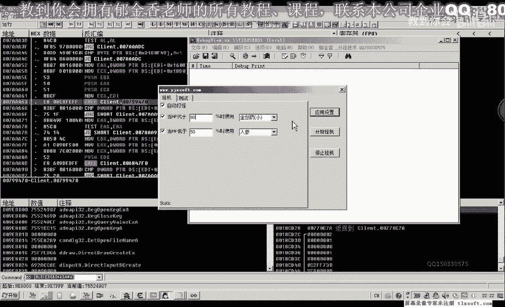

以下是计算生命值百分比的函数示例：

```pascal
function GetHpPercent: Integer;
var
  CurrentHp, MaxHp: Integer;
begin
  CurrentHp := GetCurrentHp;
  MaxHp := GetMaxHp;
  Result := (CurrentHp * 100) div MaxHp; // 乘以100以获得百分比整数
end;
```

重新编译测试，如果百分比小于设定值，会有使用药品的提示，但药品可能没有被消耗。这可能是因为调用游戏函数（Call）的地址发生了变化。

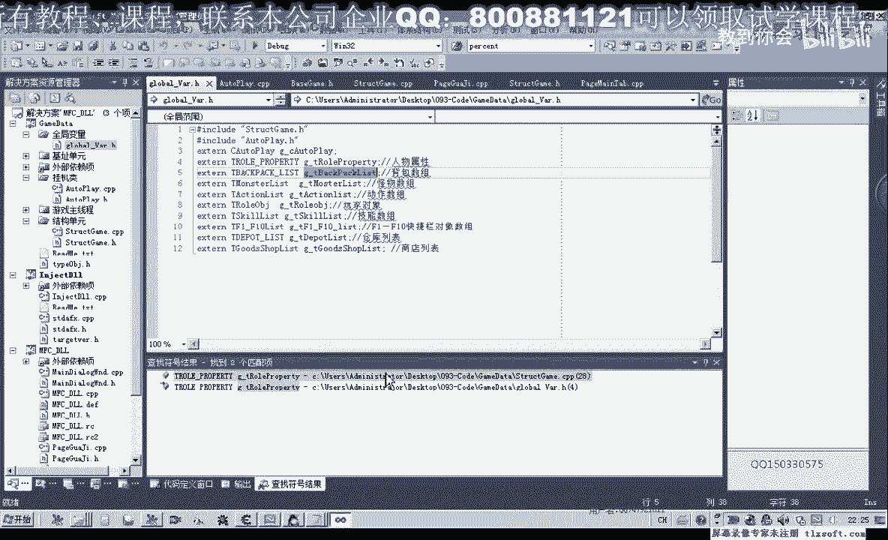

通过调试发现，函数只执行到了头部，说明Call的地址可能已失效。需要重新搜索特征码，更新物品使用函数的Call地址。

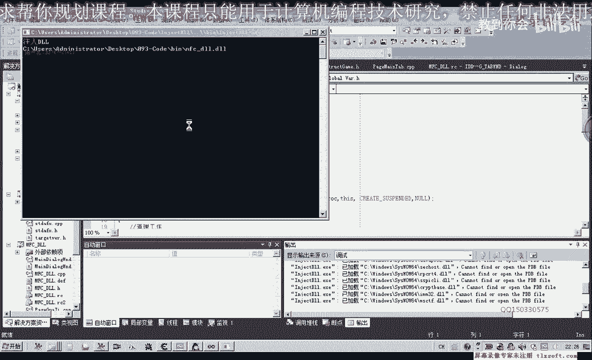

更新地址后，重新编译测试。此时，药品应该可以被正常使用。如果百分比设置过小，程序可能会反复使用药品，这说明还需要在代码中加入百分比判断。

修改代码，只有当当前百分比小于设定百分比时，才使用药品。同时，修正百分比计算函数，确保返回正确的百分比值。

## 最终测试与总结

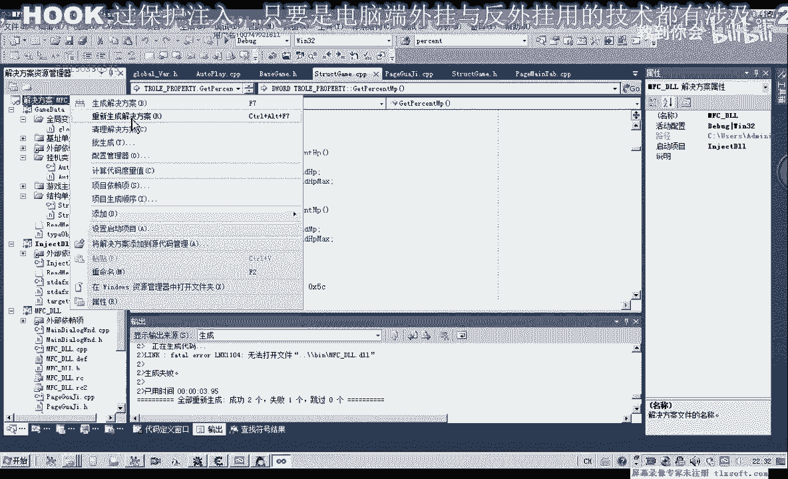

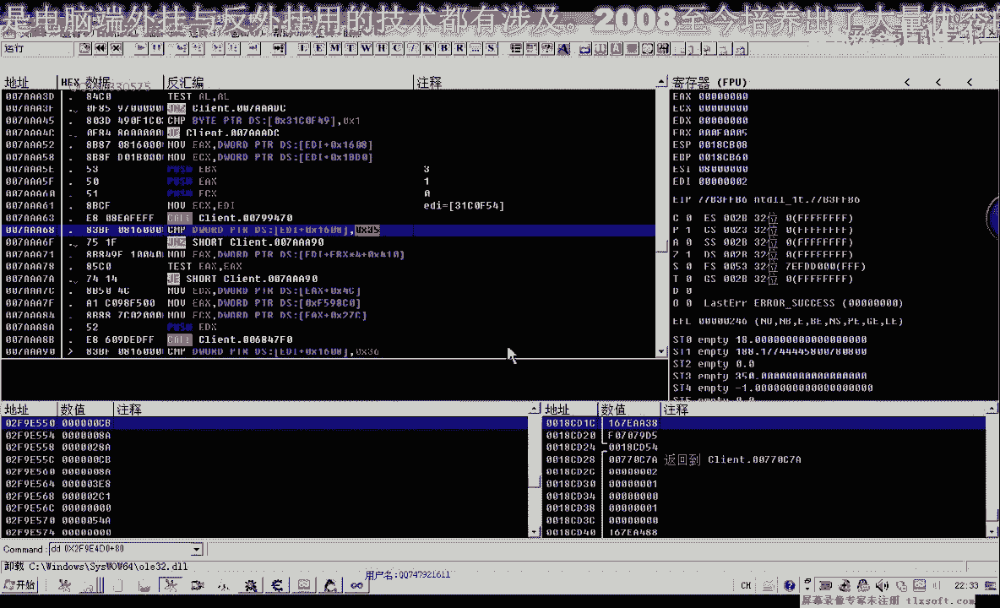

重新编译代码，进行最终测试。当生命值百分比低于设定值（如95%）时，外挂应能自动使用指定的药品（如“金创药小”）。

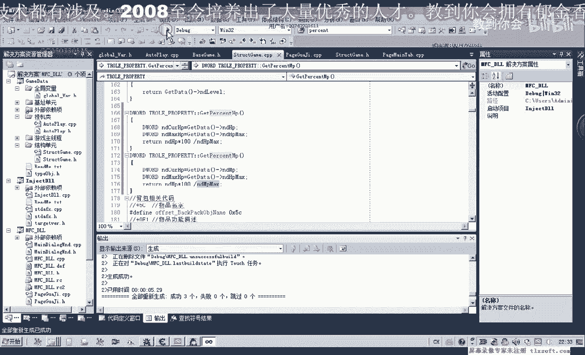

本节课中我们一起学习了如何初始化低血保护功能的界面数据，编写并调试了自动使用药品的逻辑代码。通过测试，我们确保了功能能够在游戏角色生命值较低时自动使用恢复物品，从而实现对角色的保护。