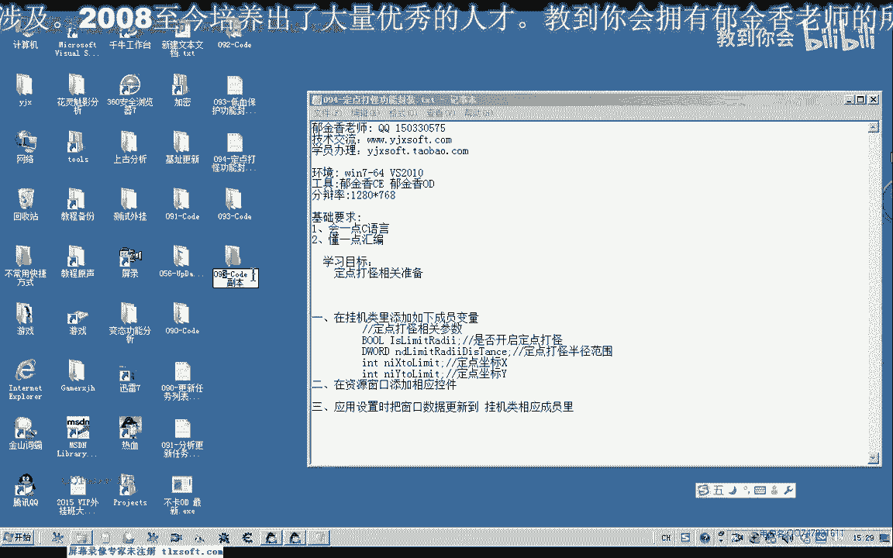
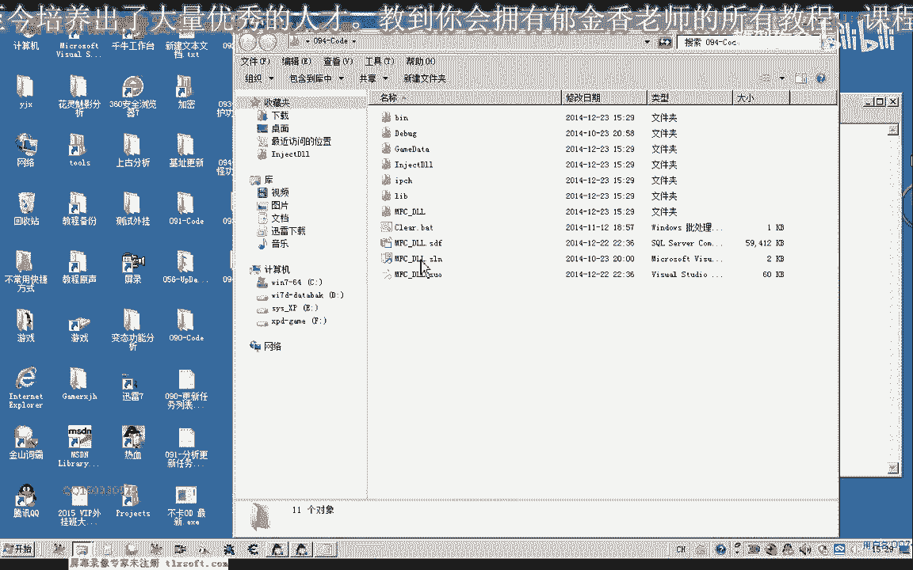
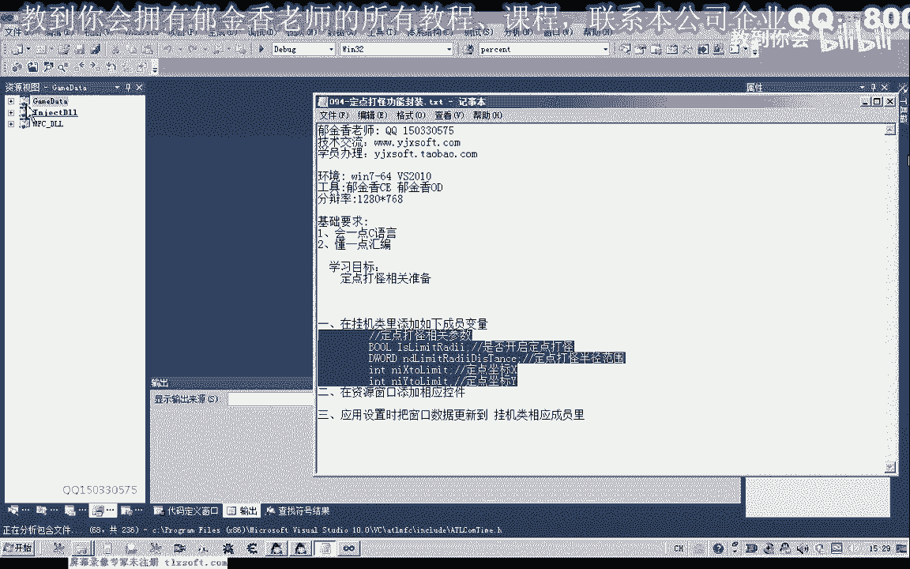
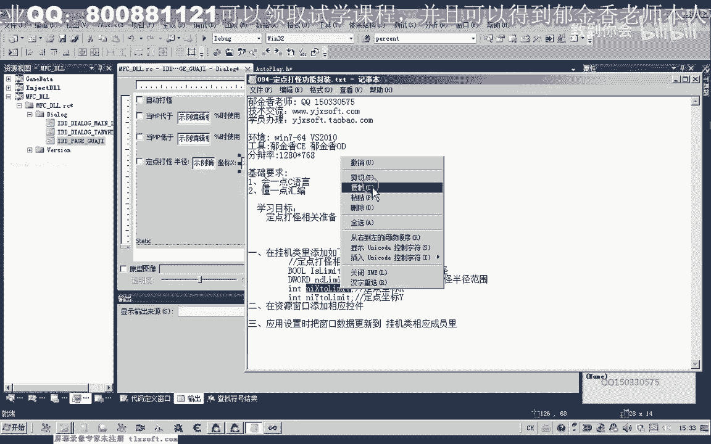
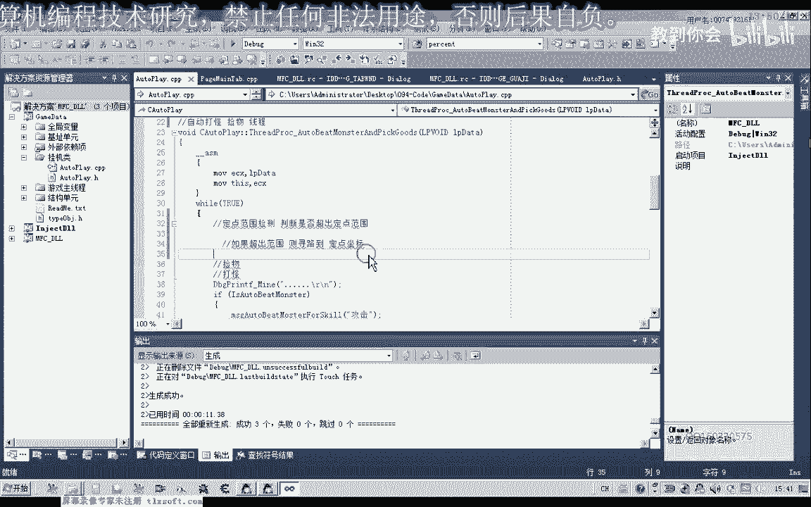

# 课程 P83：094-定点打怪功能封装 🎯

在本节课中，我们将学习如何为游戏挂机功能封装一个“定点打怪”模块。该功能的核心作用是确保角色在死亡回城后，能够自动返回预设的挂机地点，从而提升自动化效率。

上一节我们完成了挂机功能的基础框架，本节中我们来看看如何为其增加定点返回的能力。

## 功能需求与设计思路

很多时候，由于角色死亡或其他原因，角色可能会偏离原有的打怪地点。因此，我们需要编写一个定点打怪功能。当角色死亡回城后，它能自动跑回预设的挂机地点。





要实现这个自动定点打怪功能，我们需要在挂机类中添加几个相关的成员变量。



以下是需要添加的四个核心参数：
*   **是否开启定点打怪**：一个布尔值，用于在界面上接收复选框的选择，决定是否启用此功能。
*   **定点打怪半径**：一个数值，代表允许角色活动的范围半径。
*   **定点坐标X**：预设挂机地点的X坐标。
*   **定点坐标Y**：预设挂机地点的Y坐标。

## 代码实现：添加成员变量

首先，我们在挂机类（例如 `CAutoFight`）的内部添加这四个成员变量。

```cpp
class CAutoFight {
    // ... 其他现有成员
    BOOL m_bFixedPointFight; // 是否开启定点打怪
    DWORD m_dwFixedRadius;   // 定点打怪半径
    LONG m_lFixedPosX;       // 定点坐标X
    LONG m_lFixedPosY;       // 定点坐标Y
    // ... 其他现有成员
};
```

## 界面设计：关联控件与变量

添加成员变量后，我们需要切换到资源视图，调整挂机设置窗口，并添加控件来接收用户输入的参数。



以下是需要在对话框中添加的控件及其关联：
1.  **复选框**：用于启用“定点打怪功能”。我们将其与成员变量 `m_bFixedPointFight` 关联，变量类型选择 `BOOL`（值类型）。
2.  **静态文本和编辑框**：用于输入“定点打怪半径”。前面放置一个静态文本控件显示“半径：”，后面跟一个编辑框。将此编辑框与成员变量 `m_dwFixedRadius` 关联，变量类型选择 `DWORD`（值类型）。
3.  **静态文本和编辑框**：用于输入“定点坐标X”。将其与成员变量 `m_lFixedPosX` 关联，变量类型选择 `LONG`（值类型）。
4.  **静态文本和编辑框**：用于输入“定点坐标Y”。将其与成员变量 `m_lFixedPosY` 关联，变量类型选择 `LONG`（值类型）。

完成控件添加和变量关联后，切换到主窗口或对话框的“应用设置”相关函数中。我们需要将界面上的数据更新到成员变量里。

```cpp
void CMyDlg::OnApplySettings() {
    // 更新数据：从对话框控件到成员变量
    UpdateData(TRUE);
    // 现在，m_bFixedPointFight, m_dwFixedRadius, m_lFixedPosX, m_lFixedPosY 已包含用户输入的值
    // 可以将这些值传递给挂机类实例
    // g_autoFight.SetFixedPointParams(m_bFixedPointFight, m_dwFixedRadius, m_lFixedPosX, m_lFixedPosY);
}
```

这样，我们就能把用户设置的参数传递到挂机类的内部。之后，程序将根据这些参数来限定角色的活动半径，最终实现定点打怪。

## 核心逻辑与下节预告

定点打怪的最终实现逻辑，需要在自动打怪的回调函数中完成。

其核心流程如下：
1.  **范围检测**：判断角色当前位置是否超出定点范围。
2.  **条件寻路**：如果超出范围，则自动寻路到定点坐标；如果未超出，则跳过寻路，继续原有打怪逻辑。

为了实现这个流程，我们需要编写两个辅助函数：
*   `BOOL IsOutOfRange()`：用于判断是否超出定点范围。
*   `void MoveToFixedPoint()`：用于执行寻路到定点坐标的操作。

本节课我们主要完成了界面和基础变量的搭建。具体的函数设计与实现，我们将留到下一节课一起完成。现在，请重新编译一下项目，确保界面修改生效。

## 课后作业 📝

为了巩固理解，请大家尝试编写上面提到的 **范围检测函数 `IsOutOfRange`** 的框架。

这是一个挂机类的成员函数。它的作用是判断角色当前坐标与传入的定点坐标之间的距离，是否超过了指定的半径。

**函数设计提示：**
*   **输入**：可以直接使用类内的成员变量 `m_lFixedPosX`, `m_lFixedPosY`, `m_dwFixedRadius` 作为判断依据。也可以设计为接收目标坐标和半径作为参数，更具通用性。
*   **逻辑**：获取角色当前位置的 `(currX, currY)`。计算其与定点 `(m_lFixedPosX, m_lFixedPosY)` 的**距离**。
    *   距离公式：`distance = sqrt( (currX - fixedX)^2 + (currY - fixedY)^2 )`
*   **输出**：返回一个布尔值。如果 `distance > m_dwFixedRadius`，表示超出范围，返回 `TRUE`；否则，返回 `FALSE`。

---



本节课中我们一起学习了定点打怪功能的界面封装与设计思路。我们添加了必要的成员变量，并在对话框中创建了对应的控件，完成了数据的绑定。下一节课，我们将深入核心逻辑，实现范围判断与自动寻路函数。