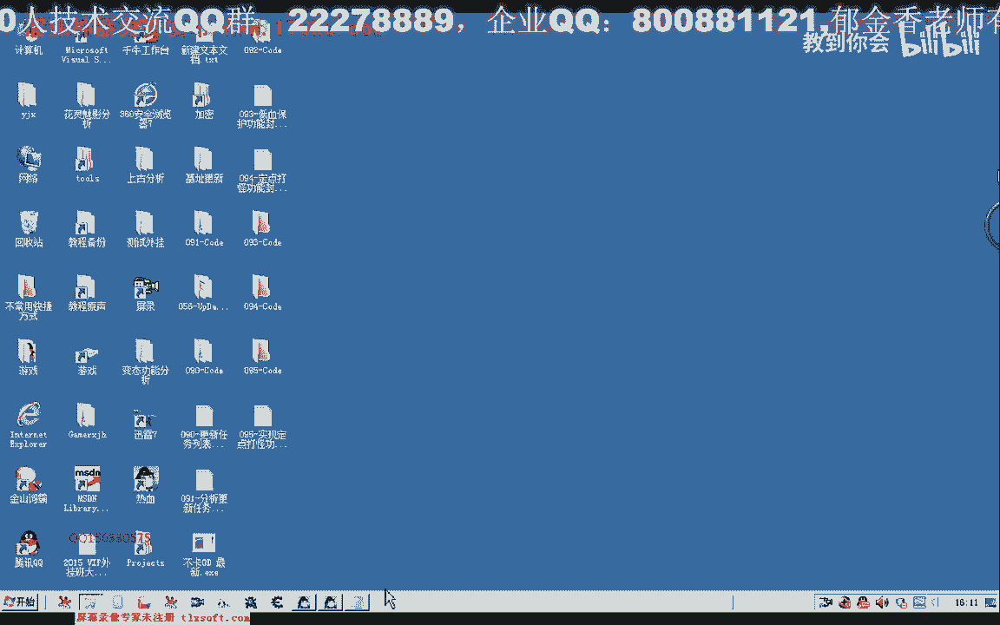
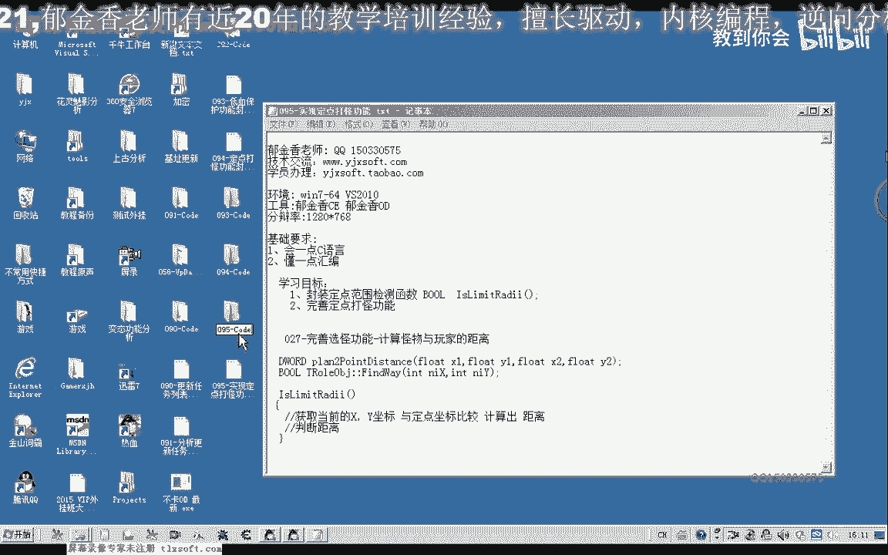
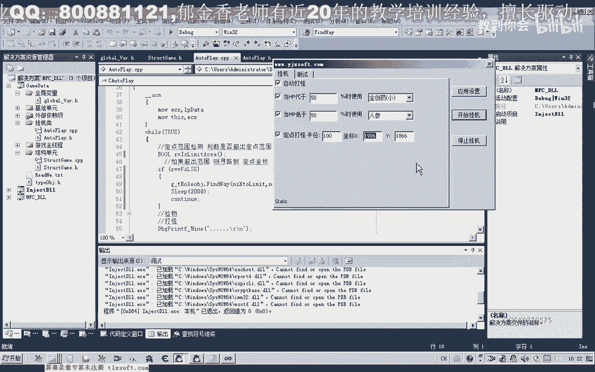

# 课程 P84：095-实现定点打怪功能 🎯



在本节课中，我们将学习如何为自动打怪功能添加“定点”限制，使角色只在以指定坐标为中心、特定半径的圆形范围内活动。一旦超出范围，角色将自动寻路返回中心点。

---

上一节我们介绍了自动打怪的基本框架，本节中我们来看看如何为其添加地理范围的约束。

首先，我们需要在挂机类中添加一个成员函数，用于判断角色当前位置是否超出了设定的定点范围。

该函数的核心逻辑是计算角色当前位置与设定中心点之间的距离，并与允许的半径进行比较。以下是实现此功能的代码：

```cpp
bool IsWithinRange(int centerX, int centerY, float limitDistance) {
    // 获取玩家当前坐标
    float currentX = g_pPlayer->GetPosX();
    float currentY = g_pPlayer->GetPosY();
    
    // 计算两点间的距离
    float distance = CalculateDistance(currentX, currentY, (float)centerX, (float)centerY);
    
    // 判断距离是否在限制范围内
    if (distance > limitDistance) {
        return false; // 超出范围
    } else {
        return true; // 在范围内
    }
}
```

其中，`CalculateDistance` 函数可利用游戏引擎或数学库中现有的函数实现，计算公式为：
**`distance = sqrt( (x2 - x1)^2 + (y2 - y1)^2 )`**

---

接下来，我们需要在自动打怪的主循环线程中集成这个范围检测功能。

在打怪循环的起始部分，我们调用上述函数进行检查。以下是集成后的逻辑流程：

```cpp
while (bHooking) {
    // 1. 检查是否在定点范围内
    if (!IsWithinRange(fixedX, fixedY, radius)) {
        // 如果超出范围，则寻路返回中心点
        g_pPlayer->PathFindTo(fixedX, fixedY);
        Sleep(2000); // 等待2秒，让角色移动
        continue; // 跳过本次循环，等待下一次检测
    }
    
    // 2. 如果在范围内，则执行正常的打怪逻辑
    // ... (原有的选择目标、攻击等代码)
}
```

---

现在，让我们进行功能测试，验证定点打怪是否按预期工作。

以下是测试步骤：
1.  在设置中指定中心点坐标（例如 X: 1996, Y: 1866）和半径（例如 100）。
2.  启动挂机功能。
3.  手动控制角色跑出设定的半径范围。
4.  观察角色是否自动寻路返回中心点，并恢复自动打怪。

测试时，你可能会发现角色在边界处来回移动。这是正常现象，因为检测和移动需要时间。更复杂的改进（如加入缓冲区域或状态机）我们将在后续课程探讨。

---

本节课中我们一起学习了如何实现定点打怪功能。我们通过添加一个范围检测函数，并在主循环中根据检测结果控制角色的移动，成功地将打怪活动限制在了指定区域内。



目前，坐标和半径需要手动输入。作为课后练习，请你尝试添加一个按钮，点击后可自动获取玩家当前坐标并填充到设置中，以提升用户体验。我们下节课将对这个功能进行进一步的改进和优化。